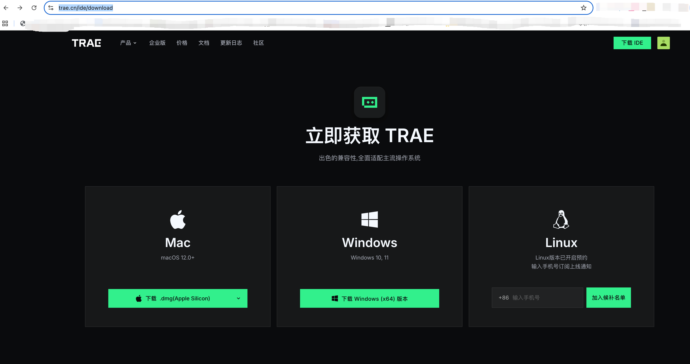
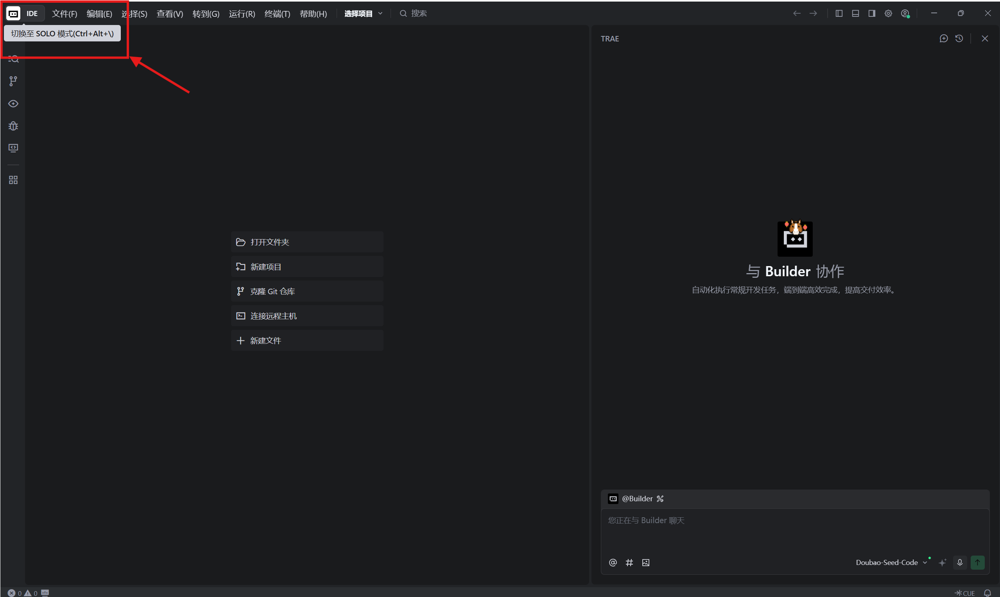
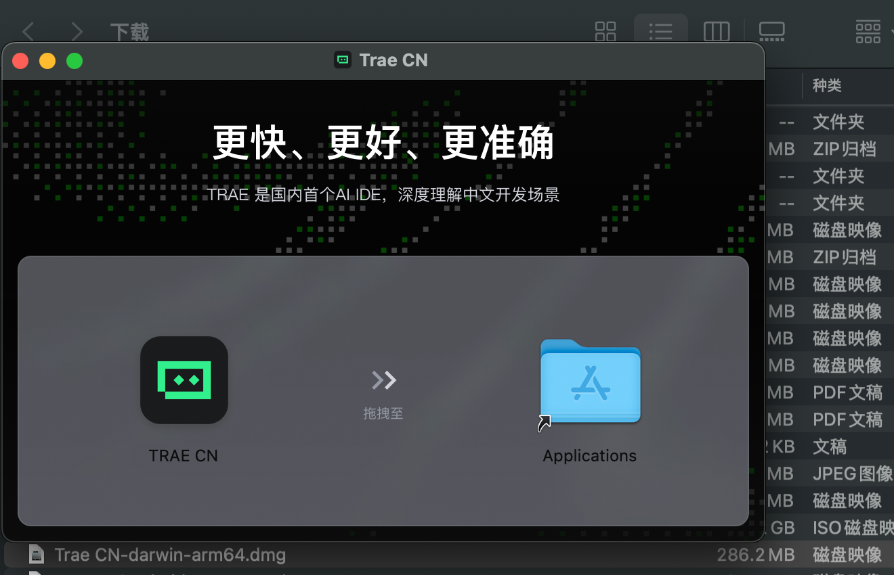
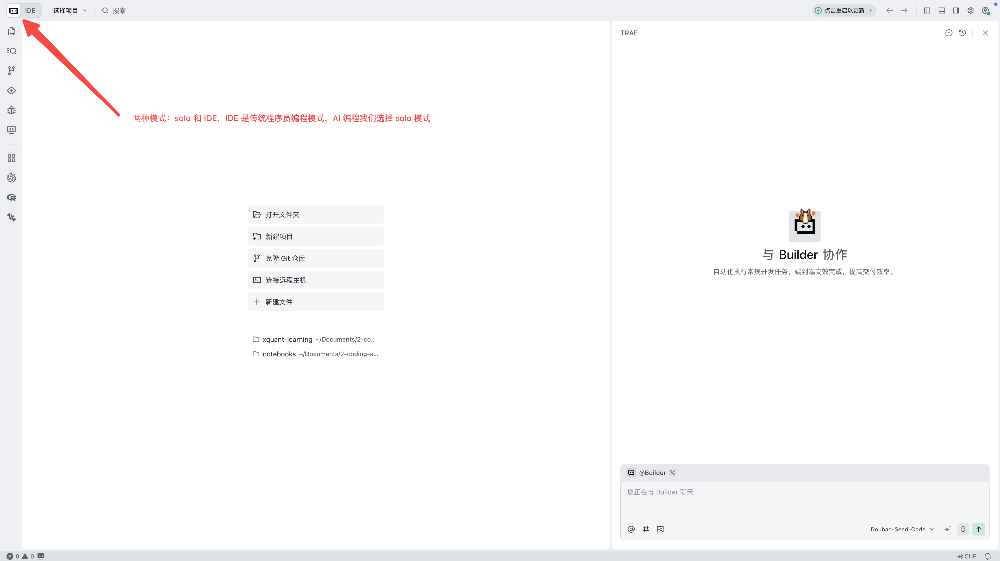
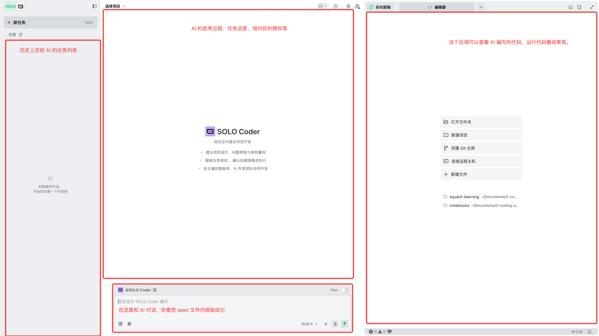
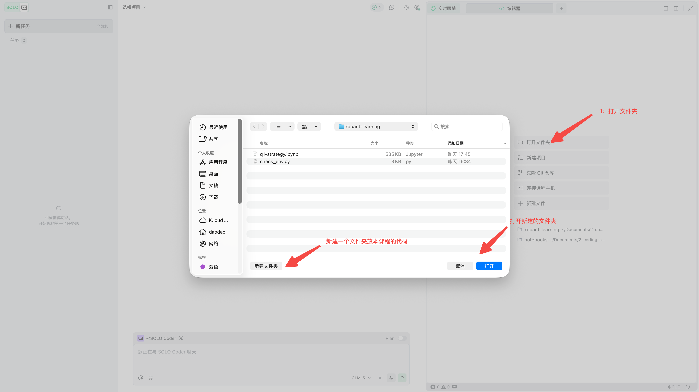
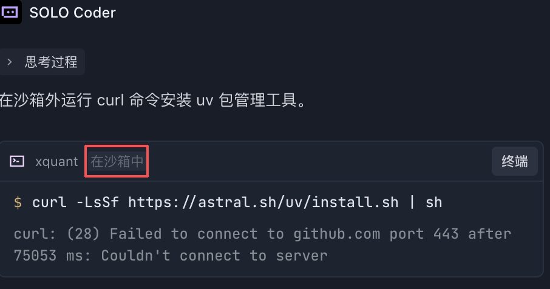
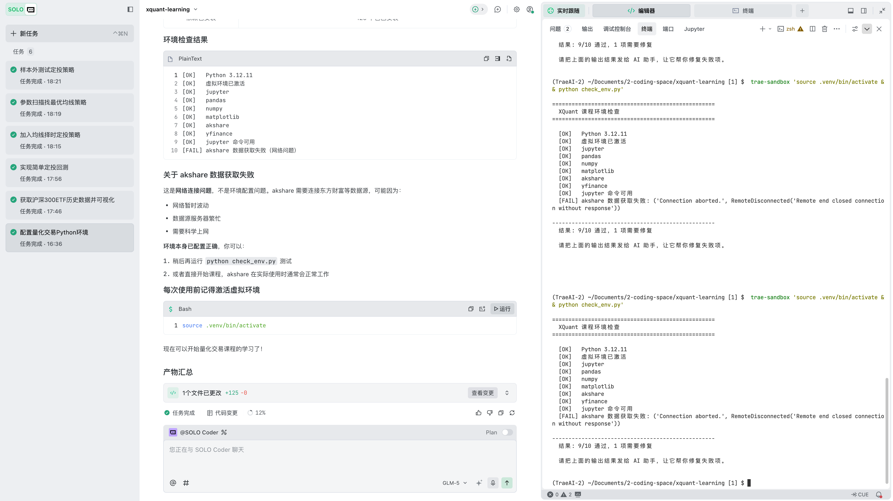

# 开始动手之前

这一节是**动手之前的一次性准备**工作，一共做两件事：① 把 AI 编程工具和 Python 环境装好；② 顺便学习写一份对 AI 友好的 spec 。

## 准备工具

做量化交易需要的工具其实很少。入门阶段你只需要一个基础环境，本书会用三样东西搭出来：① 数据源（拿什么做实验）；② 编程环境（在哪跑代码）；③ AI 编程工具（替你写代码）。下面分别介绍。

### 数据源：策略的“原材料”

数据是策略的“原材料”——没有数据，回测无从谈起。本书用两个免费的数据源就够了，对比如表 II-1 所示。

**表 II-1 本书使用的数据源**

| 数据源       | 覆盖范围                 | 费用 |
|--------------|--------------------------|------|
| **akshare**  | A 股为主，数据全、更新快 | 免费 |
| **yfinance** | 全球股票，接口简单       | 免费 |

本书用 akshare（A 股）+ yfinance（美股 / 全球）两个免费源就够了。等你把整个流程跑通、确定要认真做了，再考虑付费数据源。

数据有几个坑要提前知道：**复权方式**（前复权、后复权、不复权，用错了结果完全不同）、**停牌处理**（停牌期间的价格怎么填充）、**幸存者偏差**（只用当前在市的股票回测会高估收益）。这些问题在后续章节遇到时会展开。

### 编程环境：跑策略的“工作台”

有了数据，还需要一个可以运行策略的工作台。你不需要复杂的工程系统，只需要一组基础工具，对照如表 II-2 所示。

**表 II-2 本书使用的编程环境**

| 工具                 | 用途                             |
|----------------------|----------------------------------|
| **Python 3.12**      | 编程语言本体                     |
| **Jupyter Notebook** | 交互式编程环境，可以边写边看结果 |
| **常用库**           | pandas、NumPy、Matplotlib        |

不需要 GPU、不需要云服务器、不需要数据库——一台普通电脑就够了。

> 第 2 章起，本书会用到一个叫 **open-xquant** 的开源框架——它的设计理念和“为什么需要它”会在第 2 章章首详细介绍。本节只列你**现在**要装的工具。

## 安装 TRAE

工具列出来后，开始装。先装 TRAE（本书用于演示 AI 编程的AI 编程工具），再让 TRAE 按一份 spec 帮你装 Python 环境。

### 为什么选 TRAE？

本书以 TRAE 为演示工具。如果你已经在用 Cursor、Claude Code、Codex 或其他 AI 编程工具，完全可以继续使用——操作方式相同：在对话框用自然语言结构化写下想法（即spec），AI 将其翻译成 python 程序，执行即可。

主流的 AI 编程工具不少，对比如表 II-3 所示。

**表 II-3 主流 AI 编程工具对比**

| 工具                | 简介                                  |
|---------------------|---------------------------------------|
| VS Code + Copilot   | 老牌编辑器，加装 AI 插件              |
| Cursor              | AI 原生编辑器，海外用户多             |
| Claude Code / Codex | 命令行工具，专业开发者常用            |
| **TRAE**            | 字节跳动出品，AI-first 设计，中文界面 |

本书选择 TRAE 的原因：

- **AI-first，SOLO 模式**：整个界面围绕“和 AI 对话”设计，不需要你懂编辑器怎么操作
- **模型实力强**：字节有自己的大模型（如豆包），能力不输一线
- **免费可用**：个人开发者免费使用，还能免费接入自定义模型
- **对中国用户友好**：中文界面，国内直连

一句话：TRAE 是目前对零基础、中国用户最友好的 AI 编程工具。

### 四步装好 TRAE

#### 1. 下载 TRAE

访问 TRAE 官网 trae.cn / trae.ai，根据你的操作系统（macOS 或 Windows）下载安装包，下载页面如图 II-1 所示。

#### 2. 安装 TRAE

运行下载的安装包，按照向导提示完成安装。安装过程很简单，一路点“下一步”即可（Windows 安装向导见图 II-2，macOS 见图 II-3）。

#### 3. 打开 TRAE，认识界面

安装完成后打开 TRAE。默认是 IDE 模式（如图 II-4 所示），但本书要用的是 SOLO 模式——它对 AI 编程更友好，整个界面围绕“和 AI 对话”设计。切换到 SOLO 模式后的界面如图 II-5 所示。

SOLO 模式下你只需要关注一个区域：**AI 助手对话框**。后续所有操作都是在这个对话框里完成的。

#### 4. 创建学习目录

在你的桌面上新建一个文件夹（书中示例文件夹叫 `xquant` ）。然后在 TRAE 中打开它：菜单 → 文件 → 打开文件夹 → 选择 `xquant`，操作过程如图 II-6 所示。

打开后，你会在左侧文件管理器中看到 `xquant` 这个文件夹名称。现在它是空的，很快 AI 会帮你把需要的文件都创建好。

## 一起写第一份 spec：让 AI 装 Python 环境

到这一步 TRAE 装好了，但 Python 还没装。我们的目标是装 Python 3.12 + 7 个依赖包，并且自动验证每个组件都装对了。

最直接的做法是直接告诉 TRAE：“给我装一下 Python 环境。”

不行——AI 不知道你要哪个版本、用什么工具、要哪些包、跑通的标志是什么。它会按自己的偏好装一套，你的同学按他的电脑装另一套，半年后你们的环境完全不同。

正确的做法是写一份 **spec**——前言里讲过的「任务说明书」，把“做什么 + 做成什么样”清清楚楚交给 AI。这份 spec 我们已经写好放在仓库里了——但与其让你直接抄一遍，不如一起从零把骨架走一遍，等你看明白每一段为什么这么写，再去打开真实文件对照。下面我们一段段写。

### spec 长什么样：四段骨架

一份能让 AI 稳定执行的 spec，通常有四段：

> 📌 **spec 的四段骨架**
>
> 1\. **上下文** — 在什么前提下做这件事（AI 不知道你之前做了什么，要明示）
>
> 2\. **任务** — 一句话点明本次要做什么，不用写怎么做。本书中示例
>
> 3\. **要求** — 具体步骤，AI 自由度越小越可复现
>
> 4\. **结果呈现** — 怎么算成功（最容易被忽略也最重要的部分）

四段是 spec 必须回答的四个问题：**前提是什么 / 做什么 / 怎么做 / 算不算做对了**——哪一段都不能少。

我们一段段把“装环境”这个任务写成 spec。

### 第一段：上下文

我们的状况很简单：刚装好 TRAE，打开了一个空目录，但 Python 一切还没装。这一段写出来：

> **上下文**：我（学员）刚在 TRAE 中打开了一个空目录作为课程根目录。本机是 macOS，尚未安装 Python 或任何依赖。这是课程的第一份 spec——后续spec 都依赖这一份装出的环境。

本节后续四段 blockquote 全部以 macOS 为例展示。Windows 用户按相同骨架，把「macOS」替换成「Windows」、把 mac 命令替换成 PowerShell 命令即可——具体替换在 `specs/spec-01-env-setup-windows.md` 文件里逐行对照，本节无需重复。

这一段示范的是 spec 写作的第一条要点，下面我把它单列出来——本节后续每写完一段 spec，都会附一条对应的「📌 要点」。这是全书第一次出现这种样式块，它和正文并列、可以反复回查。

> 📌 **要点 1：能一句话说清的事就不要写两句** AI 一次能处理的信息有限。你写得啰嗦，最关键的指令容易被它忽略。写 spec 的过程是反复“还能不能再短一点”的过程。

### 第二段：任务

任务段要具体到一句话能说清。“装好 Python 环境”不够具体——什么版本？用什么工具？哪些包？

> **任务**：在当前目录下完成 macOS 量化课程编程环境配置——装 uv → 用 uv 创建 Python 3.12 虚拟环境 → 装 7 个依赖包 → 创建并跑通 check_env.py 自检脚本。
>
> 📌 **要点 2：关键事物要具体到 ID 或版本号** “Python” 不够，要 “Python 3.12”；“包管理工具”不够，要 “uv”；“装一些库”不够，要 “7 个具体的库”。任何 spec 中的关键名词都要具体到不能再具体的程度，AI 才不会按自己的偏好随便选一个。

### 第三段：要求

要求段是 spec 的主体——把“怎么做”拆成步骤。环境配置一共 6 步：确认目录、装 uv、建虚拟环境、装依赖、写 check_env.py、跑 check。以下要求比较具体，是因为编程需要让环境前后一致，避免引起不必要的问题，实际工作中我们不必告诉 AI 应该怎么做，所以你可以完全复制这一段：

> **要求**： 1. **确认当前目录**——在终端运行 `pwd`，记录路径，后续操作都在这个目录下。 2. **安装 uv**——运行 `curl -LsSf https://astral.sh/uv/install.sh | sh`，再 `source $HOME/.local/bin/env`，最后 `uv --version` 应输出版本号。 3. ……（共 6 步，完整内容见 `specs/spec-01-env-setup-mac.md`）

完整 6 步加上每一步的命令、check_env.py 全文都在 spec 文件里。这里只挑两个特别值得讲的细节。

**装依赖时为什么要锁版本号？** 比较两种写法：

❌ `uv pip install pandas numpy matplotlib` ✅ `uv pip install pandas==3.0.* numpy==2.4.* matplotlib==3.10.*`

不锁版本的话，半年后你重新跑 spec，pandas 升到了 3.1，某个 API 改了，书上的图就跑不出来。锁到 `==X.Y.*` 既允许 patch 升级（修 bug 的小版本）又不会跨 minor（可能改 API 的版本），最稳。

> 📌 **要点 3：能锁的都锁住——版本号、日期、随机种子** 量化交易的命脉是“可复现”。你今天跑出来的图，明天还得跑得出来；你电脑上跑的回测，老师电脑上的结果一样；半年后回头检查，依然能复现。任何会随时间漂移的东西（库版本、日期窗口、随机数）都要锁。

环境配置这件事**没有图表可看**——某个包没装好，当下不会报错，等到第 1 章跑实验时才暴露问题。所以验证必须是机械的、固定的、可重复的。所以我们把检查脚本写进了 spec，这就是告诉 AI 使用指定的工具完成某些任务，从而提高 AI 任务的确定性。AI 只能照着抄一份一字不差的，每个学员跑出的报告完全一致——失败时哪一项 FAIL 就是哪一项装错了。

### 第四段：结果呈现

最后一段是“成功长什么样”。一份 spec 没有这一段，AI 跑完你只能凭感觉判断对错。

> **结果呈现**： 1. `python check_env.py` 最末两行输出 `结果: 11/11 全部通过！` + `环境配置完成，可以开始课程。` 2. 命令退出码为 0 3. 当前目录下存在 `.venv/` 与 `check_env.py`
>
> 📌 **要点 4：成功的标志要可机械验证** “跑通了” / “看起来对” / “应该没问题”——这些都是不合格的成功标志。一份好 spec 的结果呈现段要让 AI 自己能说“对了”或“错了”，不需要学员凭感觉判断。assert 语句、具体的数字（11/11）、具体的文件名、退出码——这些就是机械验证。

四段拼起来就是一份完整 spec。我们刚才在书里写过的骨架——上下文 / 任务 / 要求 / 结果呈现——和 `specs/spec-01-env-setup-mac.md`（或 `spec-01-env-setup-windows.md`，根据你的系统）里的真实文件一一对应；区别只在于真实文件把 6 步和 check_env.py 全文都写齐了。下一节我们把它交给 TRAE。

## 让 TRAE 跑这份 spec

上一节我们把这份 spec 在书里一段段写完了，现在把它交给 TRAE 真正执行。在打开 spec 文件之前，先看下面这条提示——等下 TRAE 弹窗时你就不会被吓到：

> **💡 提示：关于“沙箱”**
>
> TRAE 帮你装环境时会弹窗询问是否允许“在沙箱外运行”。别紧张：AI 平时是在一个受限的小房间（沙箱）里活动，但现在它要帮你布置整个工作台，需要你给它开一下门。遇到这个提示，直接点“是”或“允许”即可，过程示意如图 II-7 所示。
>
> 如果你打开 spec 文件第一行也写了“所有命令在沙箱外运行”——这就是 TRAE 弹窗问你的原因；不是出错，是预期里的一步。

读完提示，再打开你系统对应的 spec 文件——

- **macOS 用户**：打开 `specs/spec-01-env-setup-mac.md`
- **Windows 用户**：打开 `specs/spec-01-env-setup-windows.md`

把 spec 全部内容复制到 TRAE 的 AI 对话框中，发送。

AI 会自动完成 6 个步骤：装 uv、建虚拟环境、装 7 个依赖包（含 open-xquant 框架）、创建 check_env.py、跑自检。整个过程几分钟。你不需要理解每一步细节，只需要看最后的检查结果。

### 验证结果

如果一切顺利，你会在 TRAE 的终端中看到类似这样的输出：

    ==================================================
      XQuant 课程环境检查
    ==================================================

      [OK  ] Python 3.12.x
      [OK  ] 虚拟环境已激活
      [OK  ] jupyter
      [OK  ] pandas
      [OK  ] numpy
      [OK  ] matplotlib
      [OK  ] akshare
      [OK  ] yfinance
      [OK  ] open-xquant
      [OK  ] jupyter 命令可用
      [OK  ] akshare 数据源连通（获取到 5847 条数据）

    --------------------------------------------------
      结果: 11/11 全部通过！
      环境配置完成，可以开始课程。

实际终端输出如图 II-8 所示。

如果有任何项目显示 `[FAIL]`，**不要紧张，也不要自己改命令重试**——把完整的输出结果复制给 TRAE 的 AI 助手，告诉它“环境检查有失败项，请帮我修复”。AI 会照着 spec 里“故障恢复”那一节的对照表逐项排查。

> **💡 关于错误处理的原则**
>
> 整本书你都不必去**啃** Python 报错——遇到任何报错，**把完整信息复制给 AI 助手**就好。AI 排查报错的能力远比让初学者读 stack trace 强。这是本书的承诺：你只写 spec、看结果，调试交给 AI。

## 你刚刚学到了什么

### 你做了什么

刚才的过程其实包含两件事：

① **环境装好了**——这件一次性的事做完了，往后不用再碰。 ② **你看到了一份 spec 是怎么从零写出来的**——四段骨架在你眼前展开了一遍，四条核心要点各自示范了一次。

第二件事比第一件重要。

### 7 条 spec 自查清单

刚才本节示范了 4 条要点（写在每段 spec 之后的「📌 要点 1-4」）。把这 4 条加上 3 条通用补充，就构成下面这份“写完 spec 过一遍”的自查清单——任何一条没做到都是问题：

| \# | 自查项 |
|----|----|
| 1 | **四段都齐了？** 上下文 / 任务 / 要求 / 结果呈现，一段都不能少 —— 结构骨架 |
| 2 | **任务一句话能说清吗？** “做一下数据分析” ❌；“获取沪深 300ETF 历史数据并可视化” ✅ —— 来自要点 1 |
| 3 | **关键事物具体到 ID 了吗？** 标的代码、库版本、文件名、参数名都点名 —— 来自要点 2 |
| 4 | **能锁的都锁了吗？** 库版本、日期窗口、随机种子——任何会随时间漂移的都要锁 —— 来自要点 3 |
| 5 | **结果呈现有“机器能判断的标志”吗？** assert、具体数字、文件名、退出码 —— 来自要点 4 |
| 6 | **写的是“做 X”而不是“不要 Y”吗？** 正向指令比否定句对 AI 更稳定 —— 通用补充（首次出现） |
| 7 | **长度合理吗？** 大多数 spec 不超过 80 行（环境配置这种特殊情况除外） —— 通用补充（首次出现） |

第 6、7 两条本节没有专门演示，会在第 1 章后续 spec 写作中遇到时再补讲。这 7 条会跟着你整本书——每写一份新 spec，最后都过一遍这个清单。

### 你需要做什么

后续每一章都会让你写或改一份 spec。开始时书里会带你一段一段写（像本节这样），后面会渐渐放手——到第 6、7 章你应该能自己写完整的 spec，到第 9 章你应该能根据问题写新 spec。

> **💡 spec 写作能力的成长曲线**
>
> 抄 → 改 → 拼 → 写。第 1 章基本是“抄 + 看懂”；第 2-3 章是“改其中几个参数”；第 4-6 章是“把多个 spec 拼成新流程”；第 7-9 章是“看到一个量化问题，自己写一份新 spec”。每一步都不用着急。

## 准备就绪

恭喜，你现在已经具备了开始量化交易学习的全部条件。

### 速查表

前言和这一节涉及的核心概念汇总在表 II-4 里。

**表 II-4 动手前的核心概念速查**

| 概念 | 含义 | 类比 |
|----|----|----|
| spec（任务说明书） | 给 AI 的结构化指令 | 你说清楚要做什么，AI 负责执行 |
| spec 四段骨架 | 上下文 / 任务 / 要求 / 结果呈现 | 一份 spec 必须回答的四个问题 |
| TRAE | 本书演示用的 AI 编程工具 | 也可以换成 Cursor / Claude Code 等 |
| 量化交易 | 用数据和规则做交易决策 | 把“我觉得”变成“数据显示” |
| 量化飞轮 | 候选 / 组合 / 执行 / 归因，循环往复 | 越转越聪明的轮子 |
| 三字要点 | 飞轮每一格都要走的三步：做 / 看 / 疑 | 想法要规则、结果要指标、指标要被怀疑 |

### 下一步

**第 1 章**，我们会用一个真实的 ETF 带你**走完整个飞轮一圈**——从最简单的定投开始（做），看它能不能赚钱（看），尝试让它“聪明”一些（再做、再看），最后亲眼看到“回测时间段里收益率优美、换段时间就亏损”这种典型情况（疑）。 准备好了吗？翻到下一章，开始你的第一次飞轮转动。
