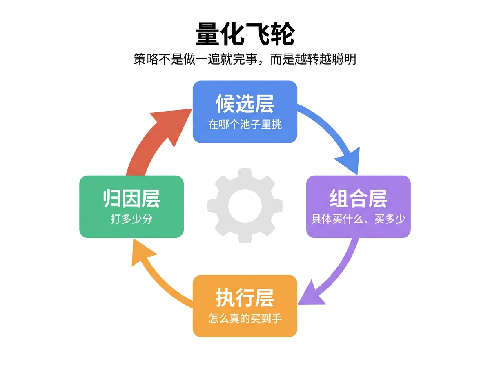
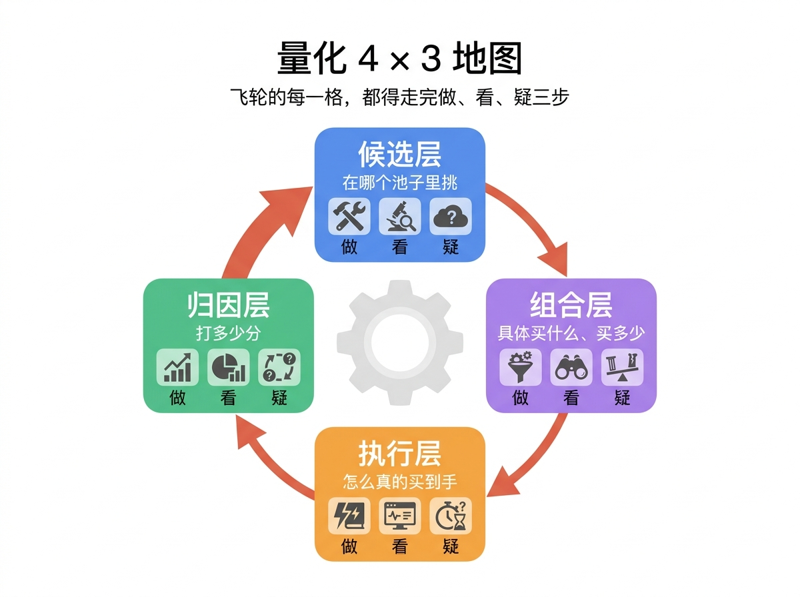

# 前言

## 为什么写这本书

你打开这本书，大概率是因为你听说过“量化交易”或者“量化投资”。多年以来，媒体都在传递一类观点：量化投资具有卓越的投资业绩表现。然后，如此卓越的量化投资通常只服务于高净值用户。普通人常常因为净值门槛被阻碍在量化投资的门外。既然如此，普通个人投资者如何才能应用量化投资呢？既然无法借助他人而使用量化投资，那么唯一的途径就是去自学量化投资。中国目前有2.4亿个人投资者，按照千分之一的人想学习量化投资而言，也至少有24万人正走在学习量化投资的路上。但这些尝试学习量化投资的人在学习的路上走得并不算顺利。究其原因，与量化投资相关的晦涩的金融术语、复杂的数学公式和天书般的程序代码阻挡了普通投资者的量化投资学习之路。有少数人能迈过以上几个门槛，可是新的阻碍又重新出现。学完了量化投资内容，在面对真实市场时，如何把量化投资和真实市场结合，如何抓住量化投资应用到金融市场的重点之处，如何把握把时间花在量化投资的哪些环节上？要解决这些问题，只有建立一套科学、完整、可执行的量化体系才行，否则，面对波诡云谲的金融市场，我们无法持续构建出有效的量化策略，也就无法真正享受量化投资的红利。

我自己是算法工程师出身，过去十多年一直做 AI 和算法相关的工作，具备了数学和编程基础。我接触量化投资的方式，是从业余时间跟着教程跑过几个简单的量化策略 demo开始。之后我发现工程思维里“拆问题、提假设、用数据验证”这一套方法在量化投资领域也成立。这不过，这里要解决的问题是金融领域的问题。三个拼图，我已经有了两块，只要补足金融领域的知识短板，我就可以继续做量化投资了。我决定深入下去，直到在这条量化投资路上找到了「一硕」——一位有十几年量化交易经验的搭档。他正在尝试用 AI 来实现量化投资，他是统计学和财务出身，具备数学和金融的基础，我们两个的能力互补。之后，他把自己开发的量化投资策略毫无保留地分享给我，我们一起把它拆开：搞清楚每一个想法是怎么产生的、怎么用数据验证、验证之后如何在工程层面真正执行，分析执行时又会遇到哪些大大小小的问题。整个拆解的过程，让我获益匪浅，这也是本书的缘起。

这本书能写出来，还有一个 2025 年才成熟的关键基础——**AI 编程能力的跃迁**。在 2024 年之前，“用 AI 替你写量化代码”还是不靠谱的：AI 写出来的代码经常跑不通、逻辑反复出错、库版本对不上。但从 2025 年下半年开始，全世界的大模型在编程方面的能力突飞猛进，以 Cursor、TRAE、Claude Code 为代表的 AI 编程工具也在持续迭代，两者叠加，AI 编程发生了一轮明显的能力跃迁——能读懂自然语言写的需求、能把复杂任务拆成小步骤、能自己调试、能记住上下文连续工作数十小时。

**这意味着什么？这意味着阻挡大家尽早动起来的门槛降低了。这也是本书提供的方法——“你用自然语言描写想法、AI 替你写代码做实验”——在 2025 年才真正可行。** 我们等到这扇窗开了，才动笔把这套从想法到落地的完整过程写成书。

## 这本书要解决什么问题

这本书要解决的，是量化投资初学者可能正在遇到的三个主要问题——

**问题 1：想做量化，但卡在“不会编程”，迟迟迈不出第一步。** 你有想法，甚至有过策略雏形，但一想到要写代码、搭环境、调库，就放弃了。这本书让你**用自然语言**表达策略思路，写代码、跑程序、画图表全部交给 AI 助手。你只需要清晰地说明“要做什么、做成什么样”。

**问题 2：看了很多量化内容，专有名词高大上，要么看不懂、要么落地难。** 各种指标、术语、模型铺天盖地，但不知道哪些是关键、哪些只是“看起来很专业”。这本书帮你回到最底层：用**数据和逻辑**来重新理解投资，这就是量化思维。

**问题 3：尽管学会了很多量化策略，但始终没有搭建出随着市场变化而进化的系统。** 你可能看过教程、读过文章，但内容都是碎片：这里学一点策略，那里学一点工具，没有一根主线把它们串起来。这本书带你从头做一遍，**亲手搭出一个成体系、可迭代的量化交易系统**。

**这本书适合两类人**：① **有兴趣 + 没实操**：刚刚对量化产生兴趣、想试试又不知道从哪开始的人；② **有尝试 + 无系统**：读过几本量化书、试过别人的示例代码，但始终没做出过一套自己的策略的人。

**要花多少时间？** 如果你按“周末半天 + 工作日两个晚上各 1.5 小时”的节奏走（每周大约 5-6 小时），**2-3 个月**可以走完全书。当然你也可以加快——重点不是速度，而是每章动手做完，能完整解释自己做了什么。

走完这条路，首先你会亲手指挥 AI 实现一份**完整的策略**——一份能告诉你“什么时候买、什么时候卖、买多少”的可执行规则，消除了动手的门槛；其次你建立了一个完整的量化交易体系，以后再实践和学习都会有的放矢。

至于具体会带你走过哪些事——下一节先给你一张地图，再带你走。

## 这本书的整体框架

在带你做实验之前，先把全书的骨架立起来——这样后面 9 章动手做的每一步，你都知道自己在地图的哪个位置。

量化交易听起来复杂，但骨架其实很简单：**它只是 4 件事循环做、每件事走 3 步**。看明白这“4×3”，你就有了一张全书都能用的地图。

### 量化飞轮：候选 → 组合 → 执行 → 归因

任何一个量化策略，都是在循环回答四个问题：

- **候选层 · 选什么** —— 从几千上万只股票/ETF 里**先有鱼塘，再捞鱼**——圈出一小撮值得长期跟踪的。
- **组合层 · 买多少 / 何时买卖** —— 从池子里挑几只，决定每只买多少、什么时候买卖，这是依据数据做决策的关键步骤。
- **执行层 · 真的下单** —— 把“数据决策”变成“真实持仓”，把组合变成真实的买卖订单，并处理价格滑动、成本、风险。
- **归因层 · 对比和打分** —— 钱到底是赚了还是亏了？和更简单的做法相比值不值？是靠本事、还是运气在赚钱？靠运气赚的钱迟早得还给市场。

这四层构成了一个完整的量化体系，也是一个**飞轮**——归因层得出的结论，会反过来修改下一轮的候选和组合，飞轮越转越准（如图 I-1 所示）。

> **📌 小词典：什么是飞轮（Flywheel）？**
>
> 飞轮就是一个能持续转动的轮子——一开始要使劲推，一旦转起来，靠惯性自己就能加速。在量化里，“飞轮”意味着：策略不是“做一遍就完事”，而是每转一圈都比上一圈更聪明一点。

### 三字要点：做 / 看 / 疑

四层构成了一个完整的量化体系，在构建每一层时，还要遵循一套动作，才是真正的量化交易系统。比如说，同样是“做组合层”，你可以凭感觉拍脑袋，也可以用数据说了算，结果当然天差地别。所以**每一层**里，都得走完同样的 3 步：

- **做** —— 把动作写成程序，成为可重复执行的规则。不允许“我感觉茅台不错”，要写成“近 60 日均价上穿当日收盘价就买”
- **看** —— 把目标和结果都要定义出可比较的指标。不允许“感觉”，不允许“看起来还行”，要写成“年化 12%、最大回撤 18%”这种带数字的判断。只要数字上没达成目标，就不能靠“再等等看”或“应该没问题”改变结论。
- **疑** —— 永远对指标保持质疑，防止自己被指标欺骗。不允许“回测说赚了就信”，要问：“换一段时间还行吗？参数稍微调一下还稳定吗？”

这三个动作是**层层递进**的：先**做**出来，才有结果可**看**；**看**到数字了，才有东西可**疑**。

> **📌 小词典：为什么“疑”也是量化的一部分？**
>
> 量化交易中，最严重的不是错过了收益，而是乐观导致亏损。所以始终对回测结果保持怀疑就非常有必要。一个回测能跑出年化 50%——但只在那 5 年的特定数据上跑得出来，换一段时间年化就掉到接近 0。**会做、会看，但不会疑，就会被自己的策略欺骗，就会在某些时候把赚到的钱加倍还回去。** 这就是为什么“疑”和“做”“看”同等重要，甚至更重要。全书第 6 章会专门用一整章训练这个动作。

把四层飞轮和三字要点叠起来，就是完整的量化体系，也是这本书要在你脑子里建起来的整张地图（如图 I-2 所示）。

### 这本书的 9 站旅程

我们将用 9 个站点走完这张地图的全程。接下来的 9 章，就是带你在这张地图上走 9 站。每一站对应飞轮的哪个位置、主要练哪个动作，列在表 I-1 里。

**表 I-1 9 章主题与飞轮位置对应**

| 章节    | 问题                           | 飞轮位置             | 主练动作     |
|---------|--------------------------------|----------------------|--------------|
| 第 1 章 | 第一次跑通一个完整策略         | 走一遍完整流程       | 做 + 看 + 疑 |
| 第 2 章 | 选出你的投资宇宙：3 只 ETF     | 候选层（选什么）     | 做           |
| 第 3 章 | 给 ETF 分钱：3 种分法实测      | 组合层（买多少）     | 做           |
| 第 4 章 | 给策略加规则：调仓、止损、止盈 | 组合层（何时买卖）   | 做           |
| 第 5 章 | 策略好不好？4 个评估角度       | 归因层（对比和打分） | 看           |
| 第 6 章 | 看清好看的回测：别被自己骗了   | 怀疑你的回测         | 疑           |
| 第 7 章 | 真的下单：跨到实盘             | 执行层（真下单）     | 做 + 看      |
| 第 8 章 | 让策略活着：监控、诊断、迭代   | 评估并反哺起点       | 疑 + 做      |
| 第 9 章 | 持续寻找盈利机会：因子研究入门 | 找下一个赚钱机会     | 做 + 看      |

注意第 1 章——它一上来就带你**走完飞轮一圈**，而且故意让你在终点遇到一种典型陷阱：**回测里看着赚钱，换一段时间就不行了**。这不是设计失误，是**设计意图**：让你在第 1 章就亲身经历什么叫“被自己的回测骗”，从此真正记住“疑”这个动作的分量。

九站走完，飞轮的 4 格你都站过、做/看/疑 3 个动作你都练过。这就是你**带得走**的量化思维。

## 你能获得什么能力

读完这本书，你学会的不是具体的策略，而是一套不断找到新策略的方法。总结一下，你会建立起四类核心能力：

- **会用 AI 编程**：学会用自然语言结构化描述任务，让 AI 准确地翻译成代码——你将学会和 AI 协作做事，这是 AI 时代的核心能力。
- **养成量化思维**：把模糊的想法、抽象的概念转化成定义明确的指标和清晰无误的规则，用数据检验假设是否成立。
- **会做策略实验**：在 4×3 的量化框架下，你将从数据获取、回测、对比基准、参数扫描，到样本外验证，全都亲手跑一遍。
- **知道如何迭代**：你不仅有了量化体系和做 / 看 / 疑 三个动作，你还会知道这个体系以后会遇到哪些坑，从而长期迭代下去。

## 本书的核心理念

跟着全书走完，你会发现，本书自始至终在贯彻三个理念：

**第一：问题驱动。** 量化交易本质上是做研究——就现象提出问题，就问题提出假设，再用实验去验证假设。每一章都是一个大问题，引出若干小问题，回答了这些问题再引出一个新的大问题，来到新一章。跟随这些问题，我们将走完完整的 4×3 量化地图。

**第二：先动手，再认知。** 量化交易光看不动手绝学不会——你必须亲自走一遍。书中在一个接一个问题驱动下，都有对应的实验来解答这些问题；实验结果出来了，我们才会开始引入一些概念建立认知。

**第三：0 编程。** 全书都采用 AI 编程的方式做实验，因此我们需要把想法详细描述给 AI——这称之为任务说明书（specification，简称 spec）。全书一步一步告诉你如何写一份好的 spec，并提供 spec 和代码供你在动手时参考。

> **📌 小词典：什么是 spec？**
>
> spec 是 specification 的简写，可以理解为「任务说明书」。你不需要掌握任何编程语法，只需要用大白话把两件事说清楚： **要做什么** （在量化交易中就是“你想做什么策略”）； **做成什么样** （在量化交易中就是“策略应该如何运行”）
>
> AI 会根据这份说明，自动完成编码、执行和输出。

## 怎么使用这本书

这本书不是用来“看完”的，而是用来“跟着做”的。**它的核心学习方式是循环**：

> 提出问题 → 动手实验 → 看结果、理解 → 进入下一个问题

每一章都按这个循环组织。

你可以在一开始，从我们提供的 GitHub 仓库中获得参考的 spec 或者 Python 代码，完成简单实验，然后模仿我们提供的 spec，根据方法编写自己的 spec，或者修改已有 spec，做新的实验。

实验结果，你需要看懂其含义，书中提供了实验结果的解读，你也可以提出自己的解读，和你的 AI 助手讨论。这也有助于建立你的量化思维。鼓励读者对本书方法和解读充满“怀疑”，这正是三字要点要训练的。

### 每一节怎么走

每节正文都会**带你一段一段把 spec 写出来**——上下文、任务、要求、结果呈现四段，对应的方法点（📌 要点）嵌在演示过程中讲，不集中讲。完整的 spec 文件在 GitHub 仓库的 `specs/` 目录里，跑实验时直接复制给 AI。

**你的目标不是“复制 spec”，而是看懂每段为什么那样写，逐步学会自己写。** 每节按这五步：

1.  阅读章节正文，理解这一节要解决什么问题
2.  跟着正文一段段写 spec，看每段对应的方法点
3.  打开仓库里完整的 spec 文件，复制给 AI 让它执行
4.  看运行结果（图表、关键数字）+ 章内的解读
5.  遇到错误，把信息发给 AI 让它排查

### 关于“自己写 spec”

第一次听到要“自己写 spec”，你可能有一点顾虑——“我完全不会写 spec，是不是从一开始就跟不上？”

**别担心。** 这本书把 spec 能力分**抄 → 改 → 拼 → 写**四阶段，一级一级铺给你：

- **第 1 章**：抄——跟着书里的段段演示走一遍，把完整 spec 复制给 AI，观察它的执行过程，先体会跑通的手感
- **第 2-3 章**：改——改 spec 的参数（换标的、换时间窗），结构本身不变
- **第 4-6 章**：拼——把多个已有 spec 的片段组合起来，做新的实验
- **第 7-9 章**：写——为自己的投资想法从零写 spec

正式开始之前，**开始动手之前**那一章会带你完整地写一份 spec——通过让 AI 帮你装环境这件事，把 spec 的四段骨架（上下文 / 任务 / 要求 / 结果呈现）演示一遍，并归纳出一份 7 条自查清单，帮你建立基本心智模型。**这份 7 条自查清单从第 1 章「抄」开始就一直陪你走到第 9 章「写」**——只不过你用它的方式会从“对照检查”逐步变成“下意识落笔”。从第 1 章起，每节正文里出现的方法点都用「📌 要点」标出来——你不用刻意记，看到一次记一次，跟着写到第 7-9 章自然就内化了。

### 两类辅助内容

全书出现两类辅助内容：

- **📌 小词典** —— 概念解释，反复使用的术语随时回查
- **📌 要点** —— spec 写作的方法点，嵌在写 spec 演示的段落里，看到一次记一次

### 配套资源

本书的免费资源包（扫书末二维码即可拿到），包含：

- 所有章节的示例 spec
- 配套的 Jupyter Notebook（含可运行代码 + 完整运行结果）
- 第 2 章起使用的量化框架 open-xquant（详细介绍见第 2 章工具升级一节）

也可以从 GitHub 直接获取（适合熟悉 git 的读者）：

- 课程仓库： https://github.com/xingwudao/xquant-learning
- 量化框架：https://github.com/xingwudao/open-xquant

地图就到这里。下一节“开始动手之前”是一次性准备——把 AI 编程工具和 Python 环境装好，顺便用“装环境”这件事完整地写一份 spec。一次配完，第 1 章我们就直接跑实验。
