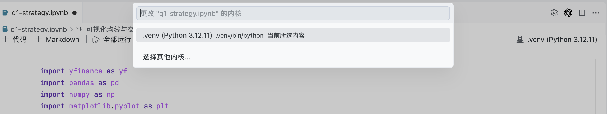
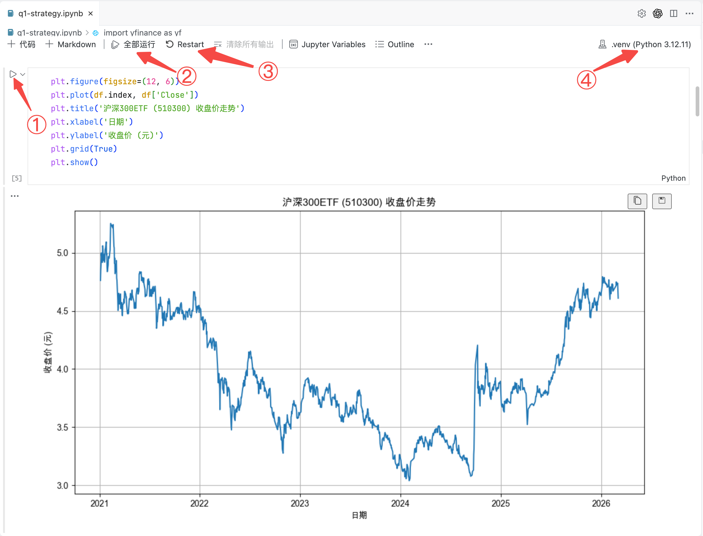
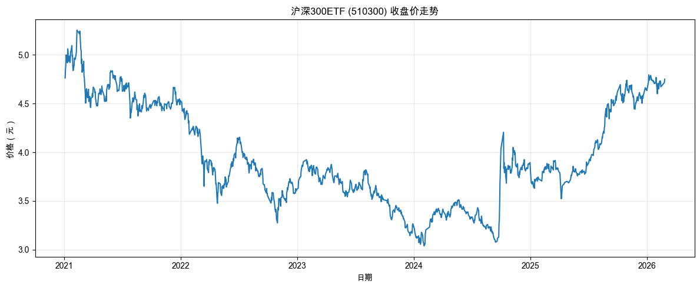
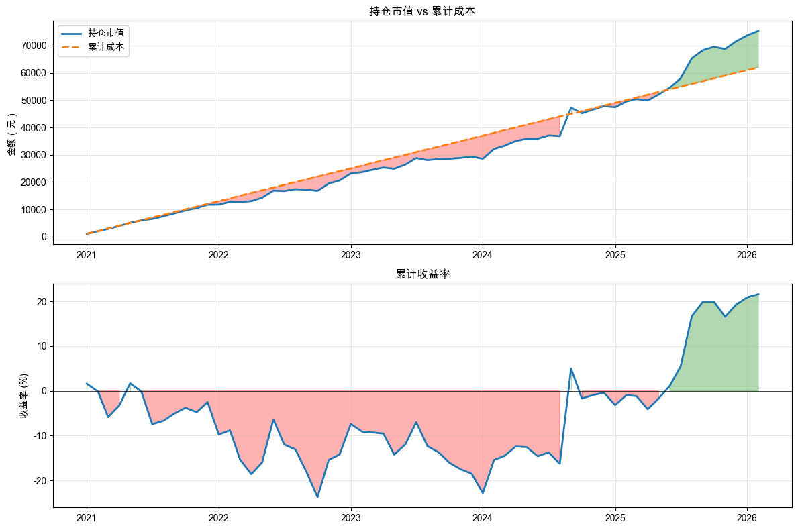
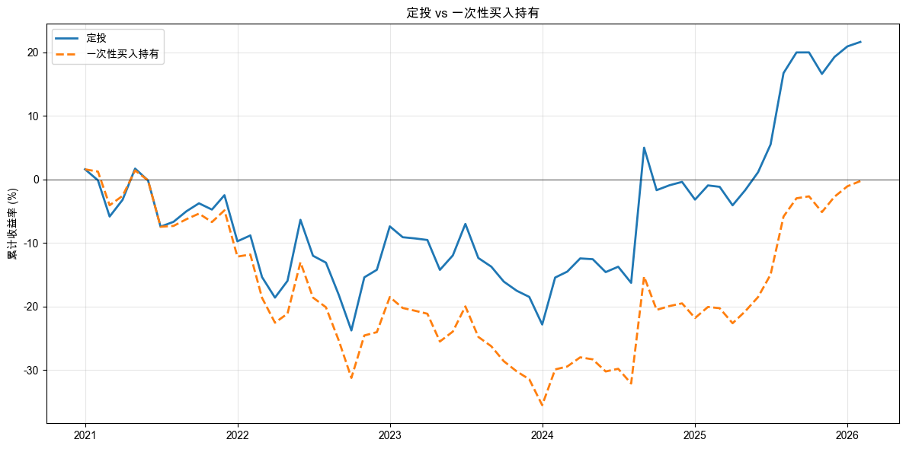
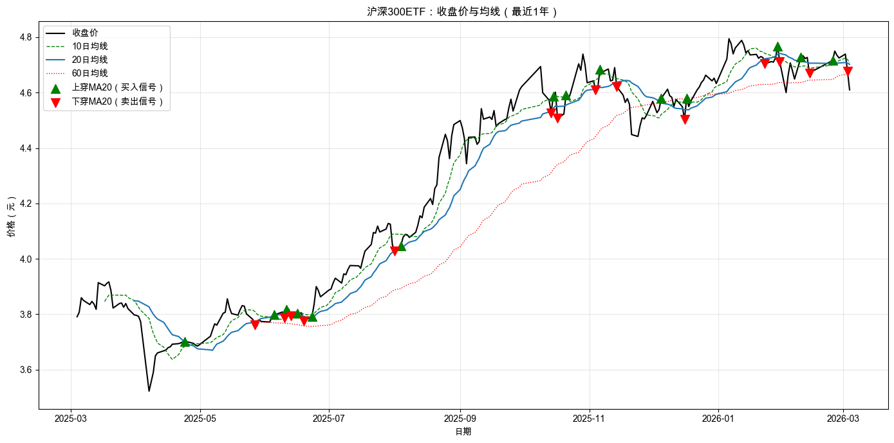
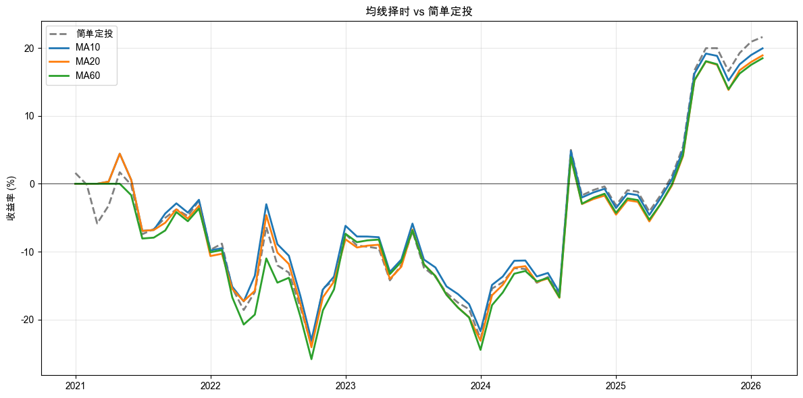
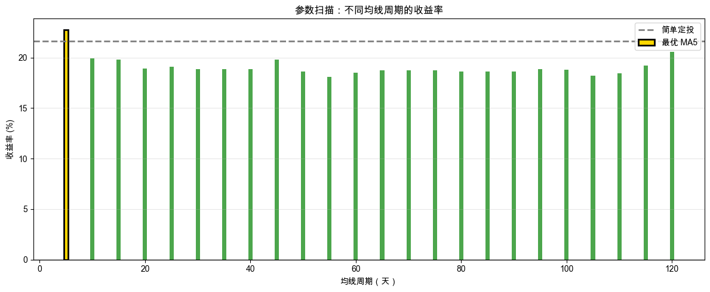

# 第 1 章：跑通第一个策略

> 最新书稿已更新至 [XQuant 量化课堂页](https://xquant.shop/courses)。
> 想阅读最新版官方书稿，请前往图书页。

前言里那张学习地图，从这一章开始，就会变成一次次的具体实验。在这一章里，你会把一个最简单的投资想法写成规则，交给 AI 跑实验，读懂结果，再亲手验证：漂亮结果到底靠不靠得住。

这一章有 7 个动手实验。你先从最简单的定投起步，把想法写成规则，再让 AI 写成代码（**做**），然后看它能不能赚钱（**看**）。接着给它加一条判断，让它稍微变“聪明”一点，再判断结果有没有变好（**再做、再看**）。最后逐个扫描参数，亲眼看到量化交易最常见的失效场景：**实验里看着赚钱，换一段时间就不行了**（**疑**）。

**路线图**

本章围绕 5 个问题，安排 7 次动手实验，外加一次总结，带你第一次走完整流程，路线如表 1-1 所示。

**表 1-1 第 1 章路线图**

| 节 | 内容 | 实验 |
|----|----|----|
| 1.1 最简单的量化策略长什么样？ | 从简单定投起步，拿到沪深 300ETF 数据，跑一次最朴素的每月固定金额买入回测 | 2 |
| 1.2 我的收益算好还是算差？ | 引入“基准”，和“什么都不做的买入持有”对比，看懂收益到底算好还是差 | 1 |
| 1.3 怎么才能赢过市场？ | 给定投加一条均线判断，看见“加判断”的双刃剑 | 2 |
| 1.4 找到“最优参数”就能盈利了？ | 逐个扫描 24 个均线参数，找历史收益率最高的“冠军” | 1 |
| 1.5 过去能代表未来吗？ | 把数据切成训练 / 测试，看冠军参数到了新数据上是否真有本事 | 1 |
| 1.6 本章总结 | 把 7 个动手操作串成一条策略进化路径，完成第一次做、看、疑的完整流程 | 0 |

## 1.1 最简单的量化策略长什么样？

这一节先进入第一个环节：**做**。你会把策略写成规则，并让程序用历史数据跑一次实验。这个过程叫 **回测（Backtest）**：用历史数据模拟“如果当时按这套规则交易，结果会怎样”。回测不能预测未来，因为未来可能出现历史里没有出现过的情况。但它能先帮我们排除明显站不住脚的想法，也能让后面的“看”和“疑”有对象。

我们从最简单的策略开始：**定投**。没错，就是你可能在银行 App 上见过的那个“定期定额投资”。每个月发了工资，拿出固定的一笔钱买入，不看涨跌、不做判断，机械地重复。

定投能量化吗？当然能，“量化”只要满足两个条件就够了：规则明确 + 执行可重复。定投完全可以量化。

不过，我们定投的不是某只个股。个股，也就是单家公司自己的股票。我们定投的是 **ETF（Exchange-Traded Fund，交易所交易基金）**。你可以把 ETF 理解成一份“指数套餐”。我们选择的是沪深 300ETF，它把 A 股市场上规模最大的 300 家公司打包在一起，其中包括银行、白酒、新能源、互联网等各行各业的龙头。

所以我们的定投规则就是：**每月第一个交易日，用固定金额（1000 元）买入沪深 300ETF。** 没有任何判断，没有任何预测，不看新闻，不猜涨跌。就这么简单。

本章 7 个实验都写在同一个 notebook 文件 `q1-strategy.ipynb` 里。notebook 是一种交互式的编程文件，和普通 Python 代码不同，它可以把代码、图表和运行结果按步骤放在一起，方便你看到策略的探索过程。第一份 spec 会让 AI 帮你创建它，后面 6 份直接接着写，变量、函数、图都在同一个 notebook 里累积下来。

### 动手实验 1：获取历史数据

接下来是你的第一个动手实验：拿到沪深 300ETF 5 年的历史数据。我们一起把这份 spec 写出来。

#### 第一段：上下文

我们刚装好环境，notebook 是空的，什么都还没做。上下文一句话说清：

> **上下文**：学员已完成环境配置（Python 3.12 + 虚拟环境 + 依赖包已安装）。这是课程的第一个操作步骤。
>
> 📌 **要点**：上下文段交代“前提是什么”。AI 不知道你之前做了什么，要明示，否则它可能假设环境已有现成数据，跳过下载步骤。

#### 第二段：任务描述

任务描述段要具体到一句话能说清。“获取数据”是反例：什么数据？什么时间？什么形式？`q1-strategy.ipynb` 是这份任务说明的交付物，它是一个 Python notebook 文件。

> **任务描述**：在当前工作目录创建 `q1-strategy.ipynb`，获取沪深 300ETF（510300.SS）最近 5 年的历史日线数据并可视化。
>
> 📌 **要点**：关键事物要点名到 ID。“沪深 300”不够，因为 A 股有沪深 300 指数（000300.SH），也有跟踪它的 ETF（510300.SS、510310.SS、510330.SS）。AI 不知道你想要哪个。spec 里所有关键名词都要具体到不能再具体。

#### 第三段：任务要求

这一段是步骤主体，AI 自由度最低的部分。我们规定四件事：

> **任务要求**：

1.  导入 yfinance, pandas, numpy, matplotlib.pyplot
2.  跨平台中文字体 fallback 链：`plt.rcParams['font.sans-serif'] = ['Arial Unicode MS', 'SimHei', 'STHeiti']` + `plt.rcParams['axes.unicode_minus'] = False`
3.  yfinance 获取数据：投资对象 `510300.SS`、起始 `2021-01-01`、参数 `auto_adjust=True, multi_level_index=False`
4.  数据存到变量 `df`，索引为 DatetimeIndex，列名含 Close

> 📌 **要点**：每个非默认参数都要点名。yfinance 默认会自动调整价格、用多级列名，这两个参数不写出来，AI 可能就会自行发挥，结果就会跟书里不一致。

有人看到 spec 里面还是出现了零星代码，担心自己写不到这么细。其实没关系。你以后写自己的量化策略时，可以分两步来：先和 AI 讨论想法，让 AI 帮你起草 spec；再把确认后的 spec 发给 AI，让它实现代码。此外，从第二章开始，我们会采用开源框架 open-xquant，进一步降低 spec 的编写难度。

#### 第四段：验收标准

最后是“成功长什么样”，这是 spec 最容易被忽略也最重要的部分：

> **验收标准**：

1.  打印数据的前 5 行
2.  打印数据时间范围（起始日期 到 结束日期）和总行数
3.  画一条收盘价折线图，标题为「沪深 300ETF (510300) 收盘价走势」

> 📌 **要点**：验收标准要让 AI 跑完自己能说“对了 / 错了”。“画一张图”是反例，AI 可能画 K 线、画柱状图、画散点图。要明确到具体的 X/Y 轴、标题文字、变量名。

完整示例 spec 在配套仓库的 [`q1-how-to-profit/specs/spec-01-get-data.md`](https://github.com/xingwudao/xquant-learning/blob/main/q1-how-to-profit/specs/spec-01-get-data.md)，你可以参考。把你写好的 spec 复制到 AI 编程工具对话框里；如果出现授权弹窗，选「允许」。示例 spec 用了 Markdown 语法，比如 `#` 表示标题，`-` 表示列表，反引号用于标出代码。Markdown 不是必要条件，关键是把想法表达清楚，并且有一定结构。

AI 执行完毕后，你会在文件夹中看到一个新文件：`q1-strategy.ipynb`。第一次双击打开时，AI 编程工具会询问你使用什么 Python 内核。它的意思是：这份 notebook 要交给哪个 Python 环境来运行。这里选择“准备工作”中创建的 Python 3.12 环境，如图 1-1 所示。

打开 notebook 文件后，你会看到代码被分成一个个单元格，从上到下排列。这个界面中有几个常用按钮，如图 1-2 所示。

1.  单步运行：单独运行当前代码单元格。运行结果会出现在这个单元格下方。

2.  全部运行：从上到下依次运行整个 notebook，直到全部完成或出现错误。每个单元格的运行结果会紧接着出现在代码单元格下方，错误信息也会显示在下方。

3.  重新启动：重新启动当前选择的 Python 内核。通常，在 Python 环境中安装了新工具，或者更新了某个旧工具之后，需要重新启动。

4.  当前 Python 内核：显示当前 notebook 正在使用哪个 Python 环境。

回到你的第一个成果上来，这时候你的 notebook 里应该出现了一张折线图和一些打印输出。AI 帮你做了这些事：从雅虎财经下载了沪深 300ETF（代码 `510300.SS`）从 2021 年 1 月至今的每日价格数据，打印了前 5 行让你看看数据“长什么样”，然后画了一张收盘价走势图，如图 1-3 所示。

### 读懂你的第一张图

看看这张收盘价走势图。

**先看整体趋势**：价格总体是在涨还是在跌？有没有明显的“大起大落”？你大概率会看到价格经历了几轮上涨和下跌的周期，不是一条直线往上走，也不是一路向下。

**再看波动范围**：最高点和最低点大概差多少？价格在什么区间内震荡？你会发现，波动幅度可能比你想象的大。这说明，同一只 ETF，不同时间点买入，结果可能天差地别，也正是我们要先用回测看结果的原因。

**这说明什么？** 价格有涨有跌，波动是常态。你不可能总是准确地买在最低点、卖在最高点，没有人能长期稳定做到这一点。那有没有一种方法，可以不依赖“买在最低点”也能参与市场？定投就是这个思路。

有了数据，一个自然的问题就出来了：**如果从几年前开始，每月固定买入一些，到现在是赚了还是亏了？** 我们来用历史数据回答这个问题。

### 动手实验 2：定投回测

在真正投钱之前，我们当然想先知道这个策略靠不靠谱。怎么办？用历史数据模拟一遍。

再提醒一次，这就是前面讲到的 **回测（Backtest）**，这个过程就像在脑海中“重播”历史，看看你的策略在过去能不能盈利。回测不能预测未来，但能帮你验证一个想法是否靠谱。

我们一起把这份回测 spec 写出来。这次重点看两件新东西：**spec 之间怎么接续**，以及**复用代码怎么封装成函数**。

#### 第一段：上下文

这次的上下文不再是“什么都没有”。上一份 spec 已经留下了 `df` 变量，我们直接接着用：

> **上下文**：在 `q1-strategy.ipynb` 中已有上一步的代码：使用 yfinance 获取了沪深 300ETF（510300.SS）的日线数据，存储在变量 `df` 中，索引为 DatetimeIndex，包含 Close 列。
>
> 📌 **要点**：spec 之间会有“接续关系”，前一份 spec 的输出是后一份的输入。上下文段把这条链条写明（变量名、形状、关键列）。这样 AI 不会重新下载数据，也不会假设一个不存在的列。

#### 第二、三段：任务描述和任务要求

任务描述一句话就能说清：

> **任务描述**：实现简单定投回测，每月第一个交易日用 1000 元按收盘价买入。

任务要求就要详细一点：

> **任务要求**：

1.  把回测逻辑封装为函数 `backtest_dca(df, monthly_amount=1000)`，返回 DataFrame（**后续步骤会复用此函数**）
2.  实现：按月分组取每月第一交易日 → 每月份额 = 1000 / 收盘价 → 累计份额逐月累加 → 月末市值 = 累计份额 × 当月最后收盘价 → 累计收益率 = (市值 - 成本) / 成本
3.  返回 DataFrame 含列：`total_cost, total_shares, portfolio_value, return`

> 📌 **要点**：复用型代码必须封装成函数。“后续步骤会复用此函数”这一句话是给 AI 的硬约束。不要写一段一次性脚本，要写一个有清晰入参的函数。后面的实验 5 会在它的基础上再写一个类似函数 `backtest_dca_with_ma`，函数没封装好整条 spec 链就接不上。
>
> 📌 **要点**：返回的 DataFrame 列名要点死。这里写的是 `total_cost, total_shares, portfolio_value, return`，四个名字一字不差。后面好几节实验都要从 `result_dca.return` 这种路径取数，列名只要换成 `ret` 或 `cum_return`，后面所有 spec 都得连带改。

随着编程模型进步，也随着你自己的策略库越来越丰富，并非所有 spec 都要像这里这样写得如此明确。AI 会在你的策略库基础上，逐渐学会如何帮你推测和补全。但作为学习，一开始我们尽量详细。

#### 第四段：验收标准

> **验收标准**：打印投资期间 / 投资月数 / 总投入金额 / 最终市值 / 最终收益率。画两张图（上下排列，figsize 12×8）：上图持仓市值 vs 累计成本（盈利绿、亏损红），下图累计收益率（零线上下绿/红填充）。

完整示例 spec 在配套仓库的 [`q1-how-to-profit/specs/spec-02-dca-backtest.md`](https://github.com/xingwudao/xquant-learning/blob/main/q1-how-to-profit/specs/spec-02-dca-backtest.md)，你可以参考。确认自己的 spec 后，把它复制给 AI。

AI 翻译成 notebook 后，如果没有自动运行代码，你可以按照前面演示的步骤自己运行，运行完毕后，你的 notebook 里会出现一组数字和两张图。AI 帮你做了这些事：按月分组找到每个月的第一个交易日作为定投日，用 1000 元除以当日收盘价算出每月能买多少份，逐月累加持有份额和投入成本，最后计算每月末的持仓市值和累计收益率。

定投的机制有一个天然的好处：价格低的时候，同样 1000 块钱能买到更多份额；价格高的时候，买到的份额更少。就像去菜市场，菜贵的时候少买点，菜便宜的时候多买点。

AI 还画出了上下两张图（如图 1-4 所示）：

- **上图「持仓市值 vs 累计成本」**：蓝色实线是你的持仓市值，它会随市场波动上下起伏；另一条线是你的累计投入成本，它稳步上升（毕竟每个月都在投钱）。两条线之间的区域用颜色标注，绿色代表盈利的时段，红色代表亏损的时段。
- **下图「累计收益率」**：更直观地看到收益率随时间的变化曲线。零线以上是赚，以下是亏。

### 读懂你的回测结果

先看打印出来的数字：总投入是多少，最终市值是多少，收益率是正还是负？

再看两张图。你大概率会发现，收益率在正负之间来回穿越，这说明：有一段时间盈利，过一阵又亏回去，然后可能又赚回来。这不是你的策略有问题，而是市场本来就这样。没有一个策略能保证只盈利不亏损，定投也不例外。它只是一种“分散买入时点”的方法，避免了把所有钱一次性投在最高点的风险，降低了运气的成分。

不管你看到的最终结果是正收益还是负收益，有一件事比结果本身更重要：**我们怎么知道这个结果算好还是算差？**

赚了 5%，听起来还行？但如果同期银行理财能给你 4%，而你承受了股市的波动，整天担惊受怕，才只多赚了 1%，值得吗？亏了 3%，听起来很糟？但如果同期大盘跌了 15%，你其实已经大幅跑赢了市场。

这就像考试拿了 80 分。你得知道全班平均分，才能判断自己考得好不好。我们需要一个参照物，考多少分很重要，但分数线划在哪则更重要。

## 1.2 我的收益算好还是算差？

一个收益率就是一个数字，本身不能告诉你任何事。赚了 20% 是好是坏？亏了 5% 是糟糕还是其实还行？这取决于你跟谁比。

这时候，你需要一个 **基准（Benchmark）**。基准就是分数线，也就是“跟谁比”，比如“全班平均分”。你不知道 80 分算好算差，但如果全班平均 60 分，你就知道自己考得不错；如果全班平均 95 分，那 80 分就得反思了。投资也是一样。你的收益率只有跟某个参照物放在一起看，才有意义。

跟谁比？其实有三种不同层次的基准：

- **绝对基准**：自己能接受的最低收益率。比如“年化至少 5%，否则我还不如买理财”。可以选择一个无风险的利率，比如 3 年定存的年化利率。这是你的个人底线。
- **相对基准**：和市场或行业指数比。你的策略是赢了大盘还是输了大盘？赢了说明你比市场更好，输了说明你还不如买指数基金。如果一番操作还不如市场大盘，再算上自己付出的时间和承受的波动，这个策略就很难说有效。
- **策略基准**：和同类策略中最简单的做法比。如果策略要挑买入时机，就和“买入持有”比，你费心选时机，总得比什么都不做强吧？如果策略要分配不同资产的买入比例，就和“平均分配”比，你费心调配比例，总得比平均分配强吧？

在后面的章节中，我们会逐步引入这三种基准。眼下先从最基本的开始。

先记住一个简单判断：如果一个策略只是跟着市场一起涨跌，它还不能说明自己发现了独特规律。只有放到基准旁边比较，才知道它到底有没有做得更好。

那什么是最自然的基准？想象你在投资的第一天，面前有两个选择：一是按照某个策略每月定投，二是把所有钱一次性全部买入，然后什么都不做，一直拿着到最后一天。第二个选择就是 **买入持有（Buy & Hold）**，它代表“什么都不做”的结果。你的策略要是连“什么都不做”都赢不了，那它存在的意义是什么？

所以我们接下来要做的事很简单：算出“什么都不做”能赚多少钱，然后跟定投的结果放在一起比。

### 动手实验 3：和基准对比

我们一起把这份基准对比 spec 写出来。这次重点看一个新东西：**验收标准如何写“动态结论”**。不知道跑出来谁赢谁输时，怎么提前定义两种结果的解读？

#### 第一、二段：上下文和任务描述

> **上下文**：在 `q1-strategy.ipynb` 中已有沪深 300ETF 日线数据（变量 `df`，含 Close 列）和简单定投回测结果（变量 `result_dca`，含 return 列）。
>
> **任务描述**：计算「一次性买入持有」作为基准，和定投策略对比，帮助理解收益来源。

#### 第三段：任务要求

> **任务要求**：

1.  基准策略（Buy & Hold）：起始日全部资金一次性买入，持有到最后一天；基准收益率 = (终点 - 起点) / 起点，存到 `benchmark_return`
2.  计算基准的逐月累计收益率曲线（每月末收盘价相对起始价的涨跌幅）
3.  与定投策略对比

#### 第四段：验收标准

我们不知道沪深 300 这 5 年是涨是跌，所以**得提前写好两种结果的对应文案**：

> **验收标准**：

1.  打印起点 / 终点价格、一次性买入收益率、定投收益率、两者差异
2.  根据对比结果**动态选**一句话：
    - 如果定投跑赢：「在市场整体下跌时，定投通过分批买入避开了部分高位」
    - 如果定投跑输：「在市场整体上涨时，越早全部投入越好」
3.  无论哪种结果，都补充一句：「但两种策略都主要跟着市场涨跌，还不能说明有稳定优势」
4.  画一张对比图（figsize 12×6）：定投 vs 一次性买入两条累计收益率曲线，图例标注名称

> 📌 **要点**：spec 不能预设结果方向。“分批买入避开高位” / “越早全部投入越好”听起来像两个相反的结论，但它们其实是对**同一个现象**的两种表述：市场跌了 / 涨了。把“双分支动态结论”写进 spec，让 AI 跑完后自己根据结果说话，无论涨跌都不会出现“硬写但和数据不符”的尴尬。

完整示例 spec 在配套仓库的 [`q1-how-to-profit/specs/spec-03-benchmark.md`](https://github.com/xingwudao/xquant-learning/blob/main/q1-how-to-profit/specs/spec-03-benchmark.md)，你可以参考。确认自己的 spec 后，把它复制给 AI，让它执行试试看。

AI 执行完毕后，你的 notebook 里会出现一组对比数字和一张双线对比图。AI 帮你做了这些事：计算买入持有的收益率（用最后一天的价格减去第一天的价格，再除以第一天的价格），然后把它和定投的收益率放在一起对比，算出两者的差异。

两条收益率曲线画在同一张图上（如图 1-5 所示）。它们之间的距离，就是两种策略在每个月的差异。有时候定投在上面，有时候买入持有在上面，领先和落后是交替出现的。这张图的价值在于：它不只告诉你最终结果谁赢了，还让你看到整个过程中两者的“赛跑”。

### 读懂对比结果

先看打印出来的数字。你会发现一个有意思的现象：沪深 300ETF 的起点价格和终点价格可能非常接近。也就是说，如果你在数据起始日一次性买入，持有到现在，可能几乎没赚没亏。市场在这几年里“坐了一趟过山车”，最后又回到了起点附近。

但定投的结果呢？大概率是正收益。为什么“什么都不做”几乎没有收益，而定投反而获得了正收益？

原因不复杂。回想一下定投的机制：价格低的时候，同样 1000 块钱能买到更多份额；价格高的时候，买到的份额更少。过去几年沪深 300 经历了一轮明显的下跌，又有所回升。在下跌过程中，定投不断在低位买入，积累了大量便宜的份额。等到价格回升，这些便宜份额带来的利润弥补了高位买入的亏损。而一次性买入就没有这个“摊低成本”的机会。你在最开始买了，然后只能眼睁睁看着价格跌下去再涨回来。

再看对比图。两条线的交叉和分离，就是两种策略的攻守转换。你会发现，在市场下跌的阶段，定投那条线通常在上面（跌得少）；在市场快速上涨的阶段，买入持有可能追上来甚至反超。这也符合直觉：下跌期间，分批买入天然就比一次性买入有优势，因为你避开了在最高点“全仓”的风险。

## 1.3 怎么才能赢过市场？

上一节我们知道了：如果只跟着市场涨跌走，很难证明策略有自己的优势。想做得比基准更好，就要加入一条能写成规则的判断。最简单的判断工具，是一条线，叫做**均线（Moving Average）**。它把过去一段时间的收盘价取平均，每天算一个值，再连成一条曲线。

打个比方，你今天量体温 37.5°C，是不是发烧了？不好说，也许你刚跑完步、也许体温计不太准。但如果你连续 5 天量体温，算个平均值，发现平均体温都偏高，那大概率是真的不舒服了。均线就是这个“平均体温”。它取过去 N 天收盘价的平均值，把每天的随机波动抹平，留下更稳定的趋势方向。单看某一天的价格就像单看某一次体温，可能被噪音干扰；但看一段时间的平均值，信息就可靠多了。

那“价格在均线上方”意味着什么？意味着当前的价格比过去一段时间的平均价格高。换句话说，市场最近在涨，可能正处于上升趋势。注意我用了“可能”，因为均线是个**滞后指标（Lagging Indicator）**，它看的是过去，不预测未来。就像你说“这个星期天气都不错”，不代表明天一定晴天。但作为一个参考信号，它总比什么都不看要强。

基于这个逻辑，我们给定投策略加一条规则：每月定投日，**仅当收盘价高于 N 日均线时才买入**，否则这个月跳过。就这么简单。不买的月份，钱留在手里，份额和成本都不变。

这就是**择时（Market Timing）**：不再闭着眼睛每月都买，而是先看看“天气”再决定出不出门。市场趋势向上的时候跟着买入，趋势不明朗的时候按兵不动。听上去很合理，对吧？

但这里有一个问题：N 取多少？过去 10 天的平均值？20 天？还是 60 天？不同的 N 就是不同的“回看窗口”：

- **MA10**（10 天，约 2 周）：短期均线。反应灵敏，价格稍微涨几天它就跟着翘头，但也容易被短期波动骗到，价格随便抖一抖，信号就来回翻转。
- **MA20**（20 天，约 1 个月）：中期均线。过滤掉了大部分日常噪音，是比较常用的参数。
- **MA60**（60 天，约 3 个月）：长期均线。非常稳定，但反应迟钝。市场可能已经涨了一大截，它才慢悠悠地确认“嗯，确实在涨”。

到底哪个好？光想没用，我们跑一遍就知道了。但在跑回测之前，先画一张图，亲眼看看均线到底长什么样。

### 动手实验 4：看见均线

这份“画图” spec 比前面几份有更多细节，要把图怎么画，规定到颜色、线型、标记形状这个粒度上。我们一起把它写出来，看看“视觉要求”要写多细才够。

#### 第一、二段：上下文和任务描述

> **上下文**：在 `q1-strategy.ipynb` 中已有沪深 300ETF 日线数据（变量 `df`，含 Close 列）。上一节引入了均线的概念：过去 N 天收盘价的平均值。
>
> **任务描述**：画出收盘价与三条均线（MA10 / MA20 / MA60）的对比图，并标记 MA20 的上穿 / 下穿点。

#### 第三段：任务要求

这部分要规定到颜色、线型、标记形状这个粒度上。

> **任务要求**：

- 截最近 1 年数据：`df_recent = df.loc[df.index[-1] - pd.DateOffset(years=1):].copy()`
- 三条均线：`rolling(10/20/60).mean()`
- 找 MA20 交叉点：上穿（前 Close ≤ MA20，当 Close \> MA20）/ 下穿（前 Close ≥ MA20，当 Close \< MA20）
- 画对比图（figsize 14×7）：
  - 收盘价（黑色实线）/ MA10（绿色虚线）/ MA20（蓝色实线）/ MA60（红色点线）
  - 上穿点：绿色向上三角（`marker='^'`, markersize=10）
  - 下穿点：红色向下三角（`marker='v'`, markersize=10）
  - 标题「沪深 300ETF：收盘价与均线（最近 1 年）」+ 图例 + 网格

> 📌 **要点**：可视化 spec 必须把视觉要求写到颜色、线型、标记形状级别。只说“画一张对比图”不够，AI 可能给你默认蓝色细线、不带标记、不带网格的图，跟书里截图完全对不上。每一个视觉决策都要进 spec：颜色、线型、标记大小、图形尺寸。你不一定需要指明颜色代码，但要用自然语言说明。
>
> 📌 **要点**：截窗口要带 `.copy()`。要求里的 `df.loc[...].copy()` 不是装饰。pandas 里不带 `.copy()` 的切片常常是“视图”，后面再往这个视图上加列（MA10/MA20/MA60）会触发 `SettingWithCopyWarning`，有时甚至改不到原数据。spec 里写明 `.copy()` 比写一句“注意切片”更稳，AI 看到 `.copy()` 就知道你要的是独立副本。这一点不需要一开始就知道，我也是第一遍输出不满意之后，经过 AI 提醒才补上的。你要学的是持续迭代，不是第一次就写完美。

#### 第四段：验收标准

> **验收标准**：价格与均线对比图（含交叉点标记）+ 打印交叉统计「上穿 N 次 / 下穿 N 次」。

完整示例 spec 在配套仓库的 [`q1-how-to-profit/specs/spec-04-ma-visual.md`](https://github.com/xingwudao/xquant-learning/blob/main/q1-how-to-profit/specs/spec-04-ma-visual.md)，你可以参考。确认自己的 spec 后，把它复制给 AI，弹窗选「允许」。

AI 执行完毕后，你的 notebook 里会出现一张价格与均线的对比图，如图 1-6 所示。

### 读懂均线图

现在你亲眼看到了均线和交叉信号。几个值得注意的地方：

**三条均线的“性格”不同。** 绿色的 10 日均线紧贴价格，几乎同步波动，价格稍微涨几天它就跟着翘头，跌几天它就立刻掉头向下。蓝色的 20 日均线稍微平滑一些，过滤掉了一些日常噪音。红色的 60 日均线最“淡定”，价格上下翻飞它才慢慢跟。这正是前面说的“回看窗口”的差异：窗口越短，越灵敏也越容易被骗；窗口越长，越稳定也越迟钝。

**交叉点就是信号。** 绿色三角标记的是“上穿”，收盘价从 MA20 下方穿到上方，意味着短期价格超过了最近一个月的平均水平，趋势可能在转好。红色三角标记的是“下穿”，收盘价跌破了 MA20，趋势可能在转弱。

**信号不少，但不是每次都“对”。** 仔细看图：有些上穿之后确实涨了一段，信号是“对”的；但也有些上穿之后价格又很快跌回去，刚穿上去就掉下来，这就是“假信号”。均线越短，假信号越多；均线越长，信号越少但更迟钝。没有哪条均线能百分百准确。

有了这个直觉，我们来试试：如果真的按这些信号来决定买不买，结果会怎样？

### 动手实验 5：加入均线择时

这份均线择时 spec 多了一件事，要把可能出错的边界情况提前列出来。因为均线初期没值、累计成本为 0 时除法会出问题，这些都要在 spec 里点名。我们一起把它写出来。

#### 第一、二段：上下文和任务描述

> **上下文**：在 `q1-strategy.ipynb` 中已有沪深 300ETF 日线数据（`df`）、简单定投回测函数 `backtest_dca` 和结果（`result_dca`）、基准对比代码。
>
> **任务描述**：在定投基础上加入均线择时：每月第一个交易日，仅当收盘价 \> N 日均线才买入。

#### 第三段：任务要求

> **任务要求**：

1.  函数 `backtest_dca_with_ma(df, monthly_amount=1000, ma_period=20)`，返回格式同 `result_dca`，额外含 signal 列（布尔值）。**后续步骤会复用此函数**
2.  三个边界情况必须写明处理方式：
    - 均线计算初期（前 N 天）没均线值，这些月份不买入
    - 跳过的月份，累计成本和份额保持不变
    - 累计成本为 0 时（尚未发生任何买入），收益率直接设为 0，**不要用除法**，避免除零警告
3.  分别跑 MA10、MA20、MA60 三个参数

> 📌 **要点**：边界情况必须写进 spec。“每月有买入条件”听起来简单，但隐藏着三个容易出错的地方：① 前 N 天没均线 ② 跳过月份的状态怎么传递 ③ 累计成本为 0 时除法会 NaN。如果 spec 不写清楚这三件事，AI 就有可能写出有 bug 的代码。
>
> 📌 **要点**：这里增加了一个回测函数 `backtest_dca_with_ma(df, monthly_amount=1000, ma_period=20)`，它前两个入参和实验 2 的 `backtest_dca(df, monthly_amount=1000)` 完全一致，只在末尾加 `ma_period`。新加参数追在已有参数后面，不打乱原顺序，才能保证 spec 链的可读性。

#### 第四段：验收标准

> **验收标准**：

1.  打印每个参数：`MA10: 收益率 X.XX%, 买入 N/M 次` + 简单定投作为对照
2.  画对比图（figsize 12×6）：简单定投灰虚线 + MA10/20/60 三色实线，图例 + 网格 + 零线

完整示例 spec 在配套仓库的 [`q1-how-to-profit/specs/spec-05-ma-timing.md`](https://github.com/xingwudao/xquant-learning/blob/main/q1-how-to-profit/specs/spec-05-ma-timing.md)，你可以参考。确认自己的 spec 后，把它复制给 AI，弹窗选「允许」。

AI 执行完毕后，你的 notebook 里会出现一组对比数据和一张多线对比图。AI 帮你做了这些事：在每个交易日计算过去 N 天收盘价的平均值（均线），然后在每月定投日比较当天收盘价和均线值。价格在均线上方就买入，在下方就跳过。和简单定投的区别就在这里：简单定投每个月都买，均线策略有些月份会选择“不出手”。AI 分别用 MA10、MA20、MA60 三个参数各跑了一遍回测，然后画了一张对比图（如图 1-7 所示）：灰色虚线是简单定投作为基准，三条有色实线是不同均线参数的策略，四条线放在一起一眼就能看出谁在什么时候领先、什么时候落后。

### 读懂均线择时的结果

先看打印出来的数字。每一行告诉你两件事：最终收益率和买入次数。

注意买入次数的变化。简单定投是每个月都买，均线策略则会跳过一些月份。MA10 跳过得少一些，因为短期均线容易被价格快速穿越；MA60 跳过得多一些，因为长期均线更“迟钝”，价格要涨很久才能站到它上面。换句话说，均线周期越长，策略越“挑剔”，不是每个月都觉得“可以买”。

再看收益率。三个参数的收益率各不相同，有的可能比简单定投好，有的可能更差。这是第一个值得注意的现象：**加了均线判断，不一定收益更高。**

为什么会这样？因为均线择时是一把双刃剑。它帮你跳过了一些“价格在下跌通道”的月份，避免了在下跌中继续投钱，这是好事。但它也可能让你错过一些“刚开始反弹”的月份。价格刚从底部起来，还没站上均线，你就没买到最便宜的那几次。少买的月份如果后来涨了，你就少赚了。

现在看对比图。灰色虚线是简单定投，有色实线是三条均线策略。注意它们什么时候分开、什么时候靠近。你可能会发现：在市场大幅下跌的阶段，均线策略的曲线有时比简单定投下跌得少，因为它跳过了一些下跌月份的买入。但在市场持续上涨的阶段，均线策略可能跟不上简单定投，因为有些月份它“犹豫”了，没有买入。

这里有一个关键观察，请你记住：**加入判断条件确实改变了结果，但改变的方向不一定是你期望的方向。它不是一个“只赚不赔”的改进，而是一种取舍，用“可能错过上涨”换“可能避开下跌”。** 这样的取舍会贯穿后面的章节：每一条规则都在换取某种收益，也承担某种代价。

你还会注意到，这三个参数的效果不一样。MA10、MA20、MA60，谁最好？在你手上这段数据里，可能 MA20 赢了，也可能 MA60 更好，这取决于市场在过去几年具体走了什么样的路径。

三个参数，MA10、MA20、MA60，到底哪个最好？为什么不干脆把所有可能的参数都试一遍呢？从 MA5 到 MA120，每隔 5 天试一个，总有一个是最优的吧？没错，这个做法就叫“参数扫描”，目的是找到“最优参数”。

## 1.4 找到“最优参数”就能盈利了？

上一节我们试了三个参数，效果各不相同。你心里可能已经在想：才三个参数就想找到最优解？太不严谨了。干脆全试一遍，从 MA5 到 MA120，每隔 5 天取一个，一共 24 个参数。跑完之后，选收益率最高的那个。听起来是不是很“科学”、很“严谨”？毕竟我们没有拍脑袋猜，而是用数据说话、穷举搜索。

为什么是 5 到 120 这个范围？5 天太短，几乎等于在看每周的波动，全是噪音；120 天约等于半年，再长的话均线变化越来越缓慢，策略基本不会发出买入信号。5 到 120 覆盖了实务中常用的所有均线周期，短期、中期、长期都包含在内。每隔 5 天取一个是为了效率：不需要逐天试，大趋势的差异在 5 天级别就能体现出来，MA15 和 MA16 的结果不会有质的不同。

不过在看结果之前，你可以先想一个问题：如果你朝墙上射了 24 支箭，总有一支是最接近靶心的。但这说明你箭术好吗？如果射 2400 支箭呢？先把这个问题放在心里，我们来看看实验结果。

### 动手实验 6：参数扫描

这份参数扫描 spec 有点**朴素**，所谓朴素，就是暂时不管什么是“过拟合”，也不分训练 / 测试集，这些概念我们留到以后再说，这次就单纯“找最优”。我们一起把它写出来，先经历一次“找到漂亮数字”的过程，下一节再回头看看那个数字到底是什么。

#### 第一、二段：上下文和任务描述

> **上下文**：在 `q1-strategy.ipynb` 中已有 `df`、`result_dca`、带均线条件的回测函数 `backtest_dca_with_ma`。
>
> **任务描述**：扫描所有均线参数（MA5 到 MA120，步长 5），找到历史收益率最高的「最优参数」并可视化。

#### 第三、四段：任务要求和验收标准

> **任务要求**：扫描范围 MA5 到 MA120 步长 5（共 24 个参数）→ 调用已有的 `backtest_dca_with_ma` 跑一遍 → 记录每个参数的最终收益率 → 找出最高那个。
>
> **验收标准**：打印最优参数 / 最优收益率 / 简单定投对照 / 提升幅度；画柱状图（figsize 12×5），正收益绿、负收益红、最优金色高亮黑边框、灰虚线标出简单定投水平线、黑实线标零线。

完整示例 spec 在配套仓库的 [`q1-how-to-profit/specs/spec-06-param-scan.md`](https://github.com/xingwudao/xquant-learning/blob/main/q1-how-to-profit/specs/spec-06-param-scan.md)，你可以参考。确认自己的 spec 后，把它复制给 AI，弹窗选「允许」。

AI 执行完毕后，你的 notebook 里会出现一组数字和一张柱状图。AI 帮你做了这些事：从 MA5 到 MA120，每隔 5 天取一个参数，逐个运行均线回测并记录收益率，一共 24 次。就像考试出了 24 套卷子，让同一个策略换不同的均线参数去做，看哪套得分最高。然后从中找出收益率最高的“冠军参数”，并画成柱状图。

参数扫描结果如图 1-8 所示。柱状图中每根柱子代表一个参数的收益率。绿色柱子 = 正收益，红色柱子 = 负收益，金色高亮那根就是“冠军”，24 个参数里收益率最高的。灰色虚线是简单定投的水平线，让你一眼看出哪些参数跑赢了简单定投，哪些跑输了。黑色实线是零线，在它下面的参数连本都没保住。

### 读懂参数扫描的结果

先看打印出来的数字。最优参数的收益率是多少？和简单定投比，提升了多少？你大概率会看到一个相当漂亮的数字，看起来我们真的“找到了盈利的秘诀”。

但是，请你仔细看那张柱状图的形状。

如果真的存在某个“最优均线周期”的内在规律，你会期望柱状图呈现一个“山峰”形状：最优参数附近的参数表现应该也不差，离最优越远表现越差，像一座钟形山丘，顶点就是最优值。这说明“最优参数附近就是甜蜜区”，你稍微偏一点也没关系。

但实际的柱状图是这样吗？大概率不是。你看到的更像是高高低低、毫无规律的锯齿形状。MA35 可能很好，MA40 突然变差，MA45 又回来了。相邻的两个参数仅仅差 5 天，表现可能天差地别。金色那根“冠军”柱子的左右邻居，可能一个正收益一个负收益。

这说明什么？

说明这个“最优参数”的“好”，很可能只是碰巧。它恰好在这段特定的历史数据上表现最好，而不是因为它抓住了什么深层规律。如果真的有深层规律，相邻参数不应该差这么多。MA35 和 MA40 只差 5 天的回看窗口，它们看到的趋势信息几乎一样，凭什么一个盈利一个亏损？唯一的解释是：结果对参数极度敏感，而这种敏感性来自数据中的随机波动，不是来自某种稳定的市场规律。

现在回到开头那个问题：你朝墙上射了 24 支箭，然后走到离某支箭最近的地方画了一个靶心。“百发百中”？当然不是，你只是射得够多罢了。24 个参数里，总有一个碰巧在这段时间表现最好，这是统计学的必然，不是你发现了什么秘密。就像你抛 24 次硬币，总有一次正面连续出现最多，你不会因此断定那枚硬币有“特异功能”。

这个现象我们暂时叫它“锯齿现象”，参数和参数之间的差异不是平滑过渡的山峰，而是高低跳动的锯齿。所以，我们需要一个更严格的方法去验证：这个“冠军”到底是真本事，还是只是 24 次掷骰里运气最好的那一次。

方法很简单：用这个参数从未见过的新数据来测试它。下一节就做这件事。

## 1.5 过去能代表未来吗？

回测就是用过去的数据来检验策略，无论考分高低，我们都应该问一句：过去能代表未来吗？

既然我们无法真正预测未来，也不能穿越到未来，我们只能想办法设计考试，让考试中得到高分的策略在未来也更可能表现好。因此，不能拿学生复习过的原题来考他。他全都见过，考满分不说明任何问题。要测出真实水平，得拿一张他从没做过的卷子。投资策略也一样。上一节我们用全部 5 年的历史数据做参数扫描，找到了“冠军参数”。但这个冠军是在“开卷考”里拿的第一名，它见过所有数据，当然能挑到最好的答案。这不算本事。

还要给它一场闭卷考，方法是把数据分成两段。

你手上有大约 5 年的历史数据。我们把前 60% 拿出来，大约 3 年，这部分叫**训练集（Training Set）**，用来“刷题”，也就是做参数扫描、找最优参数。剩下的后 40%，大约 2 年，叫**测试集（Test Set）**，这是“考试卷”。训练集里发生的事，测试集完全不知道；测试集里发生的事，训练的时候完全没看过。两段数据，互不相见。这是这次实验最重要的约束：两段数据不能交叉，否则就又变成开卷考。

考试的类比可以帮你记住这个逻辑：你手上有 5 年的真题。你用前 3 年的真题来复习，反复做、反复总结、找到最顺手的解题方法。然后你用后 2 年的真题来“考试”，这 2 年的题你在复习的时候完全没碰过。如果你是真的理解了规律，换一张新卷子也能考好。如果你只是背了前 3 年的答案，新卷子就会露馅。

为什么是 60/40？没有什么神奇数字。训练集不能太少，否则“复习”不充分，找到的参数不可靠；测试集也不能太少，否则“考试”的题量不够，结果说明不了问题。60/40 是一个常见的折中：前面大约 3 年够做一轮完整的参数扫描，后面大约 2 年够看出趋势。这不是完美的方法，真正的未来当然不可知，我们只是用“后来发生的事”来模拟未来。但它是我们能做到的最公平的模拟。

接下来的实验就是这个思路：在训练集上重新做参数扫描，找到训练集的“冠军参数”。然后拿着这个冠军参数去测试集上跑一遍，看看它能不能通过“考试”。同时我们在测试集上也跑一遍简单定投作为对照。为什么要对照？因为简单定投不做任何参数优化，它就是“什么都不想”的参照物。如果你精心优化的参数连“什么都不想”都赢不了，那优化的意义何在？

### 动手实验 7：样本外测试

这份样本外测试 spec 把数据按时间切成两段，让上一节找到的“冠军参数”在没见过的新数据上重新考一次。我们一起把它写出来，重点是**数据切分的可复现写法**和**怎么把三个数字摆在一起做对比**。

#### 第一、二段：上下文和任务描述

> **上下文**：在 `q1-strategy.ipynb` 中已有 `df`、`backtest_dca`、`backtest_dca_with_ma`、参数扫描代码（MA5 到 MA120）。
>
> **任务描述**：把数据按时间前 60% / 后 40% 分为训练集 / 测试集，验证「最优参数」在未见过的新数据上是否仍然有效。

#### 第三段：任务要求

> **任务要求**：

1.  数据分割：**按时间前 60% 为训练集，后 40% 为测试集**（按时间顺序切，不打乱）
2.  在训练集上扫描参数（MA5 到 MA120 步长 5），找到训练集上的最优参数
3.  用该最优参数在**测试集**上跑回测
4.  同时在**测试集**上跑简单定投作为对照
5.  对比三个收益率：训练集最优 / 测试集该参数 / 测试集简单定投

> 📌 **要点**：数据切分的写法直接决定可复现。“按时间前 60%”是确定的，“随机分 60/40”是不确定的。后者每次跑会得到不同切分结果，结果就不能 1:1 对照了。任何切分操作都要写明：是按时间还是随机？切点在哪？随机种子？影响切分结果的要素确定写在你的 spec 中，实验结果才能复现。
>
> 📌 **要点**：当一份 spec 要核对前一份 spec 的结论时，固定套路是把三个数字摆在一起对比：前一份给出“看似最优”，本份给出“测试集上的真实成绩”+“全选 C 的成绩”。三者一对比，前一份的“最优”到底是真本事还是巧合，一目了然。三个数字不是随便凑的：训练集最优是“自我感觉”，测试集该参数是“真实检验”，测试集简单定投就好比“全选 C”，三者放一起对比，隐藏风险就更容易暴露。

#### 第四段：验收标准

> **验收标准**：

1.  打印训练集 / 测试集时间范围和条数
2.  三个数字并排打印：训练集最优参数 + 收益率 / 测试集上该参数的收益率 / 测试集上简单定投的收益率
3.  对比结论双分支：
    - 最优参数在测试集上比简单定投还差：打印「这就是过拟合，你在历史数据上找到的是巧合，不是规律」
    - 否则：打印「结果看起来还行，但仍需谨慎，样本量有限」

完整示例 spec 在配套仓库的 [`q1-how-to-profit/specs/spec-07-overfitting.md`](https://github.com/xingwudao/xquant-learning/blob/main/q1-how-to-profit/specs/spec-07-overfitting.md)，你可以参考。确认自己的 spec 后，把它复制给 AI，弹窗选「允许」。

AI 执行完毕后，你的 notebook 里会出现一组关键数字。这可能是本章最重要的一组数字，请你做好心理准备。

AI 帮你做了这些事：把数据按时间顺序在第 60% 的位置切下一刀，前面是训练集（“复习用的真题”），后面是测试集（“考试当天才看到的新题”）。注意数据是按时间顺序切的，不是随机打乱的，因为在现实中你只能用过去的数据做决策，未来的数据还没发生。然后在训练集上重新做参数扫描找到冠军参数，拿着这个冠军参数去测试集上跑一遍（“正式考试”），同时在测试集上也跑一遍简单定投作为对照。

### 读懂样本外测试的结果

现在看看这三个数字。

第一个数字：训练集上最优参数的收益率。这个数字大概率很漂亮。毕竟它是 24 个参数里挑出来的冠军，在训练集上当然表现最好。记住，这是“开卷考”的成绩。

第二个数字：测试集上用同一个参数的收益率。这是“闭卷考”的成绩。

第三个数字：测试集上简单定投的收益率。这是“全选 C”的成绩。

把第二个数字和第三个数字放在一起看。

大概率你会看到这样的结果：冠军参数在测试集上的收益率，比简单定投还差。

请你再读一遍这句话，确认你没有看错。你花了大量精力做参数扫描，从 MA5 到 MA120 穷举了 24 个参数，在训练集上找到了表现最好的那个。然后你拿着这个精心挑选的冠军参数去面对“未来”，它还不如简单定投。折腾了一圈，最后还不如“全选 C”。

也就是说：**你精心优化的策略，还不如什么都不做。**

这不是你的操作有误，也不是代码有 bug。这就是“过拟合”（Overfitting）。通俗一点说，就是策略把见过的题背得太熟，却没有学到真正规律；一遇到波动变化，就失效。

在训练集上，你的冠军参数看起来无懈可击。它是 24 个候选人里的第一名，收益率比第二名还高出不少。但到了测试集上，它差到几乎像换了一个策略。它在训练集上的好成绩不是因为它抓住了市场的某种深层规律，而是因为它恰好适配了那段特定数据的特定走势。换一段数据，这种适配就不存在了。

为什么会这样？我从三个角度帮你理解。

**从统计的角度看。** 24 个参数里挑最好的那个，就像在教室里随便拉 24 个人，选最高的那个。他身高 185cm，但这能代表这 24 个人的平均身高吗？当然不能。他只是碰巧最高的那个。你选的参数越多，“碰巧最好”的那个看起来越好。因为你给了随机波动更多的机会来制造“看起来很厉害”的假象。这种现象叫选择偏差（Selection Bias）：当你从一堆结果里挑最好的那个，你挑到的往往不是“真正最好”的，而是“运气最好”的。

**从市场的角度看。** 前 3 年和后 2 年的市场环境不同。也许前 3 年价格一路下跌；后 2 年价格从低点慢慢涨回来。或者反过来。一个参数在价格下跌时表现好，比如 MA60，因为它足够迟钝，帮你躲过了大部分下跌，但到了价格上涨时，这种迟钝反而成了累赘：市场都涨起来了，MA60 还在犹豫要不要买入，白白错过了一大段涨幅。市场不是一成不变的。一件衣服不可能四季都合适，冬天穿着暖和的羽绒服，夏天穿就热死人。你在前 3 年找到的“最合身的衣服”，到后 2 年换了季节，哪里都不对。

**从直觉的角度看。** 最优参数就是为那段训练数据“量体裁衣”的产物。量体裁衣做出来的西装确实完美合身，但那是为你一个人做的。换一个身材不同的人穿，哪里都不对劲。你的冠军参数也是一样：它是为 2021 年到 2023 年某段特定市场走势“量身定做”的，每一个均线周期、每一次买入跳过，都恰好踩在了那段数据上。换一段数据，哪怕只是后面紧接着的两年，整套策略就不再合身。

这就是过拟合，它是量化中最危险的敌人，也是最会伪装的敌人。

它不是 bug，不是因为代码写错了一行引起的，它是一种系统性的思维陷阱。只要你在历史数据上做优化，过拟合的风险就始终存在。你测试的参数越多，优化的维度越多，它就越危险，因为你给了“碰巧”更多的生存空间。

每一个做量化的人，不管是刚入门的新手还是资深研究员，都必须时刻警惕它。在历史数据上看到的任何“好结果”，在被样本外测试验证之前，都不值得相信。训练集上的冠军可能只是考试原题背得最熟的那个学生，真正的考试一来就露馅了。

你在本章走过的路，从简单定投、到加入均线判断、到参数扫描找最优、再到样本外测试看清真相，正是很多量化新手都会经历的完整旅程。区别只在于：有些人在“找到最优参数”那一步就停下来了，兴冲冲地拿去实盘交易，等到真正亏钱之后才明白过拟合是什么。而你，在投入一分钱之前，就已经看到了真相。

记住这个教训：**历史数据上的“最优”，不等于未来的“可用”。** 在量化交易的世界里，保持怀疑会让你走得更稳。

## 1.6 本章总结

回头看看我们走过的路。从最简单的定投开始，到加入均线判断做择时，到参数扫描寻找“最优解”，再到样本外测试看着精挑出来的参数失效，7 个动手实验，一步一步，你经历了一次完整的认知升级。这不只是学了几个策略，而是亲眼见证了“看起来有效”和“真的有效”之间的巨大鸿沟。

### 概念速查表

本章涉及的核心概念汇总如表 1-2 所示。

**表 1-2 第 1 章核心概念速查**

| 概念 | 含义 | 类比 |
|----|----|----|
| 回测（Backtest） | 用历史数据模拟策略执行 | 在脑海中“重播”历史 |
| 基准（Benchmark） | 用来比较的参照物 | 全班的平均分 |
| 均线（Moving Average） | 过去 N 天价格的平均值 | 连续几天的平均体温 |
| 过拟合（Overfitting） | 把数据中的噪音当成规律 | 背答案 vs 理解规律 |
| 训练集（Training Set） | 用来“复习”和找参数的那段数据 | 复习用的真题 |
| 测试集（Test Set） | 模型从未见过、用来检验的那段数据 | 没做过的考试卷 |

### 策略进化路径

第 1 章 3 个版本的策略进化与教训如表 1-3 所示。

**表 1-3 第 1 章策略进化路径**

| 版本 | 策略            | 教训                                         |
|------|-----------------|----------------------------------------------|
| v0.1 | 简单定投        | 收益主要跟随市场涨跌                         |
| v0.2 | 定投 + 均线择时 | 加入判断是双刃剑，不保证比简单定投更好       |
| v0.3 | 参数扫描优化    | 历史最优不等于未来可用，过拟合的风险就在面前 |

### 学习地图第一遍：你刚刚走完的路

回头看：你已经把四个阶段都接触了一次。**确定候选**：你选了沪深 300ETF；**制定规则**：你定了“每月买一份”或“上穿均线再买”的规则；**执行交易**：程序在回测里按规则模拟买入；**评估归因**：你比了三种策略的累计收益，也对照了样本内和样本外。

更重要的是：**做、看、疑**三个环节你都经历了一遍。前言里那句话，“**做要定规则、看要定指标、还要怀疑你的指标**”，你不是听别人讲，而是亲眼看见冠军参数在测试集上现原形之后才真正信的。**这就是为什么本书把“疑”和“做”“看”放在同等位置**：会做、会看，但不会怀疑，最容易被漂亮结果骗到。

### 本章最重要的收获

说实话，我们并没有学会一个能稳定盈利的策略。定投跑不赢市场，加了均线也未必更好，参数优化更是一脚踩进了过拟合的坑。如果你期待的是“学完第 1 章就能找到盈利的策略”，那确实要让你失望了。

但你学会了一样比任何策略都值钱的东西：**怀疑**。面对任何一条漂亮的回测曲线，你现在知道第一个要问的问题是：“这是规律，还是巧合？”这种本能的警觉，会让你在未来少走很多弯路，少付很多代价。

### 带走的问题

本章带你跑通了第一个完整策略，但也留下了一些更深的问题。带着它们继续往下走：

- **只买沪深 300 够吗？** 本章 7 个实验全在拿沪深 300 做样本，但真正投资时不会只买一只。第 2 章会先选 3 只 ETF，建立一个更像样的候选范围。
- **怎么区分运气和能力？** 一个策略盈利了，到底是真有水平，还是刚好碰上了一段适合它的市场走势？第 5 章、第 6 章会解答。
- **有没有不容易过拟合的策略？** 既然参数优化这条路走不通，还有别的路吗？第 4 章、第 6 章会解答。
- **怎么知道策略在未来还能盈利？** 样本外测试只是第一步，还有更严格的检验方法吗？第 5 章会解答。

答案都在后面。我们下一章继续。

> 💡 **提示**：本章所有代码的可运行版本见配套仓库的 [`q1-how-to-profit/notebooks/q1-strategy.ipynb`](https://github.com/xingwudao/xquant-learning/blob/main/q1-how-to-profit/notebooks/q1-strategy.ipynb)。
