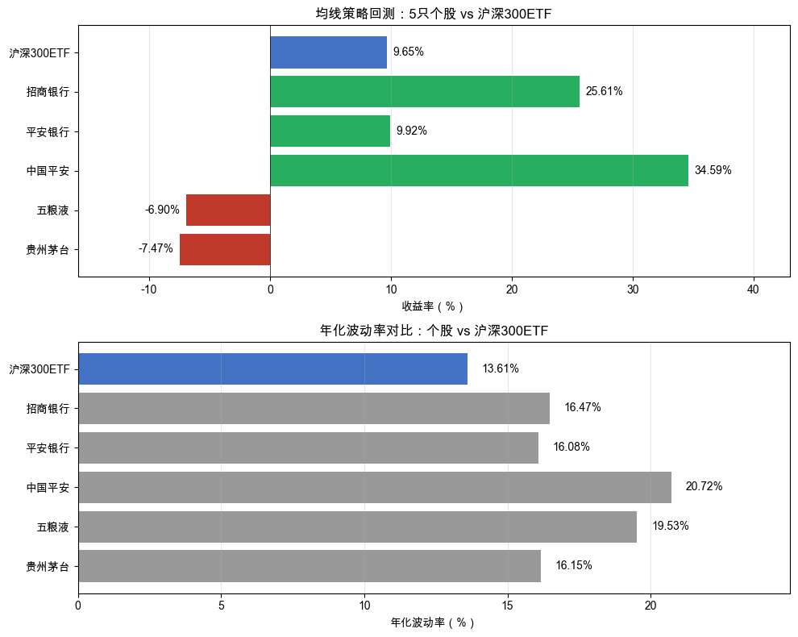
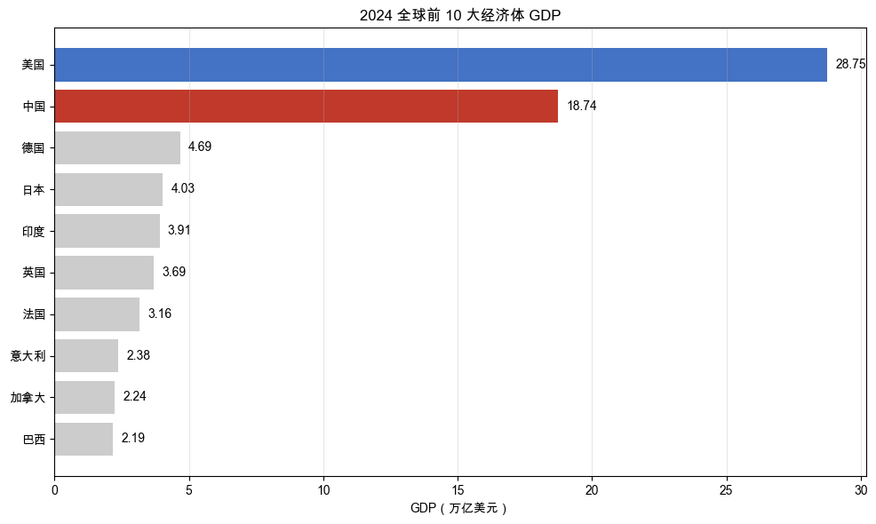
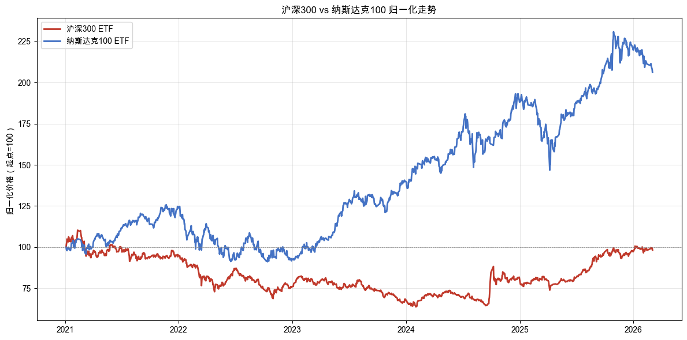
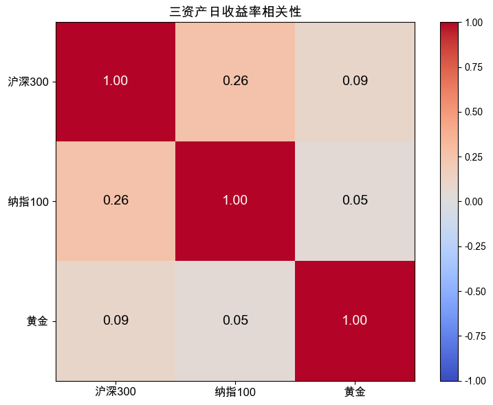
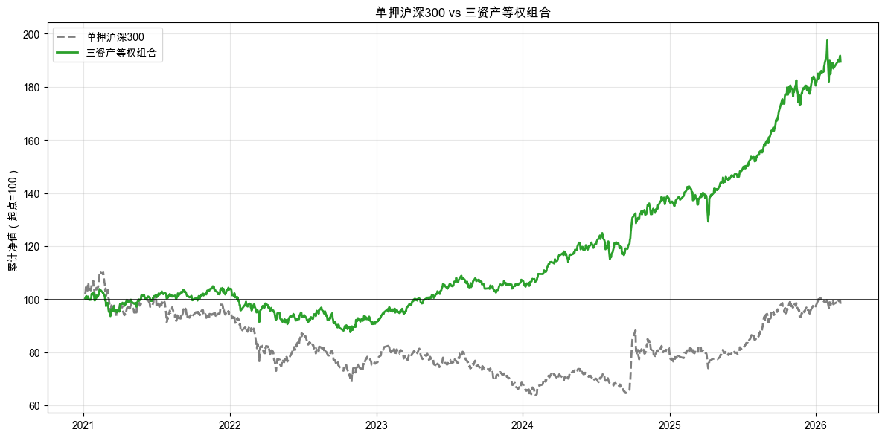

# 第 2 章：先选买什么：从 3 只 ETF 开始

> 最新书稿已更新至 [XQuant 量化课堂页](https://xquant.shop/courses)。
> 想阅读最新版官方书稿，请前往图书页。

第 1 章我们用一只沪深 300ETF 体验了量化策略的完整流程：从下载数据、定投回测、基准对比，到均线择时、参数扫描、样本外测试。一路走下来，你已经亲手验证了一个策略从“看起来有效”到“过拟合”的全过程。

直觉告诉我们，如果策略只围绕一只资产运行，风险会很集中。把鸡蛋放在一个篮子里不够安全，应该分散一点。这个直觉对不对？“分散”到底该怎么分？随便多买几只就算分散了吗？这些问题，就是本章要回答的。

### 路线图

本章按“准备 → 实验 → 收尾”三段组织，对照如表 2-1 所示，一共要动手做 3 次实验。

**表 2-1 第 2 章路线图**

| 节 | 内容 | 实验 |
|----|------|------|
| 2.1 - 2.2 | 为什么要圈定一个候选名单 | 0 |
| 2.3 - 2.5 | 怎么圈定一个候选名单：类型、地区、风险分散 | 3 |
| 2.6 - 2.7 | 回头看 + 本章总结 | 0 |

---

## 2.1 先圈定可选范围

第 1 章只研究一只沪深 300ETF，所以你不用思考“市场上还有什么”。从这一章开始，问题变了：策略到底允许考虑哪些投资对象？

不能只看一只。只看一只，风险集中，机会也少。它不适合的时候，策略可能长时间只能拿着现金。也不能什么都看。把整个市场都塞进来，看似选择更多，其实没有重点。数据质量、成交活跃程度、资产类型、交易规则都混在一起，后面的实验很容易变乱。所以我们要先圈定一个有限的候选范围。这个范围在量化里叫**标的池（Universe）**。所谓“标的”，就是投资对象；标的池，就是策略允许考虑的候选名单。第 2 章先确定名单，第 3 章再讨论名单里的资产各买多少。

你可以把标的池想成一块白板。白板上先写下策略允许观察的名字。后面做信号、算权重、执行交易，都只能在这块白板里进行。白板之外的资产，再好也先不看。

构建标的池时，应该先提出自己的假设，再把假设变成可以计算的变量。在量化里，有些变量会被称为**因子（Factor）**。你现在可以先把因子理解成：把投资直觉翻译成数字后的可计算变量。它可以用来描述资产或市场的特征，也可以用来解释风险和收益、预测未来表现，或者辅助投资决策。比如“经济体量更大的市场更值得优先考虑”，就可以落成 GDP 总量这个简化宏观因子。

本章先不展开复杂的因子研究。这里你只需要记住：GDP 总量是一个简化的因子例子；相关性不是因子本身，而是用来判断资产涨跌是否同步的统计指标。更完整的因子研究放到第 9 章再讲。

如果你还没有金融基础，那么在开始动手实验前，先简单看一眼市场上常见的投资对象：

- **股票（Stock）**：买一家公司的一小块所有权。公司赚钱了你分红，公司涨价了你的股份也值钱了。风险：单个公司可能经营不善甚至倒闭。
- **ETF（交易所交易基金）**：一篮子股票的打包组合。比如沪深 300ETF（510300）打包了 A 股市值最大的 300 家公司。买一份 ETF = 同时持有 300 家公司，风险分散。
- **债券（Bond）**：就是一张“借条”。你买国债 = 借钱给国家，到期还本付息。风险低，收益也相对低。
- **期货 / 期权**：“衍生品”，自带杠杆，风险极高，可能亏损超过本金。**新手先别碰。**

这些种类，风险和收益各不相同，本书作者的建议是：**新手学习不要买卖股票，从 ETF 开始。** 等你通过 ETF 理解了市场运作，再去研究其他资产也不迟。原因很简单，ETF 本身就是一篮子资产。用 ETF 构建第一个标的池，可以先避开单家公司新闻、财报、公司高管变化这些干扰，先把注意力放在量化策略本身：怎么提出假设，怎么写成 spec，怎么用数据验证。

表 2-2 总结了 ETF 适合新手学习量化的四个理由。

**表 2-2 ETF 适合新手学习量化的理由**

| 新手特点 | ETF 适合理由 |
|---------|-------------|
| 不懂选股 | 已经帮你选好了一篮子股票 |
| 资金有限 | 一手 ETF 可能只要几百块 |
| 时间有限 | 不用研究单个公司，买指数 = 买这个国家的整体经济 |
| 心态不稳 | 分散持有降低波动，不会因为一家公司出大问题就亏得很惨 |

本章要教你用 ETF 构建第一个标的池：沪深 300ETF、纳指 100ETF、黄金 ETF。

---

## 2.2 我们要用的研究工具

第 1 章手写脚本跑通了一个均线策略。那足够用来入门，但从这一章开始不够了。量化研究需要反复做同一类事情：写 spec、下载数据、跑实验、看指标、保存结果、检查结果是否可信。如果每一步都临时写代码，很容易出现这些问题：

- 同一个想法，今天跑出来一个结果，明天换一段代码又跑出另一个结果。
- 图画出来了，但数据来源、时间范围、交易假设没有记录清楚。
- 收益看起来很好，却没有审计，也没有稳健性检查。

AI 是概率模型。同一份 spec 发给它，前后两次生成的程序细节可能不一样。量化实验不能接受这种飘忽：同一个想法今天一个结果，明天另一个结果，就无法比较、复盘和审计。所以，从第 2 章开始，我们的实验会引入一个开源框架 **open-xquant**（下文简称 `oxq`，[github.com/xingwudao/open-xquant](https://github.com/xingwudao/open-xquant)）。它不是本书的主角，也不是你要专门学习的编程框架；它只是帮你把实验流程固定下来，约束 AI 的输出。

AI 接入 open-xquant 后，主要做三件事：

1. **让想法变得清晰，成为可执行的实验**：你写清楚“做什么”，形成 spec，它先检查 spec 是否可行，再生成对应的程序。
2. **让实验的结果完全可复现，可审计**：spec 中记录了影响实验结果的所有变量，只要没有变化，就会得到同一个结果；一旦有改变，就会被记录下来供事后审计。
3. **让一次次的实验变成研究资产**：实验结束后，原始 spec、实验代码、原始和中间数据、过程图表、研究报告，全都被记录下来，成为研究资产和知识库。

open-xquant 的核心流程可以概括为：

`编写策略规格说明书 → 验证策略规格说明书 → 根据策略规格说明书生成程序 → 执行程序回测 → 审计回测过程 → 检查回测实验稳健性 → 生成回测实验报告`

你不需要记住这些步骤背后的命令和代码。AI 会根据框架说明执行这套流程。本章接下来的三个实验，都会用同一个套路：先提出一个直觉假设，再把它写进 spec，让 AI 调用 open-xquant 跑出结果，最后由你来判断结果说明了什么。

---

## 2.3 为什么先用 ETF？

我们在第 1 章用的就是沪深 300ETF。刚刚提到，本书建议新手先用 ETF 学习量化策略，但你日常听到的投资故事，主角往往是个股：贵州茅台、中国平安、招商银行这些家喻户晓的大公司。也许你对这个建议还有疑虑。那就把第 1 章的流程换到几只个股上，看看结果会怎样。

直觉告诉你：这些都是 A 股里最优秀的公司，策略在它们身上应该也能跑出不错的结果。我们来试试，看看这个直觉能不能经得起数据检验。

### 动手实验 1：个股 vs ETF 信号质量对比

我们一起把这份 spec 写出来。这次重点看两件事：**怎么让 AI 调用稳定工具**，以及**怎么控制对照实验的唯一变量**。

#### 第一、二段：上下文和任务描述

> **上下文**：本章探讨“该选哪些投资对象”。第一步，先拿大家熟悉的几只个股试一遍第 1 章学的均线策略，跟沪深 300ETF 摆在一起看效果。
>
> **任务描述**：在 notebook `q2-what-to-buy.ipynb` 中新建代码单元格，对 5 只 A 股个股 + 沪深 300ETF 跑均线策略，让你直观看到个股信号的嘈杂。

#### 第三段：任务要求

要求段是这份 spec 的关键。这里不需要把每个函数怎么调用都写进正文，只要把实验目标、数据范围、策略规则和输出要求写清楚。具体接口让 AI 去参考 open-xquant 的示例：

> **任务要求**：
>
> 1. 数据：沪深 300ETF（`510300.SS`）+ 5 只 A 股（`600519.SS` 茅台 / `000858.SZ` 五粮液 / `601318.SS` 中国平安 / `000001.SZ` 平安银行 / `600036.SS` 招商银行），时间窗 `2023-01-01` 到 `2026-01-01` 共 3 年
> 2. 6 个投资对象分别跑同一个策略：均线交叉信号（SMA(1) 上穿 SMA(20)）、等权入场、信号反转出场。每次只放一个投资对象，保证公平对比。具体 oxq 模块（`Engine.run` / `Crossover` / `EqualWeightOptimizer` / `ExitRule`）请参考 [open-xquant 示例](https://github.com/xingwudao/open-xquant/tree/main/examples/modules)
> 3. 取每个投资对象的累计收益率和年化波动率
> 4. 两张横向柱状图（figsize 10×8）：上图收益率（沪深 300 蓝色高亮，其余按正负绿 / 红），下图年化波动率（沪深 300 蓝色、个股灰色）

oxq 里 `EqualWeightOptimizer` 就是把钱平均分给入选的投资对象，`ExitRule` 就是按设定的反转条件卖出持仓。你不需要钻接口细节，AI 会去查示例。

> 📌 **要点**：用到工具时，**给 AI 一个能查到示例的入口**，再让它写代码。不要把 `Engine.run(rules=[...], router=..., receiver=...)` 这种接口签名硬抄进 spec。工具升级一次，硬抄的接口就可能失效；给一个入口让 AI 现查现用，更经得起升级。

> 📌 **要点**：对照实验只留一个变量。这份 spec 让 6 个投资对象跑**完全一样**的策略：同样的均线周期、同样的时间窗、同样的入场出场规则。这样最终柱状图上的差异就只能归因于“投资对象本身”。spec 里“6 个投资对象、同一个策略”必须写死，任何“看 AI 心情”的余地都不能留。

#### 第四段：验收标准

> **验收标准**：每个投资对象打印 `代码（中文名）: 收益率 X.XX%  年化波动率 X.XX%` + 两张横向柱状图 + 三句结论：「5 只个股结果天差地别」「个股波动率 XX%-XX%、ETF 只有 XX%」「一篮子资产能分散波动，ETF 就是一篮子资产」。

完整示例 spec 在配套仓库的 [`q2-what-to-buy/specs/spec-01-signal-quality.md`](https://github.com/xingwudao/xquant-learning/blob/main/q2-what-to-buy/specs/spec-01-signal-quality.md)，你可以参考。确认自己的 spec 后，把它复制给 AI，弹窗选「允许」。

AI 执行完毕后，你的 notebook 里应该出现了一组数字和一张包含上下两部分的柱状图。

这就是 2.2 说的“稳定工具”的作用。你不用在 spec 里描述每一行代码怎么写，只需要清楚说明你要比较什么、时间范围是什么、结果怎么验收。

这里还出现了一个新指标：**年化波动率（Annualized Volatility）**。它表示价格上下波动的剧烈程度，数字越大说明越颠簸。就像坐车，波动率高就是过山车，波动率低就是高铁。年化是把每天的波动换算成一年的尺度，方便理解。

回到实验设计本身：6 个投资对象、同一个策略、同样的参数，唯一的变量是投资对象本身。结果如图 2-1 所示。

### 读懂这张图

先看图 2-1 上半部分（收益率）：同样的 20 日均线策略，跑在 5 只个股上的结果反差大得超出直觉。从 +34.59% 到 -7.47%，最好和最差之间差了 40 多个百分点。你选中国平安就赚了，选贵州茅台就亏了。同一个策略、同一个时间段，结果完全取决于你碰巧选了哪只股票。

再看图 2-1 下半部分（年化波动率）：个股年化波动率普遍在 16%-21%，而沪深 300ETF 只有 13.61%。这不是巧合。沪深 300ETF 包含 300 只股票，个股各自的噪音互相抵消，波动被分散掉了。均线策略在这种“干净”的趋势信号上，才能正常发挥作用。

**数据说了算：单只股票波动大、不可预测，但一篮子资产能分散这种波动。** 第 1 章我们说过，ETF 是“一篮子股票的打包组合”。当时的理由是“适合新手”。现在你有了更深的理解：ETF 不只是省事，它能从根本上降低噪音，让策略信号更干净。

这个发现让问题一下子简化了：从“在 5000 只个股里选哪只”变成了“在几百只 ETF 里选哪只”。范围缩小了一个数量级。这就是为什么推荐新手先拿 ETF 学习量化。而几百只 ETF 还是不少，怎么继续缩小范围？

---

## 2.4 几百只 ETF，选哪几只？

全球 ETF 有几百只，覆盖美国、中国、欧洲、日本、新兴市场……总不能全买。怎么缩小范围？

直觉的假设是：**经济体量大的国家，资本市场更值得优先考虑。** 一个国家的 GDP 越高，说明这个国家创造财富的能力越强，企业整体的盈利能力也可能更强，股市自然可能有更大的上涨空间。

这是一个假设，并不是真理。日本九十年代后 GDP 全球前列但股市长期表现低迷，就是反例。所以我们不能直接相信它，需要验证。下一步要把这个假设变成一个可计算指标：看 GDP 排名。也就是我们要用 GDP 总量这个简化宏观因子来验证假设。

### 动手实验 2：用 GDP 数据锁定投资方向

这一步我们做两件事：**怎么把宏观经济数据源接进来**，以及**怎么检验 GDP 总量这个简化宏观因子**。

#### 第一、二段：上下文和任务描述

接续 spec-01。这份 spec 解决“几百只 ETF 怎么缩范围”的开放问题：

> **上下文**：在 `q2-what-to-buy.ipynb` 中已有 spec-01 的“个股 vs ETF”实验代码，读者已理解“用 ETF 替代个股”。当前开放问题：**全球 ETF 几百只，怎么缩小范围？**
>
> **任务描述**：用全球主要经济体的 GDP 数据支撑“锁定中美”的选择，并下载对应的两只 ETF（沪深 300ETF + 纳指 100ETF）。

#### 第三段：任务要求

宏观数据（GDP）和价格数据（ETF 价格）来自不同源、有不同的更新频率，但都包在 oxq 同一种“先 download → 再 read”的两步式接口里：

> **任务要求**：
>
> 1. 用世界银行数据下载器拉全球前 10 大经济体 GDP（`["USA", "CHN", "DEU", "JPN", "IND", "GBR", "FRA", "ITA", "BRA", "CAN"]`），时间窗 2020-2024 共 5 年（取最新一年使用，前 4 年留作缓冲、防止当年数据延迟发布）
> 2. 读出数据，取最新一年，单位换算为万亿美元
> 3. 横向柱状图（figsize 10×6）：从高到低排列，中红美蓝高亮、其余灰色，柱子右侧标具体数值，标题「全球前 10 大经济体 GDP」
> 4. 用 yfinance 数据下载器拉两只 ETF：`510300.SS`（沪深 300ETF，代表中国核心资产）+ `513100.SS`（纳指 100ETF，A 股上市的美国科技龙头），时间窗 `2021-01-01` 到 `2026-01-01`
> 5. 读出数据，画归一化走势图（figsize 12×6，起点=100，两色实线，图例标中文名）
>
> 具体 oxq 数据读取方式请参考 [open-xquant 示例](https://github.com/xingwudao/open-xquant/tree/main/examples/modules)。

> 📌 **要点**：用一个可计算指标支撑你的选择。这份 spec 把“假设 → 指标 → 选择”三段写顺：先提出“经济体量大的市场值得优先考虑”（假设），再取 GDP 数据（指标），最后下载对应 ETF（选择）。三段缺一不可，缺指标段就成了“凭印象选择投资对象”。

> 📌 **要点**：spec 内部就要把三段过程打印出来。验收标准里**预先写好**「最直觉的思路：经济最强的国家，资本市场应该最有潜力」（猜想）→「数据说了算：锁定中国 + 美国」（验证）→「但中美都是股市，同时下跌怎么办？」。让 AI 跑完 notebook。

#### 第四段：验收标准

> **验收标准**：GDP 柱状图 + 两条 ETF 归一化曲线 + 三句打印（猜想 / 验证 / 开放问题，见上方要点）。

完整示例 spec 在配套仓库的 [`q2-what-to-buy/specs/spec-02-gdp-anchor.md`](https://github.com/xingwudao/xquant-learning/blob/main/q2-what-to-buy/specs/spec-02-gdp-anchor.md)，你可以参考。确认自己的 spec 后，把它复制给 AI，弹窗选「允许」。

AI 执行完毕后，你的 notebook 里应该出现了两张图和一组分析文字。

这里用到的 GDP（国内生产总值）是一个国家一年内创造的商品和服务的总价值，是衡量经济规模最常用的指标。GDP 告诉我们中美经济最强，接下来就去拿对应的 ETF 数据。`510300.SS` 是沪深 300ETF，跟踪沪深两市市值最大的 300 家公司，代表中国核心资产的整体表现。`513100.SS` 是纳指 100ETF（即纳斯达克 100ETF），在 A 股可以买卖，它跟踪纳斯达克 100 指数，涵盖苹果、微软、英伟达等美国科技成长龙头。两只 ETF 都在 A 股交易。

走势对比图中出现了一个新概念：**归一化（Normalization）**。它的意思是，把不同起点的价格都调整到同一个起跑线（100），这样才能公平比较谁涨得多、谁跌得多。两只 ETF 单价不同，直接放在一张图上没法比。归一化就像让两个选手从同一条起跑线出发，起点都是 100，后面谁高谁低，就是谁涨得多谁跌得多。

全球前 10 大经济体 GDP 对比如图 2-2 所示，两只 ETF 的归一化走势如图 2-3 所示。

### 读懂这两张图

先看图 2-2 GDP 柱状图：美国和中国遥遥领先，合计占全球 GDP 的约 40%，远超第三名的德国。第一梯队和第二梯队之间的差距不是一点半点：美国约 29 万亿美元、中国约 18 万亿美元，而德国只有约 4.5 万亿美元。经济体量决定了资本市场的深度和广度，选 ETF 自然要从最大的两个经济体入手。对应的投资对象也很明确：沪深 300ETF 代表中国最大的 300 家上市公司，纳指 100ETF 代表美国科技成长的龙头企业。**数据说了算：锁定中美。**

再看图 2-3 归一化走势：两条线的走势并不完全同步。有时候纳斯达克涨而沪深 300 在调整，有时候沪深 300 反弹而纳斯达克在横盘。这其实是好事。如果两个市场完全同步涨跌，那买两只和买一只没有本质区别。正是因为它们的节奏不同，当一个市场表现不好的时候，另一个市场可能在涨，后面放在一起时，整体波动就可能被平滑。这就是筛选标的池时要注意的地方：不是随便多买几个，而是买涨跌节奏不同的投资对象。

但仔细想想，你可能会有一个担忧：中美毕竟都是股票市场。如果遇到全球性的恐慌，比如 2022 年的全球加息周期，两个市场有可能一起跌。图 2-3 里其实也能看到这样的时段。那怎么办？

都是股市，同涨同跌并非不可能。我们需要一个“不同步”的东西来分散风险，一个在股市下跌时不一定跟着跌、甚至可能反过来上涨的资产。这样的东西存在吗？

---

## 2.5 中美一起跌怎么办？

既然中美两大经济体的指数可能同时下跌，那么我们要找的是一个在股市下跌时不一定跟着跌的东西。债券、现金都是候选，但还有一个更常见的选项：黄金。每次股市大跌的新闻里，常会提到“资金涌入黄金避险”。这句话的意思是，当很多人担心股市继续下跌时，会把一部分钱从股市撤出来，转到黄金上，推高金价。

这个说法听起来有道理，但“听起来有道理”不是我们做决策的依据。我们也得用数据来验证：黄金和股市的涨跌到底有没有关系？如果真的关系不大，加入黄金能把整体风险降多少？

### 动手实验 3：相关性分析与标的池构建

最后一份 spec 更难一些。重点是两件事：**写到金融指标时，要在 spec 里写清楚怎么算**；**用 oxq 的 `StaticUniverse` 把本章选出的标的池保存成后续代码能直接调用的对象**。

#### 第一、二段：上下文和任务描述

接续 spec-02 留下的开放问题：中美都是股市，需要找一个不同步的资产来分散风险。

> **上下文**：在 `q2-what-to-buy.ipynb` 中已有沪深 300ETF + 纳指 100ETF 数据，读者已通过 GDP 锁定中美。当前开放问题：**中美都是股市，可能同涨同跌，加什么能分散风险？**
>
> **任务描述**：引入黄金 ETF 作为分散风险的资产，用相关性矩阵验证三资产的分散效果，最后用 `StaticUniverse` 把本章选出的标的池保存成后续代码能调用的对象。

#### 第三段：任务要求

要求段有两件难事：① 金融指标（日收益率 / 累计收益 / 年化波动率 / 最大回撤）对零金融基础读者是黑箱，必须在 spec 里点名计算路径；② `StaticUniverse` 是第 3 章到第 9 章反复用到的核心对象，它保存的是投资候选名单。

> **任务要求**：
>
> 1. 用 yfinance 数据下载器拉黄金 ETF（`518880.SS`），时间窗 `2021-01-01` 到 `2026-01-01`，与前两只 ETF 对齐
> 2. 读出三只 ETF 的收盘价，合并成一个 DataFrame，列名改中文（沪深 300 / 纳指 100 / 黄金）
> 3. 计算相关性矩阵：先 `pct_change()` 算日收益率，再 `.corr()` 出 3×3 矩阵
> 4. 相关性热力图（figsize 8×6，imshow + coolwarm，每格标 2 位小数，标题「三资产日收益率相关性」）
> 5. 三只 ETF 平均持有 vs 只买沪深 300 对比：按下方三条公式实现累计收益率、年化波动率、最大回撤
> 6. 累计收益率对比图（figsize 12×6，只买沪深 300 灰色虚线 + 三资产等权 绿色实线，图例标方案名）
> 7. 用 `StaticUniverse(tuple([...]))` 构建标的池，调用 `get_universe(as_of_date="2026-01-01")` 取出快照
>
> 具体 oxq 模块（`YFinanceDownloader` / `LocalMarketDataProvider.get_bars` / `StaticUniverse` 的 `get_universe(as_of_date=...)` 返回结构）请参考 [open-xquant 示例](https://github.com/xingwudao/open-xquant/tree/main/examples/modules)。

要求 5 用到的三个金融指标，计算公式都要在 spec 里点名。别让 AI 凭感觉写。三条公式如下：

- 累计收益率：`(1 + 日收益率).prod() - 1`
- 年化波动率：`日收益率.std() * sqrt(252)`（252 是年交易日数）
- 最大回撤：累计净值 / 累计净值的历史最大值 - 1，取最小值

> 📌 **要点**：spec 里写到金融指标，要么写出公式（如 `日收益率.std() * sqrt(252)`）自定义指标，要么明确指向 oxq 现成的指标。“计算最大回撤”这种说法不够准确，反复运行的话，AI 可能写出几个完全不同的公式，前后对不上，不同策略可能也不同，导致无法互为基准，对比效果。

> 📌 **要点**：章末 spec 要把整章概念变成后续代码能调用的对象。`StaticUniverse(tuple([...]))` 把“标的池”从一个概念，变成一个能取快照、能传给后续 spec 的研究对象。第 3 章到第 9 章的每一份策略 spec，都要从一个 `universe` 对象入手。

#### 第四段：验收标准

> **验收标准**：相关性热力图 + 两句相关性解读（「沪深 300 与 纳指 100：X.XX」「沪深 300 与 黄金：X.XX」）+ 三指标对比表（用 `pd.DataFrame.to_string` 打印，避免 markdown 表格漂移）+ 累计收益率对比图 + 一句结论「数据说了算：分散风险的关键不是多买几个，而是买涨跌不同步的」+ 标的池构建结果 `「标的池构建完成：{snapshot.symbols}」`。

完整示例 spec 在配套仓库的 [`q2-what-to-buy/specs/spec-03-correlation.md`](https://github.com/xingwudao/xquant-learning/blob/main/q2-what-to-buy/specs/spec-03-correlation.md)，你可以参考。确认自己的 spec 后，把它复制给 AI，弹窗选「允许」。

AI 执行完毕后，你的 notebook 里应该出现了两张图、一组相关性数字和一个对比表格。`518880.SS` 是黄金 ETF，在 A 股上市，买它就等于间接持有黄金。不需要去金店买金条，通过黄金 ETF 就能参与黄金市场。

这个实验引入了两个重要的新概念。

**日收益率（Daily Return）**：今天的价格比昨天涨了还是跌了，涨跌幅度是多少。比如今天收盘价 105，昨天 100，日收益率就是 +5%。为什么要先算日收益率？因为我们关心的不是“今天价格是多少”，而是“今天比昨天变了多少”。三只 ETF 单价各不相同，价格本身没有可比性；日收益率把它们拉到了同一个尺度上。除了这种简单日收益率，还有对数日收益率，实际上用得更多一些，暂时可以不管。

**相关性（Correlation）**：两个东西的涨跌有多“同步”。数值范围从 -1 到 1：1 表示完全同步涨跌，0 表示毫无关系，-1 表示完全反着来。相关性就像两个人走路的默契度：1 是齐步走，0 是各走各的，-1 是你往左他就往右。我们需要的是接近 0 的状态：各走各的，这样一个跌的时候另一个不一定跟着跌。

热力图用颜色深浅表示相关程度。颜色越红越“同步”，越蓝越“反着来”，白色或浅色代表“关系不大”。对角线上全是 1.00，因为这是自己跟自己比，当然完全同步。

实验还设计了两种方案来对比：一种是只买沪深 300，也就是 100% 全部买沪深 300；另一种是三只 ETF 平均持有，也就是沪深 300、纳指 100、黄金各买 1/3。三只资产各占同样比例，除了年化波动率，这里还引入了一个新指标：

**最大回撤（Max Drawdown）**：从最高点到最低点跌了多少，衡量“最惨的时候有多惨”。比如你的账户从 100 万涨到 120 万，又跌回 90 万，跌幅就是 (120-90)/120 = 25%，用收益率表示就是 -25%。这个指标直接关系到你晚上能不能睡好觉，回撤越大，心理压力越大。

三资产之间的相关性热力图如图 2-4 所示。

只买沪深 300 与等权组合的核心指标对比如表 2-3 所示。

**表 2-3 只买沪深 300 vs 三资产等权组合的指标对比**

| 指标 | 只买沪深 300 | 三资产等权组合 |
|------|------------|---------------|
| 累计收益率 | -1.78% | 89.50% |
| 年化波动率 | 18.11% | 12.36% |
| 最大回撤 | -42.16% | -16.49% |

累计收益率走势如图 2-5 所示。

### 读懂这些结果

先看图 2-4 热力图和相关性数字。沪深 300 与纳指 100 的相关性是 0.26，有一定联动，但远不是同步涨跌。黄金与两个股市的相关性分别只有 0.09 和 0.05，几乎接近 0，说明黄金与股市基本没有联动。股市涨的时候黄金不一定涨，股市跌的时候黄金也不一定跌。“黄金可以分散股市风险”这个说法，数据给出了支持。

再看表 2-3 对比。这里的重点不是“等权组合赚了 89.50% 而只买沪深 300 只有 -1.78%”。虽然收益差距确实很大，但不同时间段跑可能结果不同。真正值得关注的是另外两个指标：

- **波动率从 18.11% 降到 12.36%**。颠簸程度降了三分之一。原来坐的是过山车，现在换成了大巴车。同样是在路上走，但体验完全不同。
- **最大回撤从 -42.16% 降到 -16.49%**。最惨的时候，只买沪深 300 的方案从最高点跌了 42%，你的 100 万变成了 58 万。而三资产组合最多只跌了 16%，100 万变成 84 万。回撤缩小了六成，晚上能多睡几个小时。

图 2-5 的累计收益率对比更直观：灰色虚线（只买沪深 300）大起大落，绿色实线（三资产等权组合）走得更稳、更平滑。不是没有波动，但波动的幅度小了很多。

**数据说了算：分散风险的关键不是多买几个，而是买涨跌不同步的资产。**

回顾一下我们走过的三步：个股噪音大，换成 ETF；ETF 太多，用 GDP 总量这个简化宏观因子锚定中美；中美可能同跌，再用相关性检查黄金是否能分散风险。每一步都是先有直觉假设，再用可计算指标验证。三步走完，三只 ETF 选定：**沪深 300ETF、纳指 100ETF、黄金 ETF**。

---

## 2.6 回头看：你刚才做了什么？

三步走下来，从几千个投资对象一路筛选到 3 只 ETF。这个过程本身，就是量化交易中的一个重要步骤：筛选（Screening）。等你理解了因子的基本方法，还可以继续深入研究筛选；本书面向新手，这里先讲到够用为止。

这 3 只 ETF 还不是最终持仓方案，只是后续策略允许考虑的候选名单。这个候选名单，就是本章一开始说的**标的池（Universe）**。

你刚才完成的是一个简化版流程：

1. **提出假设**：个股噪音大，ETF 更适合新手；经济体量大的市场更值得优先考虑；涨跌不同步的资产更能分散风险。
2. **转成指标**：用波动率看信号是否嘈杂，用 GDP 总量看市场规模，用相关性看资产是否同步涨跌。把假设和现象都转换成明确的可计算指标，是从主观到量化的关键一步。
3. **筛出名单**：最后得到沪深 300ETF、纳指 100ETF、黄金 ETF。

这就是构建标的池的基本思路。不是凭感觉列一个清单，而是先有假设，再找可计算指标，最后留下候选名单。

构建标的池非常重要：

- **降低噪声**：2.3 的实验验证过，把个股排除后，信号更干净。低质量的投资对象越早剔除，后面的分析越不容易被干扰。
- **缩小范围**：从几百只 ETF 缩到 3 只，后续做策略研究时计算量可控，每一个投资对象都值得你认真对待。
- **提前控制风险**：选择投资对象本身就是第一道风险控制。成交不活跃的、数据质量低的、跟你的策略逻辑不相关的，在这一步就被挡在门外了。不用等到回测时才发现“这个投资对象根本不该出现在我的组合里”。

你可能没有意识到，你刚才做的事情，和专业量化研究的第一步是一样的：先定义标的池，再谈策略。还有一点要提前说清：本章实验没有推翻假设，是因为我们为了讲解过程，专门挑了一个经过验证的例子。以后你自己做研究，大部分假设很可能会被数据推翻。

---

## 2.7 本章总结

三只 ETF 选定之后，我们把本章的核心概念、策略进化路径和最重要的收获一起收口。到这里，你完成了四个阶段里的第一阶段：**确定候选**。本章的重点是把“选什么”从拍脑袋，变成“提出假设，再用 GDP 和相关性这些可计算指标筛选”。后面几章会继续进入制定规则、执行交易、评估归因。

### 概念速查表

本章涉及的核心概念汇总如表 2-4 所示，方便随时回查。

**表 2-4 第 2 章核心概念速查**

| 概念 | 含义 | 类比 |
|------|------|------|
| 指标（Indicator） | 从原始价格数据中算出来的衍生数字 | SMA 就是一种指标：均线 |
| 因子（Factor） | 描述资产或市场特征的可计算变量，可用于解释风险和收益、预测表现或辅助决策 | GDP 总量可以作为本章的简化宏观因子 |
| 归一化（Normalization） | 把不同起点的价格调整到同一起跑线 | 让两个选手从同一条起跑线出发 |
| 日收益率（Daily Return） | 今天比昨天涨跌了多少 | 每天量体重，看涨了还是跌了 |
| 相关性（Correlation） | 两个东西的涨跌有多同步，-1 到 1 | 两个人走路的默契度 |
| 年化波动率（Annualized Volatility） | 价格波动的剧烈程度 | 过山车 vs 高铁 |
| 最大回撤（Max Drawdown） | 从最高点到最低点跌了多少 | 最惨的时候有多惨 |
| 标的池（Universe） | 策略考虑的投资对象范围 | 白板上钉的名牌 |
| 筛选（Screening） | 从全市场筛选出符合假设的投资对象 | 从一堆候选里筛出符合条件的对象 |

### 策略进化路径

三步筛选下来，路径一目了然：

全市场几千个投资对象 → 第 1 步：个股噪音大，选 ETF → 第 2 步：GDP 锚定，锁定中美 → 第 3 步：低相关性，加入黄金 → 标的池：沪深 300ETF、纳指 100ETF、黄金 ETF

每一步的决策与教训如表 2-5 所示。

**表 2-5 第 2 章策略进化路径**

| 步骤 | 假设 | 筛选标准 |
|------|------|------|
| 第 1 步 | ETF 比个股更适合新手策略 | 看收益差异和波动率 |
| 第 2 步 | 经济体量大的市场更值得优先考虑 | 看 GDP 排名 |
| 第 3 步 | 加入不同步资产能分散风险 | 看相关性 |

### 本章最重要的收获

三步筛选本身并不复杂。选 ETF、看 GDP、算相关性，每一步你都能理解。但真正值钱的不是这三步的结论，而是贯穿始终的那个思维习惯：**先提出假设，再用数据验证。**

猜对了，数据给你信心；猜错了，数据让你及时转向。这个习惯比任何具体的投资对象选择都重要。市场会变，投资对象会换，但“用数据验证假设”这个方法经得起时间检验。

### 带走的问题

投资对象选好了，但关键问题还没回答：

- **沪深 300、纳指 100、黄金，各买多少？** 等分？还是有更合适的分法？第 3 章会解答。
- **什么时候买入、什么时候卖出？** 第 4 章会解答。
- **怎么验证这个组合确实有效？** 第 5 章会解答。

答案都在后面。继续。

> 本章所有代码的可运行版本见配套仓库的 [`q2-what-to-buy/notebooks/q2-what-to-buy.ipynb`](https://github.com/xingwudao/xquant-learning/blob/main/q2-what-to-buy/notebooks/q2-what-to-buy.ipynb)
