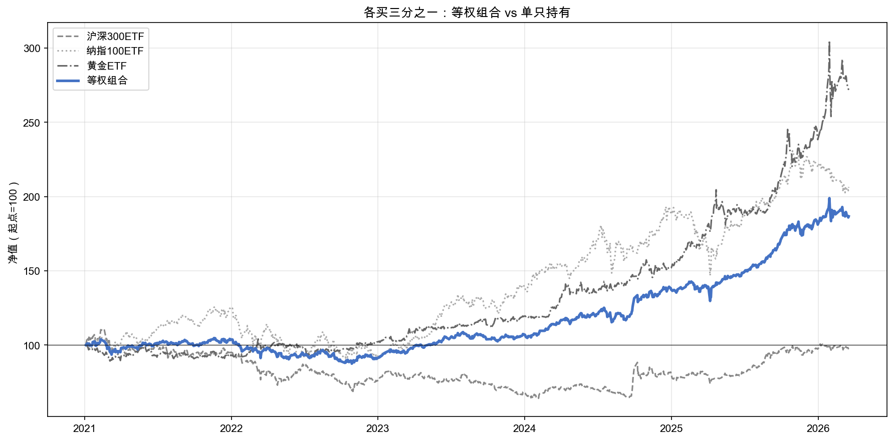
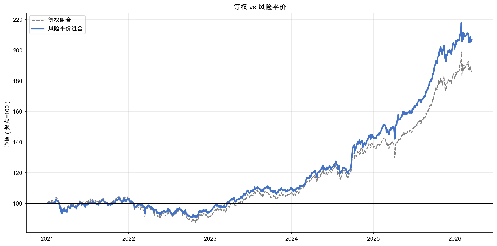
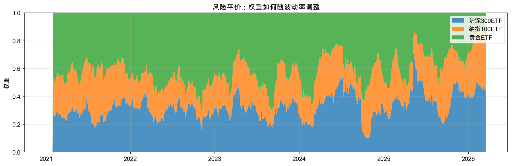
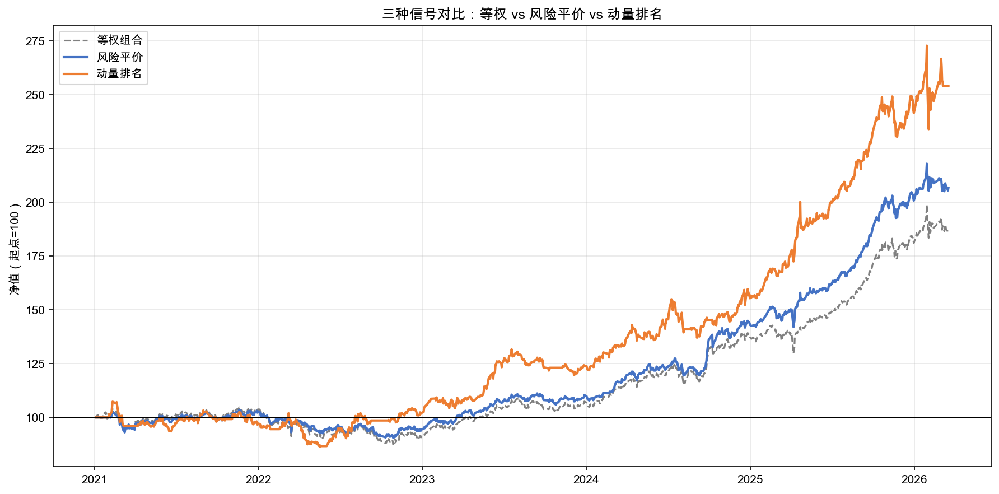
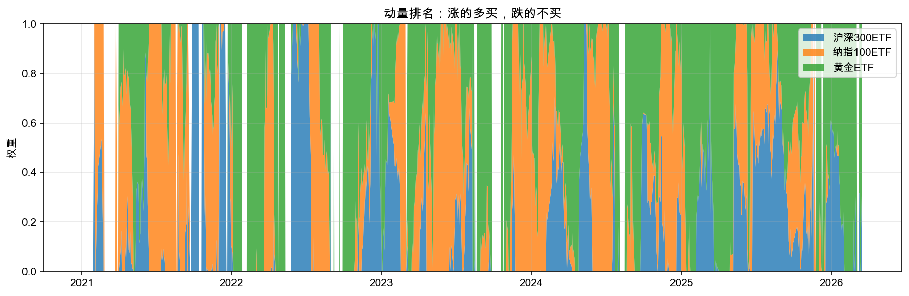

# 第三章：给 ETF 分钱：3 种分法实测

第二章我们从全市场几千只标的中，一步步筛选出了三只 ETF——沪深300、纳指100、黄金，构建了自己的投资宇宙。选标的的问题解决了，但紧接着一个新问题摆在面前：三只 ETF，各买多少？

这听起来像个分钱小问题——平均分一下不就完了吗？别急着下这个结论。同样三只 ETF、同一段历史，**只是分法不同，累计收益能差 1 倍以上、最大回撤能差三分之一**：等权 80%、风险平价 100%、动量排名 180%；回撤从 -16% 到 -12% 又到 -15%。“买什么”决定了你站在哪条赛道上，**“买多少”决定了赛道上你能不能跑下去**——这就是为什么一整章都在解决这个问题。

### 路线图

我们正在走一条完整的策略构建之路：

**选什么标的（第二章 已完成）→ 每个买多少（第三章 本章）→ 什么时候买卖（第四章）→ 怎么验证有效（第五章）**

**这一章你在飞轮的“组合层”，主练“做”——把“各买多少”从凭感觉变成有据可依的规则。** 本章解决“买多少”，分三步探索三种分钱方式，最后你来判断哪种更合理。三节分别对应的方法如表 3-1 所示。

**表 3-1 第三章三节问题与方法对照**

| 节 | 问题 | 方法 |
|----|------|------|
| 3.1 | 最简单的回答：各买三分之一 | 等权 |
| 3.2 | 波动大的少买点，波动小的多买点 | 风险平价 |
| 3.3 | 涨得好的多买点，跌的别买 | 动量排名 |

（操作流程见前言“怎么使用这本书”。每一节按相同流程：阅读 → 复制 spec 给 AI → 看结果与解读。）

---

## 3.1 最简单的回答：各买三分之一

三只 ETF，各买多少？最自然的回答：平均分，每只买三分之一。不偏不倚，公平合理。毕竟，如果你不确定哪只会涨得更好，平均分至少不会犯大错——对吧？

我们来验证一下这个直觉。

### 动手实验 1：等权组合回测

这个实验用到 open-xquant 的几个模块：`EqualWeightOptimizer`（等权优化器——把钱平均分）、`Engine`（回测引擎——模拟历史买卖）、`SimBroker`（模拟券商）。你不需要了解它们的代码，spec 会告诉 AI 怎么用。

我们一起把这份 spec 写出来。这次重点看三件新东西：**oxq 模块的“先读后写”**、**权重和=1.0 的关键断言**、**跨市场组合的共同交易日处理**。

#### 起草上下文 + 任务

这是 q3 的第一份 spec，直接接续第二章——三只 ETF 已经选好了，现在只关心权重。两段都很短：

> **上下文**：第二章选好了 3 只 ETF（沪深300、纳指100、黄金），现在要回答：每只各买多少？
>
> **任务**：在 notebook `q3-how-much.ipynb` 中创建代码，跑等权组合回测，并展示三只 ETF 各自的表现差异。

#### 起草要求

q3 起 open-xquant 框架正式上场。spec 主体的第一件事不是写代码，而是要求 AI 先读源码——这样它调的是真实接口，不会用过时或编造的写法。

> **要求**：
>
> 1. 阅读以下 oxq 模块的源码（按用途分四组）：
>    - 引擎与策略：`oxq.core.Engine` / `Strategy`
>    - 数据：`oxq.data.YFinanceDownloader` / `LocalMarketDataProvider`
>    - 仓位优化：`oxq.portfolio.optimizers.EqualWeightOptimizer`
>    - 信号、指标、规则：`oxq.signals.Threshold` / `oxq.indicators.RollingVolatility` / `oxq.rules.RebalanceFrequencyRule` / `oxq.universe.StaticUniverse` / `oxq.trade.SimBroker`
> 2. 下载 3 只 ETF（`SYMBOLS = ("510300.SS", "513100.SS", "518880.SS")`，起 `2021-01-01`）。
> 3. 计算共同交易日：中美交易日历不同步，要把三只 ETF 的索引取交集，后续所有图都用这个对齐索引。
> 4. 用 `EqualWeightOptimizer` + `Threshold` 信号（column=“close”, threshold=0, relationship=“gt”）组装策略，再平衡 `RebalanceFrequencyRule(interval_days=10)`。

> 📌 **要点**：跨市场组合必须显式处理共同交易日。沪深300 走 A 股日历，纳指100 走美股日历，圣诞节美股休市但 A 股开市，反过来春节 A 股休市但美股开市。**spec 不点名，AI 大概率不会想到这一步**——画出来的净值曲线会是锯齿状。这是 q3 起跨市场章节的领域必备配置块，跟 q1 的字体三选一一样，要写进 spec。

#### 起草结果呈现

结果呈现段把权重检查、对比表、净值曲线一次锁死，让 AI 输出可以直接对照书里的图表。

> **结果呈现**：
>
> 1. **权重合法性检查**：`weights = ew_weights_df.iloc[-1]; assert abs(weights.sum() - 1.0) < 1e-6, f"权重和应为 1.0,实际 {weights.sum()}"; assert (weights >= 0).all(), "等权权重不应为负"`。
> 2. 打印权重分配 + 10 万元换算（每只约 33,333 元）。
> 3. 打印 4 行对比表：沪深300 / 纳指100 / 黄金 / 等权组合，三列指标（累计收益率、年化波动率、最大回撤）。
> 4. 净值曲线图：3 条灰色线（用 `--` / `:` / `-.` 三种线型区分单只持有）+ 1 条蓝色实线加粗（等权组合），归一化到 100，标题「各买三分之一：等权组合 vs 单只持有」。

> 📌 **要点**：仓位分配 spec 的**必查**断言是「权重和 = 1.0 ± 1e-6」。这条 assert 在 q1 单标的策略里不需要（只有一个标的，要么买要么不买），但只要进入“分钱”场景，这条就必须有。**没有这条断言，AI 输出 0.998 或 1.003 你都会以为正常**——但下游回测会按这个权重直接乘资金，误差会一路传染到最后的收益率。三个 spec 都要复用这条模板。

完整 spec 在 [`specs/spec-01-equal-weight.md`](https://github.com/xingwudao/xquant-learning/blob/main/q3-how-much/specs/spec-01-equal-weight.md)——复制给 AI，弹窗选「允许」。

AI 助手执行完毕后，你的 notebook 里应该出现了一组权重数字、一张对比表和一张净值图。我们先认识两个新概念。

**权重（Weight）** ——“这笔钱怎么分”，每只标的分到总资金的百分之多少。你有 10 万元，三只 ETF 各 1/3 权重，就是每只买 33,333 元。权重就像分蛋糕——蛋糕总共 100%，每人分多少取决于权重。

**信号（Signal）** ——根据指标对市场做出的判断：要不要动、怎么动。信号只表达意愿，不负责执行。第一章的 Crossover 信号说的是“买还是不买”——价格上穿均线就买、下穿就卖。这里的 EqualWeightOptimizer 说的是“各买多少”——三只 ETF 各 1/3。判断的内容升级了，但本质都是信号：观察市场、做出判断。至于判断之后怎么执行——下多少单、什么价格成交——那是后面的事。

回测中设定了每 10 个交易日（大约两周）重新调整一次持仓，让实际权重回到目标权重。为什么需要再平衡？因为三只 ETF 涨跌幅不同，持有一段时间后，涨得多的那只实际占比会变大，偏离了最初的 1/3。再平衡就是定期“拨乱反正”。

### 实验结果

等权就是等权，三只各占三分之一，每只买 33,333 元。但等分钱之后跑出来的效果如何？三只 ETF 单独持有与等权组合的对比如表 3-2 所示。

**表 3-2 三只 ETF 单独持有 vs 等权组合表现**

| 标的 | 累计收益率 | 年化波动率 | 最大回撤 |
|------|-----------|-----------|---------|
| 沪深300ETF | -1.78% | 18.11% | -42.16% |
| 纳指100ETF | 106.09% | 22.66% | -27.50% |
| 黄金ETF | 188.54% | 15.83% | -16.77% |
| **等权组合** | **80.75%** | **11.73%** | **-16.79%** |

净值曲线对比如图 3-1 所示。



### 读懂这些结果

先看图 3-1 的大趋势：等权组合那条蓝色实线，稳稳地走在三条灰色线之间——不是最好的，也不是最差的。黄金一路领涨，纳指100先跌后涨、波折不断，沪深300整体低迷。组合把三者的表现“平均”了一下，走出了一条居中的路线。

但你可能已经注意到了：黄金单独拿的累计收益率是 188.54%，比等权组合的 80.75% 高了一倍多。那为什么不全买黄金？

看波动率那列。**年化波动率（Annualized Volatility）** 衡量的是价格上下波动的剧烈程度——第二章我们认识过这个指标。波动率大意味着你的账户大起大落：今天涨 3%、明天跌 4%，反复折腾。现实中大部分人受不了这种颠簸——涨的时候开心，连跌几天就开始怀疑“是不是该卖了”，一卖可能就错过了后面的反弹。**波动率小，意味着你能在低点不慌、在涨势中不慌——账户里看着一时少了 5%、10%，你不会马上卖掉。** 不慌，才能真正拿到那段收益。

再看一个更关键的问题。三只 ETF 的年化波动率从 15.83%（黄金）到 22.66%（纳指100），差了好几个百分点。但等权信号说“不管你多颠簸，都买一样多的钱”。想想这意味着什么：波动最大的纳指100，虽然只花了 1/3 的钱，但它每天的涨跌幅度最大，对组合整体的影响也最大——它一跌，组合就被拖着跌；它一涨，组合的涨幅也主要靠它撑着。**平均分钱，并不等于平均分影响力。** 波动大的那只，用同样的钱产生了更大的影响力，**拉着整个组合的涨跌走**。

有没有更聪明的分法？比如，波动大的少买点，波动小的多买点——让每只 ETF 对组合的“影响力”真正平均？

---

## 3.2 波动大的少买点，波动小的多买点

上一节的结论很清楚：平均分钱，并不等于平均分影响力。波动大的纳指100，用同样的钱却产生了更大的影响力，把整个组合的涨跌拉着走。那反过来想——既然波动大的影响力太大，能不能给它少分点钱？波动小的那只影响力不够，多分点钱给它？这样三只 ETF 对组合的“拉扯力度”应该更均匀。

这种“按波动率倒数分配权重、让每个资产对组合波动的贡献相等”的方法，有一个正式的名字：**风险平价（Risk Parity）** ——“风险”指的是波动率，“平价”指的是让每个资产的风险贡献相等。让每个资产对组合波动的贡献相等——就像把三个发动机的功率调到一样大，整个组合不会被某一个拖着走。桥水基金的“全天候策略”用的就是这个思路。下面我们用一个生活化的类比直接走进它。

想象你要把一笔钱交给三个人帮你打理。第一个人成熟稳重，赚了不炫亏了不慌，你看着他的账户心里很踏实；第二个人喜怒无常，今天信心爆棚明天就想清仓，你的心跟着他上上下下；第三个人介于两者之间。你会怎么分钱？肯定是稳重的那个多管点，情绪化的那个少管点。三只 ETF 也一样——波动率就是它们的“情绪起伏程度”。波动小的稳重，多买；波动大的情绪化，少买。

### 动手实验 2：风险平价组合回测

我们一起把这份 spec 写出来。这次重点看两件新东西：**signal.required_indicators 在信号上挂指标**、**差量式 spec 让差异点单点暴露**。

#### 起草上下文 + 任务

这是 q3 的第二份 spec，接续 spec-01 的等权回测结果。上下文一句话承接，任务一句话点明：

> **上下文**：在 `q3-how-much.ipynb` 中已有等权组合回测结果。学员已看到三只 ETF 波动率差异很大，等权分配让波动大的 ETF 主导了组合涨跌。当前问题：能不能按波动来分——波动大的少买，波动小的多买？
>
> **任务**：在 notebook 中新建代码单元格，用风险平价信号运行回测，对比等权组合。

#### 起草要求

风险平价要用波动率，但波动率是怎么传给优化器的？oxq 的做法是**在信号上挂指标依赖**——这是 oxq 框架的关键模式，把指标声明和信号绑在一起，再把公共配置抽出做成对照实验：

> **要求**：
>
> 1. 阅读 `oxq.portfolio.optimizers.RiskParityOptimizer`（若 spec-01 未读 `Threshold`，补一下）。
> 2. 在 `Threshold` 信号上注册 vol 指标：`signal_rp.required_indicators = {"vol": (RollingVolatility(), {"column": "close", "period": 20})}`。这样回测引擎跑到信号时会自动算 vol 列，优化器再读这一列分配权重。
> 3. 用 `RiskParityOptimizer(volatility_col="vol")` 装配优化器，打印最新一天与等权权重的对比 + 10 万元换算。
> 4. 抽出公共配置 `COMMON = dict(universe=universe, ...)`，让等权和风险平价两个策略只在 `portfolio` 一行不同——`Strategy(name="equal-weight", **COMMON, portfolio=EqualWeightOptimizer())` vs `Strategy(name="risk-parity", **COMMON, portfolio=RiskParityOptimizer(...))`。

> 📌 **要点**：oxq 用 `signal.required_indicators` 把“信号需要哪些指标”声明在信号本身上——q3 三个 spec 都依赖这条语法。**spec 要给到具体写法**（“在信号上注册”+ 字典字面量），AI 才能照抄；只写描述，它要么抄到 strategy 上，要么挂到 universe 上，接口对不上就报错。同样的精确度还体现在 COMMON 字典的设计上：把公共部分抽出来，让等权与风险平价的唯一差异落在 portfolio 一行——这是仓位分配章三联 spec 的主线设计，**写了 COMMON 就要兑现**，否则这条教学就失效。

#### 起草结果呈现

这一段把“权重检查 + 视觉契约”两件事一起锁——分析话术按实际数据走向描述，避免提前替结果下定义。

> **结果呈现**：
>
> 1. **权重检查**：复用 spec-01 的 assert 模板，加一条`assert rp_w.nunique() > 1, "风险平价权重不应全相等(否则退化为等权)"`。
> 2. 权重对比表 + 10 万元换算 + 指标对比表。
> 3. 净值曲线对比图（figsize 12×6，等权灰虚 + 风险平价蓝实） + 权重历史堆叠面积图（figsize 12×4，展示三只 ETF 权重随时间变化）。
> 4. 末尾分析话术按数据动态描述方向（若波动率反升说明 vol 估计期偏短，不要硬写“降到”）。

> 📌 **要点**：仓位分配章的标志可视化是**权重历史堆叠面积图**——它让学员一眼看到“权重不是一成不变的”。等权下三条带等宽，风险平价下面积带宽随时间变化。spec 必须明确画这张图，figsize 12×4，堆叠面积，y 轴 0-1。这是 q3 起会反复出现的视觉模板。

完整 spec 在 [`specs/spec-02-risk-parity.md`](https://github.com/xingwudao/xquant-learning/blob/main/q3-how-much/specs/spec-02-risk-parity.md)——复制给 AI，弹窗选「允许」。

AI 助手执行完毕后，你的 notebook 里应该出现了新的权重数字、一张对比表、两张图。

风险平价信号的用法和 3.1 的等权信号完全一样——只是换了一个信号类，其余不变。但钱真的分得不一样了：等权是三等分，风险平价则是波动小的多分、波动大的少分。同样 10 万元，沪深300ETF 从 33,333 元涨到了 45,510 元，黄金ETF 从 33,333 元降到了仅 11,239 元。

策略组装和上一节几乎一模一样——整个策略定义只有组合优化器那一行不同，从 `EqualWeightOptimizer()` 换成 `RiskParityOptimizer()`。其余的投资宇宙、信号、指标、再平衡频率、回测引擎全部复用。当框架搭好之后，换一种“分钱方式”就只是换一个优化器。

### 实验结果

两种方案的权重对比如表 3-3 所示。

一个细节先点透：表 3-3 的权重按**最近 20 天的滚动波动率**算，与表 3-2 那行**全期年化波动率**不是同一组数字——短期与长期波动可以差很多。

**表 3-3 等权 vs 风险平价权重对比**

| 标的 | 等权权重 | 风险平价权重 |
|------|---------|------------|
| 沪深300ETF | 33.3% | 45.5% |
| 纳指100ETF | 33.3% | 43.3% |
| 黄金ETF | 33.3% | 11.2% |

指标层面，两种方案的差异如表 3-4 所示。

**表 3-4 等权 vs 风险平价指标对比**

| 指标 | 等权组合 | 风险平价组合 |
|------|---------|------------|
| 累计收益率 | 80.75% | 99.67% |
| 年化波动率 | 11.73% | 10.81% |
| 最大回撤 | -16.79% | -12.26% |

净值曲线对比如图 3-2 所示，权重随波动率变化的历史轨迹如图 3-3 所示。





### 读懂这些结果

先看图 3-2 的净值曲线。蓝色实线（风险平价）走得比灰色虚线（等权）更平滑，而且终点更高——风险平价不仅更稳，还赚得更多。

再看指标表里的数字。波动率从 11.73% 降到 10.81%，最大回撤从 -16.79% 收窄到 -12.26%——最惨的时候少跌了 4.5 个百分点。收益率反而更高了（80.75% → 99.67%）——波动小了，收益没丢，甚至更好。这不是巧合：波动小意味着你更容易在低点不慌，不会在大跌时恐慌卖出，反而能享受到后面的反弹。

最后看图 3-3 的权重历史。你会发现一个有意思的现象：三只 ETF 的权重不是固定的，而是随时间在动态调整。某段时间黄金ETF 波动率飙升，它分到的钱就自动减少；某段时间沪深300ETF 变得平稳了，它分到的钱就自动增加。这就是节首讲的“按波动率倒数分配”在跑——市场自己在告诉你谁该多买谁该少买，你不用做任何主观判断。

风险平价比等权更稳了。但你有没有注意到，它只看波动率，完全不看涨跌。如果一只 ETF 正在猛涨，风险平价不会多买它；如果一只正在跌，也不会少买它。能不能更贪心一点——让涨得好的多买点？

---

## 3.3 涨得好的多买点，跌的别买

风险平价让组合更稳了，但回头想想，它的判断标准只有一个——波动率。波动大的少买，波动小的多买，仅此而已。至于一只 ETF 是在涨还是在跌？它完全不关心。黄金如果正在猛涨，风险平价不会因此多买一分钱；沪深300如果正在暴跌，它也不会少买一分钱。它只看颠簸程度，不看方向。

那能不能更激进一点：涨得好的多买，跌的干脆不买？

还记得第二章我们提过几种交易方式吗？其中一种叫趋势交易——跟着涨势走。动量排名就是趋势交易思想的量化表达：过去一段时间涨得猛的，我认为它还会继续涨，多买；跌的，我认为它还会继续跌，不买。简单粗暴，但逻辑清晰。

### 动手实验 3：动量排名组合回测

我们一起把这份 spec 写出来。这次重点看两件新东西：**多指标依赖链（mom + vol → ram）**、**排序型 spec 的过滤后归一化**。

#### 起草上下文 + 任务

这是 q3 三联 spec 的最后一份，从“加权（永远全持有）”跃迁到“排序（动量为负的不买）”。上下文 + 任务一气呵成：

> **上下文**：在 `q3-how-much.ipynb` 中已有等权组合和风险平价组合的回测结果。学员已理解：等权不看任何指标，风险平价只看波动率。当前问题：风险平价更稳了，但它完全不看涨跌。能不能让涨得好的多买点？
>
> **任务**：在 notebook 中新建代码单元格，用动量排名信号运行回测，与前两种方案三方对比。

#### 起草要求

动量排名比风险平价多一层——它要算 ram = mom / vol，**ram 依赖 mom 和 vol 两个指标**。oxq 的 required_indicators 支持这种链式依赖，再加一个排序型优化器收尾：

> **要求**：
>
> 1. 阅读 `TopNRankingOptimizer` / `Momentum` / `Ratio` 三个 oxq 模块。
> 2. 在信号上注册三个指标（指标依赖链）：
>    ```python
>    signal_tn.required_indicators = {
>        “mom”: (Momentum(), {“column”: “close”, “period”: 20}),
>        “vol”: (RollingVolatility(), {“column”: “close”, “period”: 20}),
>        “ram”: (Ratio(), {“col_a”: “mom”, “col_b”: “vol”}),
>    }
>    ```
>    顺序很重要——ram 依赖 mom 和 vol，所以 mom 和 vol 要先注册。
> 3. 用 `TopNRankingOptimizer(score_col="ram", n=3, filter_negative=True)` 装配优化器。`n=3` 是因为候选池就 3 只 ETF，这里等于“全选 + 过滤负值”；`filter_negative=True` 是动量排名的硬规则——**正在跌的不买**。
> 4. 复用 spec-02 的 COMMON 字典，只把 portfolio 换成 `TopNRankingOptimizer(...)`。

> 📌 **要点**：多指标依赖链是 oxq 信号系统的关键能力。spec-02 注册 1 个指标（vol），spec-03 注册 3 个且 ram 依赖前两个——**spec 必须把注册顺序写清楚**，而不是只列指标名。AI 写代码时如果先注册 ram 再注册 mom/vol，运行时 ram 算不出来就直接 NaN——你看不到报错，但权重全错。

> 📌 **要点**：排序型 spec（动量排名）与加权型 spec（等权、风险平价）的本质区别是：可以**放弃部分标的**。所以“权重和=1.0”的断言要改成“未被过滤的活跃权重和=1.0”——`active_w = tn_w[tn_w > 1e-6]; assert abs(active_w.sum() - 1.0) < 1e-6`。这是排序型 spec 的活跃权重检查，加权型 spec 不需要这一步。

#### 起草结果呈现

这一段的两个着力点：用排序型断言代替原来的“权重和=1.0”硬话术，并把“动量为负时面积图出空白”这个特殊视觉点写进 spec。

> **结果呈现**：
>
> 1. **权重检查**：用排序型断言（过滤后归一化）。
> 2. 三方权重对比表 + 三方指标对比表（三种信号同台 PK）。
> 3. 三条净值曲线图（等权灰虚 + 风险平价蓝实 + 动量排名橙实）。
> 4. 动量排名权重历史堆叠面积图，**注意：动量为负时权重为 0，面积会出现空白**——把这个视觉特征预先写进 spec。
> 5. 分析话术按实际数据动态描述方向，**不要硬写“更大”或“更深”**——市场不可预测，spec 不应假设结果方向。

> 📌 **要点**：可视化 spec 不仅要描述要画什么，还要把**特殊视觉点**预先点出——动量为负时面积图会出空白，这种“反常”的视觉如果 spec 不预告，AI 可能用 `fillna(0.33)` 把空白补上，反而抹掉了排序型策略最重要的视觉信号。这是仓位分配章的高级 spec 写法：**视觉契约不只规定颜色形状，还要规定“该出现的空白也要出现”**。

完整 spec 在 [`specs/spec-03-momentum-ranking.md`](https://github.com/xingwudao/xquant-learning/blob/main/q3-how-much/specs/spec-03-momentum-ranking.md)——复制给 AI，弹窗选「允许」。

AI 助手执行完毕后，你的 notebook 里应该出现了新的权重对比、一张三方指标表、两张图。这个实验引入了两个新概念。

**动量（Momentum）** ——过去 N 天的涨跌趋势。正数 = 涨势，负数 = 跌势。就像看一辆车的速度表——动量为正说明车在加速前进，为负说明在倒退。这里用的是 20 日动量，也就是看过去一个月的涨跌方向。

但单看动量有个问题：波动大的标的天然动量值更大——它涨 5% 和波动小的标的涨 2%，可能只是因为它“脾气大”，不一定代表趋势更强。所以我们把动量除以波动率，得到**风险调整动量（ram = mom / vol）** ——每份波动带来的动量。这样不同脾气的标的之间才能公平比较。

**TopNRankingOptimizer** ——按 ram 值排名分配权重。ram 为负的标的直接权重设为 0——不买。剩下的按 ram 大小归一化分配权重。涨得越猛且波动越小，分到的钱越多。如果三只 ETF 里有两只 ram 为负，那所有的钱就全部集中到唯一 ram 为正的那只上。

### 实验结果

三种信号的权重对比（最新一天）如表 3-5 所示。

**表 3-5 三种信号最新一天权重对比**

| 标的 | 等权 | 风险平价 | 动量排名 |
|------|------|---------|---------|
| 沪深300ETF | 33.3% | 45.5% | 0.0% |
| 纳指100ETF | 33.3% | 43.3% | 0.0% |
| 黄金ETF | 33.3% | 11.2% | 100.0% |

差异一目了然。等权三等分，风险平价按波动调整，而动量排名直接把沪深300和纳指100的权重归零——近期它们在跌，不买。所有的钱全部涌向唯一在涨的黄金ETF。

三种信号的指标对比如表 3-6 所示。

**表 3-6 三种信号指标对比**

| 指标 | 等权 | 风险平价 | 动量排名 |
|------|------|---------|---------|
| 累计收益率 | 80.75% | 99.67% | 179.96% |
| 年化波动率 | 11.73% | 10.81% | 15.54% |
| 最大回撤 | -16.79% | -12.26% | -15.77% |

三条净值曲线同框对比如图 3-4 所示，动量排名的权重历史如图 3-5 所示。





### 读懂这些结果

先看图 3-4 的净值曲线，三条线同框对比。橙色实线（动量排名）终点最高——累计收益 179.96%，远超风险平价的 99.67% 和等权的 80.75%。但这笔超额收益不是白来的：动量排名的波动率是 15.54%，高于风险平价的 10.81%；最大回撤 -15.77%，也深于风险平价的 -12.26%。**收益更高，但颠簸更大、回撤更深——这就是激进策略的代价。**

别急着下结论。记得第一章的教训吗？同一个策略换个时间段，结果可能完全不同。动量排名在这几年的数据上表现优异，是因为市场恰好有几段清晰的趋势——比如黄金从 2023 年开始的持续上涨。**换段时间，动量排名的判断可能跟不上市场反转的节奏——这种"数据上看着好、换个时段就出问题"的现象，第五章会专门讨论，本章先不下结论。** 没有完美的分法——风险平价更稳，动量排名更激进——哪个更适合你，要看你打算拿多久、能承受多大波动、能不能扛得住一段时间的回撤。第五章我们会用更系统的方法判断“一个策略到底好不好”。

再看图 3-5 的权重历史。对比 3.2 的风险平价权重图，动量排名的变化剧烈得多——某只 ETF 动量转负，权重直接从几十个百分点归零，所有钱涌向其他标的；等它动量转正，权重又突然拉满。你还会发现图中有些时段出现了空白——三只 ETF 的权重加起来不到 100%，甚至全部归零。这说明那段时间三只 ETF 的动量全是负的，没有一只在涨，信号的判断是“都别买”。风险平价的权重变化则平缓得多，三只 ETF 始终都持有，只是比例在缓慢调整。两种信号的性格完全不同：一个求稳，一个求进。风险平价像一个谨慎的管家，均匀分配、避免偏科；动量排名像一个激进的赌徒，押注赢家、果断弃子。

三种信号，三种结果。到这里，你可能已经有了一个模糊的感觉：刚才做的事情好像不简单——选信号、跑回测、比指标，这不就是在做量化研究吗？

回头看：前言里说量化第一步是“**做**”——把动作写成可重复执行的规则。三次实验里，你已经做了三次：等权、风险平价、动量排名，每一次都是把“怎么分钱”从凭感觉变成了一段 spec 能让 AI 重跑的规则。这就是“做”。具体每一种规则做了什么？我们回头看看。

---

## 3.4 回头看：你刚才做了什么？

三次实验，你只换了一样东西——信号。数据、标的、回测引擎、再平衡频率全部一样，只有信号不同，结果就完全不同。

你刚才做的事情，在量化交易的框架里有一个正式的名字：**信号对比（Signal Comparison）** ——保持其他条件不变，只切换信号，观察结果的差异。这是量化研究中最基础、也最重要的操作之一。信号只管判断，不管执行——但判断之后，谁来动手？这是规则（Rules）的事，第四章会讲。

我们来看看你现在走到了哪里：第二章解决了“买什么”（Universe），第三章解决了“买多少”（Signal），第四章将解决“什么时候”（Rules）。

第一章里的 Crossover 信号说的是“买还是不买”——价格上穿均线就买、下穿就卖，要么买要么不买。第三章的三种信号说的是“每只买百分之多少”——从 0% 到 100%，可以精确到小数点。判断的粒度更细了，但本质没变：都是信号，都是观察市场之后做出的判断。三种信号、三种性格，对照如表 3-7 所示。

**表 3-7 三种信号的性格对照**

| 信号 | 看什么 | 性格 |
|------|--------|------|
| EqualWeightOptimizer | 什么都不看 | 佛系 |
| RiskParityOptimizer | 波动率 | 稳重 |
| TopNRankingOptimizer | 涨跌趋势 | 激进 |

“性价比”这个问题——三种信号收益和波动都不同，能不能用一个数字综合衡量？这是下一节要回答的事。

---

## 3.5 夏普比率：一个数字概括“性价比”

三种信号的收益率和波动率都不同。等权收益最低，风险平价更稳且收益更高，动量排名收益最高但波动也最大。有没有一个数字能把收益和波动综合起来，告诉你“每承受一份颠簸，能赚多少收益”？

有。**夏普比率（Sharpe Ratio）** ——年化收益率除以年化波动率，衡量的是“性价比”。就像买东西看“每块钱能买到多少克”，夏普比率看的是“每承受一份颠簸能赚到多少收益”。数字越大，说明你承受的颠簸越值得。三种信号的夏普比率对比如表 3-8 所示。

**表 3-8 三种信号的夏普比率**

| 指标 | 等权 | 风险平价 | 动量排名 |
|------|------|---------|---------|
| 年化收益率 | 11.96% | 13.97% | 20.80% |
| 年化波动率 | 11.73% | 10.81% | 15.54% |
| 夏普比率 | 1.08 | 1.35 | 1.42 |

看最后一行。三种方案的夏普比率依次递增：等权 1.08，风险平价 1.35，动量排名 1.42。风险平价比等权高出不少，说明按波动调整确实提升了性价比。动量排名最高，但优势不如收益率差距那么大——因为它的波动率也更高，部分抵消了收益优势。不过，夏普比率有三个你需要知道的局限：

1. 它把上涨和下跌的波动一视同仁——但你可能根本不介意往上的颠簸。
2. 同一个策略换个时间段，夏普比率可能完全不同——它只反映特定历史区间的表现。
3. 当波动率为 0 时它会失效——持有现金的夏普比率是无穷大，但显然不是好策略。

结论：夏普比率适合在相同条件下横向对比几种方案的性价比，但别把决策押在这一个数字上。怎么综合多个指标来判断一个策略到底好不好？这是第五章的主题。

---

## 3.6 本章总结

三次实验，三种信号，从“各买三分之一”到“按波动调整”再到“按涨势分配”——你一步步把“买多少”这个问题从拍脑袋变成了有据可依。信号就是策略的大脑，换一个大脑，整个策略的表现就完全不同。

还有一个细节值得带走：本章三种信号下回测都设定了每 10 个交易日重算权重——这叫**再平衡（Rebalancing）**，又名**调仓**。“多久重算一次 / 多久调一次”是另一个独立的设计选择，第四章会专门讲。

### 概念速查表

本章涉及的核心概念汇总如表 3-9 所示，方便随时回查。

**表 3-9 第三章核心概念速查**

| 概念 | 含义 | 类比 |
|------|------|------|
| 权重（Weight） | 每只标的分到总资金的百分之多少 | 一笔钱怎么分 |
| 信号（Signal） | 根据指标对市场做出的判断——要不要动、怎么动。只表达意愿，不负责执行 | 你看完天气预报后的判断：“带伞”。带不带是另一回事 |
| 风险平价（Risk Parity） | 按波动率倒数分配权重，让每只影响力均匀 | 成熟稳重的多管钱，情绪化的少管钱 |
| 动量（Momentum） | 过去 N 天的涨跌趋势，正=涨势，负=跌势 | 最近的势头 |
| 动量排名（TopNRankingOptimizer） | 按涨势强弱分配权重，跌的不买 | 趋势交易的量化表达 |
| 夏普比率（Sharpe Ratio） | 年化收益 / 年化波动，衡量性价比 | 每份颠簸赚多少 |
| 再平衡/调仓（Rebalancing） | 定期重新计算权重并调整仓位 | 定期重新分工 |

### 策略进化路径

第二章产出了投资宇宙（沪深300、纳指100、黄金）。本章在此基础上探索了三种分钱方式：Step 1 各买 1/3（EqualWeightOptimizer）——简单，但波动大的把组合拉着走；Step 2 按波动调整（RiskParityOptimizer）——更稳，每只影响力均匀；Step 3 按涨势调整（TopNRankingOptimizer）——趋势交易的量化表达。第三章产出：三种信号对比 + 信号就是策略的大脑。

### 本章最重要的收获

走完三个实验后，本章最值得带走的五条认知如表 3-10 所示。

**表 3-10 第三章主线认知**

| 认知 | 来源 |
|------|------|
| 平均分钱 ≠ 平均分影响力 | 3.1 |
| 波动率小 = 你能在低点不慌 | 3.1 |
| 按波动调整让组合更稳 | 3.2 |
| 同样的策略，只换信号，结果完全不同 | 3.3 |
| 夏普比率适合对比，但别只看一个指标 | 3.4 |

### 带走的问题

做完本章，你应该带着两个问题进入后续章节——它们将在下两章被一一回答：

- 信号只负责判断“想怎么分”，但**判断完了谁来执行？按什么规则下单？** → 第四章
- 动量排名在这段数据上全面胜出，但**换一段时间还行吗？怎么区分真本事和运气？** → 第五章

第二个问题正是本书口号“**做要规则、看要指标、还要怀疑你的指标**”中“疑”的入口——动量排名的累计 179.96% 看起来很漂亮，但你已经隐隐感到不对劲：换段时间还能不能这样？这种警觉，是后面五章要反复训练的主线动作。

> 本章所有代码的可运行版本见 `notebooks/q3-how-much.ipynb`
