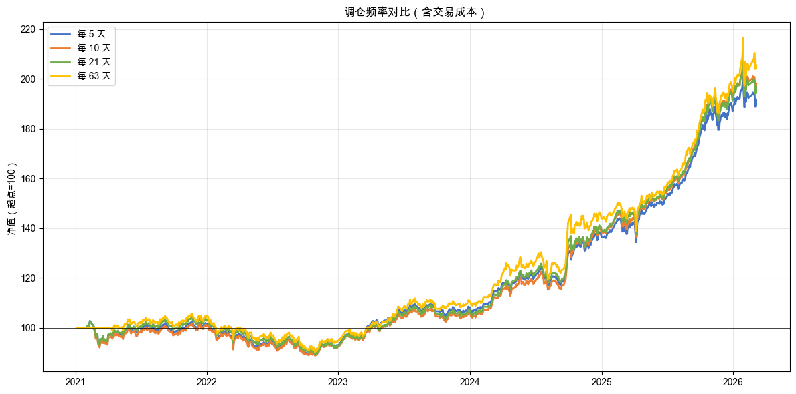
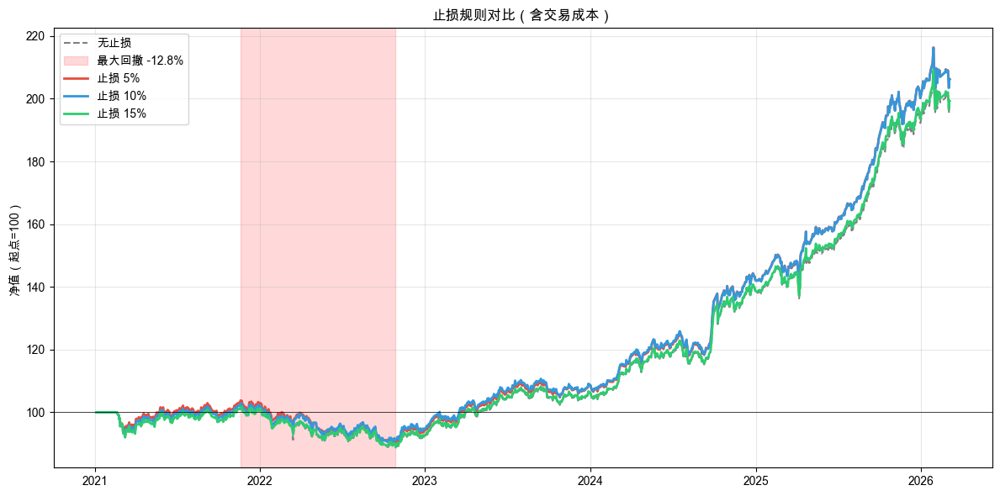
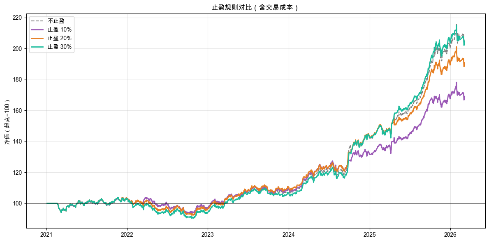

# 第 4 章：决定何时买卖：再平衡、止损、止盈

> 最新书稿已更新至 [XQuant 量化课堂页](https://xquant.shop/courses)。
> 想阅读最新版官方书稿，请前往图书页。

第 3 章我们用三种权重分配方法解决了“买多少”：等权、风险平价、动量排名，各有各的特点。但有个细节你可能没注意：不管用哪种权重分配方法，策略都是每 10 个交易日自动做一次再平衡，把实际权重调回目标权重。为什么是 10 天？5 天行不行？一个月呢？

更关键的问题是：**如果在两次再平衡之间，某只 ETF 突然下跌 20%，你只能等到下一个再平衡日才能反应。** 这合理吗？

> **本章边界**：章名虽然叫“什么时候买卖”，但本章不讨论第一次什么时候买入。第 3 章已经回答了“每只 ETF 应该分多少钱”。本章聚焦的是已经持仓之后的三个问题：多久做一次再平衡（4.1）、跌到什么程度先撤（4.2）、涨到什么程度走人（4.3）。
>
> **规则（Rule）**：第 3 章的权重分配方法回答“钱应该怎么分”。本章引入规则，回答“什么时候动手”。规则会观察持仓状态，例如涨了多少、跌了多少、距离上次再平衡过了多久，然后按预设条件触发执行。从本章起，你会反复看到 `RebalanceFrequencyRule` / `StopLossRule` / `TakeProfitRule` 这些 Rule 类，它们就是规则的具体实现。

### 路线图

本章进入四个阶段里的**制定规则**阶段。第 2 章解决买什么，第 3 章解决每个买多少，本章解决什么时候调整持仓、什么时候卖出。本章一共要动手做 3 次实验。

**表 4-1 第 4 章路线图**

| 节 | 内容 | 实验 |
|----|------|------|
| 4.1 | 多久做一次再平衡？ | 1 |
| 4.2 | 亏了要不要先跑？ | 1 |
| 4.3 | 赚了要不要走？ | 1 |

本章使用第 3 章的风险平价权重分配方法作为基础配置。它始终在 3 只 ETF 之间分配资金，方便我们观察不同规则的效果。

---

## 4.1 再平衡频率有多重要？

第 3 章每 10 个交易日做一次再平衡。这个“10”是拍脑袋定的。更勤一点，比如每周一次，会更好吗？更慢一点，比如每季度一次，会更差吗？

直觉告诉我们：再平衡越频繁，反应越快，效果应该越好。真的吗？

### 动手实验 1：不同再平衡频率对比

本节用到两个新模块：`RebalanceFrequencyRule`（设定多少天做一次再平衡）和 `PercentageFee`（模拟交易手续费）。

我们一起把这份 spec 写出来。这次重点看两件新东西：**参数化扫描怎么列**，以及**辅助函数封装作为后续 spec 的接口**。

#### 第一、二段：上下文和任务描述

> **上下文**：本章探讨“什么时候调整持仓、什么时候卖出”。第 3 章用了三种权重分配方法：等权、风险平价、动量排名。本章选择风险平价作为基础配置，因为它始终持有全部 3 只 ETF，方便我们观察止损和止盈规则的效果。第 3 章每 10 个交易日做一次再平衡，但为什么是 10 天？更勤或更慢，结果会怎样？
>
> **任务描述**：在 notebook `q4-when-to-trade.ipynb` 中创建代码，对比不同再平衡频率的效果，并首次引入交易成本。

#### 第三段：任务要求

任务要求段是这份 spec 的关键：把“对比 4 种频率”和“先后跑两轮成本”两件事写清楚。

> **任务要求**：
>
> 1. 先读 oxq 源码：`PercentageFee` / `SimBroker` / `RebalanceFrequencyRule` / `RiskParityOptimizer` / `Engine` / `Strategy`
> 2. 复用第 3 章的 `SYMBOLS`、`START`、风险平价权重分配方法等基础配置
> 3. 定义辅助函数 `run_backtest(frequency, fee_model=None, order_rules=None)` 封装策略构建和回测执行，**供后续 spec 复用**
> 4. 定义 4 种再平衡频率：`FREQUENCIES = [5, 10, 21, 63]`（约每周 / 两周 / 每月 / 每季度）
> 5. 第一轮回测不含成本（`fee_model=None`），第二轮回测含成本（`PercentageFee(rate=Decimal("0.001"), min_fee=Decimal("5"))`）
> 6. 含成本版本画净值曲线对比图（figsize 12x6，4 条线，统一从 100 开始）
> 7. 分析按实际数据动态描述（不要硬写“更高”或“更低”）

> 📌 **要点**：参数化扫描的关键是把“被对比的维度”列成一个数组（`FREQUENCIES = [5, 10, 21, 63]`），再用一个 for 循环跑完。spec 里把数组写出来，AI 就不用猜要对比哪些值。后面 spec-02 / spec-03 也会沿用同样的写法：`STOP_THRESHOLDS = [...]`、`TP_THRESHOLDS = [...]`。这是研究型工作中最常见的 spec 写法。

> 📌 **要点**：辅助函数 `run_backtest` 是为 spec-02 / spec-03 留的接口。整章三份 spec 都通过它跑回测。spec-02 把止损规则放进 `order_rules` 参数，spec-03 再把止盈规则放进去。spec 链有共享逻辑时，要在第一份 spec 里封装成函数，后续 spec 直接调用。

#### 第四段：验收标准

> **验收标准**：
>
> 1. 无成本对比表（4 行 6 列）
> 2. 含成本对比表（4 行 7 列，多一列“总手续费”）
> 3. 含成本净值曲线对比图
> 4. 分析文字（按实际数据描述方向）

完整示例 spec 在配套仓库的 [`q4-when-to-trade/specs/spec-01-rebalance-frequency.md`](https://github.com/xingwudao/xquant-learning/blob/main/q4-when-to-trade/specs/spec-01-rebalance-frequency.md)。参考它确认自己的 spec 后，再复制给 AI，按提示允许执行。

AI 执行完毕后，你的 notebook 里应该出现两张对比表和一张净值图。我们来解读结果。

四种频率分别对应每周（5 个交易日）、每两周（10）、每月（21）、每季度（63）。代码跑了两轮回测：第一轮不含成本，第二轮含成本（万分之一佣金，最低 5 元）。同样的策略，唯一的差别是有没有扣手续费。

**交易成本（Transaction Cost）**：每次买卖都要付的费用，主要是付给券商的佣金，以及部分市场要交的税费。本章回测里只模拟了佣金部分（万分之一，最低 5 元），没有加印花税。实际交易的成本会比回测里更高。记住这一点：**回测里的成本是乐观估计，现实只会更贵。** A 股 / 美股 / 港股具体费率有差别，大家通过互联网可以查到公开资料。

在之前的第 2 章和第 3 章里，我们的回测都没有考虑交易成本，就像在一个“免手续费”的理想世界里做实验。从现在开始，我们把手续费加回来，看看现实世界会怎样。

### 实验结果

不含成本时四种频率的对比如表 4-2 所示。

**表 4-2 不含交易成本时四种再平衡频率的对比**

| 频率 | 累计收益率 | 年化波动率 | 最大回撤 | 简化夏普 | 交易次数 |
|------|-----------|-----------|---------|---------|---------|
| 5 | 101.22% | 10.90% | -12.32% | 1.34 | 744 |
| 10 | 106.80% | 11.19% | -12.44% | 1.36 | 372 |
| 21 | 95.22% | 11.35% | -14.33% | 1.24 | 177 |
| 63 | 105.56% | 11.85% | -14.79% | 1.28 | 57 |

加上手续费后的对比如表 4-3 所示。

**表 4-3 含交易成本（万分之一佣金）时四种再平衡频率的对比**

| 频率 | 累计收益率 | 年化波动率 | 最大回撤 | 简化夏普 | 交易次数 | 总手续费 |
|------|-----------|-----------|---------|---------|---------|---------|
| 5 | 93.36% | 10.91% | -12.97% | 1.27 | 744 | 4,665 元 |
| 10 | 101.68% | 11.19% | -12.81% | 1.31 | 372 | 3,022 元 |
| 21 | 91.93% | 11.35% | -14.50% | 1.21 | 177 | 2,052 元 |
| 63 | 104.09% | 11.86% | -14.85% | 1.27 | 57 | 926 元 |

含成本下的净值曲线对比如图 4-1 所示。

### 读懂这些结果

先看表 4-2。四种频率的简化夏普差异不大，从 1.24 到 1.36。不含成本时，每 10 天再平衡的简化夏普最高（1.36）。

再看表 4-3。加上手续费后，每 10 天再平衡的简化夏普仍然最高（1.31），排名没变。但有一组数字值得关注：最右边两列。交易次数从频率 5 的 744 笔降到频率 63 的 57 笔，相差 13 倍；总手续费从 4,665 元降到 926 元，相差 5 倍多。**频率越高，交易越多，成本越大。**

对比表 4-2 与表 4-3 中频率 5 的行：不含成本时累计收益 101.22%，含成本时跌到了 93.36%，手续费吃掉了将近 8 个百分点的收益。而频率 63 从 105.56% 只降到 104.09%，手续费只吃掉了 1.5 个百分点，因为它只交易了 57 笔。

最后看净值图。四条线走势相似，终点差异不算大。频率的选择有影响，但不是决定性的。更重要的发现是：**交易不是免费的**。每次调整持仓，不管是买还是卖，都要付佣金、交税。在不含成本的“理想世界”里看起来差不多的策略，加上成本后差距就拉开了。

**数据说了算：频率的选择是个权衡，要在反应速度和交易成本之间取舍。**

但频率不是最大的问题。想象一下：你刚做完再平衡，第二天某只 ETF 下跌 15%。下一次再平衡还要等好几天。这段时间你只能眼睁睁看着亏损扩大。能不能加一个“紧急出口”：不管再平衡日到没到，亏到一定程度就先跑？

---

## 4.2 亏了能不能先跑？

定期再平衡的硬伤很明显：两次再平衡之间如果市场大跌，你只能等。

直觉告诉我们：亏了先跑，也就是卖出止损，总比硬扛着不动好。但“跑”也不是免费的。每次卖出再买回来，都要付手续费。到底值不值？先猜后验。

### 动手实验 2：止损规则对比

我们一起把这份 spec 写出来。这次重点看两件新东西：**如何接续上一份 spec 的最优结果**，以及**为什么止损必须用规则来做**。

#### 第一、二段：上下文和任务描述

> **上下文**：在 `q4-when-to-trade.ipynb` 中已有风险平价策略在不同再平衡频率下的回测结果。读者已看到交易成本的影响，也理解了“交易不是免费的”。当前问题：定期再平衡有个硬伤，中间大跌只能等。能不能加个保护？
>
> **任务描述**：在 notebook 中新建代码单元格，给策略加上止损规则，对比不同止损阈值的效果。

#### 第三段：任务要求

止损是规则，不是信号。这是 open-xquant 的关键设计，spec 要把这件事讲清楚。

> **任务要求**：
>
> 1. 先读 oxq 源码：`StopLossRule`（注意它作为 rule 传入 `Engine.run(rules=[...])`，不再是 Strategy 字段）
> 2. 解释 `StopLossRule` 工作原理：以 `avg_cost x (1 - threshold)` 为止损价提交 stop SELL 挂单，`SimBroker` 后续每个 bar 检查是否触发。为什么信号做不到：信号只看市场数据，不知道你的买入价是多少；只有规则能感知持仓状态
> 3. 用代码动态选出含成本后简化夏普最高的频率作为基准（不要硬编码）：`BEST_FREQ = max(FREQUENCIES, key=lambda f: results_with_fee[f].sharpe_ratio())`
> 4. 定义 4 组对比：无止损 / threshold=0.05 / 0.10 / 0.15
> 5. 调用 spec-01 的 `run_backtest`，把止损规则作为 `order_rules=[StopLossRule(threshold=T)]` 传入
> 6. 净值曲线对比图（无止损灰色虚线 vs 3 种阈值彩色实线），并在无止损曲线上用浅红色阴影标注最大回撤时段
> 7. 分析按实际数据动态描述，要点出阈值太紧（5%）和太松（15%）的各自问题

> 📌 **要点**：接续上一份 spec 的关键，是用代码现场算出最优值，而不是硬编码上一份 spec 的结果。`BEST_FREQ = max(FREQUENCIES, key=...)` 这一行让 spec-02 永远跟着 spec-01 的真实数据走：上一份跑出来什么频率最优，这一份就用什么。如果硬编码 `BEST_FREQ = 10`，数据更新后排名变了，基准就错了。接续型 spec 之间应该用变量传结果，不应该用数字传结果。

> 📌 **要点**：信号和规则分工不同。信号看市场状态，规则看持仓状态。spec 要求第 2 条把这个区分写进去，是为了让 notebook 里也输出这段解释。核心概念可以在 spec、notebook、正文里重复出现，但每次都要服务当前任务。

#### 第四段：验收标准

> **验收标准**：
>
> 1. `StopLossRule` 工作原理说明（挂单机制 + 信号和规则的区别）
> 2. 指标对比表（4 行 7 列）
> 3. 净值曲线对比图（含回撤阴影标注）
> 4. 分析文字

完整示例 spec 在配套仓库的 [`q4-when-to-trade/specs/spec-02-stop-loss.md`](https://github.com/xingwudao/xquant-learning/blob/main/q4-when-to-trade/specs/spec-02-stop-loss.md)。参考它确认自己的 spec 后，再复制给 AI，按提示允许执行。

AI 执行完毕后，你的 notebook 里应该出现止损规则的工作原理说明、一张对比表和一张带回撤标注的净值图。我们来解读结果。

本节引入了两个新概念。

**止损（Stop Loss）**：预设一个底线。如果从买入价跌了 X%，就自动卖出。就像你出门前跟自己说“今天最多亏 500 块，亏到了就停手”，止损就是这个底线的自动化版本。保住本金，才有机会等到下一次上涨。

**挂单（Pending Order）**：不是立即交易，而是“预设条件，满足了再执行”。止损规则在你持有某只 ETF 时，自动向券商挂一个条件单：“如果跌到某个价格以下，就帮我卖掉。”你不用每天盯盘，系统帮你盯着。

代码从第 1 个实验的结果中自动选出含成本后简化夏普最高的频率（10 天），然后在这个基准上叠加止损规则。四组对比：无止损、5% 止损、10% 止损、15% 止损。

这里有一个关键概念：**规则（Rule）**。第 3 章的权重分配方法负责判断“钱怎么分”，但它不知道你的持仓情况。它只看市场数据，例如波动率、动量，不知道你什么时候买的、买了多少钱、现在是赚还是亏。规则不同。规则能感知持仓状态，知道“我什么时候买的、现在亏了多少”。止损就是这种“看持仓”的判断，只有规则能做。

### 实验结果

止损规则的对比结果如表 4-4 所示（基准频率：每 10 天，含交易成本）。

**表 4-4 止损阈值对比（含交易成本）**

| 止损阈值 | 累计收益率 | 年化波动率 | 最大回撤 | 简化夏普 | 交易次数 | 总手续费 |
|---------|-----------|-----------|---------|---------|---------|---------|
| 无止损 | 101.68% | 11.19% | -12.81% | 1.31 | 372 | 3,022 元 |
| 5% | 100.78% | 10.71% | -13.25% | 1.36 | 389 | 3,903 元 |
| 10% | 100.32% | 11.02% | -13.08% | 1.32 | 378 | 3,270 元 |
| 15% | 95.45% | 11.14% | -14.99% | 1.26 | 374 | 3,071 元 |

净值曲线对比与最大回撤标注如图 4-2 所示。

### 读懂这些结果

先看图 4-2 的大趋势。三条彩色实线（有止损）和灰色虚线（无止损）走势接近。有止损的线在浅红色阴影区域（最大回撤时段）并没有比无止损的线跌得更浅。这是个值得停下来想一想的反直觉信号。

再看表 4-4。三种止损阈值的最大回撤都比无止损更深一点：5% 止损 -13.25%（vs 无止损 -12.81%）、10% 止损 -13.08%、15% 止损 -14.99%。也就是说，止损并没有收窄回撤。但简化夏普的方向不一样：5% 止损的简化夏普是 1.36，反而比无止损的 1.31 高一点，因为它把年化波动率从 11.19% 压到了 10.71%。分母下降，抵消了分子收益略降的影响。

为什么三种止损都没把回撤压住？这不是 bug，而是止损在**持续下跌的市场**中的副作用：**锯齿效应**。

2022 年市场一路缓慢下跌，不是一天跌 10%，而是今天跌一点、明天跌一点，连着跌好几个月。5% 止损在这种环境下反复触发，形成一个循环：持仓，跌 5% 触发止损卖出，产生亏损和手续费；再平衡日买回来，再付手续费；继续跌 5% 又触发止损，再产生亏损和手续费；再平衡日又买回来。

每一轮“卖出再买回”都要付手续费，但并没有真正躲开下跌，因为买回来之后市场继续跌。止损只是让你“分批亏”，而不是“一次亏到底”。额外的交易成本累积起来，反而让总回撤略微加深。从交易次数也能看出端倪：5% 止损多了 17 笔交易，多花了 881 元手续费，这些都是锯齿效应的代价。

**止损对一次性大跌有效，跌破底线就卖出；对持续缓慢下跌可能有害，因为会反复卖出又买回来。** 在 2021-2025 这段持续震荡下跌的数据里，三种阈值都受到了锯齿效应影响。这不代表止损永远无效，而是说在这个市场环境和这套基准上，紧的止损没占到便宜。

**数据说了算：止损“保护本金”的逻辑没错，简化夏普确实因为波动率下降而抬了一点；但“保护”在这段数据上的含义是“压低波动”而不是“压低回撤”。阈值怎么选、保护的是什么，要看数据怎么说。**

止损解决的是亏损方向。涨的方向呢？下一节继续看。

---

## 4.3 赚了要不要走？

亏的方向有止损兜底了。涨的方向呢？市场给你 10%，你拿着不动，要不要主动卖出？万一涨上去又跌回来，岂不是白赚一场？

直觉告诉我们：赚了就走，也就是卖出止盈，落袋为安，总比看着利润蒸发好。真的吗？先猜后验。

### 动手实验 3：止盈规则对比

我们一起把这份 spec 写出来。这次 spec 的结构和前两份一样：一样的对比表、一样的净值图、一样的辅助函数。我们要演示的是：同样的 spec 模板，不同的规则，结果可能截然不同。结果是什么方向，跑完再揭晓。

#### 第一、二段：上下文和任务描述

> **上下文**：在 `q4-when-to-trade.ipynb` 中已有不同再平衡频率的对比结果、止损规则的效果。当前问题：止损试图控制亏损。反过来，赚到一定程度以后，要不要主动卖掉、落袋为安？
>
> **任务描述**：在 notebook 中新建代码单元格，给策略加上止盈规则，对比不同止盈阈值的效果。

#### 第三段：任务要求

这份 spec 在 spec-01（最优频率）+ spec-02（最优止损）的基础上，继续叠加止盈规则。

> **任务要求**：
>
> 1. 先读 oxq 源码：`TakeProfitRule`（挂单机制和 `StopLossRule` 类似，只是方向相反，以 `avg_cost x (1 + threshold)` 为止盈价提交 limit SELL 挂单）
> 2. 累积接续：用代码动态选 spec-02 中简化夏普最高的止损阈值，与 spec-01 的最优频率叠加作为基准，代码写法如下：`BEST_SL = max([sl for sl in STOP_THRESHOLDS if sl is not None], key=lambda sl: results_sl[sl].sharpe_ratio())`
> 3. 定义 4 组对比：不止盈 / threshold=0.10 / 0.20 / 0.30
> 4. 调用 spec-01 的 `run_backtest`，把止损和止盈一起塞进 `order_rules=[StopLossRule(threshold=BEST_SL), TakeProfitRule(threshold=TP)]`
> 5. 净值曲线对比图（不止盈灰色虚线 vs 3 种阈值彩色实线）
> 6. 打印交易记录（取止盈阈值最小的那组，展示前 10 笔），让读者看到 stop / limit / market 三种 `order_type` 在同一回测里共存
> 7. 分析按实际数据动态描述，要点出止损 vs 止盈的对照（止损截断亏损，逻辑清晰；止盈截断利润，越紧伤害越大），并收尾“让利润奔跑，截断亏损”这句行业老话

> 📌 **要点**：这次接续到了第三个实验：`BEST_FREQ`（spec-01）+ `BEST_SL`（本份现场算）+ 4 组止盈阈值。每加一条规则，都是在前一步最优配置之上加。接续型 spec 链有两种模式：简单复用前一份的产出，或者把前几份的最优结果逐步叠加。后者适合“逐步完善交易规则”这类研究场景。

> 📌 **要点**：这是一份对照实验 spec。前两份 spec 可能让你产生“加规则就会变好”的预期，这一份要做的是复用同样的对比表、同样的净值图、同样的辅助函数，只换一种规则，看数据怎么说。写对照实验 spec，关键是不要在 spec 里预先暗示结果方向。不要写“展示 X 的优势”“证明 Y 有效”，要写中性的“对比”“评估”。

> 📌 **要点**：第 6 条让读者看到 stop / limit / market 三种 `order_type` 的交易记录前 10 笔。前面所有对比都是宏观指标，这 10 行把规则机制下沉到单笔交易级别。宏观指标最好配套微观证据，不能只看一个总数字。

#### 第四段：验收标准

> **验收标准**：
>
> 1. TakeProfitRule 工作原理说明
> 2. 指标对比表（4 行）
> 3. 净值曲线对比图
> 4. 交易记录（前 10 笔，含 order\_type 列）
> 5. 分析文字

完整示例 spec 在配套仓库的 [`q4-when-to-trade/specs/spec-03-take-profit.md`](https://github.com/xingwudao/xquant-learning/blob/main/q4-when-to-trade/specs/spec-03-take-profit.md)。参考它确认自己的 spec 后，再复制给 AI，按提示允许执行。

AI 执行完毕后，你的 notebook 里应该出现止盈规则的工作原理说明、一张对比表、一张净值图和一段交易记录。我们来解读结果。

**止盈（Take Profit）**：预设一个目标。如果从买入价涨了 X%，就自动卖出锁定利润。就像你卖东西时挂一个“到了这个价就成交”的价格。止盈就是给你的持仓挂一个“到了就卖”的目标价。和止损一样，它也是通过挂单机制实现的。你不用盯盘，系统帮你盯着。

基准配置是第 1 个实验和第 2 个实验选出的组合：每 10 天再平衡 + 5% 止损。在这个基础上，分四组测试：不止盈、10% 止盈、20% 止盈、30% 止盈。止损和止盈可以同时生效。

### 实验结果

止盈规则的对比结果如表 4-5 所示（基准：每 10 天再平衡 + 5% 止损，含交易成本）。

**表 4-5 止盈阈值对比（含交易成本）**

| 止盈阈值 | 累计收益率 | 年化波动率 | 最大回撤 | 简化夏普 | 交易次数 | 总手续费 |
|---------|-----------|-----------|---------|---------|---------|---------|
| 不止盈 | 100.78% | 10.71% | -13.25% | 1.36 | 389 | 3,903 元 |
| 10% | 72.72% | 9.70% | -9.47% | 1.18 | 431 | 6,703 元 |
| 20% | 83.47% | 10.04% | -13.25% | 1.26 | 409 | 5,215 元 |
| 30% | 104.32% | 10.23% | -13.25% | 1.45 | 396 | 4,306 元 |

净值曲线对比如图 4-3 所示。

交易记录（10% 止盈，前 10 笔）如表 4-6 所示。

**表 4-6 10% 止盈策略的前 10 笔交易记录**

| 日期 | 标的 | 方向 | 数量 | 成交价 | 订单类型 | 手续费 |
|------|------|------|------|--------|---------|--------|
| 2021-02-01 | 沪深300ETF | BUY | 5,221 | 4.8952 | market | 25.56 |
| 2021-02-01 | 纳指100ETF | BUY | 32,274 | 0.8620 | market | 27.82 |
| 2021-02-01 | 黄金ETF | BUY | 12,204 | 3.8200 | market | 46.62 |
| 2021-02-22 | 沪深300ETF | BUY | 164 | 5.0562 | market | 5.00 |
| 2021-02-22 | 纳指100ETF | BUY | 32 | 0.8974 | market | 5.00 |
| 2021-02-22 | 黄金ETF | SELL | 262 | 3.6750 | market | 5.00 |
| 2021-02-26 | 黄金ETF | SELL | 11,942 | 3.6130 | market | 43.15 |
| 2021-03-08 | 沪深300ETF | SELL | 115 | 4.5957 | market | 5.00 |
| 2021-03-08 | 纳指100ETF | SELL | 241 | 0.8378 | market | 5.00 |
| 2021-03-08 | 黄金ETF | BUY | 12,453 | 3.5190 | market | 43.82 |

### 读懂这些结果

这个结果可能出乎你的意料：**多数止盈阈值降低了收益率，但 30% 止盈反而提高了收益和简化夏普。**

先看表 4-5。不止盈时累计收益 100.78%，加了 10% 止盈后降到 72.72%，少赚了 28 个百分点；20% 止盈降到 83.47%，也是少赚。但 30% 止盈给了一个反弹：累计收益 104.32%，比不止盈还高 3.5 个百分点；简化夏普从 1.36 升到 1.45，也是四组里最高的。“落袋为安”在不同阈值上给出了完全不同的结论。

为什么 10% / 20% 止盈都在拖后腿？看看我们用的是什么基础配置。风险平价组合里有三只 ETF，各自承担相近的风险。当某只 ETF 表现好、价格上涨时，它正在为你赚钱。10% / 20% 这种较紧的止盈，恰好在这个时候把它卖掉。你亲手切断了正在帮你赚钱的持仓。阈值越紧，“切断”得越早，伤害越大。

那 30% 止盈为什么反而提高了结果？阈值放到 30% 之后，止盈极少被触发。表 4-5 里 30% 止盈的交易次数是 396 笔，只比不止盈多 7 笔；多花的手续费也只有 403 元。这 7 笔包含止盈触发的卖出，以及触发后下一次再平衡日的买回。具体止盈触发了几次，可以在 notebook 的交易记录里数 `limit` 行。

少量触发恰好抓住了几次“涨过头又掉头”的极端波动，把波动率从 10.71% 压到 10.23%。分母波动小了一点，分子收益反而稳了一点，简化夏普就抬上去了。这是一个边界值的故事：阈值太紧，会把“正在赚钱的持仓”切断；阈值放得够远，止盈基本不动手，少数被触发的恰好是涨过头又掉头的几次，把波动尾部削掉了一点。这就是 30% 止盈在四组里简化夏普反而最高的原因。

再看手续费那列。不止盈时 3,903 元，10% 止盈跳到 6,703 元，多花了 2,800 元。止盈每触发一次就是一笔额外交易，这一项就把手续费推高了 72%。

表 4-6 的交易记录也很有说明力。注意“订单类型”那列：前 10 笔全是 `market`，也就是再平衡产生的买卖。这意味着这个基准虽然同时挂了 5% 止损和 10% 止盈两种条件单（一份 `stop` 挂单，一份 `limit` 挂单），但前 10 笔里两种都还没被触发。读者可能在等的“止盈触发”，也就是 `limit` 类型，在 ETF 这种宽基上很少被命中，但每命中一次都会切断正在涨的持仓。

对比一下第 2 个实验里的止损：

- **止损截断亏损**：下跌中越拿越亏，跑了可能是对的。
- **止盈截断利润**：上涨中越拿越赚，跑了通常会错过后面的收益，除非阈值放得够远。

**注意：这个结论是在 2021-2025 年这段数据和风险平价组合上得出的。** 行业里的老话“让利润奔跑，截断亏损”（Let profits run, cut losses short）也是同一个方向。你不知道还会跌多少，先卖出可能更稳妥；但涨到头没人提前知道，一只 ETF 涨了 10% 后可能还会涨 50%，你在 10% 就卖了，等于亲手把机会让出去。但这句话不是定理。换一段时间、换一类投资对象，比如频繁短线买卖、专门做涨跌反转的策略，止盈在某些场景下可能反而帮了忙。本章给你的不是“止盈一定不要加”这种绝对结论，而是一个工作方法：**加规则之前，先用数据验证它在你的策略和你的时段上到底是帮忙还是造成额外损耗。**

**数据说了算：不是所有“听起来合理”的规则都有效。每加一条规则，都要用数据验证它到底是帮忙还是造成额外损耗。还要在不同阈值上都看一遍，避免用单一参数的结果下绝对结论。**

---

## 4.4 回头看：你刚才做了什么？

这一章你做了三件事：给策略加再平衡节奏、加止损护栏、加止盈出口。三个实验走下来，你会反复看到同一个提醒：加规则不一定变好。下面把三次发现归纳成三个认知。

三个实验，三个认知升级：

1. **再平衡频率**：交易不是免费的。频率越高，交易越多，成本越大。选频率就是在“反应速度”和“交易成本”之间做权衡。

2. **止损规则**：保护本金的逻辑听起来稳，跌破底线就卖出。但在 2021-2025 这段持续震荡下跌的数据里，三种阈值都没把回撤压住，只把波动压低了。代价是额外交易和手续费。你要分清楚，“保护”在你的数据上到底是压回撤还是压波动。

3. **止盈规则**：逻辑不如止损直观。10% / 20% 阈值都降低了收益率，但 30% 阈值反而提高了收益和简化夏普。同一类规则，不同阈值给出反向结论。“落袋为安”听起来合理，但数据告诉我们要谨慎。

你刚才做的事情，可以叫**规则设计（Rule Design）**：在权重分配方法的基础上，添加交易执行上的保护和约束。我们来看看现在走到了哪里：

- **第 2 章：买什么**：标的池（Universe）
- **第 3 章：买多少**：权重分配方法，告诉策略每只买百分之多少
- **第 4 章：什么时候动手**：规则（Rules），决定何时执行、如何保护

本章把“规则”补进了第 3 章的权重分配方法。权重分配方法给出目标权重，规则决定什么时候调整持仓、什么时候触发保护。两者分工明确，缺一不可。

**一个更深的认知：不是所有“合理”的规则都有效。** 止损的逻辑听起来站得住脚：截断亏损，保护本金。但在我们这段数据上，“保护”的含义是压波动，而不是压回撤。止盈的逻辑就更模糊：你怎么知道涨到头了？而且换个阈值，结论可能反过来。加规则之前，先问两个问题：

- 这条规则的逻辑站得住脚吗？
- 换个参数、换个时段，结论还一样吗？

第二个问题，正是第 5 章要回答的。

---

## 4.5 本章总结

三个实验，从“多久再平衡一次”到“亏了跑不跑”，再到“赚了走不走”，你一步步给策略加上了交易执行上的规则，也第一次体验到了交易成本的威力和“规则越多越好”这个直觉的破灭。本章仍然训练“做”这个环节：把“动还是不动”从凭感觉，变成可重复执行的规则。止盈在不同阈值上方向反过来的那一刻，也是在提醒你：下一章要开始系统训练“看”和“疑”。

### 策略进化路径

本章接着第 3 章的产出，在风险平价权重分配方法上逐步叠加规则。每加一条规则，都用数据验证，而不是凭直觉。

- **第 3 章产出**：风险平价权重分配方法 + 每 10 天再平衡
  - 第 1 步：比较再平衡频率，频率有影响，交易成本不可忽视
  - 第 2 步：加止损，压低了波动，但回撤因锯齿效应变深
  - 第 3 步：加止盈，多数阈值降低收益，30% 阈值反而抬高简化夏普
- **第 4 章产出**：完整的规则配置 + “每条规则都要在不同阈值上验证”的认知

### 概念速查表

本章涉及的核心概念汇总如表 4-7 所示，方便随时回查。

**表 4-7 第 4 章核心概念速查**

| 概念 | 含义 | 类比 |
|------|------|------|
| 交易成本（Transaction Cost） | 每次买卖都要付的费用，包括佣金、税费、滑点等 | 去银行换汇要收手续费 |
| 止损（Stop Loss） | 预设底线：从买入价跌了 X% 就自动卖出 | “今晚最多输 500，输到了就走” |
| 止盈（Take Profit） | 预设目标：从买入价涨了 X% 就自动卖出 | “到了这个价就成交” |
| 挂单（Pending Order） | 预设条件，满足了再执行的订单 | “到价自动触发” |
| 锯齿效应（Whipsaw） | 在持续下跌的市场里反复卖出又买回，每来回一次都增加成本 | 来回买卖，成本越积越多 |
| 规则（Rule） | 感知持仓状态，决定何时动手 | 到点提醒、到价触发 |
| 让利润奔跑，截断亏损 | 止损截断亏损（通常有帮助），别用止盈截断利润 | 交易经典格言 |

### 本章最重要的收获

走完三个实验后，本章最值得带走的核心认知归纳如表 4-8 所示。

**表 4-8 第 4 章核心认知**

| 认知 | 来源 |
|------|------|
| 交易不是免费的，每次买卖都有成本 | 4.1 |
| 再平衡频率是反应速度与交易成本的权衡 | 4.1 |
| 止损压低了波动，但回撤可能因锯齿效应变深 | 4.2 |
| 信号看市场，规则看持仓，两者角色不同 | 4.2 |
| 止盈结论会随阈值反向，不能只看单一参数 | 4.3 |
| 不是所有“合理”的规则都有效，要在不同阈值上用数据验证 | 4.3 |
| 让利润奔跑，截断亏损（经验，不是定理） | 4.2 + 4.3 对比 |
| 先猜后验，数据说了算 | 贯穿全章 |

### 带走的问题

读完本章，你应该带着两个问题进入下一章。它们正是第 5 章要回答的：

- 策略看起来不错，但**怎么知道不是恰好在这段时间表现好？** 换个时间段结果还一样吗？这是第 5 章要回答的问题。
- 回测结果漂亮就能赚钱吗？**怎么避免自欺欺人？** 这也是第 5 章要回答的问题。

> 本章所有代码的可运行版本见配套仓库的 [`q4-when-to-trade/notebooks/q4-when-to-trade.ipynb`](https://github.com/xingwudao/xquant-learning/blob/main/q4-when-to-trade/notebooks/q4-when-to-trade.ipynb)
