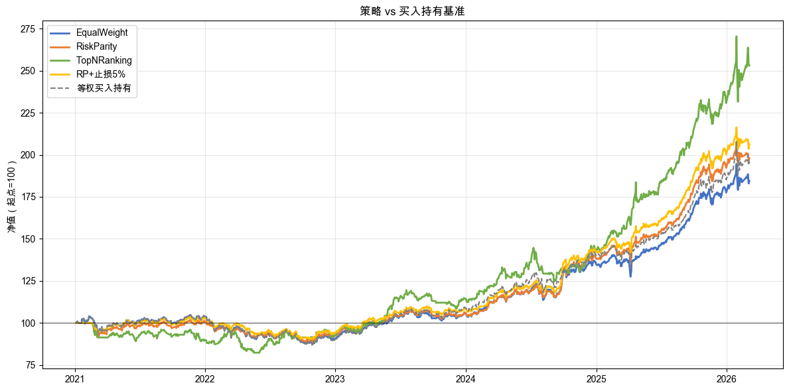
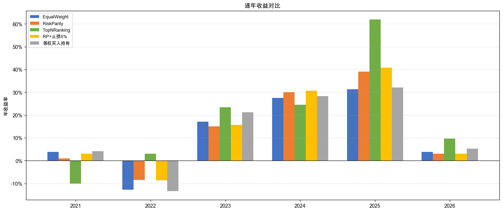
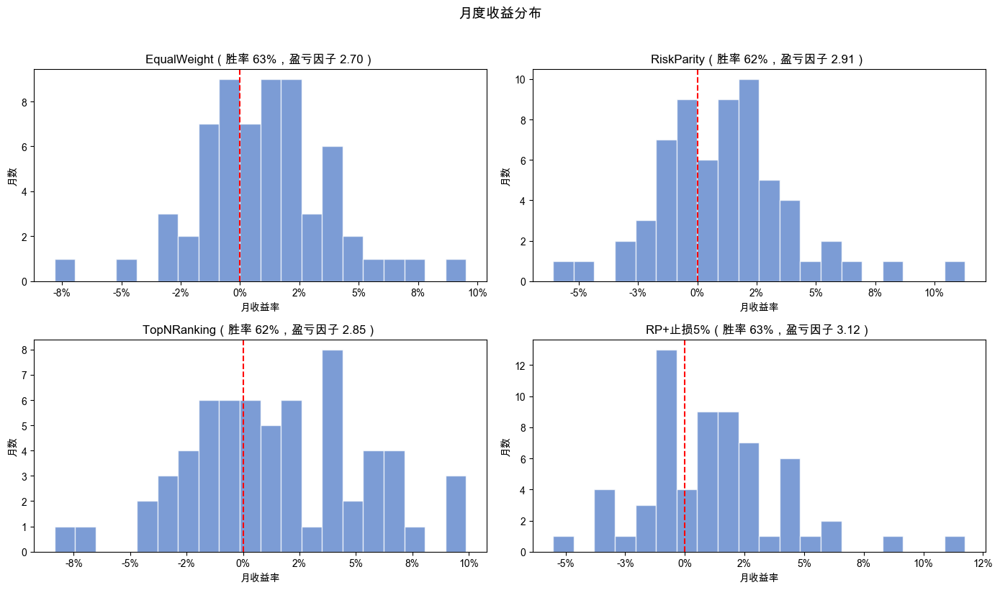
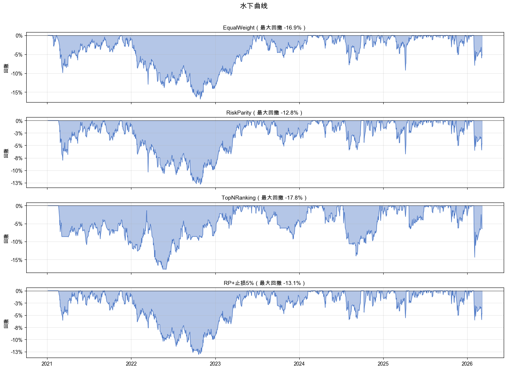
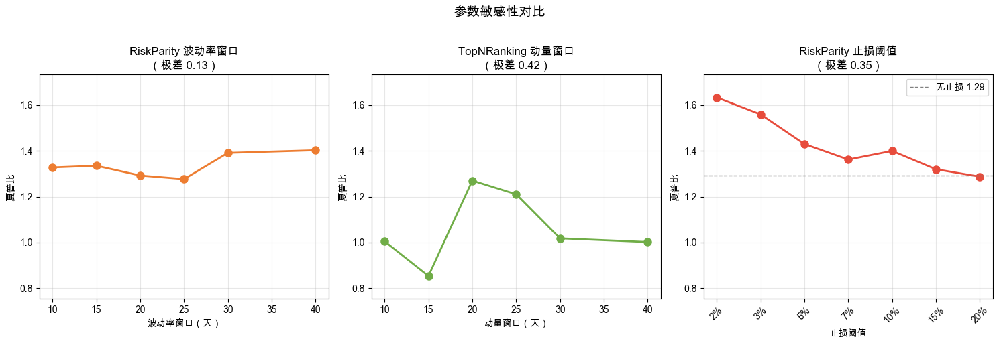

# 第 5 章：判断策略好不好：4 个关键视角

> 最新书稿已更新至 [XQuant 量化课堂页](https://xquant.shop/courses)。
> 想阅读最新版官方书稿，请前往图书页。

第 4 章我们给策略加上了规则：再平衡频率、止损、止盈，也学会了“不是所有合理的规则都有效”。现在手上有一个“看起来不错”的配置：风险平价 + 5% 止损。它的年化收益接近 15%，简化夏普也不低。

但“看起来不错”到底是什么意思？年化 15% 好不好？简化夏普 1.4 左右够不够？**跟什么比？**

更关键的问题：**这些数字是好几年平均出来的。如果某一年亏了 20%，你扛得住吗？**

### 路线图

本章进入四个阶段里的**评估归因**阶段。前面几章主要在训练“做”：把想法写成规则，让程序跑起来。本章开始训练“看”：拿到一组回测结果后，知道先看什么、再看什么、每个数字说明什么。

本章给策略做一次“全面体检”，分四个角度检查结果。全章一共要动手做 4 次实验，路线如表 5-1 所示。

**表 5-1 第 5 章路线图**

| 节 | 内容 | 实验 |
|----|------|------|
| 5.1 | 跟什么比？ | 1 |
| 5.2 | 每年都有收益吗？ | 1 |
| 5.3 | 收益结构什么样？ | 1 |
| 5.4 | 参数动一动，结果还稳吗？ | 1 |

铁律不变：**先猜后验，数据说了算。**

本章用第 3 章和第 4 章的四个策略配置作为“被检查对象”。四个候选配置对照如表 5-2 所示。

**表 5-2 第 5 章评估的四个候选配置**

| 策略 | 来源 | 特点 |
|------|------|------|
| EqualWeight | 第 3 章等权 | 最简单，无参数 |
| RiskParity | 第 3 章风险平价 | 波动相对低 |
| TopNRanking | 第 3 章动量排名 | 收益高，但波动也高 |
| RP+止损5% | 第 4 章规则配置 | 风险平价 + 5% 止损 |

> 提示：本章的要点段会比前几章更长，因为本章开始处理指标口径、图表约定和同一种方法的不同用途。读到要点段时不用赶，重点是看清楚：为什么要这样写，不这样写会怎样。

---

## 5.1 跟什么比？

第 4 章的策略年化收益接近 15%，简化夏普也不低，好不好？

直觉告诉我们：收益高就是好，简化夏普越大越好。但“好”是跟什么比？如果同期简单买入并持有也涨了很多，你忙活半天可能并没有占到便宜。

本章要做的第一件事，就是把第 3 章、第 4 章产出的策略配置放到“跟谁比”的语境里。一个策略自己涨了，不代表它好。只有它比一个简单可行的参照做法更好，才说明这套规则可能有价值。

在开始之前，先复习四个你已经见过的“基础体检指标”。它们在第 1 章、第 2 章、第 3 章都已经登场过。如果一时忘了，回来看表 5-3 就好。

**表 5-3 四个基础体检指标速查（第 1 章、第 2 章、第 3 章已登场）**

| 指标 | 白话含义 |
|------|---------|
| 累计收益率 | 从头到尾总共赚了多少 |
| 年化收益率 | 平均每年赚多少 |
| 年化波动率 | 价格上下波动的程度，数字越大越颠簸 |
| 最大回撤 | 最惨时从最高点跌了多少，用来衡量“最坏情况有多坏” |

这四个指标已经能看出策略“赚没赚、颠不颠、跌得深不深”。但它们各自只看一面。你还需要几把“综合尺”，把收益和风险放在一起看。第 3 章已经介绍过夏普比率，也说明本书表格里暂时使用的是简化口径：年化收益率 / 年化波动率。本章实验跑完后，我们会把简化夏普和另外两把尺子放在一起看：卡玛比、索提诺比。先做实验，再解释。

### 动手实验 1：策略对比买入持有基准

我们一起把这份 spec 写出来。这次重点看三件新东西：**金融指标的年化口径必须显式**、**open-xquant 评估与构造模块都要白话点名**、以及**防止 AI 写出错误分析的标准句**。

> 先看完下面的 spec 拆解，再回到运行结果。这一节信息会比前面密一些，因为 5.1 是本章信息量最大的一节。

#### 第一、二段：上下文和任务描述

第 5 章是“看”的一章，把前几章产出的策略配置放进体检台。上下文不引入新的策略，只把第 3 章、第 4 章的产物集合起来：

> **上下文**：本章评估策略是否真的好。第 3 章和第 4 章产出了 EqualWeight、RiskParity、TopNRanking、RiskParity+5% 止损四个策略配置，回测指标看起来不错。但“不错”是跟什么比？年化 15% 好不好，取决于同期一个简单参照做法赚了多少。
>
> **任务描述**：在 notebook `q5-how-to-validate.ipynb` 中，把四个策略配置和“等权买入持有”基准放在一起比较，引入多种风险调整指标。

> 📌 **要点**：第 5 章不引入新策略，只把前几章的产物集中送进体检台。spec 的上下文段要把“被检查对象”明确点名。这种“集合体检”型 spec 的好处是：读者只需要学习评估方法，不必再消化新的策略逻辑。

#### 第三段：任务要求

任务要求段做两件硬约束。第一件，点名 open-xquant 评估端和构造端要用哪几个模块，接口细节让 AI 自己去查。第二件，指标的年化方法必须写清楚，否则不同工具、不同时间跑出来的数字可能对不上。

> **任务要求**：
>
> 1. 评估端使用 oxq 的 `RunResult`，指标的计算口径显式锁定：
>    - 年化方法：**252 个交易日**（非 365 自然日）
>    - 简化夏普：`annualized_return / annualized_volatility`，不扣无风险收益
>    - 卡玛比：`annualized_return / abs(max_drawdown)`
>    - 索提诺比：`annualized_return / downside_volatility`（下行 = 收益 < 0 的标准差）
>    - 基准的简化夏普也要用同一口径
> 2. 构造端使用 oxq 的三个权重分配方法：等权（`EqualWeightOptimizer`）、风险平价（`RiskParityOptimizer`）、动量排名（`TopNRankingOptimizer`），按各自的构造参数和所需指标实例化
> 3. 数据快照固定：`START = "2021-01-01"`，`END = "2026-03-18"`（本章数字以此为基准，不要用 `today`）
> 4. 定义辅助函数 `run_strategy(portfolio, indicators=None, freq=10, stop_loss=None)` 供后续 spec 复用
> 5. 运行四个策略 + 构造“等权买入持有”基准（每只 ETF 归一化到 1，等权平均，之后不交易）

> 📌 **要点**：金融指标的年化口径（252 个交易日还是 365 个自然日、是否扣无风险收益、下行波动怎么定义）必须写明。零基础读者不知道这些约定，同一个指标在不同资料里口径可能不同。如果 spec 不锁定口径，你跑出 1.43，别人跑出 1.27，谁也不知道差在哪。指标 spec 的“精度”，恰恰落在这些看不见的小字上。

> 📌 **要点**：评估端和构造端要分别点名。第 1 条锁定评估端，也就是 `RunResult` 的指标计算；第 2 条列出构造端，也就是三个权重分配方法。零基础读者只需要知道“用哪些模块”，AI 会自己去查接口。spec 把模块点清楚，剩下的对照工作交给 AI。

#### 第四段：验收标准

最后一段最关键的不是“画几张图”，而是怎么让 AI 在不知道结果方向的情况下写出准确的分析文字：

> **验收标准**：
>
> 1. 策略与基准对比表（5 行 × 8 列）：策略名 / 累计收益 / 年化收益 / 波动率 / 最大回撤 / 简化夏普 / 卡玛比 / 索提诺比；最后一行是等权买入持有基准
> 2. 相对基准收益差表
> 3. 净值曲线对比图（figsize 12×6，4 实线 + 1 灰虚线，归一化到 100）
> 4. 分析文字（**根据实际数据动态描述方向，不要硬写“更高”或“更低”**）：哪些策略跑赢了基准？三把尺子的冠军是不是同一个？

> 📌 **要点**：「根据实际数据动态描述方向，不要硬写“更高”或“更低”」是第 5 章四份 spec 的标准句。AI 容易写出听上去合理、但和数据对不上的结论。把这句话当成第 5 章的标配，任何要 AI 写“分析文字”的 spec 都该带上。

完整示例 spec 在配套仓库的 [`q5-how-to-validate/specs/spec-01-benchmark-and-metrics.md`](https://github.com/xingwudao/xquant-learning/blob/main/q5-how-to-validate/specs/spec-01-benchmark-and-metrics.md)。参考它确认自己的 spec 后，再复制给 AI，按提示允许执行。

AI 执行完毕后，你的 notebook 里应该出现一张对比表、一张相对基准收益差表和一张净值曲线图。

这个实验做了什么？把第 3 章、第 4 章产出的四个策略配置（等权、风险平价、动量排名、风险平价 + 止损）全部重新跑一遍含成本的回测，同时构造一个“买入持有”基准：等权买入三只 ETF 后不再做任何交易，代表“什么都不做”的结果。然后把五条净值曲线画在一起，用七个指标（累计收益、年化收益、波动率、最大回撤、简化夏普、卡玛比、索提诺比）逐一比较，算出每个策略相对基准多赚或少赚了多少。

### 实验结果

四个策略与基准的指标对比如表 5-4 所示。

**表 5-4 四个策略与等权买入持有基准的指标对比**

| 策略 | 累计收益 | 年化收益 | 波动率 | 最大回撤 | 简化夏普 | 卡玛比 | 索提诺比 |
|------|---------|---------|--------|---------|--------|--------|---------|
| EqualWeight | 84.37% | 12.33% | 12.49% | -16.86% | 1.05 | 0.73 | 0.92 |
| RiskParity | 98.01% | 13.77% | 11.16% | -12.81% | 1.29 | 1.08 | 1.16 |
| TopNRanking | 153.03% | 18.71% | 15.77% | -17.77% | 1.27 | 1.05 | 1.11 |
| RP+止损5% | 106.23% | 14.59% | 10.61% | -13.07% | 1.43 | 1.12 | 1.33 |
| 等权买入持有 | 94.82% | 14.39% | 13.00% | -17.24% | 1.10 | — | — |

相对基准收益差（策略累计收益 - 基准累计收益 94.82%）如表 5-5 所示。

**表 5-5 四个策略相对等权买入持有基准的收益差**

| 策略 | 相对基准收益差 |
|------|-------|
| EqualWeight | -10.45% |
| RiskParity | +3.18% |
| TopNRanking | +58.20% |
| RP+止损5% | +11.41% |

净值曲线对比如图 5-1 所示。

### 结果解读

第一个认知升级：**“好不好”必须有参照物。**

**基准（Benchmark）**：用来做比较的参照物。这里的基准是“什么都不做”：等权买入三只 ETF 后不再交易。它就像考试的“及格线”。不跟基准比，你根本不知道自己的策略是好还是坏。

年化 14% 听起来不错，但等权买入持有同期也赚了 14.39%。EqualWeight 做了很多次交易，累计收益 84.37%，反而没跑赢“什么都不做”的 94.82%。这说明：多做事不一定带来更好结果。

表 5-5 看的就是“比基准多赚或少赚了多少”。EqualWeight 的相对基准收益差是 -10.45%，说明它不但没有跑赢简单基准，反而可能被频繁调整持仓带来的交易成本拖累了。TopNRanking 的相对基准收益差最高（+58.20%），但先别急着下结论。还要看其他指标怎么说。

第二个发现：**不同的尺子量出不同的结论。**

实验跑完了，正式介绍三把“综合尺”。它们各自把收益和风险放在一起，但对“风险”的定义不同：

- **简化夏普**：年化收益除以年化波动率。把“收益高”和“波动大”折成一个数字。注意，这里仍然沿用本书前面章节的简化口径，不扣无风险收益。
- **卡玛比（Calmar Ratio）**：年化收益除以最大回撤。每承受 1% 的最大回撤，能换来多少年化收益。如果你最怕“一次跌太深”，卡玛比是最直接的尺子。
- **索提诺比（Sortino Ratio）**：只用下行波动率做分母。上涨波动不是风险，涨得猛不应该被惩罚，所以索提诺比只关注亏损方向的波动。

简单记忆：**夏普看“颠不颠”，卡玛看“摔多惨”，索提诺只关心“亏的部分”。**

把这三把尺子放进表 5-4 之后回头看。三把尺子的冠军都是 RP+止损5%：简化夏普 1.43、卡玛比 1.12、索提诺比 1.33。TopNRanking 虽然收益最高，但三把尺子都不是冠军。这次三把尺子碰巧给出了同一个冠军，但不是每次都这么巧。不同的尺子关注不同的风险维度，完全可能给出不同答案。你最怕什么风险，就优先看对应的尺子。

但这些都是好几年平均出来的数字。**平均年化 14% 听着不错，但如果其中一年亏了 20%，你扛得住吗？**

---

## 5.2 每年都有收益吗？

刚才的指标覆盖了 2021 年初到 2026 年 3 月，整整 5 年多、1250 多个交易日。这么长时间的平均值，可能掩盖某些年份的亏损。就像考试平均 80 分，但其中一科考了 30 分。

直觉告诉我们：平均好就是好吧，哪年赚哪年亏不重要？

真的吗？拆开看看。

### 动手实验 2：逐年收益拆解

我们一起把这份 spec 写出来。这次重点看两件新东西：**接续型 spec 共享 notebook 状态**、以及**时间维度切片要避免重复回测**。

#### 第一、二段：上下文和任务描述

spec-02 不需要重新介绍策略。它直接接着 spec-01 在同一个 notebook 里跑。上下文段把“已经有什么”列清楚就够了：

> **上下文**：在 `q5-how-to-validate.ipynb` 中已有四个策略和基准的整体指标对比、`results` 字典、`run_strategy` 辅助函数、`TNR_PORTFOLIO` 等变量。读者已了解基准、相对基准收益差、卡玛比、索提诺比等概念。
>
> **任务描述**：按年度拆解策略表现，并深挖 TopNRanking 在负收益年份的异常。

> 📌 **要点**：第 5 章四份 spec 共享同一个 notebook 状态。spec-02 直接读 spec-01 留下的 `results` / `run_strategy` / `TNR_PORTFOLIO`。接续型 spec 的上下文段不必从头说明，只列“已经有什么”。这样 AI 不会重新下载数据、不会重新构建策略、不会假设一个不存在的变量。

#### 第三段：任务要求

任务要求段做两件事：按年度切片计算指标；深挖 TopNRanking 在负收益年份。这是最容易出现重复计算和口径不一致的地方。

> **任务要求**：
>
> 1. 用 oxq `RunResult` 的日收益序列（`daily_returns()`）和净值曲线（`equity_curve`）做时间切片
> 2. 按年度拆解四策略 + 基准：用 `daily_returns()` 按年分组，计算年收益率（累乘）、年波动率、年简化夏普、年内最大回撤。跳过样本不足的年份（`if len(year_data) < 20: continue`，避开新年初只有几个交易日的边界）
> 3. 打印逐年对比表（pandas DataFrame，存入变量 `annual_df` 供后续 spec 复用）
> 4. 画逐年收益柱状图（figsize 14×6，每年一组 5 根柱子，与 spec-01 颜色一致）
> 5. 深挖 TopNRanking 负收益年份：扫描 `mom_periods = [5, 10, 15, 20, 25, 30]`，每个窗口只跑一次回测，结果存入 `deep_dive[period]`，从字典里直接读，不要重新调用 `run_strategy` 做“是否所有窗口都亏”的二次判断

> 📌 **要点**：时间维度切片不要重复回测。“按年度拆”听起来像每年都要跑一遍，其实不需要。整段时间只跑一次，得到日收益序列后按 `index.year` 分组算指标。深挖也一样：6 个动量窗口跑 6 次，不要因为后面要二次判断又跑 6 次。spec 不点名“结果存 dict 复用”，AI 写出的代码大概率会重复回测。

> 📌 **要点**：最小样本过滤必须写清楚。年内少于 20 个交易日不进表，是为了避免样本太少导致年化数字失真。spec 不写明，AI 可能用 1 月份的 5 天数据计算“年化”，得出离谱数字。表上突然多出一行“2026 年化 +800%”，读者很难看出哪里错了。

#### 第四段：验收标准

> **验收标准**：
>
> 1. 逐年收益对比表（DataFrame，行=年份，列=4 策略+基准，负收益用 `*` 标注）
> 2. 逐年收益柱状图
> 3. TopNRanking 异常年份深挖表（行=动量窗口，列=负收益年份）
> 4. 分析文字（**根据实际数据动态描述方向**）：哪些策略“每年都赚”？深挖结论是“参数没选对”还是“策略结构性问题”？

完整示例 spec 在配套仓库的 [`q5-how-to-validate/specs/spec-02-annual-breakdown.md`](https://github.com/xingwudao/xquant-learning/blob/main/q5-how-to-validate/specs/spec-02-annual-breakdown.md)。参考它确认自己的 spec 后，再复制给 AI，按提示允许执行。

AI 执行完毕后，你的 notebook 里应该出现逐年对比表、柱状图和一份 TopNRanking 深挖分析。

这个实验做了什么？把第 1 个实验的整体指标拆成逐年成绩单。按年份分组计算每个策略和基准的年收益率、年波动率、年内最大回撤，看看哪些策略“每年都赚”，哪些有负收益年份。然后针对 TopNRanking 在负收益年份做深挖：换遍 6 种动量窗口（5 / 10 / 15 / 20 / 25 / 30 天）重新跑回测，看这一年的亏损是参数选错了，还是策略本身的结构性问题。

### 实验结果

四个策略 + 基准的逐年收益拆解如表 5-6 所示（`*` 标注负收益年份）。

**表 5-6 四策略与基准逐年收益对比**

| 年份 | EqualWeight | RiskParity | TopNRanking | RP+止损5% | 基准 |
|------|------------|------------|-------------|----------|------|
| 2021 | 3.76% | 1.03% | -10.09% * | 3.04% | 4.09% |
| 2022 | -12.72% * | -8.55% * | 3.04% | -8.63% * | -13.44% * |
| 2023 | 17.04% | 15.03% | 23.48% | 15.67% | 21.21% |
| 2024 | 27.55% | 30.12% | 24.50% | 30.65% | 28.31% |
| 2025 | 31.29% | 39.01% | 62.02% | 40.74% | 32.10% |
| 2026 | 3.88% | 3.00% | 9.65% | 3.00% | 5.24% |

逐年收益的柱状对比如图 5-2 所示。

深挖 TopNRanking 在 2021 年的负收益。把动量窗口换遍，结果如表 5-7 所示。

**表 5-7 TopNRanking 2021 年不同动量窗口的年收益**

| 窗口 | 2021 |
|------|------|
| period=5 | -9.48% |
| period=10 | -7.97% |
| period=15 | -5.08% |
| period=20 | -10.09% |
| period=25 | -11.09% |
| period=30 | -9.14% |

所有动量窗口在 2021 年都亏钱。

### 结果解读

**分段检验（Segment Analysis）**：把回测结果按时间段拆开检查。整体指标是“平均分”，逐年拆开才是“每科成绩单”。整体及格不等于每科都及格。

拆开后两个重要发现：

**第一，没有哪个策略“年年赚钱”。** EqualWeight、RiskParity 和 RP+止损5% 在 2022 年都出现了负收益，同期基准也亏了 -13.44%。策略和基准一起亏，说明策略并没有真正提供“下跌保护”。这是资产配置策略的特点：它能分散风险，但不能消除市场整体下跌带来的损失。

**第二，TopNRanking 的负收益不是参数问题。** 2021 年，TopNRanking 是唯一亏钱的策略（-10.09%），而其他三个策略和基准都是正收益。换遍所有动量窗口（5 天到 30 天），在 2021 年全部亏钱。这是**动量策略的结构性弱点**。

**动量滞后性**：动量指标基于“过去涨了多少”来判断买什么。但当市场反复上下波动、没有明确方向时，过去涨得好的恰恰可能是“已经涨到头了”的那个。动量指标看的是后视镜，它有天然的滞后性。2021 年的市场就是典型的来回波动环境，动量策略在这种环境下容易吃亏，换什么参数都不一定能解决。

**数据说了算：逐年拆开，才能看到整体指标掩盖的问题。不同策略类型有不同的市场环境偏好。**

但年度还是太粗了。知道了哪年亏钱还不够。赚钱的年份里，是每月稳稳地赚，还是靠某几个月的大涨覆盖其他月份的亏损？

---

## 5.3 收益结构什么样？

年度表现解释了“什么时候赚、什么时候亏”，但没解释“怎么赚的”：是每个月稳稳地赚一点，还是靠几次大赚覆盖很多次小亏？

同样赚钱的两个策略，赚法可能完全不同。你能接受“一年中 8 个月亏钱、靠 4 个月大赚拉回来”的策略吗？

另外，回撤不只是一个数字。最大回撤 -15% 但 3 个月恢复，和最大回撤 -10% 但 1 年没恢复，哪个更痛苦？

### 动手实验 3：月度分布 + 回撤深度

我们一起把这份 spec 写出来。这次重点看两件新东西：**图表约定要写到颜色与子图布局**，以及**关键阈值（包括看似微小的 -0.001）必须显式**。

#### 第一、二段：上下文和任务描述

接续 spec-02 的发现：胜率全时段都差不多，但 2021 年有人亏 10% 有人赚 3%。这一份 spec 把“为什么差距这么大”拆开看：

> **上下文**：notebook 里已有四个策略和基准的整体对比、逐年拆解、TopNRanking 在反复波动市场中的结构性弱点。
>
> **任务描述**：分析月度收益分布和历史回撤事件。同样赚钱的策略，赚法可能完全不同。

#### 第三段：任务要求

第一组要求做月度分布。第二组做回撤事件。回撤事件的“什么算事件”阈值，是这份 spec 最容易被遗漏的精度点。

> **任务要求**：
>
> 1. 用 oxq `RunResult` 的月度收益（`monthly_returns()`）和回撤序列（`drawdown_series()`）做收益结构分析
> 2. 月度分布分析（四策略）：胜率、平均盈利月、平均亏损月、盈亏比、盈亏因子、最长连赢/连亏（**月收益 = 0 算亏损**）
> 3. 打印月度统计对比表 + 画月度收益分布直方图（figsize 14×8，2×2 子图，20 bins，x=0 处红色虚线）
> 4. 回撤深度分析：识别每次回撤事件，阈值锁定 `THRESHOLD = -0.001`（即跌幅 ≥ 0.1% 才算事件，避开数值噪声生成假事件）：起点 = dd 跌穿阈值的那天，恢复 = dd 反弹回阈值之上的那天，未恢复则标“—”
> 5. 打印每个策略前 5 大回撤事件 + 回撤汇总
> 6. 画水下曲线（figsize 14×10，4 子图垂直，**与 spec-01 同色继承**：EW=#4472C4 / RP=#ED7D31 / TNR=#70AD47 / RP+止损=#FFC000）
> 7. 拆解 TopNRanking 2021 年月度，说明为什么胜率 50% 但盈亏比 0.47 仍然会亏钱

> 📌 **要点**：图表和事件识别里的“阈值”包括看不见的数字。回撤事件的 `THRESHOLD = -0.001` 看似微不足道，但它直接决定有多少行进表。`-0.001` 可能给你 50 个事件，`-0.01` 可能只剩 10 个。spec 不锁阈值，AI 选不同值就会得出完全不同的“前 5 大回撤”，读者两次跑结果对不上，根本不知道差在哪。任何“看起来微小”的阈值，都应该写进 spec。

> 📌 **要点**：跨 spec 的颜色要继承。spec-01 的净值曲线用了 4 个颜色，spec-03 的水下曲线也要沿用。否则读者刚记住“绿色 = TNR 净值线”，下一张图又变成全蓝色，就很难对应。第 5 章一开始锁定的图表约定（颜色、figsize、布局），要在每份后续 spec 显式继承，不能假设 AI 会自动记住。

#### 第四段：验收标准

> **验收标准**：月度统计表（4 行）+ 月度直方图（2×2）+ TopNRanking 2021 年逐月明细 + 四策略 2021 月度对比 + 前 5 大回撤事件表 + 回撤汇总表 + 水下曲线图（4 子图）+ 分析文字（根据实际数据动态描述方向）

完整示例 spec 在配套仓库的 [`q5-how-to-validate/specs/spec-03-return-distribution-and-drawdown.md`](https://github.com/xingwudao/xquant-learning/blob/main/q5-how-to-validate/specs/spec-03-return-distribution-and-drawdown.md)。参考它确认自己的 spec 后，再复制给 AI，按提示允许执行。

AI 执行完毕后，你的 notebook 里应该出现月度统计表、分布直方图、2021 年胜率陷阱分析、回撤事件表和水下曲线图。

这个实验做了什么？从两个维度拆解“怎么赚的钱”。第一个维度是月度收益分布：把每个策略的日收益按月汇总，统计胜率（赚钱月占比）、盈亏比（平均赚多少、平均亏多少）、最长连赢/连亏月数等。还专门拆解了 TopNRanking 2021 年的逐月明细，和其他三个策略对比同年的胜率和盈亏比，解释为什么胜率差不多、结局却完全不同。第二个维度是回撤深度：识别每次从高点下跌到恢复的完整事件，记录深度、下跌天数、恢复天数，画出水下曲线。

内容比较多，我们分两个维度来看。

**维度一：月度收益分布**

四个策略的月度统计指标如表 5-8 所示。

**表 5-8 四策略月度收益统计对比**

| 策略 | 胜率 | 平均盈利月 | 平均亏损月 | 盈亏比 | 盈亏因子 | 最好月 | 最差月 | 连赢 | 连亏 |
|------|------|----------|----------|--------|---------|--------|--------|------|------|
| EqualWeight | 63.5% | 2.54% | -1.63% | 1.55 | 2.70 | 9.52% | -7.82% | 8 | 3 |
| RiskParity | 61.9% | 2.79% | -1.56% | 1.79 | 2.91 | 11.29% | -6.09% | 11 | 4 |
| TopNRanking | 61.9% | 3.88% | -2.21% | 1.75 | 2.85 | 9.88% | -8.36% | 11 | 4 |
| RP+止损5% | 63.5% | 2.77% | -1.55% | 1.79 | 3.12 | 11.74% | -5.52% | 11 | 4 |

四个策略的月度收益分布直方图如图 5-3 所示。

乍一看，四个策略的胜率都差不多，都是 62% 左右。但第 2 个实验告诉我们，TopNRanking 在 2021 年亏了 10%，而其他策略同年都是正收益。胜率差不多，为什么结局完全不同？拆解 2021 年的月度数据就能看清原因。

**拆解 TopNRanking 2021 年：胜率的陷阱**

TopNRanking 在 2021 年的逐月收益如表 5-9 所示。

**表 5-9 TopNRanking 2021 年逐月明细**

| 月份 | 收益 |
|------|------|
| 2021-01 | 0.00% |
| 2021-02 | -7.29% |
| 2021-03 | -1.44% |
| 2021-04 | +1.93% |
| 2021-05 | +1.54% |
| 2021-06 | -1.78% |
| 2021-07 | +1.17% |
| 2021-08 | +2.28% |
| 2021-09 | -4.30% |
| 2021-10 | +1.12% |
| 2021-11 | +0.75% |
| 2021-12 | -4.05% |

把四个策略放在 2021 这一年同一张表里对比，胜率与盈亏比的差异如表 5-10 所示。

**表 5-10 四策略 2021 年月度胜率与盈亏比对比**

| 策略 | 胜率 | 平均盈利月 | 平均亏损月 | 盈亏比 | 年收益 |
|------|------|----------|----------|--------|--------|
| EqualWeight | 50% | 2.03% | -1.37% | 1.48 | 3.76% |
| RiskParity | 58% | 1.76% | -2.20% | 0.80 | 1.03% |
| TopNRanking | 50% | 1.46% | -3.14% | 0.47 | -10.09% |
| RP+止损5% | 58% | 1.77% | -1.82% | 0.97 | 3.04% |

看上面的 2021 年对比。TopNRanking 的胜率 50%，跟 EqualWeight 一样。但它赚的月份平均只赚 1.46%，亏的月份平均亏 3.14%，盈亏比只有 0.47。翻译一下：赚的时候赚得少，亏的时候亏得多。结果是，虽然一半的月份赚钱，但亏损月把所有利润全吃掉还倒贴了，全年 -10.09%。

同年的 EqualWeight 胜率也是 50%，但盈亏比 1.48。赚的月份平均赚 2.03%，亏的月份平均只亏 1.37%。同样的胜率，完全不同的结局。

这就是**胜率的陷阱**：大多数人天然觉得“赢的次数越多越好”，但胜率本身意义不大。胜率 90%，每次赚 1 元；亏的那 10% 每次亏 20 元。10 次交易赚 9 元、亏 20 元，净亏 11 元。高胜率，也可能亏钱。

真正决定收益的是**盈亏比（Win/Loss Ratio）**：平均每次赚多少除以平均每次亏多少。优秀策略的关键是“小亏大赚”：亏的时候尽量控制亏损幅度，赚的时候让利润继续增长。只追求高胜率，可能会忽略亏损幅度。

**盈亏因子（Profit Factor）**：总盈利除以总亏损的绝对值。大于 1 说明赚的比亏的多，大于 2 通常已经不错。四个策略的盈亏因子都在 2.7 到 3.1 之间，整体看都不错。但注意，这是全时段的数字。拆到具体年份，比如 2021 年，TopNRanking 的盈亏因子会远低于 1。

**维度二：回撤深度**

**前 5 大回撤事件**

EqualWeight 的前 5 大回撤事件如表 5-11 所示。

**表 5-11 EqualWeight 前 5 大回撤事件**

| # | 开始 | 最低点 | 恢复 | 深度 | 下跌天数 | 恢复天数 |
|---|------|--------|------|------|---------|---------|
| 1 | 2021-11-22 | 2022-10-28 | 2023-06-16 | -16.86% | 340 | 231 |
| 2 | 2021-02-18 | 2021-03-09 | 2021-11-15 | -9.88% | 19 | 251 |
| 3 | 2025-02-20 | 2025-04-07 | 2025-05-06 | -9.22% | 46 | 29 |
| 4 | 2026-01-30 | 2026-02-02 | 未恢复 | -7.95% | 3 | — |
| 5 | 2024-07-18 | 2024-08-05 | 2024-09-26 | -7.82% | 18 | 52 |

最大回撤：-16.86% / 平均恢复：17 天 / 最长恢复：251 天

RiskParity 的前 5 大回撤事件如表 5-12 所示。

**表 5-12 RiskParity 前 5 大回撤事件**

| # | 开始 | 最低点 | 恢复 | 深度 | 下跌天数 | 恢复天数 |
|---|------|--------|------|------|---------|---------|
| 1 | 2021-11-22 | 2022-10-28 | 2023-05-19 | -12.81% | 340 | 203 |
| 2 | 2021-02-22 | 2021-03-09 | 2021-07-15 | -7.98% | 15 | 128 |
| 3 | 2025-02-20 | 2025-04-07 | 2025-04-16 | -6.72% | 46 | 9 |
| 4 | 2026-01-30 | 2026-02-02 | 未恢复 | -6.02% | 3 | — |
| 5 | 2024-07-19 | 2024-08-05 | 2024-09-26 | -5.94% | 17 | 52 |

最大回撤：-12.81% / 平均恢复：15 天 / 最长恢复：203 天

TopNRanking 的前 5 大回撤事件如表 5-13 所示。

**表 5-13 TopNRanking 前 5 大回撤事件**

| # | 开始 | 最低点 | 恢复 | 深度 | 下跌天数 | 恢复天数 |
|---|------|--------|------|------|---------|---------|
| 1 | 2021-02-22 | 2022-06-01 | 2023-03-20 | -17.77% | 464 | 292 |
| 2 | 2026-01-30 | 2026-02-02 | 未恢复 | -14.39% | 3 | — |
| 3 | 2024-07-10 | 2024-09-04 | 2024-12-17 | -14.02% | 56 | 104 |
| 4 | 2023-07-20 | 2023-12-05 | 2024-02-23 | -9.34% | 138 | 80 |
| 5 | 2025-04-23 | 2025-04-28 | 2025-06-30 | -6.48% | 5 | 63 |

最大回撤：-17.77% / 平均恢复：14 天 / 最长恢复：292 天

RP+止损5% 的前 5 大回撤事件如表 5-14 所示。

**表 5-14 RP+止损5% 前 5 大回撤事件**

| # | 开始 | 最低点 | 恢复 | 深度 | 下跌天数 | 恢复天数 |
|---|------|--------|------|------|---------|---------|
| 1 | 2021-11-22 | 2022-10-21 | 2023-05-19 | -13.07% | 333 | 210 |
| 2 | 2021-02-22 | 2021-03-09 | 2021-05-18 | -6.06% | 15 | 70 |
| 3 | 2026-01-30 | 2026-02-02 | 未恢复 | -6.02% | 3 | — |
| 4 | 2024-07-19 | 2024-08-05 | 2024-09-26 | -5.94% | 17 | 52 |
| 5 | 2025-02-20 | 2025-04-07 | 2025-04-11 | -5.57% | 46 | 4 |

最大回撤：-13.07% / 平均恢复：13 天 / 最长恢复：210 天

四个策略的水下曲线如图 5-4 所示，可以直观看到“在水下度过的时间”。

### 结果解读

收益结构揭示了“怎么赚的钱”，这里有两个关键维度。

**胜率是陷阱，盈亏比才是关键。** 四个策略全时段的胜率都在 62% 左右，看不出差别。但拆到 2021 年，TopNRanking 的盈亏比只有 0.47。每赚 1 块钱，对应要亏 2 块多。同年 EqualWeight 盈亏比 1.48，赚的月份能覆盖亏的月份。同样的胜率，截然不同的结局。真正决定收益的不是赢的次数，而是赢的时候赚多少、亏的时候亏多少。

**回撤不只是深度，还有恢复时间。** TopNRanking 的最大回撤 -17.77%，从 2021 年 2 月开始下跌，直到 2023 年 3 月才恢复，整整两年都没有回到前高。RiskParity 最大回撤 -12.81%，恢复用了 203 天。RP+止损5% 最大回撤 -13.07%，恢复用了 210 天。

**水下曲线（Underwater Curve）**：每天距离历史最高点跌了多少。它直观展示一个残酷的事实：你有多少时间是在“还没回本”的状态中度过的。回撤不只是一个数字，它是一段真实的持有体验。深度和恢复时间同样重要。

**回撤恢复时间**：从最低点爬回前高需要多久。回撤 -15% 但 3 个月恢复，和回撤 -10% 但 1 年没恢复相比，后者对实际持有体验的伤害可能更大。比起回撤深度，恢复时间更影响你能不能拿得住。

**数据说了算：赚钱的方式和赚钱一样重要。** 别被高胜率迷惑，关注盈亏比；别只看回撤深度，还要看恢复时间。

评估够全面了吗？其实还有一个隐藏问题：你用的参数（动量窗口 20 天、波动率窗口 20 天、止损阈值 5%）是在历史数据里选出来的。但如果把 20 天前后扰动一下，比如改成 15 天或 25 天，结果还差不多吗？如果稍微一动就差很多，那这个“最优”在未来的数据上恐怕也靠不住。

---

## 5.4 参数动一动，结果还稳吗？

前面三个实验的评估都基于特定参数：动量窗口 20 天、波动率窗口 20 天、止损阈值 5%。这些参数是在历史数据里选出来的，至少在这段数据上表现不错。

但问题是：在最优参数附近前后扰动一下，比如动量窗口从 20 天改成 15 天或 25 天，结果是差不多，还是会差很多？如果附近的参数表现都还行，说明这个“最优”相对稳定；如果稍微一动，简化夏普就从 1.27 跌到 0.85，那历史上的“最优”很可能在未来数据上不再最优。

直觉告诉我们：找到最优参数就行了。真的吗？

### 动手实验 4：参数敏感性扫描

我们一起把这份 spec 写出来。这次重点看两件新东西：同样是参数扫描，这次目的不同；要让“高原型”和“山峰型”的视觉对比成立，y 轴范围必须统一。

#### 第一、二段：上下文和任务描述

这是读者第二次见到参数扫描。上次在第 1 章，是用来“找最优参数”；这次在第 5 章，是用来“判断结果是否稳定”。同样的技术，不同的目的。这个区别必须在上下文段就讲清楚，否则读者会困惑为什么又来一次：

> **上下文**：notebook 里已有四策略的整体指标、逐年收益、月度分布、回撤分析。所有分析都基于特定参数（period=20, freq=10, threshold=0.05）。
>
> 当前问题：如果参数稍微变一下，结论还成立吗？
>
> **注意**：这里的参数扫描和第 1 章 spec-06 不同。第 1 章是“用扫描找最优参数”，目的是挑值；本章是“用扫描判稳健性”，目的是看形状。同样的技术，完全不同的目的。本章不是要找出比 20 更好的窗口，而是要判断“在 20 附近的所有值，结果是不是都差不多”。
>
> **任务描述**：扫描 RiskParity 波动率窗口、TopNRanking 动量窗口、止损阈值三个维度，对比“高原型”和“山峰型”。

> 📌 **要点**：同方法不同目的，必须在 spec 里显式区分。参数扫描在第 1 章是过拟合的诱因，因为它容易让你挑出漂亮数字；在第 5 章则是检查稳健性的方法，因为它用来观察附近参数是不是都差不多。如果 spec 不点名“这次不是为了找最优”，读者会以为又是一次找最优，下一章讲过拟合时就接不上。工具的意义会随章节变化，spec 必须写出当前章节用它干什么。

#### 第三段：任务要求

> **任务要求**：
>
> 1. RiskParity 波动率窗口扫描 `vol_period = [10, 15, 20, 25, 30, 40]`：中心 20 是 spec-01 选定值，左右对称展开 ±10/±15，加 40 看远端外推；不试 5（5 天太短无法稳定估计波动率）
> 2. TopNRanking 动量窗口扫描 `mom_period = [10, 15, 20, 25, 30, 40]`（波动率窗口固定 20）
> 3. 止损阈值扫描 `thresholds = [0.02, 0.03, 0.05, 0.07, 0.10, 0.15, 0.20]` + 无止损（共 8 行表，无止损作为最后一行，“止损阈值”列填“无”）
> 4. 计算每组的简化夏普极差（max - min），打印对比 + 标注“高原型”（极差小）和“山峰型”（极差大）
> 5. 画三子图折线（figsize 15×5，1×3 布局），y 轴范围统一，这样 RP 的“平”和 TNR 的“尖”才能立刻可见
> 6. 输出“山顶营地”隐喻：高原型像一片平坦的高原（站在哪都差不多高），山峰型像一座尖峰（偏一步就掉下去）

> 📌 **要点**：参数列表的设计必须能解释。`[10, 15, 20, 25, 30, 40]` 不是随便挑。中心 20 是当前选定值，左右展开看附近，加远端 40 看外推。spec 不解释扫描点的来历，读者仿写时只会照抄数字，遇到自己的策略就不知道该挑哪些值扫。

> 📌 **要点**：y 轴统一，是“高原型”和“山峰型”对比能不能看出来的关键。三个子图如果各自缩放，看起来都会“波动很大”，因为每个图都填满了画布。统一 ylim 后，RP 是平的，TNR 是尖的，差异会立刻出现。参数敏感性对比图，坐标轴要尽量共享。

#### 第四段：验收标准

> **验收标准**：RiskParity 波动率窗口表（6×5）+ TopNRanking 动量窗口表（6×5）+ 止损阈值表（8×5）+ 简化夏普极差对比 + 折线敏感性图（1×3）+ 分析文字（根据实际数据动态描述方向），用“山顶营地”隐喻收束

完整示例 spec 在配套仓库的 [`q5-how-to-validate/specs/spec-04-parameter-sensitivity.md`](https://github.com/xingwudao/xquant-learning/blob/main/q5-how-to-validate/specs/spec-04-parameter-sensitivity.md)。参考它确认自己的 spec 后，再复制给 AI，按提示允许执行。

AI 执行完毕后，你的 notebook 里应该出现三组参数敏感性表和一张折线对比图。

这个实验做了什么？分三组做参数扰动测试。第一组：保持其他参数不变，把 RiskParity 的波动率窗口从 10 天到 40 天逐个试一遍，看简化夏普变化多大。第二组：对 TopNRanking 做同样的事，把动量窗口从 10 天到 40 天逐个试。第三组：固定 RiskParity 策略，把止损阈值从 2% 到 20% 逐个试（外加无止损对照）。然后算出每组的简化夏普极差（最高减最低），判断策略是“高原型”（参数怎么调都差不多）还是“山峰型”（偏一点结果就明显变差）。

### 实验结果

RiskParity 波动率窗口扫描结果如表 5-15 所示。

**表 5-15 RiskParity 波动率窗口敏感性**

| 窗口（天） | 累计收益 | 简化夏普 | 卡玛比 | 回撤 |
|----------|---------|--------|--------|------|
| 10 | 104.32% | 1.33 | 1.13 | -12.80% |
| 15 | 102.65% | 1.33 | 1.13 | -12.64% |
| 20 | 98.01% | 1.29 | 1.08 | -12.81% |
| 25 | 96.76% | 1.28 | 1.06 | -12.93% |
| 30 | 109.29% | 1.39 | 1.10 | -13.49% |
| 40 | 111.45% | 1.40 | 1.05 | -14.37% |

简化夏普极差：0.13

TopNRanking 动量窗口扫描结果如表 5-16 所示。

**表 5-16 TopNRanking 动量窗口敏感性**

| 窗口（天） | 累计收益 | 简化夏普 | 卡玛比 | 回撤 |
|----------|---------|--------|--------|------|
| 10 | 104.21% | 1.00 | 0.72 | -19.91% |
| 15 | 83.31% | 0.85 | 0.73 | -16.78% |
| 20 | 153.03% | 1.27 | 1.05 | -17.77% |
| 25 | 144.73% | 1.21 | 1.10 | -16.46% |
| 30 | 105.42% | 1.02 | 0.87 | -16.64% |
| 40 | 101.54% | 1.00 | 0.74 | -19.03% |

简化夏普极差：0.42

止损阈值的扫描结果如表 5-17 所示（基于 RiskParity 策略，再平衡频率 10 天）。

**表 5-17 止损阈值敏感性**

| 止损阈值 | 累计收益 | 简化夏普 | 最大回撤 | 交易次数 |
|---------|---------|--------|---------|---------|
| 2% | 125.87% | 1.63 | -9.65% | 402 |
| 3% | 118.80% | 1.56 | -11.62% | 394 |
| 5% | 106.23% | 1.43 | -13.07% | 387 |
| 7% | 100.90% | 1.36 | -13.26% | 382 |
| 10% | 106.16% | 1.40 | -12.02% | 375 |
| 15% | 99.30% | 1.32 | -12.51% | 371 |
| 20% | 97.04% | 1.29 | -13.23% | 370 |
| 无止损 | 98.01% | 1.29 | -12.81% | 369 |

简化夏普极差：0.35

三组参数的简化夏普极差汇总如表 5-18 所示。

**表 5-18 参数敏感性极差对比**

| 参数组 | 简化夏普极差 | 类型 |
|--------|----------|------|
| RiskParity | 0.13 | 高原型（参数不敏感） |
| TopNRanking | 0.42 | 山峰型（参数敏感） |
| 止损阈值 | 0.35 | 山峰型（参数敏感） |

三组参数的简化夏普折线对比如图 5-5 所示。

### 结果解读

最后一个认知升级：**好策略不怕参数变。**

**参数敏感性（Parameter Sensitivity）**：改一个参数值，策略表现变化有多大。这是策略体检中不可或缺的一项。

看 RiskParity：波动率窗口从 10 天调到 40 天，简化夏普在 1.28 到 1.40 之间，极差只有 0.13。不管你选哪个窗口，结果都差不多。这叫**高原型（Plateau）**：像一片平坦的高原，站在哪里都差不多高。

再看 TopNRanking：动量窗口从 10 天调到 40 天，简化夏普在 0.85 到 1.27 之间，极差 0.42，是 RiskParity 的 3 倍多。窗口选 20 天时简化夏普 1.27，选 15 天时只有 0.85，掉了 1/3。这叫**山峰型（Peak）**：像一座尖峰，只有山尖上最高，稍微偏一步就掉下去。

想象你在山上找营地。高原型策略像一片平坦的高原，站在哪里都差不多高。山峰型策略像一座尖峰，只有山尖上最高，稍微偏一步就掉下去。你选哪个？

**好策略不应该依赖某一个特殊参数。** 如果换一个参数值，简化夏普就从 1.27 跌到 0.85（掉了 1/3），说明你可能只是运气好选对了那个值。RiskParity 的有效性来自基本逻辑：“波动大的少买”。不管你用 10 天还是 40 天窗口来衡量波动，排序关系不会剧烈变化。TopNRanking 的高收益则部分依赖于“恰好选对了参数 20”。

这也呼应了第 2 个实验的发现：TopNRanking 在某些年份负收益、对参数敏感，它的高收益可能有运气成分。RiskParity 虽然收益不如 TopNRanking 高，但参数更稳、年度一致性更好，这才是更可靠的策略。

**选策略就像选营地：要选高原，不选尖峰。**

回头看：还记得第 1 章末尾你亲眼看到的那次“参数扫描里冠军在样本外掉到了水下”吗？那就是山峰型在参数和时间两个维度上同时暴露的问题。你当时亲手看到一次漂亮回测失效，从此对回测多一份警觉。

**这一章的高原型和山峰型，是从“看”走向“疑”的桥梁。下一章，你会专门训练“疑”：检查回测本身是否可信。**

---

## 5.5 回头看：你刚才做了什么？

这一节是“看”的操作流程总图，把四个实验铺成一条以后可以复用的检查路径：

- **第 1 个实验：跟什么比？** 基准 + 相对基准收益差 + 多维指标（简化夏普 / 卡玛比 / 索提诺比）
- **第 2 个实验：每年都有收益吗？** 分段检验 + 策略类型弱点（动量滞后性）
- **第 3 个实验：收益结构什么样？** 胜率陷阱 / 盈亏比 / 盈亏因子 + 回撤深度 / 恢复时间
- **第 4 个实验：参数动一动，结果还稳吗？** 参数敏感性 + 高原型和山峰型

从今以后，拿到任何策略的回测结果，你都可以用这四步做一次“全面体检”。这四步会拆出五个具体检查问题，如表 5-19 所示。

**表 5-19 策略体检维度速查**

| 维度 | 问题 |
|------|------|
| 基准 | 跑赢了吗？ |
| 年度 | 每年都赚吗？ |
| 分布 | 赚法健康吗？ |
| 回撤 | 最坏到什么程度？ |
| 参数 | 参数改了还行吗？ |

**从“看收益率”到“全面体检”，这是本章最重要的认知升级。**

### 五个最容易让你“被自己骗”的陷阱

每个维度对应一种最容易踩的陷阱。它们各有不同名字，但本质都是“指标好看，结果不靠谱”。下次别人（或者你自己）拿一份“漂亮”的回测来，先用这五个视角扫一遍：

1. **基准陷阱**：只看年化收益，没和“什么都不做”对比。EqualWeight 累计 84% 看着还行，等权买入持有同期 95%，你忙了半天反而落后。
2. **整体陷阱**：只看多年累计，掩盖了某些年份的大亏。TopNRanking 累计第一，但 2021 年是唯一亏钱的策略（-10.09%），其他三个策略同期都是正收益，普通人在那年可能就放弃了。
3. **胜率陷阱**：胜率 90% 不等于赚钱。一次大亏可以抹平十次小赚，真正决定结果的是盈亏比和盈亏因子。
4. **回撤陷阱**：只看最大回撤深度，不看恢复时间。跌 15% 但 3 个月恢复，和跌 10% 但 1 年不恢复，持有体验完全不同。
5. **山峰陷阱**：某个参数最优，稍微一偏简化夏普就掉一大截。这往往不是规律，是巧合，和第 1 章末尾那次样本外失效是同一种问题。

五个陷阱合起来，就是本章反复强调的事：不是指标越多越好，而是每个指标只看一面。你得把几面合起来看，才能少被自己骗。

---

## 5.6 本章总结

### 策略进化路径

**第 4 章产出：风险平价 + 止损 + 三个对比策略**

- 第 1 个实验：跟基准比，不是所有策略都跑赢了“什么都不做”
- 第 2 个实验：逐年拆，某些年份亏损，动量策略有结构性弱点
- 第 3 个实验：看分布，胜率是陷阱，盈亏比才是关键
- 第 4 个实验：动参数，高原型稳，山峰型脆

**第 5 章产出：完整的策略评估方法 + “体检清单”**

### 概念速查表

本章涉及的核心概念汇总如表 5-20 所示，方便随时回查。

**表 5-20 第 5 章核心概念速查**

| 概念 | 含义 | 类比 |
|------|------|------|
| 基准（Benchmark） | 用来做比较的参照物，“什么都不做”时你能赚多少 | 考试的“及格线” |
| 相对基准收益差 | 策略收益减去基准收益 | 比及格线高多少或低多少 |
| 卡玛比（Calmar） | 年化收益 / 最大回撤 | 每承受 1% 最大回撤换多少收益 |
| 索提诺比（Sortino） | 只用下行波动率做分母 | 上涨波动不算风险 |
| 分段检验 | 把回测按年份拆开 | 整体及格不等于每科都及格 |
| 动量滞后性 | 动量指标基于“过去涨了多少” | 后视镜，过去涨不代表未来继续涨 |
| 胜率的陷阱 | 胜率本身意义不大 | 胜率 90% 也可能亏钱 |
| 盈亏比（Win/Loss Ratio） | 平均盈利 / 平均亏损 | 真正决定收益的指标 |
| 盈亏因子（Profit Factor） | 总盈利 / 总亏损 | 大于 1 赚钱，大于 2 优秀 |
| 水下曲线（Underwater） | 每天距离历史最高点跌了多少 | “你在水下待了多久” |
| 回撤恢复时间 | 从最低点爬回前高要多久 | 比深度更影响持有体验 |
| 参数敏感性 | 改参数后结果变化多大 | 好策略不怕参数变 |
| 高原型和山峰型 | 高原：参数怎么调都差不多。山峰：偏一点简化夏普极差大 | 找营地选高原不选尖峰 |

### 本章核心认知

走完四步实验，沉淀下来的认知如表 5-21 所示。

**表 5-21 第 5 章核心认知**

| 认知 | 来源 |
|------|------|
| “好不好”必须有参照物：基准 | 第 1 个实验 |
| 相对基准收益差告诉你有没有跑赢简单做法 | 第 1 个实验 |
| 简化夏普、卡玛比、索提诺比是三把不同的尺子 | 第 1 个实验 |
| 整体指标可能掩盖年度亏损：分段检验 | 第 2 个实验 |
| 动量策略在反复震荡的市场中有结构性弱点：滞后性 | 第 2 个实验 |
| 胜率是陷阱，真正决定收益的是盈亏比 | 第 3 个实验 |
| 回撤不只是深度，还有恢复时间：水下曲线 | 第 3 个实验 |
| 好策略不怕参数变：高原型优于山峰型 | 第 4 个实验 |
| 先猜后验，数据说了算 | 贯穿全章 |

### 带走的问题

- 体检工具给了你客观数据。但**回测本身可信吗？** 回测能调参数让收益翻倍，这是真的好，还是自欺欺人？这是第 6 章要回答的问题。
- 如果你在 2023 年跑回测发现某个策略 2021-2023 表现好，你怎么知道它 2024 年还会好？这也是第 6 章要回答的问题。

带着这两个问题进入下一章。它们正是“疑”这个环节要训练的核心。这一章你已经把“看”练了一遍，下一章我们专门把“疑”练成主线。

> 本章所有代码的可运行版本见配套仓库的 [`q5-how-to-validate/notebooks/q5-how-to-validate.ipynb`](https://github.com/xingwudao/xquant-learning/blob/main/q5-how-to-validate/notebooks/q5-how-to-validate.ipynb)

---

## 拓展阅读

本章正文聚焦“四步策略体检”。下面三段是主线之外的补充，读完正文后再看更容易吸收。

### 为什么“年化”用 252 这个数字

正文反复说“年化收益率”、“年化波动率”，背后都隐含一个换算系数：**252**。

A 股一年大约 250 到 252 个交易日（节假日不开盘），美股 252 个，全球主流市场都接近这个数。所以，从日收益换算成年化时，常见做法是：**年化收益率 ≈ 平均日收益率 × 252**；**年化波动率 ≈ 日收益率标准差 × √252**。注意，波动率是乘以根号 252，不是直接乘以 252。比如一个策略日波动率 1%，年化波动率 ≈ 1% × √252 ≈ 15.87%。回测里所有“年化”指标都用了这个换算。它不是定理，但是常见行业惯例。

### 夏普比率和信息比率（IR）

本书表格里用的是简化夏普：年化收益 / 年化波动。你可能在论文或基金报告里见过另一个相似的指标：**信息比率（Information Ratio, IR）**。

二者长得很像，区别在分子：简化夏普的分子是策略本身的年化收益，信息比率的分子是“策略收益减去基准收益”。也就是说，信息比率衡量的是：在扣掉简单参照做法之后，策略多赚的那一部分是否值得它承担的波动。本书默认用简化夏普，因为更直观；但你以后看到信息比率不要陌生，它只是把比较对象换成了“相对基准的收益差”。

### 索提诺比的“MAR”参数

正文说索提诺比 = 年化收益 / 下行波动率。但什么算“下行”？常见定义是：收益低于某个阈值（叫 MAR，Minimum Acceptable Return，最低可接受收益率）的那部分波动。

常见的两种 MAR 选法：第一，**MAR = 0**，把“亏损”定义为“日收益率 < 0”，最简单；第二，**MAR = 无风险利率**，把“没跑赢无风险收益”也算“下行”，更严格。本书计算时用的是 MAR = 0，更直观。你看到不同来源的索提诺比数值有差异时，先确认它们用的是哪种 MAR，否则比的不是同一个东西。
