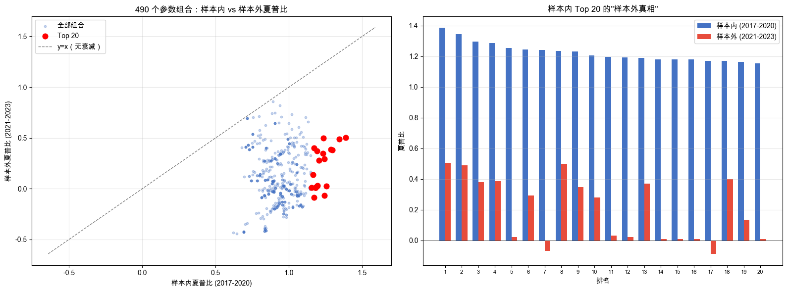
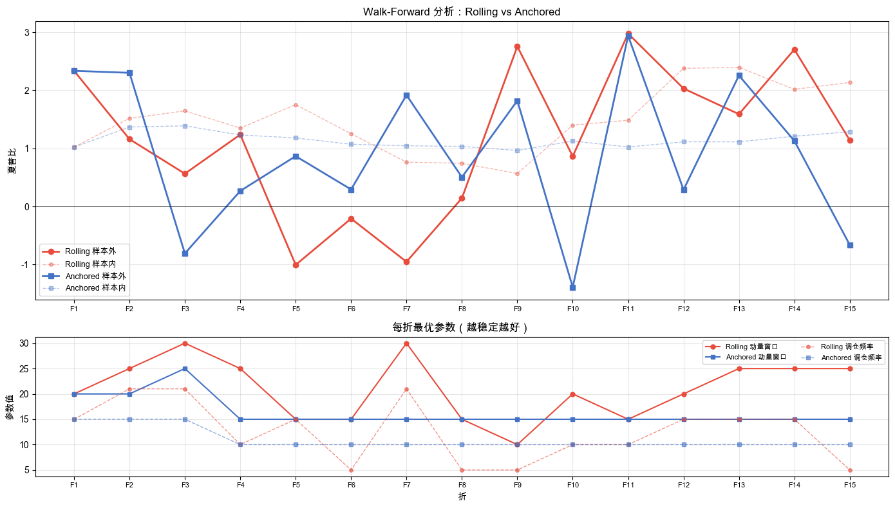
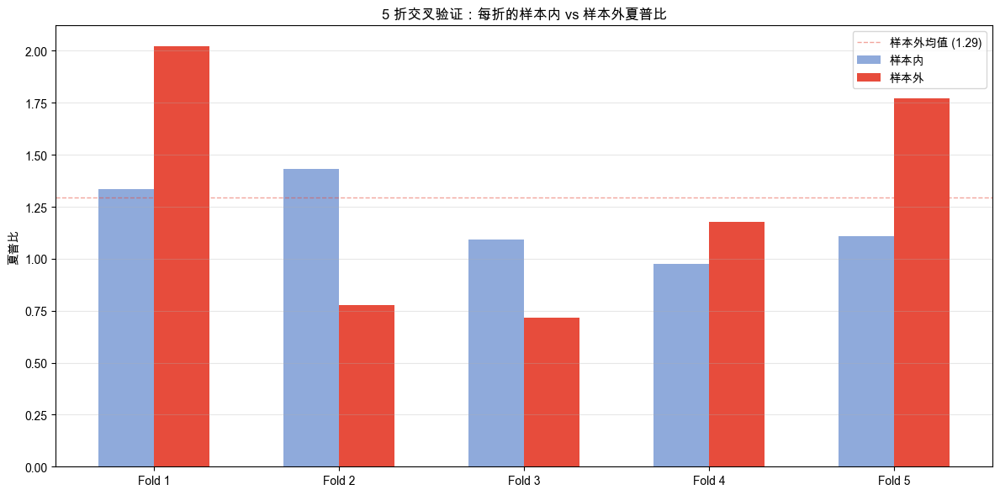
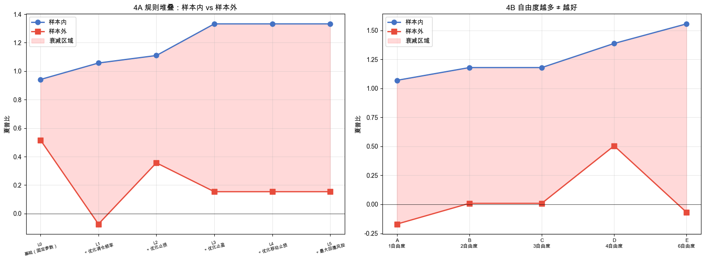

# 第六章：看清好看的回测：别被自己骗了

第五章我们给策略做了一次全面体检——基准对比、逐年拆解、收益分布、参数敏感性。现在手上有一套完整的评估方法论。

但所有体检结果都基于一个前提：**回测结果是真实的。**

真的吗？

回顾第五章的发现：TopNRanking 策略在 2021 年亏了 10%，换遍所有动量窗口都救不回来——这是动量策略的结构性弱点。但同样的策略在 2023-2025 的好市场上表现不错。这引出一个危险的念头：**如果我们在好市场上精心挑选参数，找到“收益最好”的组合，信心满满地投入资金——未来再遇到差市场会怎么样？**

回测可以调参数让收益翻倍——这是真的好，还是自欺欺人？

### 路线图

**选什么标的（第二章）→ 每个买多少（第三章）→ 什么时候买卖（第四章）→ 怎么验证有效（第五章）→ 如何避免自欺欺人（第六章）**

**这一章你仍在飞轮的“归因层”，但主练动作切到了“疑”——本书口号“做要规则、看要指标、还要怀疑你的指标”中“还要怀疑你的指标”，就是这一章要让你练成肌肉记忆的事。** 第一章你已经亲手撞过一次墙——参数扫描里“冠军”在样本外掉到水下；这一章我们给你**四把铲子**，让那种墙以后看见就能挖开：样本内/外、Walk-forward、交叉验证、规则负担。本章解决第五步——识别过拟合陷阱，学会检验策略的真实有效性。四步对应的问题与方法如表 6-1 所示。

**表 6-1 第六章四节问题与方法对照**

| 步骤 | 问题 | 方法 |
|------|------|------|
| Step 1 | 能不能找到收益最好的参数？ | 参数优化 + 样本内/样本外 |
| Step 2 | 市场在变，参数也该跟着变吧？ | Walk-forward 分析 |
| Step 3 | 一条路径够可靠吗？ | 交叉验证 |
| Step 4 | 规则越多回测越好——是好事吗？ | 规则负担 |

铁律不变：**先猜后验，数据说了算。**

（操作流程见前言“怎么使用这本书”。）

---

## 6.1 能不能找到收益最好的参数？

**和第一章 1.5 节的关系：** 第一章末尾你扫过 24 个一维参数（均线窗口），用 60-40 切分做样本外测试，已经撞过一次过拟合的墙。这一章接着上一次的脚印继续走——**同一种切法，但量级跃迁**：参数从 1 维涨到 4 维（动量 / 波动 / 调仓 / 止损），组合数从 24 涨到 490。维度多了之后，过拟合的样子会变什么样？这一节给你答案。

第五章用了默认参数——动量窗口 20 天、波动率窗口 20 天、调仓频率 10 天。但这些是随便选的，不是天经地义的。

直觉告诉我们：**多试几组参数，选收益最高的就行了。** 几百种组合里总有比默认值更好的吧？

这个想法太自然了。就像买手机——把市面上所有型号的参数列出来，逐项比较，选评分最高的那款。参数也一样，把所有组合都试一遍，选出表现最好的——这叫**参数优化**，也叫**网格搜索（Grid Search）**——一个参数组合就像是一个格子，挨个格子试一遍，总能找到最优解。

真的这么简单吗？试试看。

### 动手实验 1：参数优化与样本内/样本外

这个实验用到 open-xquant 的参数优化工具：`GridSearch`（网格搜索——把所有参数组合都试一遍）和 `WalkForward`（前推分析——模拟“边走边调”的真实场景）。

我们一起把这份 spec 写出来。这次重点看三件新东西：**维度跃迁**（从一维到四维参数）、**时段语义切分**（好市场挑参数 / 差市场验证）、**业务约束的可读字符串写法**。

#### 起草上下文 + 任务

第一章 1.5 节用一行“前 60% / 后 40%”切了一刀——这是结构性切分。这一节不一样：每段时间要带金融含义。

> **上下文**：本章探讨参数优化和过拟合。第五章看了默认参数（动量 20 / 波动率 20 / 调仓 10）的 plateau vs peak，但学员从没试过“从一堆参数里找最好的”。承接第五章的叙事——TopNRanking 在 2017-2020 好市场上参数选得好，2021 年差市场会怎么样？
>
> **任务**：在 `q6-avoid-overfitting.ipynb` 用 `oxq.optimize.GridSearch` 跑参数网格搜索，用样本内 / 样本外方法检验过拟合。

> 📌 **要点**：数据切分要带“市场含义”。第一章的 60/40 是按比例切的，这里换成“2017-2020 好市场 / 2021-2023 差市场”——后者把每段对应的市场行情说清楚，学员才能看懂“为什么是这两段”。**任何切分型 spec，起止日期都要四个全锁死（IS_START / IS_END / OOS_START / OOS_END），否则今年跑、明年跑切出来不一样，过拟合证据就站不住。**

#### 起草要求：维度跃迁与业务约束

第一章扫过 24 个一维参数（均线窗口）。这一节直接跳到 4 维——动量 / 波动率 / 调仓频率 / 止损阈值。

> **要求**：
>
> 1. 数据切割：样本内 `2017-01-01 ~ 2020-12-31`、样本外 `2021-01-01 ~ 2023-01-31`，四个端点全锁死
> 2. 用 `ParameterSet` 定义参数空间：动量 / 波动率窗口 `[10, 15, 20, 25, 30]`、调仓频率 `[5, 10, 15, 21]`、止损阈值 `[0.03, 0.05, 0.07, 0.10, 0.15, 0.20]`
> 3. 分两组跑：无止损组（3 维）+ 含止损组（4 维），约束后总组合数约 490
> 4. 业务约束用可读字符串写：`add_constraint("RebalanceFrequencyRule.interval_days <= mom.period")`、`<= vol.period`
> 5. 调仓频率不应超过信号窗口——这是领域知识，不是技术约束
> 6. 用 `GridSearch` 跑两组参数空间，在样本内、样本外各跑一次

> 📌 **要点**：维度跃迁后要分组管理。一维扫描随便扫，四维直接扫会爆——5×5×4×6 = 600 还要约束过滤。**分两组跑（无止损 70 组合 + 含止损 420 组合）既能控制总数，又能让止损这一维在结果里被单独看清——也为后面“规则负担”那一节埋了伏笔。**

> 📌 **要点**：业务约束用可读字符串，不要用 lambda。`"RebalanceFrequencyRule.interval_days <= mom.period"` 这种 DSL 字符串比 `lambda p: p["RebalanceFrequencyRule.interval_days"] <= p["mom.period"]` 更适合 0 基础学员看。**约束的“为什么”要写到 spec 注释里——“信号 20 天更新一次，调仓 60 天才看一次 = 在用过期信号做决策”——这是把领域知识嵌入 spec 的标准写法。**

#### 起草结果呈现

> **结果呈现**：
>
> 1. 打印 Top 20 表（按样本内夏普排名）+ 样本外对比 + 全局相关系数 + 衰减分布
> 2. 散点图（样本内 vs 样本外夏普，y=x 对角线虚线，Top 20 红色高亮）
> 3. Top 20 柱状图（每组双柱：样本内 / 样本外）
> 4. 总结打印按实际数据动态描述：Top 20 平均衰减、对角线下方点的占比、过拟合定义

完整 spec 在 [`specs/spec-01-parameter-optimization.md`](https://github.com/xingwudao/xquant-learning/blob/main/q6-avoid-overfitting/specs/spec-01-parameter-optimization.md)——复制给 AI，弹窗选「允许」。

AI 助手执行完毕后，你的 notebook 里应该出现了网格搜索的完整结果。我们来看看代码做了什么。

数据被切成了两段：**样本内（In-Sample）** 用 2017-2020 四年做优化，**样本外（Out-of-Sample）** 用 2021-2023 做验证。为什么选这么早的数据？因为样本内需要足够长（至少 3-4 年），才能覆盖牛熊周期，避免只在单一行情下调参。时间顺序也必须正确——先优化，后验证，就像真实投资中你只能用历史数据做决策，然后面对未来。

**样本内**就是你看着答案复习的模拟考试卷；**样本外**就是真正的考试——你从没见过的题目。

四个维度的参数组合——动量窗口 5 种 × 波动率窗口 5 种 × 调仓频率 4 种 × 止损阈值（有/无），加上约束过滤（调仓频率不能超过信号窗口——用过期信息做决策没有意义），最终产生 490 种有效组合。

`GridSearch` 把 490 种参数组合逐个跑回测，按夏普比排名。然后用同样的参数在样本外再跑一遍，看“真正的考试”成绩如何。

### 运行结果

490 种组合全部跑完，先看样本内 Top 20 的“样本外真相”——样本内夏普 Top 20 及其样本外表现（部分）如表 6-2 所示。

**表 6-2 样本内夏普 Top 20 及其样本外表现（部分）**

| # | mom | vol | freq | sl | 样本内夏普 | 样本外夏普 | 衰减 |
|---|-----|-----|------|----|-----------|-----------|------|
| 1 | 15 | 10 | 10 | 0.03 | 1.39 | 0.50 | -0.88 |
| 2 | 15 | 15 | 10 | 0.03 | 1.34 | 0.49 | -0.85 |
| 3 | 15 | 25 | 10 | 0.03 | 1.30 | 0.38 | -0.92 |
| 4 | 15 | 20 | 10 | 0.03 | 1.29 | 0.39 | -0.90 |
| 5 | 30 | 10 | 5 | 0.03 | 1.25 | 0.02 | -1.23 |
| 7 | 30 | 10 | 10 | 0.03 | 1.24 | -0.07 | -1.31 |
| 14 | 15 | 10 | 10 | 无 | 1.18 | 0.01 | -1.17 |

**样本内 Top 20 统计：** 样本内夏普均值 1.22（范围 1.15 ~ 1.39），样本外夏普均值 0.20（范围 -0.09 ~ 0.50），平均衰减 -1.02。

**全部 490 个组合统计：** 样本内/样本外夏普相关系数 0.04，样本外比样本内差的比例 100%，夏普衰减均值 -0.82、中位数 -0.88。

散点图与 Top 20 柱状图如图 6-1 所示。

### 结果解读

第一个认知升级：**参数优化是一把双刃剑。**

先看数字。样本内 Top 20 的平均夏普 1.22——这在量化里属于很拿得出手的成绩。但拿到样本外（2021-2023，没见过的数据），平均夏普跌到了 0.20。衰减了 83%。

再看散点图。每个点代表一种参数组合，对角虚线是“样本外 = 样本内”的理想状态。如果所有点都在对角线上，说明样本内的好成绩在样本外也能兑现。但现实是：**100% 的点都在对角线以下**——没有一种参数组合的样本外表现达到样本内水平。

更扎心的是：样本内夏普和样本外夏普的相关系数只有 0.04——几乎没有关系。样本内排名第一的组合，样本外并不一定最好。

这就是**过拟合（Overfitting）**——你的策略只会死读书，课后习题全都会做，结果高考考砸了。它“记住了”过去数据的特征（噪音），而不是发现了真正的规律。

柱状图更直观：蓝色柱子（样本内）高高在上，红色柱子（样本外）矮了一大截。有些组合样本外甚至为负——在“真正的考试”中亏了钱。

**数据说了算：参数优化后，必须在没见过的数据上验证。样本内的好成绩不算数。**

**这就是第一把铲子：样本内 / 样本外切分。** 它不能直接帮你赚钱——但它能让你在第一时间看到“漂亮回测背后到底有没有真东西”。第一章那次“被自己骗”的肉身记忆，到这里第一次有了一件可以挂在墙上的工具。

怎么办？我们把数据切成了“优化”和“验证”两段，只验证了一次。但只验证一次够吗？市场在变，参数也该跟着变吧？

---

## 6.2 市场在变，参数也该跟着变吧？

Step 1 把数据切成了“优化”和“验证”两段，发现了过拟合问题。但我们只切了一次、只验证了一次。

市场每年都在变。2020 年选的参数，2023 年还适用吗？能不能模拟“每隔一段时间重新优化参数”的过程？

直觉告诉我们：**市场每年不一样，参数当然应该定期更新。** 用最近的数据重新优化，应该比死守一组参数更好。

这个想法叫 **Walk-forward（前推验证）分析**——“边走边调”。在历史数据上模拟“每隔一段时间重新优化参数”的过程：用过去两年数据选参数，在接下来半年验证；然后窗口往前滑半年，再选参数、再验证……如此反复。

有两种滑动方式：

- **滚动式（Rolling）**——固定数据窗口宽度，窗口左边位置不断往右移动。好处是只看最近的市场，坏处是丢弃了更早的数据。就像只翻最近两年的课本复习
- **锚定式（Anchored）**——固定数据窗口左边位置，窗口宽度不断拉长。好处是利用了所有历史数据，坏处是旧数据可能不再适用。就像从高一课本开始全部复习

试试看——用两种不同的方式“边走边调”。

### 动手实验 2：Walk-forward 分析

我们一起把这份 spec 写出来。这次重点看两件新东西：**循环型 spec 的端点全锁**（窗口起止 + 长度 + 步长四个参数都不留浮动）、**对照实验式 spec 的并列结构**（让 Rolling / Anchored 自己跑出对比）。

#### 起草上下文 + 任务

> **上下文**：在 `q6-avoid-overfitting.ipynb` 中已有 490 个组合的网格搜索结果 + 样本内/样本外对比，过拟合现象已暴露。当前问题：数据只切了一次。市场在变，2023 年选的参数 2025 年还适用吗？能不能模拟“定期重新优化”的过程？
>
> **任务**：在 notebook 新建单元格，用 `oxq.optimize.WalkForward` 实现 Walk-forward 分析，对比 Rolling 和 Anchored 两种方式。

#### 起草要求：循环窗口的四个端点

循环型 spec 比单次 spec 脆弱得多——单次 spec 漏掉一个日期可能没事，循环型 spec 漏掉就会让“折数”在不同时间跑出不同结果。

> **要求**：
>
> 1. 复用 Step 1 的参数空间（无止损组 70 组合）和约束（`RebalanceFrequencyRule.interval_days <= mom.period` / `<= vol.period`）
> 2. 数据范围：`DATA_START="2017-01-01"` 到 `ANALYSIS_END="2026-05-06"`——四个端点全锁死，不要用 `pd.Timestamp.now()`
> 3. Rolling Walk-forward：训练窗口 `"2Y"`、测试窗口 `"6M"`、`anchored=False`
> 4. Anchored Walk-forward：同上，`anchored=True`（训练窗口从起点不断扩大）
> 5. `train_period="2Y"` 的依据：覆盖一个完整中期周期；`test_period="6M"` 的依据：足够长以观察策略表现，又足够短以让多个折落进数据范围

> 📌 **要点**：循环型 spec 的窗口端点要四个全锁死——**起始日 + 结束日 + 窗口长度 + 步长**。漏掉任何一个，折数都会随时间漂移。如果用 `pd.Timestamp.now()` 当结束日，半年后跑出来折数从 15 变成 16，参数稳定性的结论可能就反过来了。**任何带 `for` 循环的 spec 都要回头检查这四个端点。**

> 📌 **要点**：循环窗口的“为什么”也要写。`"2Y" / "6M"` 不是随手挑的——背后有“覆盖一个完整中期周期”和“折数 ≥ 5 才有统计意义”两个判断。**领域知识里的窗口长度选择，跟参数选择本身一样重要——把判断写进 spec 注释，别让 AI 揣摩。**

#### 起草结果呈现

> **结果呈现**：
>
> 1. 用 `to_dataframe()` 打印每折详情：训练时段、验证时段、最优参数、样本内/样本外夏普
> 2. 汇总：`oos_sharpe_ratio()`、`deterioration()`、各折参数集合
> 3. 对比图（figsize 14×6，上下两栏）：上栏每折样本外夏普（Rolling 红 / Anchored 蓝两条线），下栏参数稳定性线图（mom.period / interval_days 各折取值）
> 4. 标题「Walk-forward 分析：Rolling vs Anchored」
> 5. 打印分析按实际数据动态描述：Anchored 是否锁定参数、Rolling 是否乱跳、衰减对比

完整 spec 在 [`specs/spec-02-walk-forward.md`](https://github.com/xingwudao/xquant-learning/blob/main/q6-avoid-overfitting/specs/spec-02-walk-forward.md)——复制给 AI，弹窗选「允许」。

AI 助手执行完毕后，你的 notebook 里应该出现了 Rolling 和 Anchored 两种 Walk-forward 的完整结果。

训练窗口 2 年，验证窗口 6 个月。每次用 2 年数据选出最优参数，在接下来 6 个月验证。然后窗口滑动，重复这个过程。最终得到 15 折结果——15 次“选参数 → 验证”的记录。

### 运行结果

两种方式的对比如表 6-3 所示。

**表 6-3 Rolling vs Anchored 对比**

| 方式 | 样本外夏普 | 衰减 | 唯一参数组合 |
|------|-----------|------|-------------|
| Rolling | 0.14 | -36.2% | 7/15 |
| Anchored | 0.13 | -23.5% | 5/15 |

Anchored 参数更稳定。

关键发现：Rolling 在 15 折（每次滑动算一折，一共滑了 15 次）中选了 7 种不同的参数组合——平均两折就换一种。而 Anchored 只有 5 种，且其中 7 折选了相同的参数（动量窗口 20、波动率窗口 15、调仓频率 5）——单一组合占了近一半折数。

Anchored 的逐折参数一览如表 6-4 所示。

**表 6-4 Anchored Walk-forward 逐折参数与样本外夏普**

| Fold | mom | vol | freq | 样本外夏普 |
|------|-----|-----|------|-----------|
| 1 | 15 | 15 | 5 | 2.50 |
| 2 | 15 | 15 | 5 | 0.71 |
| 3 | 20 | 15 | 5 | -0.13 |
| 4 | 15 | 10 | 5 | 0.68 |
| 5 | 30 | 15 | 5 | -2.49 |
| 6 | 20 | 15 | 5 | -1.83 |
| 7 | 20 | 15 | 5 | 1.42 |
| 8 | 20 | 15 | 5 | -0.67 |
| 9 | 20 | 15 | 5 | 1.91 |
| 10 | 20 | 15 | 5 | -1.75 |
| 11 | 30 | 15 | 5 | 1.99 |
| 12 | 20 | 20 | 5 | 1.22 |
| 13 | 30 | 15 | 5 | 1.23 |
| 14 | 20 | 15 | 5 | 1.31 |
| 15 | 30 | 15 | 5 | 0.98 |

（mom=20, vol=15, freq=5）这组参数前后出现了 7 次，是 Anchored 的最频繁选择。其余四种组合——（15, 15, 5）、（30, 15, 5）、（15, 10, 5）、（20, 20, 5）——各出现 1 到 4 次。换句话说：动量窗口在 15-30 之间换、波动率窗口大多停在 15、调仓频率 15 折全选 5。Rolling 的波动更宽——动量窗口在 15-30 之间跳、波动率窗口从 10 一直到 30，没有明确偏好。

每折样本外夏普走势与参数稳定性对比如图 6-2 所示。

### 结果解读

第二个认知升级：**参数稳定性比参数最优更重要。**

先看上图。两条实线是样本外夏普——Rolling（红色）和 Anchored（蓝色）都有起伏，但起伏的方向大体一致。下图更关键：Rolling 的参数线在 mom=15-30、vol=10-30 间跳来跳去，Anchored 的两条线被压在更窄的区间内（mom 多在 20、vol 多在 15）。

**参数稳定性（Parameter Stability）**——好的参数组合应该在不同时间窗口中保持一致。如果每换一个窗口参数就变，说明“最优参数”取决于你看哪段市场，这个参数可能只是在拟合噪音。

Anchored 在 15 折中 7 折都选了（mom=20, vol=15, freq=5）这一组——15 次里 7 次是同一个答案；剩下的折在四组里跳，但波动率窗口大多稳在 15、调仓频率 15 折全是 5。不管训练集从 2 年扩大到 9 年，参数选择都被限制在一个窄区间——这是一个好信号。而 Rolling 在 15 折里选出 7 种不同组合，每两折就换一次，说明它在追逐短期市场特征，而不是捕捉长期规律。

样本内到样本外的衰减比例：Rolling 衰减 36.2%，Anchored 衰减 23.5%。Anchored 衰减更小，因为它用了更多数据训练，不容易被噪音骗。

Walk-forward 的核心价值：不是找到一个“永远最优”的参数，而是检验你的优化方法在历史上是否靠谱。如果历史上每次优化后验证都不错，你对下一次优化会更有信心。

**数据说了算：参数稳定 = 更可信。如果最优参数总在变，你怎么知道现在选的参数下个月还是最优？**

**这就是第二把铲子：Walk-forward。** 它把“换段时间还稳定吗”从一种焦虑变成了一项可以滚动跑的检查——参数稳定的策略你可以拿得动，参数到处变的策略你可以早早放弃。

但 Walk-forward 只用了一种切法——如果数据切的方式不同，结论还一致吗？

---

## 6.3 一条路径够可靠吗？

Walk-forward 模拟了“边走边调”，但我们只用了一种切法。如果换一种切数据的方式，结论还一样吗？

做科学实验有个基本原则：**一次实验不够，要重复多次。** 只做一次实验就下结论，可能只是碰巧。同样的道理——只验证一次（Step 1）或只用一种切法（Step 2）都不够可靠。

直觉告诉我们：**好策略不管怎么切都好。** 如果 5 次验证里 4 次都选了同样的参数，比只验证 1 次可信得多。

这就是**交叉验证（Cross Validation）**——用多种数据切分方式验证同一个策略，看结论是否一致。

但金融数据有一个特殊的限制，先用一个生活类比说清楚：**做菜可以“先看明天的菜单再决定今天买什么菜”——但炒股不行**，因为你今天根本不知道明天会发生什么。

把这个限制翻译成两个量化术语：

- **时间序列属性（Time-Series Nature）** —— 金融数据有先后顺序：今天比昨天晚发生，比明天早发生。顺序不能打乱。
- **时间穿越 / 数据泄露（Look-Ahead Bias / Data Leakage）** —— 在训练或验证时，不小心让模型“看到了未来”。比如本应该用 2020 年的数据训练，结果你混了一点 2024 年的数据进来——这等于让你的策略在考试前“偷看了答案”，回测会异常漂亮，但放到实盘上一笔笔真金白银地亏。

所以做交叉验证时**每折必须保持时间顺序**——这就是 **时间序列分割（Time-Series Split）**：训练集永远在测试集之前，绝不让“未来”出现在“过去”的训练里。

试试看。

### 动手实验 3：交叉验证

我们一起把这份 spec 写出来。这次重点看两件新东西：**时序切分而非随机切分**（金融数据的硬约束）、**接续型 spec 的减法**（不复述前面已经讲过的概念，专心做一件新事）。

#### 起草上下文 + 任务

> **上下文**：在 `q6-avoid-overfitting.ipynb` 中已有参数优化 + Walk-forward 分析。Walk-forward 只用了一种切法——如果换一种切法，结论还一样吗？一次验证和多次验证，可信度差多少？
>
> **任务**：在 notebook 新建单元格，用 `oxq.optimize.TimeSeriesCV` 实现时间序列交叉验证。

#### 起草要求：时序切分的硬约束

> **要求**：
>
> 1. 复用 Step 2 的参数空间和约束（无止损组 70 组合）
> 2. 数据范围：`DATA_START="2017-01-01"` 到 `ANALYSIS_END="2026-05-06"`——与 Step 2 同步锁死，保证 5 折切分点在任何时间跑都一致
> 3. 用 `oxq.optimize.TimeSeriesCV`（不是 sklearn 的 `KFold`）：`n_splits=5`、`expanding=True`
> 4. 传入 `paramset`，让 `cross_validate()` 自动在每折训练集上做 GridSearch
> 5. `n_splits=5` 的依据：ML 教科书默认值，7 年数据上每折约 1.4 年验证集，足够长
> 6. `expanding=True` 的依据：训练集逐折扩大——Step 2 的 Anchored 比 Rolling 更稳定，本步跟随该结论

> 📌 **要点**：金融数据要用时序切分，不能用随机切分。普通 ML 用 sklearn 的 `KFold` 是随机切的（可设 `random_state`）；金融场景必须用 `TimeSeriesSplit`——**训练集永远在测试集之前，绝不让“未来”出现在“过去”的训练里**。否则就是把答案偷给了考试中的你——回测看起来漂亮，实盘上一笔笔真金白银地亏，是这条硬约束最常见的代价。这是 q6 比通用 ML 课程多出的一条硬约束。

> 📌 **要点**：接续型 spec 应该做减法。spec-03 比 spec-01 / spec-02 都短得多——它不重新定义参数空间（直接复用 Step 2 的 `wf_paramset`）、不重讲一次什么是过拟合，专心做“5 折结果对比”一件事。**承接型 spec 应当克制重复——前面 spec 讲过的就别再讲；只引入本 spec 真正新的东西。**

#### 起草结果呈现

> **结果呈现**：
>
> 1. 用 `cv_result.to_dataframe()` 打印汇总表，再 for 循环逐折打印（训练时段、验证时段、最优参数、样本内/样本外夏普、样本外收益）
> 2. 汇总：`mean_oos_metric()` ± `std_oos_metric()` + 范围 [min, max] + 唯一参数组合数
> 3. 柱状图（figsize 12×6）：每折样本内 / 样本外夏普双柱 + 样本外均值水平线
> 4. 标题「5 折交叉验证：每折的样本内 vs 样本外夏普比」
> 5. 打印分析按实际数据动态描述：5 折中几折选了相同参数、变异系数大小、与 Step 2 Anchored 结论是否一致

完整 spec 在 [`specs/spec-03-cross-validation.md`](https://github.com/xingwudao/xquant-learning/blob/main/q6-avoid-overfitting/specs/spec-03-cross-validation.md)——复制给 AI，弹窗选「允许」。

AI 助手执行完毕后，你的 notebook 里应该出现了 5 折交叉验证的完整结果。

`TimeSeriesCV` 把数据切成 5 折。每折用前面的数据训练（训练集逐渐扩大），紧跟着的一段做验证。每折都独立做网格搜索——选出该折的最优参数，再到验证集上检验。

### 运行结果

5 折交叉验证的逐折详情如表 6-5 所示。

**表 6-5 5 折交叉验证逐折详情**

| Fold | 训练时段 | 验证时段 | 最优参数 | 样本内夏普 | 样本外夏普 | 样本外收益 |
|------|----------|----------|----------|-----------|-----------|-----------|
| 1 | 2017-01-01 ~ 2018-07-22 | 2018-07-23 ~ 2020-02-11 | mom=15, vol=15, freq=5 | 0.87 | 0.69 | 14.37% |
| 2 | 2017-01-01 ~ 2020-02-11 | 2020-02-12 ~ 2021-09-02 | mom=15, vol=10, freq=5 | 0.72 | 0.44 | 10.82% |
| 3 | 2017-01-01 ~ 2021-09-02 | 2021-09-03 ~ 2023-03-25 | mom=20, vol=15, freq=5 | 0.66 | 0.28 | 4.33% |
| 4 | 2017-01-01 ~ 2023-03-25 | 2023-03-26 ~ 2024-10-14 | mom=20, vol=15, freq=5 | 0.53 | 1.56 | 37.83% |
| 5 | 2017-01-01 ~ 2024-10-14 | 2024-10-15 ~ 2026-05-06 | mom=20, vol=20, freq=5 | 0.72 | 1.79 | 67.22% |

**TopNRanking CV 汇总：** 样本外夏普 0.95 ± 0.68，样本外范围 [0.28, 1.79]，唯一参数组合 4/5。

5 折中 Fold 3 与 Fold 4 选择了相同的参数（mom=20, vol=15, freq=5），其余三折各不相同——这组结果该怎么读？

每折样本内 vs 样本外夏普对比如图 6-3 所示。

### 结果解读

第三个认知升级：**多次验证比单次验证更可靠。**

先看参数一致性。5 折里只有 Fold 3 和 Fold 4 选了同一组参数（mom=20, vol=15, freq=5），其余三折各不相同——单看 5 折，共识不算强。但有意思的是：这组（mom=20, vol=15, freq=5）也正是 Step 2 里 Anchored Walk-forward 在 15 折里出现 7 次的最频繁参数。两种独立的切法（一种 15 折滑动、一种 5 折时序切分）都把概率最高的位置指向了同一组参数——切法换了，结论没变。

再看表现波动。样本外夏普的范围从 0.28 到 1.79，标准差 0.68。变异系数（标准差/均值）约为 0.72，仍小于 1——说明样本外表现整体相对一致，但波动不容忽视：最好的折（1.79）比最差的折（0.28）高了 6 倍以上。参数对了不代表什么时候都有正收益——策略对市场环境仍然敏感。

交叉验证的价值不是给你一个“最优参数”，而是告诉你**你的参数选择有多可靠**。5 折下来如果共识强，可以更有信心；共识弱，就该接受“参数选择本身有不确定性”，而不是盯着某一折的结果。

**数据说了算：多次验证给出更立体的画像——共识强可以更进一步，共识弱就该承认不确定性。即使参数对了，也别期望每年都有正收益。**

**这就是第三把铲子：交叉验证。** 它让你在多种切法下独立验证同一个结论——一次可能是巧合，多次都指向同一个答案就更可信。前两把铲子告诉你“是不是过拟合”，这一把告诉你“你有多大把握”。

到这里，我们从三个角度检验了参数选择——一次验证（Step 1）、动态验证（Step 2）、多次验证（Step 3）。但还有一种过拟合更隐蔽：不是参数选错了，而是**规则太多了**。

---

## 6.4 规则越多回测越好——是好事吗？

前三步检验的都是参数选择——找参数、更新参数、换切法验证参数。但还有一种过拟合更隐蔽。

回顾第四章：我们给策略加了止损、止盈、移动止损等交易规则。当时的结论是“不是所有规则都有用”。但那时我们没有做样本内/样本外验证。如果在样本内不断加规则、调参数，回测收益一路上升——这是真的在改进策略，还是只是在“凑”出好看的数字？

直觉告诉我们：**规则越多保护越全面，效果应该越好。** 止损防亏损、止盈锁利润、移动止损跟踪趋势——每一条都有道理。

真的吗？试试看——从最简单的策略开始，一层一层加规则，看样本内和样本外分别怎么变。

### 动手实验 4：规则负担

我们一起把这份 spec 写出来。这次重点看两件新东西：**规则数的定义**（“规则数”和“自由度”是两个不同的轴）、**业务约束链的金融语义**（止损 < 止盈 / 移动止损 ≥ 固定止损 / 回撤 ≥ 止损都是领域知识）。

#### 起草上下文 + 任务

> **上下文**：在 `q6-avoid-overfitting.ipynb` 中已有参数优化 + Walk-forward + 交叉验证。前三步检验“参数选得对不对”。本步检验另一种过拟合——规则太多。每加一条规则，就多了一个可调旋钮；旋钮越多，越容易在样本内“调出”好看的结果。
>
> **任务**：在 notebook 新建单元格，做两个堆叠实验展示规则负担。

#### 起草要求：4A 规则堆叠 + 4B 自由度堆叠

把“加规则”和“加自由度”分两个实验跑，**学员才能看出“是规则本身的问题还是自由度的问题”**。

> **要求**：
>
> 1. 编写 `run_layer(layer_name, rules, paramset, description)` 辅助函数，复用 Step 1 的样本内/外切分
> 2. **4A 规则堆叠**（6 层）：基础策略 mom=20/vol=20/freq=10 固定，逐层添加交易规则
>    - Layer 0：基础策略（无额外规则）
>    - Layer 1：+ 优化调仓频率
>    - Layer 2：+ 优化止损
>    - Layer 3：+ 优化止盈（约束 sl < tp）
>    - Layer 4：+ 优化移动止损（约束 trail >= sl）
>    - Layer 5：+ 最大回撤风控（约束 max_dd >= sl）
> 3. **4B 自由度堆叠**（5 配置）：从 1 自由度逐步加到 6 自由度
>    - A：仅动量窗口（1 自由度）
>    - B：+ 波动率（2）
>    - C：+ 调仓频率（3）
>    - D：+ 止损阈值（4）
>    - E：+ 止盈 + 移动止损（6 自由度，粗网格 [10,20,30] 防止组合数爆炸）
> 4. 每层在样本内选最优 → 在样本外验证
> 5. 约束链按金融语义编码：止损 < 止盈、移动止损 ≥ 固定止损、回撤阈值 ≥ 止损

> 📌 **要点**：q6 第一次显式区分“规则数”和“自由度”两个轴。**4A 数的是“加了几条交易规则”**（止损是一条规则，即便它只有一个 threshold 参数）；**4B 数的是“有几个可优化的旋钮”**（一条规则可能贡献 1 个或多个自由度）。两个轴不一样——通用 ML 课程很少这么分，但金融领域必须分：止损是一条独立的业务规则，它在 4A 里占一层；但它的 threshold 在 4B 里只贡献 1 自由度。**学员看到两个实验的曲线分别走出 plateau 拐点，才能确认“既不是规则数的问题，也不是单纯自由度的问题，是两者都到了 plateau”。**

> 📌 **要点**：业务约束链要用金融语义，不是技术约束。`sl < tp`（止损不能高于止盈，否则止损永远先触发）、`trail >= sl`（移动止损不能比固定止损更严，否则后者无意义）、`max_dd >= sl`（组合层风控阈值不应小于个仓止损，否则单仓止损还没触发组合就停了）——三组约束本身就是领域知识。**spec 里的约束链 = 嵌入领域知识的标准位置；学员看 spec 学的不只是参数，还有“为什么这些参数之间该有先后关系”。**

#### 起草结果呈现

> **结果呈现**：
>
> 1. 两张汇总表：4A 六层 + 4B 五配置（含自由度、组合数、样本内/样本外夏普、衰减）
> 2. 两张图（各 figsize 12×6，双折线）：4A「规则堆叠：样本内 vs 样本外」+ 4B「自由度越多 ≠ 越好」
> 3. 打印分析按实际数据动态描述：4A 找出“超过这一层的规则都是规则负担”的最佳层、4B 找“自欺欺人开始”的拐点
> 4. 引用 Brian Peterson 两段原话：「Rule burden is a form of overfitting」+「Too many rules will make a backtest look excellent in-sample, and may even work in walk forward analysis, but are very dangerous in production.」

完整 spec 在 [`specs/spec-04-rule-burden.md`](https://github.com/xingwudao/xquant-learning/blob/main/q6-avoid-overfitting/specs/spec-04-rule-burden.md)——复制给 AI，弹窗选「允许」。

AI 助手执行完毕后，你的 notebook 里应该出现了两组实验的完整结果。

**4A：逐层添加规则。** 从最简单的基础策略出发，每层多加一条规则，每层都在样本内做优化。约束条件先把不合理的组合（比如止损大于止盈、移动止损小于固定止损）过滤掉——剩下的层差异才不会被荒谬组合污染。

**4B：逐步增加参数维度。** 从只调 1 个参数（动量窗口）开始，逐步增加可调参数的数量。**自由度（Degrees of Freedom）**——可以调节的参数和规则的数量。自由度越多，优化器的“调节空间”就越大。

### 运行结果

4A 规则堆叠的样本内/样本外表现如表 6-6 所示。

**表 6-6 4A 规则堆叠：每层规则的样本内/样本外夏普与衰减**

| Layer | 描述 | 组合数 | 样本内夏普 | 样本外夏普 | 衰减 |
|-------|------|--------|-----------|-----------|------|
| 0 | 基础（固定参数） | 1 | 0.94 | 0.52 | -0.43 |
| 1 | + 优化调仓频率 | 3 | 1.06 | -0.07 | -1.13 |
| 2 | + 优化止损 | 18 | 1.11 | 0.36 | -0.75 |
| 3 | + 优化止盈 | 57 | 1.33 | 0.15 | -1.18 |
| 4 | + 优化移动止损 | 183 | 1.33 | 0.15 | -1.18 |
| 5 | + 最大回撤风控 | 825 | 1.33 | 0.15 | -1.18 |

4B 指标堆叠（按可优化的自由度分档）的对比如表 6-7 所示。

**表 6-7 4B 指标堆叠：自由度递增下的样本内/样本外夏普**

| 配置 | 自由度 | 组合数 | 描述 | 样本内夏普 | 样本外夏普 | 衰减 |
|------|--------|--------|------|-----------|-----------|------|
| A | 1 | 5 | 动量窗口 | 1.07 | -0.17 | -1.24 |
| B | 2 | 25 | + 波动率窗口 | 1.18 | 0.01 | -1.17 |
| C | 3 | 70 | + 调仓频率 | 1.18 | 0.01 | -1.17 |
| D | 4 | 420 | + 止损阈值 | 1.39 | 0.50 | -0.88 |
| E | 6 | 323 | + 止盈 + 移动止损 | 1.56 | -0.07 | -1.62 |

随层数 / 自由度增加，样本内一路向上、样本外却平甚至下降，对比如图 6-4 所示。

### 结果解读

第四个认知升级：**规则越多 != 策略越好，简单就是美。**

这是本章最重要的认知冲击。

先看 4A。样本内夏普从 Layer 0 的 0.94 爬升到 Layer 3 的 1.33——每加一条规则，优化器都能在样本内找到更好看的结果。但样本外呢？Layer 0 （基础策略，完全没有额外规则）的样本外夏普是 0.52——这是所有层中最高的！加了调仓频率优化后（Layer 1），样本外直接变成了 -0.07。止损（Layer 2）挽回了一些（0.36），但之后的止盈、移动止损、回撤风控全部无效——样本外停在 0.15 不再提升。

注意 Layer 3-5 三行的样本内、样本外、衰减数字一字不差（IS 1.33 / OS 0.15 / 衰减 -1.18）——这不是抄错。Layer 3 引入了 `sl < tp`、Layer 4 又叠 `trail >= sl`、Layer 5 再叠 `max_dd >= sl`，三条约束把搜索空间一层层锁死。再增加的旋钮被前面的约束吃掉，最后什么都调不动。**这是规则负担的另一面：旋钮多了，相互之间的约束也多，优化器其实根本没机会真正“利用”那几个新自由度。**

也就是说：最简单的基础策略，反而是样本外表现最好的。

再看 4B。从配置 D 到配置 E，自由度从 4 增加到 6，样本内夏普从 1.39 升到 1.56（好了 12%），但样本外从 0.50 跌到 -0.07——**自欺欺人的拐点**出现了。多出来的两个参数让优化器在样本内找到了更好看的结果，但在样本外完全不兑现。

为什么会这样？每条新规则都增加一个**自由度**——可以调节的旋钮。旋钮越多，优化器就有越多的空间去“凑”出好看的回测结果。这不是在发现真规律，而是在记忆噪音。这就是**规则负担（Rule Burden）**——规则本身就是一种过拟合的来源。规则太多会让回测看起来很漂亮，甚至在前推验证中也可能过关，但放到实盘就很危险。

这个判断不是我们一拍脑袋——R 语言量化框架 quantstrat 的作者 Brian Peterson 早就说过：“规则负担本身就是一种过拟合（Rule burden is a form of overfitting）。规则太多会让回测在样本内异常漂亮，甚至在前推验证里也能过关，但放到实盘就非常危险。”每条规则都是给优化器多一个旋钮——旋钮越多，凑出好看回测的余地就越大，对真实未来的把握反而越小。

**铁律：能用 2 个参数解决的问题，不要用 6 个。每增加一条规则，都要问——样本外也改善了吗？如果没有，删掉它。少即是多。**

**这就是第四把铲子：规则负担。** 它告诉你少即是多——不是“加规则越多策略越好”，而是“每加一条规则都要在样本外验证它真的帮上忙”。这把铲子和前三把不同：前三把帮你检查已有的策略，这一把帮你**在设计阶段就少挖坑**。

---

## 6.5 回头看：你刚才做了什么？

**6.5 是“做”——四把铲子的操作流程总图，把四步实验铺成你以后每次接到一份回测都能照着走的检查路径。** 四步下来，我们从四个角度回答了同一个核心问题——“这个参数组合是真的好，还是运气好？”

- **Step 1: 参数优化** → 490 种组合，样本内很好 → 样本外全面衰减 → 过拟合
- **Step 2: Walk-forward** → 模拟“边走边调” → 参数稳定才可信
- **Step 3: 交叉验证** → 5 折独立验证 → 共识强可以更进一步，共识弱就该承认不确定性
- **Step 4: 规则负担** → 规则越多样本内越好 → 样本外不买账 → 简单就是美

从今以后，拿到任何策略的回测结果，可以用一套防过拟合检查清单核对一遍真实性，如表 6-8 所示。

**表 6-8 防过拟合检查清单**

| 检查项 | 怎么做 | 好的信号 | 坏的信号 |
|--------|--------|----------|----------|
| 样本外验证 | 在没见过的数据上跑 | 衰减小 | 衰减大 |
| Walk-forward | 分窗口优化+验证 | 参数跨窗口稳定 | 参数每次都变 |
| 交叉验证 | 多折验证 | 各折结果一致 | 各折差异巨大 |
| 规则负担 | 从简到繁，逐层加 | 样本外同步改善 | 样本内改善但样本外不变 |
| 参数敏感性（第五章） | 扫描参数 | 高原型 | 山峰型 |

加上第五章的参数敏感性，你手上已经有五把检验策略的武器。第一章那次“被自己的回测骗”的肉身记忆，到这里被沉淀成了一份可以挂在墙上的检查清单——这就是“疑”从感觉变成方法的过程，也是飞轮归因层在你手里第一次完整闭环的一小步。下次再接到一份“漂亮”的回测，你不会再赤手空拳，而是知道该问哪几个问题、用哪几把铲子去挖。

更重要的是：这四把铲子不只是让你“能识破自己的过拟合”，它们也让你**敢于做更激进的策略实验**——因为你知道有工具可以兜住底。怀疑回测不是为了畏手畏脚，是为了能放心动手。这就是“疑”和“做”在飞轮里的真正关系：**疑得越深，做得越敢。**

---

## 6.6 本章总结

**6.6 是“概念速查 + 带走的问题”——和 6.5 严格分工：6.5 写“怎么做”，6.6 写“用到了什么 / 还有什么没回答”。**

### 策略进化路径

第五章产出：完整的策略评估方法论 + 体检清单 → Step 1: 参数优化（样本内很好但样本外衰减，过拟合） → Step 2: Walk-forward（模拟定期重新优化，参数稳定性） → Step 3: 交叉验证（多次验证更可靠，但表现差异大） → Step 4: 规则负担（规则/参数越多越危险，简单就是美） → 第六章产出：四把防身工具 + 防过拟合检查清单 + “怀疑回测”的态度

### 概念速查表

本章涉及的核心概念汇总如表 6-9 所示，方便随时回查。

**表 6-9 第六章核心概念速查**

| 概念 | 含义 | 类比 |
|------|------|------|
| 参数优化 / 网格搜索 | 把所有可能的参数组合都试一遍，选出表现最好的 | 从几千所大学里挑分数最高的 |
| 样本内（训练集） | 用来优化参数的那段数据 | 模拟考试的试题 |
| 样本外（测试集） | 用来验证参数的另一段数据，优化时没见过 | 真正的考试 |
| 过拟合 | 样本内表现很好但样本外大幅衰减 | 背了真题成绩好，但没学会真知识 |
| Walk-forward 分析 | 在历史上模拟“定期重新优化”的过程 | 每学期重新选课本复习 |
| 滚动式 Walk-forward | 训练窗口固定大小，向前滑动 | 只翻最近两年的课本 |
| 锚定式 Walk-forward | 训练窗口从起点开始，越来越大 | 从高一课本开始全部复习 |
| 参数稳定性 | 好参数在不同窗口中保持一致 | 不管怎么考，你的强项科目都一样 |
| 交叉验证 | 用多种切法验证同一个策略 | 做实验要重复多次才可信 |
| 时间序列分割 | 保持时间顺序的交叉验证 | 不能用未来考题“复习”过去 |
| 规则负担 | 每条新规则增加过拟合风险 | 考试作弊手段越多，被抓的风险越大 |
| 自由度 | 可以调节的参数和规则数量 | 作弊的旋钮越多，越容易凑出高分 |

### 本章核心认知

走完四步实验后，本章最值得带走的八条认知如表 6-10 所示。

**表 6-10 第六章核心认知**

| 认知 | 来源 |
|------|------|
| 参数优化是双刃剑——优化后必须在新数据上验证 | Step 1 |
| 样本内的好成绩不算数 | Step 1 |
| 参数稳定性比参数最优更重要 | Step 2 |
| 好参数跨窗口稳定，坏参数到处变 | Step 2 |
| 多次验证比单次验证更可靠 | Step 3 |
| 不同验证方法指向同一个参数 → 可信度高 | Step 3 |
| 规则越多 != 策略越好 | Step 4 |
| 能用 2 个参数解决的问题，不要用 6 个 | Step 4 |

### 带走的问题

我们已经知道怎么评估策略（第五章）、怎么防过拟合（第六章）。回测世界的问题基本解决了。

但回测终究是模拟。在回测里，你可以按任何价格、在任何时间成交。真实世界里呢？

- 你想买的时候，市场上有足够的卖盘吗？
- 你下单到成交之间，价格会不会已经变了？
- 回测假设的手续费，和真实交易一样吗？

**从回测到实盘，还有多少坑在等着你？** → 第七章

**你在第一章撞过那堵墙，第五章手里有了体检表，这一章把怀疑变成了肌肉记忆。下面一章，回测的世界要让位给真实成交的世界——你将带着这四把铲子，走进实盘。**

> 本章所有代码的可运行版本见 `notebooks/q6-avoid-overfitting.ipynb`
