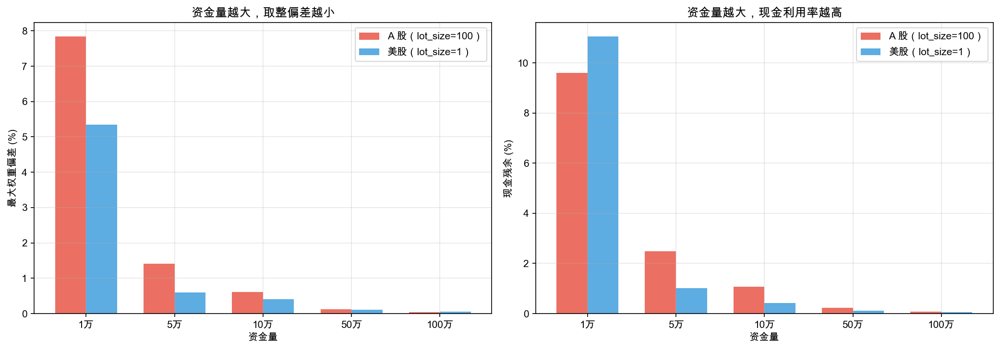
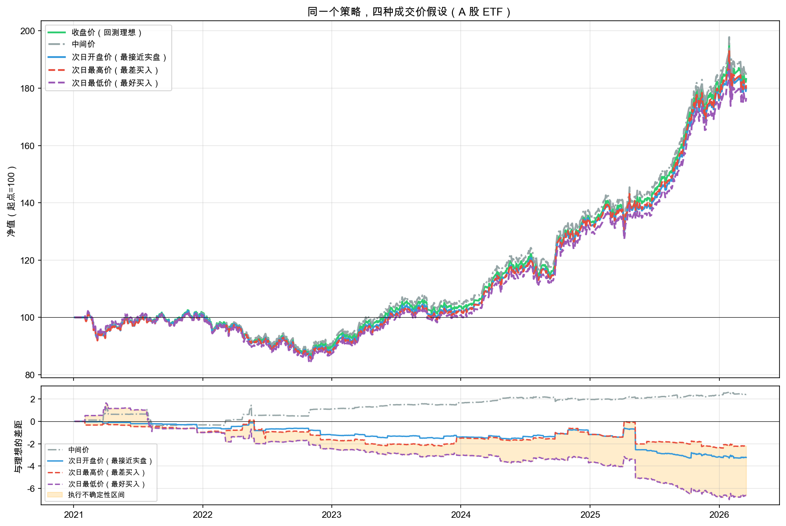
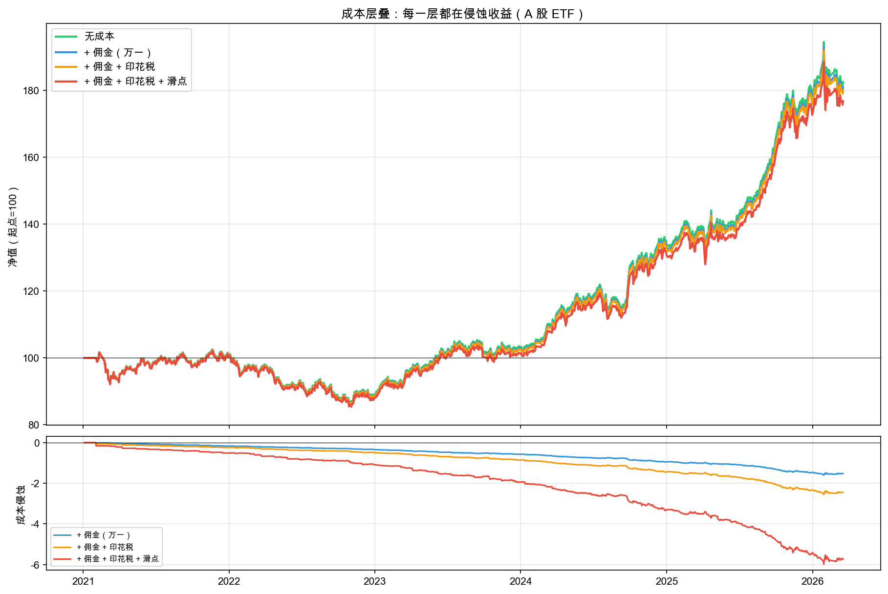
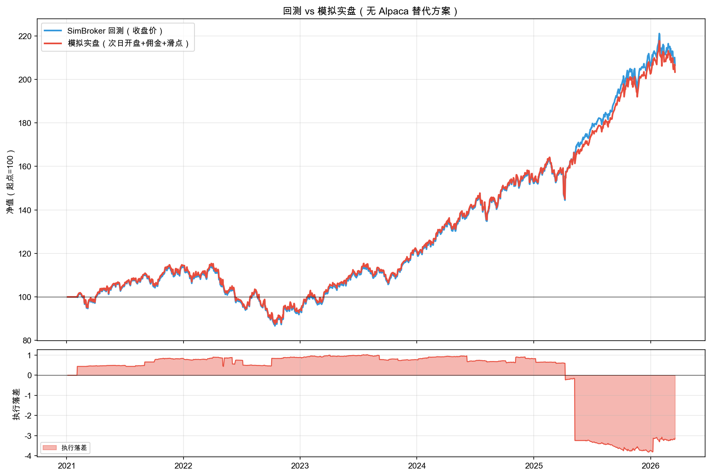
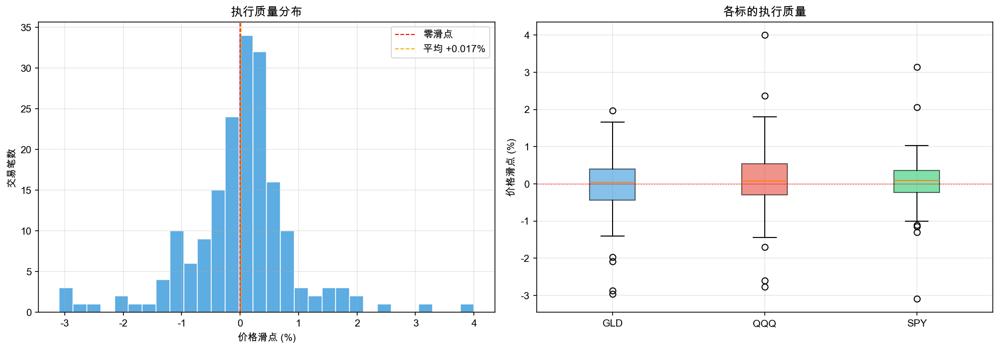

# 第七章：真的下单：跨到实盘

第六章你建立了一套完整的防线——参数优化、前推验证、交叉验证、规则负担检查。策略通过了所有考验，你信心满满。

**明天就去买！**

但打开券商 APP，你愣住了。策略说“沪深300ETF 权重 35%，纳指100ETF 权重 25%，黄金ETF 权重 40%”——可 APP 上只能输入股数和价格。35% 是多少股？按什么价格下单？

> **📌 小词典：券商 / 下单 / 成交价**
>
> - **券商** —— 你委托买卖股票的中介机构（类似机票代理人）。
> - **下单** —— 告诉券商“买/卖什么、多少股、什么价格”（把订单递给售票窗口）。
> - **成交价** —— 券商真正帮你买到 / 卖出时的价格（想 ¥4.27 买、实际成交 ¥4.30、差额就是滑点）。

回测引擎在内部用精确的浮点数分配权重——你以为回测结果就是实盘结果。但中间隔了一整条执行链：权重要翻译成股数，价格在不停变化，下单要花佣金和印花税，成交价和预期价格总有差距。这些差距不是抽象的——本章后面你会亲眼看到，仅仅因为成交价模式不同，同一笔策略最好和最差之间累计差出 6.64%；再叠加佣金 + 印花税 + 滑点，四年累计又被侵蚀 5.72%。这一章就是要看清这些“看不见的钱”都去哪了。

### 路线图

**选什么标的（第二章）→ 每个买多少（第三章）→ 什么时候买卖（第四章）→ 怎么验证有效（第五章）→ 如何避免自欺欺人（第六章）→ 如何真正执行（第七章本章）**

**这一章你跨进了飞轮的“执行层”——主练动作回到“做+看”：把“权重 → 订单 → 成交”这条执行链上的每一步都做成可重复的规则，再用执行报告“看”出回测和实盘之间的差距。** 本章从“迫不及待想操作”的状态出发，在操作中暴露四个问题，四步对应的方法如表 7-1 所示。

**表 7-1 第七章四步问题与方法对照**

| 步骤 | 问题 | 方法 |
|------|------|------|
| Step 1 | 35% 是多少股？ | 目标权重 → 具体订单 |
| Step 2 | 价格变了怎么办？ | 成交价压力测试 + 成本层叠 |
| Step 3 | 回测 vs 实盘，差距有多大？ | Alpaca 模拟交易 |
| Step 4 | 执行得对不对？ | 执行报告 + 逐笔对账 |

> **📌 小词典：实盘 vs 模拟盘**
>
> - **实盘** —— 行业惯例统称把策略接入交易接口、订单走真实撮合的运行模式。
> - **本章特指** —— Alpaca 模拟盘（paper trading），订单走 Alpaca 的撮合环境，不涉及真金白银。本章后文提到的“实盘”都是这个意思。
> - **真正用钱下单** —— 需要按所在市场的开户、入金、合规流程独立办理（A 股的对照见拓展阅读）。

（操作流程见前言“怎么使用这本书”。）

---

## 7.1 35% 是多少股？

策略给出的是权重——沪深300ETF 35%、纳指100ETF 25%、黄金ETF 40%。但券商 APP 只接受“买多少股、什么价格”。

你需要一个翻译器：把目标权重翻译成具体的订单。

这就像你规划了一次旅行预算——“交通占 35%，住宿占 25%，吃饭占 40%”——但到了订票网站，你只能输入具体金额。而且不能精确到分——火车票是 139 元，不是 138.52 元。凑成整数后，实际比例和计划比例总有些差距。

买股票也一样：你只能买 100 股的整数倍。8100 股沪深300ETF 不会刚好等于 35%。

### 动手实验 1：目标权重 → 具体订单

我们一起把这份 spec 写出来。这次重点看三件新东西：**实盘金额必须用 Decimal**、**lot_size 是市场制度的硬约束**，以及**单点 → 横切 → 网格的三段递进**。

#### 起草上下文 + 任务

q7 的 spec 必须从第一行就交代「为什么是实盘场景」——上下文用调仓日开场，把学员从「浮点数权重」的舒适世界拉到「券商 APP 只接受整数股」的现实。

> **上下文**：学员跑完第六章，策略通过了所有检验。今天是调仓日，风险平价信号给出目标权重——沪深300ETF 35% / 纳指100ETF 25% / 黄金ETF 40%。打开券商 APP，只能输入股数和价格。
>
> **任务**：在 `q7-execution.ipynb` 中用 `generate_orders()` 把目标权重翻译成具体订单，并对比 A 股（lot_size=100）和美股（lot_size=1）的取整偏差。

> 📌 **要点**：实盘金额计算必须用 `Decimal` 而非 float。spec 在 import 段写 `from decimal import Decimal`，常量定义里所有权重、价格、本金都用 `Decimal("0.35")` 字符串构造——浮点累积误差在大额账户上会到分到角的差异，这是 q7 起的第一条领域规矩。

#### 起草要求：lot_size 与三段递进

要求段把市场规则当不变量写死——A 股 100 股一手、美股 1 股一手——这不是 oxq 的设计选择，是真实世界的制度差异。然后用三段递进暴露问题。

> **要求**：
>
> 1. 常量：A 股标的 `("510300.SS", "513100.SS", "518880.SS")`、目标权重 35%/25%/40%、模拟价格 ¥4.27/¥1.72/¥8.04（全用 Decimal 字符串构造）
> 2. 第一步——空仓 + 10 万人民币 + `lot_size=100`，生成 A 股订单清单
> 3. 第二步——A 股（lot_size=100）vs 美股（SPY/QQQ/GLD，lot_size=1）的对比表
> 4. 第三步——五档资金量（1 万 / 5 万 / 10 万 / 50 万 / 100 万）× 两市场的网格扫描
> 5. 对比柱状图（figsize 14×5）：左图最大权重偏差、右图现金残余占比；A 股红、美股蓝

> 📌 **要点**：`lot_size=100` 是 A 股的硬约束（100 股一手是市场规则），`lot_size=1` 是美股的硬约束。把这种「制度差异」参数化进 spec，学员才能看清真相——不是 oxq 在挑选实现，是市场在挑选规则。

> 📌 **要点**：三段递进（单点 → 横切 → 网格）是 q7 整章的节奏——第一步跑通接口、第二步两市场对比、第三步五档资金 × 两市场。先看到现象、再看到对比、再看到规律，避免一上来用网格扫描压垮 0 基础学员。

#### 起草结果呈现

> **结果呈现**：订单表格 + A 股 vs 美股对比表 + 五档资金量两张表 + 对比柱状图；打印投入金额和剩余现金，过渡句「订单有了，但按什么价格下单？」自然带到下一节。

完整 spec 在 [`specs/spec-01-order-generator.md`](https://github.com/xingwudao/xquant-learning/blob/main/q7-execution/specs/spec-01-order-generator.md)——复制给 AI，弹窗选「允许」。

AI 助手执行完毕后，你的 notebook 里应该出现了订单生成的完整结果。`generate_orders()` 就是那个翻译器——输入目标权重、当前持仓、最新价格和总资金，输出具体的订单清单。`lot_size=100` 表示 A 股必须买 100 股的整数倍。A 股 ETF 单价虽然低（几元钱），但 100 股一手的约束让偏差远大于美股。

### 运行结果

先看 ¥100,000 的订单清单，如表 7-2 所示。

**表 7-2 ¥100,000 资金下 A 股 ETF 的订单清单与取整偏差**

| 标的 | 方向 | 目标股数 | 预估金额 | 目标权重 | 实际权重 | 偏差 |
|------|------|----------|----------|----------|----------|------|
| 沪深300ETF | BUY | 8100 | ¥34,587.00 | 35.0% | 34.6% | -0.41% |
| 纳指100ETF | BUY | 14500 | ¥24,940.00 | 25.0% | 24.9% | -0.06% |
| 黄金ETF | BUY | 4900 | ¥39,396.00 | 40.0% | 39.4% | -0.60% |

投入金额：¥98,923.00 / 剩余现金：¥1,077.00（1.08% 的资金没有被使用）

A 股 100 股整手约束让偏差非常明显——黄金 ETF 想要 40%，实际只做到 39.4%，差了 0.6 个百分点。有 1,077 元趴在账户里不产生任何收益。

再看 A 股 vs 美股的对比（同样是 10 万本金），如表 7-3 所示。

**表 7-3 A 股 vs 美股 10 万本金的取整偏差对比**

| 目标权重 | A 股标的 | 股数 | 实际权重 | 偏差 | 美股标的 | 股数 | 实际权重 | 偏差 |
|----------|----------|------|----------|------|----------|------|----------|------|
| 35.0% | 沪深300ETF | 8100 | 34.6% | -0.41% | SPY | 59 | 35.0% | -0.01% |
| 25.0% | 纳指100ETF | 14500 | 24.9% | -0.06% | QQQ | 48 | 24.6% | -0.41% |
| 40.0% | 黄金ETF | 4900 | 39.4% | -0.60% | GLD | 134 | 40.0% | -0.00% |

A 股现金残余：¥1,077.00（1.08%） / 美股现金残余：$416.52（0.42%）

A 股的偏差明显更大，现金残余也翻了一倍多。这就是 `lot_size=100` 整手约束的代价。

资金量的影响更直观，如图 7-1 所示。



左图：A 股（红色）在 1 万人民币时偏差高达 7.8%，即使 10 万人民币也有 0.6%。而美股（蓝色）在各资金量下的最大权重偏差都很小，1 万美元时偏了 5.3%，10 万美元就只有 0.4%。

右图：现金残余的规律一样——资金量越小，越多钱闲置在账户里。A 股 1 万人民币的账户，9.6% 的资金什么都没买到。

### 结果解读

第一次看到“理想”和“现实”的差距。

回测引擎在内部用浮点数精确分配权重——沪深300ETF 就是精确的 35.000%。但你去下单时，只能买 100 股的整数倍。8100 股沪深300ETF 的实际权重是 34.6%，不是 35.0%。

**取整偏差是系统性的**——每次调仓都会产生，日积月累就是真实的收益偏差。A 股的 100 股整手约束让偏差尤其明显。小资金账户（比如 10 万人民币做三只 ETF 的风险平价）可能连基本的权重分布都无法实现。

还有一笔“隐形损失”：**现金残余**。那些因为凑不成整股而趴在账户里的现金，一分钱收益都没产生。

但这只是第一个问题。订单生成了，按什么价格下单？

---

## 7.2 价格变了怎么办

回测里你只看到“权重”，但实盘里每一笔下单都要付钱给三个人——这是先建立预算感再做实验的前提。

**三笔执行成本你必须先认清：**

- **佣金（Commission）** —— 付给券商的服务费，A 股通常是万分之一到万分之三，最低 5 元；美股按笔或按股；港股约万分之五。本章 SimBroker 默认填的是万分之一。
- **印花税（Stamp Duty）** —— 付给政府的，A 股**卖出**时收千分之一（买入不收）；港股买卖双向各 0.13%；美股没有印花税。第二章拓展阅读已经预告过，本章你将在执行报告里第一次亲眼看到它把钱怎么慢慢吃掉。
- **滑点（Slippage）** —— 你下单时看到的价格和最终成交的价格之间的差。看似小，每笔 0.1%-0.3%，但乘以一年几十笔交易，累积下来不可忽视。这一节就是要让你看到它有多大。

带着这三个成本的画面感，我们再回到具体场景：Step 1 生成了订单清单——“买沪深300ETF 8100 股，按 ¥4.27”。但 ¥4.27 是昨天的收盘价。你现在下单，价格可能已经涨到 ¥4.30 了，也可能跌到 ¥4.24。

按哪个价格买？这个差异有多大影响？

回测引擎默认你在收盘价精确成交——但你不可能在收盘的那一瞬间下单。实际上，你看到收盘数据后才能做决策，最早也是第二天才能交易。那第二天的价格和昨天收盘价能差多少？

还是那张订票网站——昨晚你查到火车票 139 元，今早决定下单，价格可能已经涨到 145 元，也可能降到 132 元。同一张票，看价格的时间和真正付款的时间隔开一夜，花的钱就不一样。

我们用五种成交价假设做一次压力测试。

### 动手实验 2：成交价压力测试

我们一起把这份 spec 写出来。这次重点看两件新东西：**带宽即认知**（用 fill_between 把执行不确定性变成可见的橙色带）和**积分式归因**（成本拆四层逐层加，把“扣了 5%”分解成佣金/印花税/滑点各扣多少）。

#### 起草上下文 + 任务

> **上下文**：在 `q7-execution.ipynb` 中已有 Step 1 的订单生成实验。Step 1 生成了订单「买沪深300ETF 8100 股，按 ¥4.27」——但这是昨天收盘价，现在下单价格已经变了。按哪个价格买？差异有多大影响？
>
> **任务**：用 `FillPriceMode` 的五种模式做压力测试，再用四层成本层叠展示佣金、印花税和滑点的持续侵蚀。

> 📌 **要点**：金融术语在 spec 内最低限度解释。q7 的金融黑话密度高（成交价、滑点、印花税折算、归一化净值、夏普比率），spec 写作要假设学员单读 spec 也能看懂——在要求段开头加一段术语简释，不让 spec 完全依赖 book 才能读懂。

#### 起草要求：五种模式与四层成本

要求段同时压缩了「五种 FillPriceMode 全跑」和「四层成本层叠」两条主线。第一条让学员看到执行不确定性的带宽；第二条让学员看到成本归因。

> **要求**：
>
> 1. 数据：标的 `510300.SS / 513100.SS / 518880.SS`，起始 `2021-01-01`，用 `YFinanceDownloader` + 本地缓存
> 2. 策略沿用 q4 产出参数：`RebalanceFrequencyRule(interval_days=21)` + `StopLossRule(threshold=0.10)`，封装成 `make_strategy()` / `make_rules()` 辅助函数
> 3. 五种 `FillPriceMode`（CLOSE / MID / NEXT_OPEN / NEXT_HIGH / NEXT_LOW）各跑一次完整回测，佣金 `PercentageFee(rate=Decimal("0.0006"), min_fee=Decimal("5"))`（A 股万一佣金 + 印花税折算双边约万五，合计约万六）
> 4. 净值曲线图（figsize 12×8，上下两图高度比 3:1，`layout='constrained'`）：上图五条归一化净值（起点=100），下图各模式与 CLOSE 的差距折线 + NEXT_HIGH / NEXT_LOW 之间用橙色 `fill_between` 填充
> 5. 四层成本层叠（NEXT_OPEN 模式）：无成本 → 加万一佣金 → 加佣金+印花税（万六） → 加佣金+印花税+滑点（千一）
> 6. 成本层叠图（同样 12×8 / 3:1）：上图四条归一化净值，下图成本侵蚀折线（三条差距线 ≤ 0，正值说明计算有误）

> 📌 **要点**：**带宽即认知**——HIGH 和 LOW 之间的橙色填充把“执行不确定性”从抽象概念变成可视化的带宽。学员第一眼看到的不是数字，是带宽。把“画带宽”作为视觉契约写进 spec，胜过千言文字。

> 📌 **要点**：**积分式归因**——成本拆四层逐层加，每层一次完整回测、四条净值曲线对比。学员看到的不是「成本扣 X%」一个数字，而是「佣金扣多少、印花税扣多少、滑点扣多少」的归因分解。这是 q5/q6 已建立的“分布优于均值”思想在执行场景的延续。

> 📌 **要点**：印花税近似要主动声明“用 PercentageFee 折算为双边费率，实际略有差异”。这是教学诚实——不把模型当真理，承认精度边界。q7 涉及真实金额的 spec 都要遵循这条规矩。

#### 起草结果呈现

> **结果呈现**：五种模式对比表（5 行含收益/夏普）+ 净值曲线图（含执行不确定性带）+ 成本层叠表（4 行成本逐层递增、收益逐层递减）+ 成本层叠图（含成本侵蚀曲线）；过渡句「这些都是估算，真实执行到底差多少？」带到下一节。

完整 spec 在 [`specs/spec-02-fill-price.md`](https://github.com/xingwudao/xquant-learning/blob/main/q7-execution/specs/spec-02-fill-price.md)——复制给 AI，弹窗选「允许」。

AI 助手执行完毕后，你的 notebook 里应该出现了五种成交价模式的对比结果和成本层叠分析。

`FillPriceMode` 有五种模式：`CLOSE`（收盘价，回测默认假设）、`NEXT_OPEN`（次日开盘价，最接近实盘）、`NEXT_HIGH`（次日最高价，最差买入场景）、`NEXT_LOW`（次日最低价，最好买入场景）、`MID`（最高与最低均价）。同一个策略跑五遍，唯一的区别是“假设在什么价格成交”。

成本层叠则用四层配置逐层加码：无成本 → 加佣金（万一） → 加佣金 + 印花税 → 加佣金 + 印花税 + 滑点。用“次日开盘价”作为基础，因为这最接近实盘。**滑点（Slippage）** 是你下单时价格因市场波动而偏离预期的部分——就像你在拥挤的菜市场买菜，问价时 5 块，等你掏钱时变 5.1 了。印花税是 A 股特有的成本——每次卖出时收取 0.05%，这里用 PercentageFee 近似折算为双边费率。

### 运行结果

先看五种成交价模式的对比，如表 7-4 所示。

**表 7-4 五种成交价模式下的回测指标对比**

| 成交价模式 | 累计收益率 | 年化收益率 | 最大回撤 | 夏普比率 | 交易次数 |
|------------|------------|------------|----------|----------|----------|
| 收盘价（回测理想） | 83.22% | 12.90% | -15.45% | 1.15 | 184 |
| 中间价 | 85.62% | 13.19% | -14.34% | 1.18 | 184 |
| 次日开盘价（最接近实盘） | 80.00% | 12.50% | -15.98% | 1.12 | 184 |
| 次日最高价（最差买入） | 81.02% | 12.62% | -16.13% | 1.14 | 185 |
| 次日最低价（最好买入） | 76.58% | 12.06% | -17.19% | 1.08 | 184 |

五条净值曲线和执行不确定性区间如图 7-2 所示。



先看上图的五条净值曲线——起点都是 100，终点却不一样。同一个策略，同样的买卖决策，仅仅因为成交价格不同，累计收益差了好几个百分点。

再看下图——橙色填充区域就是 NEXT_HIGH 和 NEXT_LOW 之间的差距，叫**执行不确定性区间**。这个区间越宽，说明你对执行结果的控制力越弱。

收盘价（回测理想）83.22%；次日开盘价（最接近实盘）80.00%，比理想少了 3.22%；次日最高价（最差情况）81.02%，比理想少了 2.20%；次日最低价（最好情况）76.58%，比理想少了 6.64%。最好和最差之间的差距：4.45%。

再看成本层叠，如表 7-5 所示。

**表 7-5 成本层叠对回测指标的影响**

| 成本层级 | 累计收益率 | 年化收益率 | 夏普比率 |
|----------|------------|------------|----------|
| 无成本 | 82.44% | 12.80% | 1.15 |
| + 佣金（万一） | 80.92% | 12.61% | 1.13 |
| + 佣金 + 印花税 | 80.00% | 12.50% | 1.12 |
| + 佣金 + 印花税 + 滑点 | 76.72% | 12.08% | 1.09 |

成本层叠的净值曲线和侵蚀分解如图 7-3 所示。



上图四条线逐层下移——绿色（无成本）在最上面，红色（全成本）在最下面。下图的成本侵蚀曲线持续下行，说明成本的影响不是一次性的，而是每次交易都在积累。

成本侵蚀总计：5.72%（其中佣金 1.52%，印花税 0.92%，滑点 3.28%）。

184 笔交易，佣金吃掉了 1.52%，印花税吃掉了 0.92%，滑点吃掉了 3.28%。合计 5.72% 的收益被交易成本侵蚀。

### 结果解读

五条净值曲线讲了两件事。

**第一，回测的收盘价假设是最乐观的。** 回测默认你能在收盘价精确成交——但实际上你不可能在收盘的那一瞬间下单。次日开盘价是更现实的假设，而你的实际成交价会落在次日最低价和最高价之间的某个位置。

NEXT_HIGH 和 NEXT_LOW 之间的带状区域就是“执行不确定性”——**同一个策略决策，仅仅因为执行时机不同，结果就有这么大的差距。** 这个差距不是策略的问题，而是执行的问题。

**第二，成本是持续的侵蚀。** 佣金、印花税和滑点不是一次性的损失，而是每次交易都在发生。一年几十次调仓下来，成本层层叠加，侵蚀掉的收益比你想象的多得多。

你刚才看到的就是 A 股的真实成本结构。佣金万一是基础，印花税在每次卖出时额外扣 0.05%，滑点更是无法避免。三者叠加，四年累计侵蚀了 5.72% 的收益——这就是为什么低频策略往往比高频策略更适合个人投资者。

但以上都是“估算”——用不同的成交价模式模拟出来的。真实执行到底差多少？

---

## 7.3 回测 vs 实盘，差距有多大

把前两步的具体数字摊在桌面上：佣金 + 印花税 + 滑点，**四年累计侵蚀 5.72% 的收益**；同一笔订单按“最好”和“最差”成交价跑，**累计收益差距高达 6.64%**。这些不是抽象的“差距”——是真金白银从你的账户里走掉。

**这一节标的物切换为美股 ETF（SPY、QQQ、GLD）。** 前两个实验沿用 A 股 ETF（沪深300、纳指100、黄金），和 第二、六章 保持一致；从这一节开始换成美股 ETF——因为 open-xquant 内置了 Alpaca 美股模拟交易接口，可以让你亲手体验真实下单。放心——美股和 A 股面对的执行问题完全一样（取整偏差、滑点、成本），只是 A 股有 100 股整手约束和印花税，某些问题更严重。解读中会详细桥接。

### A 股桥接：为什么用美股练手，结论却双向适用

你接下来要上的 Alpaca 是美股模拟盘——选它是因为接入简单（注册即用，无需开户、无需入金）。但**美股看到的所有问题，A 股一模一样、且大多更严重**：

1. **取整偏差** —— A 股 100 股整手，偏差比美股大得多（美股可买 1 股）
2. **价格滑点** —— A 股同样存在，开盘竞价和收盘竞价时段尤其明显
3. **交易成本** —— A 股还要额外付印花税（卖出 0.05%）
4. **执行落差** —— 同样的策略，A 股的执行落差通常比美股更大

**“用美股练手 + 搬回 A 股操作”是这一节的实操路径**——美股 Alpaca 让你在不用开户的情况下亲手感受成交，看到的所有结论搬回 A 股完全成立。当你回到 A 股券商 APP 手动操作时，建议你：

- 先用 `generate_orders()` 生成订单清单（Step 1 的 SOP），不要凭感觉手敲数量
- 定期对比回测净值和实际账户净值，监控执行落差是否在预算内
- 如果执行落差持续放大，回到本节诊断三问——是成本问题，还是执行时机问题？

现在，我们让策略接入 Alpaca 模拟交易平台，真正跑一遍。然后把回测净值和模拟实盘净值画在同一张图上——差距一目了然。

**关键概念：** Engine 和 Strategy 完全不变，只是把数据源和交易接口换了。回测用 SimBroker + LocalMarketDataProvider，实盘用 LiveBroker + AlpacaMarketDataProvider。策略逻辑一行都不用改。

这就像你做菜——同一份菜谱，在家里用燃气灶做和在户外用柴火做，食材和步骤一样，但火候控制不同，最终味道总有差异。策略是“菜谱”，交易接口是“灶”。

### 动手实验 3：Alpaca 模拟交易

为了体验真实交易摩擦，本节使用美股 ETF（SPY、QQQ、GLD）。这是因为 open-xquant 内置了 Alpaca 美股模拟交易接口，可以让你亲手感受真实下单——提交订单、等待成交、查看回报，而不是在历史数据上模拟成交。

要使用 Alpaca 模拟盘，你需要：
1. 在 alpaca.markets 免费注册一个账号
2. 在账号设置中生成 API Key 和 Secret Key
3. 在项目根目录创建 `.env` 文件，填入：
   ```
   ALPACA_API_KEY=你的Key
   ALPACA_SECRET_KEY=你的Secret
   ```
4. 把上面的步骤告诉 AI 助手，它会帮你完成配置

我们一起把这份 spec 写出来。这是 q7 最有挑战的一份——同时要让有 Alpaca 账号的学员体验真实下单、让没账号的学员能完成完整流程、还不能把 API key 写进任何文件。重点看三件新东西：**API key 三重防线**、**Part A / B-1 / B-2 三段切分**，以及**外部依赖的兜底设计**。

#### 起草上下文 + 任务

> **上下文**：在 `q7-execution.ipynb` 中已有 Step 1 的订单生成（A 股 ETF）+ Step 2 的成交价压力测试（A 股 ETF）。前两步暴露了取整偏差、滑点和成本，但都是「估算」。现在切换为美股 ETF（SPY/QQQ/GLD），接入 Alpaca 模拟交易平台让策略真正跑一遍。
>
> **任务**：完成三段不可省略的演示——Part A：SimBroker 回测基准；Part B-1：Alpaca 数据源做历史回测对比数据源差异；Part B-2：LiveBroker 提交真实订单到 Alpaca 模拟盘。无 Alpaca 账号时提供替代方案。

> 📌 **要点**：A 股 → 美股的标的切换要诚实交代——open-xquant 当前只内置 Alpaca 美股 paper trading，国内券商接口尚未集成。spec 上下文段必须说清这个限制，避免学员误解「只有美股才有 paper trading」。

#### 起草要求：API key 三重防线 + 三段切分

要求段把 API key 处理设计成三重防线：环境变量、try/except 兜底、验证段安全断言。一道防线漏了还有两道兜着。

> **要求**：
>
> 1. **Part A**：YFinance 下载 SPY/QQQ/GLD 起始 `2021-01-01`，用 `make_us_strategy()` / `make_us_rules()` 跑收盘价 + 佣金回测，结果赋给 `result_sim`
> 2. 定义公共画图函数 `plot_sim_vs_live(norm_sim, norm_live, title, ...)`（figsize 12×8，3:1 子图，`layout='constrained'`，下图差距填充）
> 3. 检测环境变量 `os.environ.get("ALPACA_API_KEY")`，全部 Alpaca 操作包 try/except，失败自动转兜底
> 4. **Part B-1**：`AlpacaMarketDataProvider(feed="iex")` + `Engine.setup() / step()` 逐 bar 执行 + SimBroker，对比 YFinance vs Alpaca IEX 的数据源差异
> 5. **Part B-2**：核心动作 a) 用 `AlpacaClient` 读持仓 + 账户权益；b) `generate_orders(..., lot_size=1)` 算调仓；c) `LiveBroker(paper=True)` 逐笔提交；d) 等待 3 秒后查成交；e) 打印滑点对比表；f) `live_broker.close()` + 打印最终持仓。边界条件：无需调仓时跳过下单、市场关闭时查订单状态
> 6. **无 Alpaca 替代方案**：`SimBroker(fill_price_mode=NEXT_OPEN)` + 滑点 + 佣金模拟实盘，同样赋给 `result_live` 供 Step 4 使用

> 📌 **要点**：**API key 三重防线**——① 环境变量 `os.environ.get("ALPACA_API_KEY")` 不传参；② 整段包 try/except，连接失败自动切兜底；③ 验证段显式断言「不包含任何硬编码的 API Key」。q7 是学员第一次面对真实可花钱的接口，即使是 paper trading，养成「绝不硬编码 key」的习惯是关键。这三层缺一不可，可作为「涉外部 API 的 spec」的安全模板。

> 📌 **要点**：**Part A / B-1 / B-2 三段切分**承接 spec-02 的「积分式归因」——Part A 建立基准、Part B-1 揭示数据源差异、Part B-2 展示真实下单。让学员看到两层执行落差（数据层 + 真实成交层），而不是一笔糊涂账。

> 📌 **要点**：**外部依赖的兜底设计**是 q7 唯一的「双轨 spec」——q1-q6 都假设学员能跑通核心流程，但 q7 必须接受「少数学员没 Alpaca 账号」的现实。无账号路径用 NEXT_OPEN + 滑点的 SimBroker 模拟，让没账号的学员也能完整跑完这一节。涉及外部账号 / 网络 / 付费服务的 spec 应推广这种设计。

#### 起草结果呈现

> **结果呈现**：有 Alpaca 时输出必须含三部分（SimBroker 基准累计收益 / 数据源对比图 + Alpaca IEX 累计收益 / LiveBroker 实盘演示标题 + 当前持仓 + 调仓计划 + 最终持仓）；无 Alpaca 时显示模拟实盘对比图；`result_live` 必须赋值供 Step 4 使用。

完整 spec 在 [`specs/spec-03-alpaca-paper.md`](https://github.com/xingwudao/xquant-learning/blob/main/q7-execution/specs/spec-03-alpaca-paper.md)——复制给 AI，弹窗选「允许」。如果你跳过 Alpaca 配置，下一段代码会自动切到 SimBroker 模拟实盘——不影响后续阅读。

AI 助手执行完毕后，你的 notebook 里应该出现了回测 vs 实盘的对比结果。

实验分三部分：Part A 用收盘价 + 佣金跑标准回测，作为“理想基准”；Part B-1 把行情数据从 YFinance 换成 Alpaca IEX，看“数据源不同”本身能带来多大差异；Part B-2 用 **LiveBroker** 把订单真正发送到 Alpaca 交易所——SimBroker 在本地模拟成交，而 LiveBroker 等待交易所返回真实成交回报。即使是 Paper Trading（模拟盘），订单也经过了交易所的撮合引擎，成交价是市场真实报价。

### 运行结果

先看数据源差异，如表 7-6 所示。

**表 7-6 YFinance vs Alpaca IEX 同期数据源回测差异**

| 指标 | 数值 |
|------|------|
| SimBroker 回测（YFinance 数据） | 累计收益 118.59%，184 笔交易 |
| Alpaca IEX 数据 + SimBroker 回测 | 累计收益 112.66%，187 笔交易 |
| 数据源差异 | 5.93% |

两个数据源的净值曲线对比如图 7-4 所示。



先看上图——蓝色线（YFinance 数据）和红色线（Alpaca IEX 数据）走势相似，但终点差了将近 6 个百分点。下图的执行落差从 2022 年开始持续扩大。

同一个策略、同一个 SimBroker，仅仅因为行情数据来自不同供应商，结果就差了 5.93%。你以为回测结果是“确定的”，其实连数据本身都有不确定性——不同数据源的收盘价可能有微小差异（四舍五入方式、调整方法、采样时间点），四年累积下来就是这个数字。

再看 LiveBroker 的真实订单提交。这次运行时账户里已经有了之前建好的仓位（GLD 83 股、QQQ 41 股、SPY 51 股），策略只需要做小幅调整——卖出 1 股 QQQ。

订单提交后，由于市场已关闭，订单状态为“accepted”（已接受，等待下次开盘执行）。这就是真实交易的常态——你不能随时成交，要等市场开门。如果你在开盘时间运行，订单通常会在几秒内成交，成交价和预期价格之间的差距就是真实的滑点。

### 结果解读

这一步揭示了两层执行落差。

**第一层：数据源差异。** 同一个策略、同一个 SimBroker，仅仅因为行情数据来自不同的供应商（YFinance vs Alpaca IEX），回测结果就不一样。不同数据源的收盘价可能有微小差异（四舍五入、调整方式、采样时间点不同）。你以为回测结果是“确定的”，其实连数据本身都有不确定性。

**第二层：真实执行差异。** 用 LiveBroker 向 Alpaca 模拟盘提交真实订单后，成交价和你预期的收盘价总是不一样。这就是**执行落差（Implementation Shortfall）**——从“策略决定买”到“真正买到”之间的距离。差距来自三个方面：

1. **成交价偏差**——回测用收盘价，实盘在某个时刻成交，价格已经变了
2. **交易成本**——佣金、印花税（A 股）
3. **市场冲击**——你的买单本身推高了价格（大资金才明显，小资金可忽略）

关键认知：**执行落差像每次下单都要交一笔过路费——不是 bug，是从回测到实盘的必经收费站。** 关键是知道这费多大、有没有突然涨价；你需要做的不是消除它（不可能），而是监控它的浮动是否在合理范围、在评估策略时预留这个空间。

还有一个重要的设计细节值得注意：**Engine 和 Strategy 一行都没改。** 从回测切换到模拟实盘，只是换了数据源和交易接口。策略逻辑和执行环境完全解耦——这意味着你在回测中验证过的策略，可以直接接入实盘，不用重写任何代码。

差距看到了，但具体哪笔交易差得多、哪笔差得少？

---

## 7.4 怎么知道执行得对不对

Step 3 让你看到了整体的执行落差。但“整体差 6%”这个数字不够——你需要知道：

- 具体哪笔交易差得最多？
- 是特定标的的问题，还是特定日期的问题？
- 大部分交易的执行质量如何？

这就是**执行报告**的作用：逐笔对账，找到问题。

你可能觉得“对账”这个词很陌生，但你每天都在做类似的事——收到外卖后核对订单：点了三道菜，到了没有？价格和下单时一样吗？少了一道菜你会找客服。执行报告就是交易世界的“对账单”。

### 动手实验 4：执行报告

我们一起把这份 spec 写出来。这是 q7 的收尾 spec——前三份让学员看到执行落差「整体上」有多大，这份让学员**逐笔对账**找到落差的具体来源。重点看两件新东西：**反平均设计**（最贵的一笔比平均更值钱）和**实盘 vs 回测的对照表**（双图各回答一个问题）。

#### 起草上下文 + 任务

> **上下文**：在 `q7-execution.ipynb` 中已有 Step 1 / 2 / 3 的产出，特别是 `result_sim` 和 `result_live` 两个回测结果。Step 3 让学员看到了整体的执行落差，但「整体差 6%」这个数字不够——需要知道具体哪笔差得最多、是标的问题还是日期问题。
>
> **任务**：用 `ExecutionReport` 逐笔对比回测和实盘的成交，分析执行质量分布。

> 📌 **要点**：q7 的 spec 链同 q1 一样讲究「接续型 spec」——`result_live` 不论走 spec-03 的 Part B-2（Alpaca）还是兜底路径都会赋值。spec 的上下文段必须把上游变量名、形状、来源全列出，AI 才知道直接用哪份数据，不会重新跑回测。

#### 起草要求：实盘 vs 回测的对照表

要求段是这份 spec 的灵魂——五步走完一条诊断闭环：逐笔对比 → 汇总 → 最贵的一笔 → 分布图 → 桥接 A 股。

> **要求**：
>
> 1. 用 `result_sim.trades` 和 `result_live.trades` 构造 `ExecutionReport`，打印前 20 笔逐笔对比表（日期/标的/方向/回测价/实盘价/滑点/回测股数/实盘股数/股数差）
> 2. 汇总统计：总笔数、匹配交易数、仅回测有、仅实盘有、平均价格滑点、总手续费差异
> 3. **最贵的一笔**：从匹配交易（`sim_shares > 0 且 live_shares > 0`）中按 `|price_slippage|` 排序，打印 Top 1 详情；滑点 > 1% 时分析原因（波动大/流动性差/跳空）
> 4. 执行质量分布图（figsize 14×5，两子图并排）：左图滑点直方图（30 bins，标零滑点红色虚线 + 平均值橙色虚线）+ 右图按标的分组的滑点箱线图（SPY/QQQ/GLD 三色填充）
> 5. 桥接 A 股：用文字说明美股的执行问题在 A 股一样存在（取整偏差更大 / 滑点 / 印花税 / 执行落差），并给出操作建议（`generate_orders()` 生成订单清单 / 定期对比净值 / 异常时检查原因）

> 📌 **要点**：**反平均设计**——「找出最贵的一笔」是关键的反平均。执行落差的“平均”是 0.05% 看起来无害，但少数几笔可能差 1-2%。学员只看汇总统计会得到错误结论，必须看尾部。这是 q5/q6 已建立的「分布优于均值」原则在执行场景的延续。

> 📌 **要点**：**实盘 vs 回测的对照表**用双图各回答一个问题——直方图回答「整体怎样」（看分布形状），箱线图回答「问题在哪只标的」（看哪个箱子异常多）。两个视角不可互相替代，缺一不可。

> 📌 **要点**：桥接 A 股要克制——q7 的主线是认知（了解执行落差），不是工程（A 股自动化交易）。spec 用文字桥接而非要求重跑，避免给学员塞超出本章范围的负担（国内券商 API 是另一套基础设施）。

#### 起草结果呈现

> **结果呈现**：逐笔对比表 ≥ 20 行 + 汇总统计（含匹配交易数和平均滑点）+ 最贵一笔具体数值 + 直方图 + 箱线图 + 桥接 A 股的操作建议。

完整 spec 在 [`specs/spec-04-execution-report.md`](https://github.com/xingwudao/xquant-learning/blob/main/q7-execution/specs/spec-04-execution-report.md)——复制给 AI，弹窗选「允许」。

AI 助手执行完毕后，你的 notebook 里应该出现了逐笔对比的执行报告。`ExecutionReport` 接收两个成交记录列表——回测的和实盘的——按日期和标的匹配，逐笔对比价格差异。

### 运行结果

先看逐笔对比表（前 20 笔，节选），如表 7-7 所示。

**表 7-7 回测 vs 实盘逐笔成交对比（前 20 笔节选）**

| 日期 | 标的 | 方向 | 回测价 | 实盘价 | 滑点 | 回测股数 | 实盘股数 | 股数差 |
|------|------|------|--------|--------|------|----------|----------|--------|
| 2021-02-02 | GLD | BUY | $172.11 | $172.14 | +0.02% | 213 | 211 | -2 |
| 2021-03-04 | GLD | BUY | $0.00 | $159.00 | +0.00% | 0 | 3 | +3 |
| 2021-04-05 | GLD | BUY | $161.92 | $161.91 | -0.01% | 19 | 21 | +2 |
| 2021-05-04 | GLD | SELL | $166.58 | $166.56 | -0.01% | 26 | 30 | +4 |
| ... | | | | | | | | |

大部分交易的滑点很小（0.01%-0.02%），但股数差异时有出现——因为两个数据源的价格不同，`generate_orders()` 计算出的股数也不一样。

汇总统计如表 7-8 所示。

**表 7-8 回测 vs 实盘成交汇总统计**

| 指标 | 数值 |
|------|------|
| 总交易笔数 | 194 |
| 匹配交易 | 177（回测和实盘都有） |
| 仅回测有 | 7 |
| 仅实盘有 | 10 |
| 平均价格滑点 | +1.6199% |
| 总手续费差异 | $-17.33 |

177 笔匹配交易，平均滑点 1.62%。还有 7 笔只在回测中出现、10 笔只在实盘中出现——这是因为两个数据源的价格差异导致策略在不同时间触发调仓。

最贵的一笔：日期 2021-02-02，标的 SPY（标普500ETF），方向 BUY，回测成交价 $356.17，实盘成交价 $381.39，价格滑点 +7.08%。

一笔交易的滑点高达 7.08%——这是第一笔交易，回测和实盘的起始价格差距最大。后续交易的滑点会小得多。

执行质量分布如图 7-5 所示。



先看左图的直方图。橙色虚线标注了平均滑点位置。大部分交易的滑点集中在 0-2% 之间，但右侧有一条长尾——少数几笔交易的滑点特别大。

再看右图的箱线图。三只 ETF 的滑点分布差异不大，但每只都有几个“异常值”（箱子外面的点）——这些就是执行层面的尾部风险。

执行质量统计如表 7-9 所示。

**表 7-9 美股模拟盘执行质量统计**

| 指标 | 数值 |
|------|------|
| 总交易笔数 | 177 |
| 平均滑点 | +1.620% |
| 中位数滑点 | +0.973% |
| 最小滑点 | -0.112% |
| 最大滑点 | +7.082% |
| 滑点超过 0.5% 的交易 | 99 笔（56%） |

### 结果解读

执行报告是实盘运行后最重要的“对账”工具。

滑点直方图讲了一个重要的事实：**大部分交易的执行质量是正常的，滑点很小。但总有少数几笔偏差特别大。** 这就是执行层面的“尾部风险”——和策略收益的尾部风险一样，你无法消除它，但你需要知道它的存在。

箱线图按标的分组，能帮你发现：是某只 ETF 的执行质量特别差（可能流动性不够），还是所有标的都差不多？如果某只标的的滑点持续偏大，你可能需要考虑换一只流动性更好的标的，或者调整下单时机。

**实盘运行的习惯：** 每次调仓后，生成执行报告对一遍账。不是看一眼净值就完了——要逐笔检查，发现异常及时处理。这和开车一样：你不会只看速度表，还要看油量、水温、胎压。

---

## 7.5 本章总结

四步下来，我们从四个角度回答了同一个核心问题——“回测结果能直接用吗？”

Step 1：订单生成 → 权重只能买整数股 → 取整偏差 + 现金残余 → Step 2：成交价压力测试 → 五种价格假设差距巨大 → 执行不确定性 → Step 3：Alpaca 模拟盘 → 数据源不同结果就不同 → 执行落差是常态 → Step 4：执行报告 → 逐笔对账 → 大部分正常，少数偏差大。

从今以后，从回测走向实盘，你可以用这套流程管理执行风险，整理成检查清单如表 7-10 所示。

**表 7-10 从回测走向实盘的执行风险检查清单**

| 检查项 | 怎么做 | 好的信号 | 坏的信号 |
|--------|--------|----------|----------|
| 取整偏差 | 用 `generate_orders()` 提前计算 | 偏差 < 0.5% | 偏差 > 2%，资金太小或 lot_size 太大 |
| 成交价敏感性 | 用五种 FillPriceMode 跑压力测试 | 五种模式差距小 | 差距大，策略对执行时机敏感 |
| 交易成本 | 逐层叠加佣金、印花税、滑点 | 成本占年化收益 < 20% | 成本吃掉大部分收益 |
| 执行落差 | 对比回测净值和实盘净值 | 落差稳定且可预期 | 落差持续放大 |
| 执行质量 | 生成执行报告逐笔对账 | 滑点集中在 0 附近 | 频繁出现大滑点 |

**一个更深的认知：回测收益不等于实盘收益。** 中间隔着取整偏差、滑点、佣金、印花税。在评估策略时，回测收益减去预估的执行落差，才是你的合理预期。

### 策略进化路径

第六章产出：通过检验的策略，信心满满 → Step 1：权重转订单（取整偏差 + 现金残余）→ Step 2：五种成交价压力测试（滑点 + 成本全景）→ Step 3：回测 vs 实盘（亲眼看到执行落差）→ Step 4：执行报告（逐笔对账，找到差距来源）→ 第七章产出：从回测到实盘的完整闭环 + “执行有成本”的认知

### 概念速查表

本章涉及的核心概念汇总如表 7-11 所示，方便随时回查。

**表 7-11 第七章核心概念速查**

| 概念 | 含义 | 类比 |
|------|------|------|
| 取整偏差 | 因为只能买整数股，实际权重和目标权重之间的差距 | 预算 35% 交通费，但车票只有整数价，实际花的不是精确的 35% |
| 现金残余 | 凑不成整股而闲置在账户里的零头资金 | 买完所有东西后口袋里剩的零钱 |
| 成交价模式 | 回测中假设订单在什么价格成交 | 网上标价和到店实际付款价的区别 |
| 执行不确定性 | 最好和最差成交价之间的差距区间 | 同一航班，不同时间买的票价差异 |
| 滑点 | 下单时价格因市场波动偏离预期的部分 | 菜市场问价 5 块，掏钱时变 5.1 了 |
| 执行落差 | 回测收益和实盘收益之间的差距 | 菜谱上说 30 分钟做好，实际花了 45 分钟 |
| LiveBroker | 把订单真正发送到交易所的交易接口 | 从“纸上模拟下单”到“真的点了购买按钮” |
| 执行报告 | 逐笔对比回测成交和实盘成交的对账单 | 收到外卖后核对订单：点了三道菜，价格对不对，少没少 |

### 本章核心认知

走完四步实验后，本章最值得带走的核心认知如表 7-12 所示。

**表 7-12 第七章核心认知**

| 认知 | 来源 |
|------|------|
| 回测权重是理想值，实际只能买整数股 | Step 1 实验 |
| 资金量越小、整手约束越大，偏差越大 | Step 1 实验 |
| 同一个决策，执行时机不同，结果差距很大 | Step 2 实验 |
| 回测的收盘价假设是最乐观的 | Step 2 实验 |
| 交易成本（佣金+滑点+印花税）持续侵蚀收益 | Step 2 实验 |
| 回测和实盘永远有差距——执行落差 | Step 3 实验 |
| 策略逻辑和执行环境可以完全解耦 | Step 3 实验 |
| 实盘要养成逐笔对账的习惯 | Step 4 实验 |
| 大部分交易正常，少数几笔偏差大——执行的尾部风险 | Step 4 实验 |

### 带走的问题

我们已经走完了从选标的（第二章）到真正执行（第七章）的完整闭环。回测世界和实盘世界之间的桥梁搭好了。

但策略跑起来之后，新的问题出现了：

- 上个月赚了 3%，这个月亏了 5%——这是正常波动，还是策略出了问题？
- 什么时候应该停下来，什么时候应该继续坚持？
- 发现问题后，怎么系统性地改进，而不是推翻重来？

**策略活着的时候，怎么照顾它？** → 第八章

**到这里，你完成了飞轮的“执行层”——这一章把“做 + 看”落到了真金白银的边界：“做”是把 35% 的权重翻成 8100 股的订单、把 NEXT_OPEN 当成更诚实的成交假设、再用 LiveBroker 把订单递给 Alpaca；“看”是用执行报告逐笔对账，看清那 1.62% 的平均滑点和 7.08% 的最贵一笔藏在哪里。本书口号“做要规则、看要指标、还要怀疑你的指标”——前两步在这一章贯穿到底，“疑”留到下一章在实盘环境里继续。**

> 本章所有代码的可运行版本见 `notebooks/q7-execution.ipynb`
