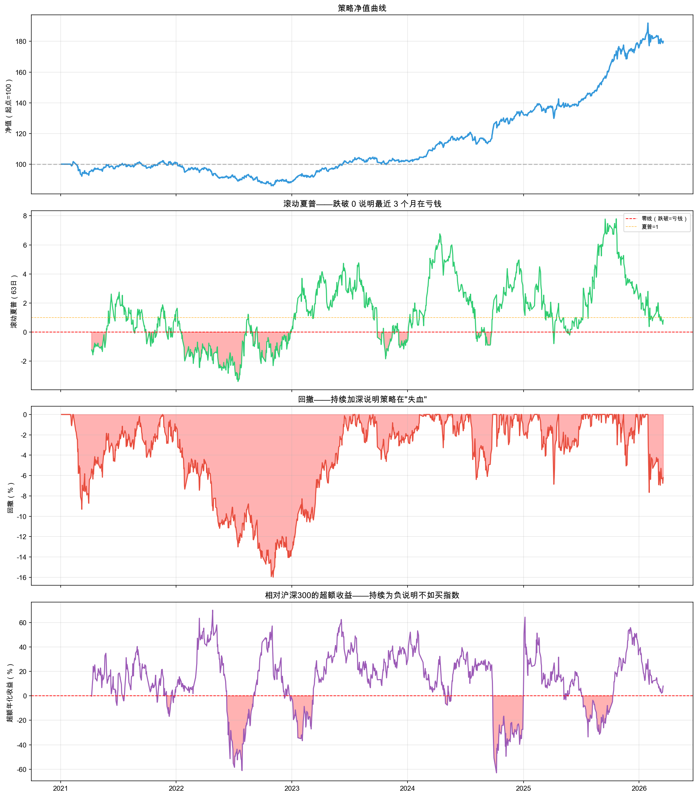
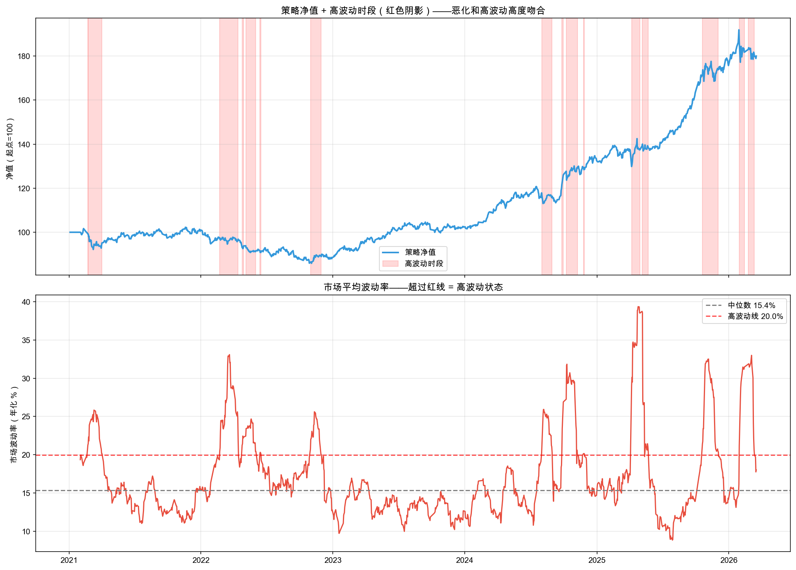
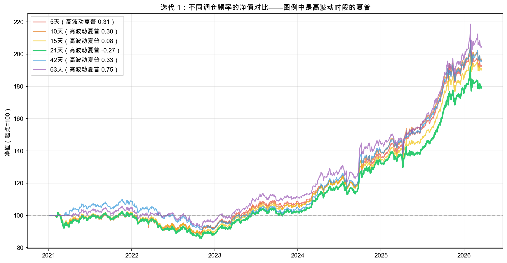
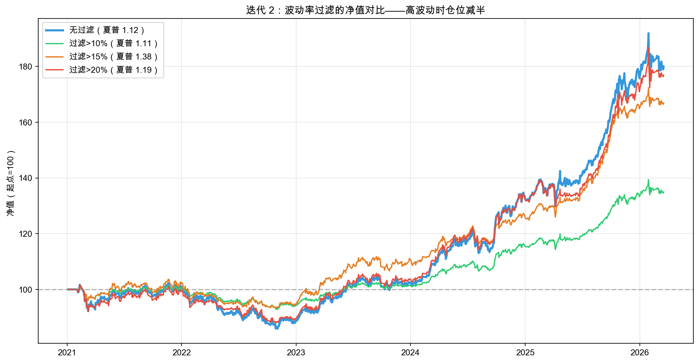

# 第 8 章：策略跑起来以后：监控、诊断、迭代

> 最新书稿已更新至 [XQuant 量化课堂页](https://xquant.shop/courses)。
> 想阅读最新版官方书稿，请前往图书页。

第 7 章你搭好了从回测到交易执行的桥梁：订单生成、成交价压力测试、模拟交易、执行报告。策略终于可以跑起来了。

**然后你开始每天看净值。**

上个月赚了 3%，开心。这个月亏了 5%，慌了。盯着那条往下走的曲线，你脑子里全是问号：策略是不是坏了？要不要停？要不要改？还是再等等？

别慌。这一章教你三件事：怎么看（监控）、怎么查（诊断）、怎么改（迭代）。

这一章进入评估归因阶段，但场景和第 5 章不同。第 5 章看的是离线回测，第 8 章看的是一个已经开始日常跟踪的策略。你要用监控发现异常，用诊断找到原因，再用对照实验决定怎么改。

前言里说过，量化实验离不开“做、看、疑”三个环节。第 8 章会把这三个环节放进日常运行场景：做，是定好监控规则和迭代规则；看，是读仪表盘指标；疑，是用诊断三问检查结果是否可信。

### 路线图

**选什么标的（第 2 章）→ 每个买多少（第 3 章）→ 什么时候买卖（第 4 章）→ 怎么验证有效（第 5 章）→ 如何避免自欺欺人（第 6 章）→ 如何真正执行（第 7 章）→ 如何持续改进（第 8 章本章）**

本章从“盯着净值焦虑”的状态出发，用三个步骤建立系统性的迭代能力，三个步骤的问题与方法对照如表 8-1 所示。

**表 8-1 第 8 章三步迭代框架：问题与方法对照**

| 步骤 | 问题 | 方法 |
|------|------|------|
| 第 1 步 | 策略是不是坏了？ | 监控仪表盘：用指标替代焦虑 |
| 第 2 步 | 问题出在哪？ | 诊断三问：由外到内定位原因 |
| 第 3 步 | 怎么改？ | 假设驱动的对照实验 |

（操作流程见前言“怎么使用这本书”。）

---

## 8.1 策略是不是坏了？

上个月赚了 3%，这个月亏了 5%。你盯着净值曲线，心里发慌。

但“净值在跌”这个信息太粗糙了。就像你身体不舒服，光说“不舒服”没用，得量体温、测血压、做检查。策略也一样，需要一个“仪表盘”，用具体的指标告诉你：现在到底是正常波动，还是真的出了问题。

我们用三个指标构成监控仪表盘，三者覆盖的角度如表 8-2 所示。

**表 8-2 监控仪表盘的三个核心指标**

| 指标 | 含义 | 类比 |
|------|------|------|
| **滚动夏普**（最近 3 个月） | 最近 3 个月的风险调整收益 | 体温计：正常在 0 以上，跌破 0 说明在“发烧” |
| **滚动回撤** | 从近期高点到现在跌了多少 | 水位线：持续下降说明“水在退” |
| **相对沪深 300 表现** | 同期你的策略比沪深 300 多赚或少赚多少 | 跑步比赛：持续落后说明跑法有问题 |

### 动手实验 1：监控仪表盘

这是本章第一份“运营 spec”，和前七章那种“建一个新功能”不同。这里我们要写的是**怎么周期性地看一个已经在跑的策略**。我们一起把这份 spec 写出来。这次重点看两件新东西：**心智切换**，上下文段第一句话就要告诉 AI“这不是建造，是体检”；以及**周期性运营 spec 的四要素**，触发条件、频率、阈值、输出形态全部显式。

#### 第一、二段：上下文和任务描述

上下文段开头那句“用具体指标替代焦虑”是整个第 8 章的总动机。运营章 spec 的上下文不必交代环境怎么搭，要交代**读者现在的情绪状态和场景**：

> **上下文**：读者跑完第 7 章，策略已经可以进入日常跟踪。但上个月赚了 3%，这个月亏了 5%，这是正常波动还是策略出了问题？需要一个“仪表盘”，用具体指标替代焦虑。
>
> **任务描述**：在 `q8-iteration.ipynb` 中跑基准回测后，用 `StrategyMonitor` 构建监控仪表盘，画三个滚动指标的时间序列图，并自动检测恶化时段。

> 📌 **要点**：运营 spec 的上下文要交代“心智切换”。前七章的 spec 是“建一个新功能”，这一章开始是“看一个已有策略的健康状态”。读者如果带着建造者的姿态去做运维，看了 30 个图也不知道在干嘛。上下文一句话点明“用指标替代焦虑”，就是给读者（也给 AI）定调子：这次的产出不是新代码，是健康判断。

#### 第三段：任务要求

任务要求段是这份 spec 的主体。重点是把“什么时候触发监控、多久跑一次、什么数值算异常、异常了怎么输出”四件事全部显式写明：

> **任务要求**：
>
> 1. 跑基准回测（`SimBroker` + 风险平价 + 21 天再平衡 + 10% 止损），拿到 `result_base`
> 2. 用 `StrategyMonitor(result_base, benchmark="510300.SS", roll_window=63)` 获取滚动指标
>    - `roll_window=63` ≈ 3 个月交易日（21 天/月 × 3），太短（<20）每天报警、太长（>120）警报来时已经亏了半年
> 3. 画四行子图（figsize 14×16，共享 x 轴）：净值曲线 / 滚动夏普（标零线和 1 线）/ 滚动回撤 / 相对沪深 300 表现，红色填充异常区域
> 4. 自动检测恶化时段。告警规则显式声明：
>    - **触发条件**：滚动夏普 < 0 且持续 ≥ 20 个交易日
>    - **频率**：每月例行检查一次；第 1 步发现恶化时立即触发第 2 步诊断
>    - **阈值**：`sharpe_threshold=0.0, min_days=20`（在 `StrategyMonitor` 构造时锁定）
>    - **输出形态**：遍历 `monitor.bad_periods`，每段一行打印起止日期、持续天数、平均滚动夏普
> 5. 打印结尾过渡句：“2022 年集中出现恶化，原因是什么？”，把读者推向第 2 步

> 📌 **要点**：周期性运营 spec 的告警四要素，触发条件、频率、阈值、输出形态，必须全部显式。建造类 spec 的“成功标志”是“代码跑通、图渲染出来”；运营类 spec 的“成功标志”是“在该报警的时候报了警、不该报的时候没报”。任何一个要素藏在 oxq 库默认参数里、没写进 spec，半年后阈值变了你也不知道。这是运营 spec 区别于第 1 章到第 7 章建造 spec 的核心方法点。

> 📌 **要点**：关键常量旁边要写“为什么是这个数”。`roll_window=63` 不是随便选的，它是行业惯例（约 3 个月交易日），理由也要进 spec。运营场景里的每一个数字都是阈值，阈值的合理性比数值本身更重要。

#### 第四段：验收标准

> **验收标准**：四行仪表盘图正常渲染 + 恶化时段列表非空（2022 年应有多个时段）+ `equity`、`daily_ret`、`result_base`、`monitor` 变量已定义（后续 spec 接续使用）。

完整示例 spec 见配套仓库的 [`q8-iteration/specs/spec-01-monitoring.md`](https://github.com/xingwudao/xquant-learning/blob/main/q8-iteration/specs/spec-01-monitoring.md)。参考示例后，确认自己的 spec，再复制给 AI。

AI 编程工具执行完毕后，你的 notebook 里应该出现了基准回测结果和一张四行的监控仪表盘图。

这个实验做了什么？先用第 4 章、第 7 章同款的风险平价策略（沪深300ETF + 纳指100ETF + 黄金ETF，21 天再平衡 + 10% 止损）跑一次从 2021 年到现在的完整回测，拿到净值曲线。然后把净值喂给 `StrategyMonitor`。它就是那个“体检中心”，自动计算三个滚动健康指标（滚动夏普、滚动回撤、相对沪深 300 表现），并标注出指标持续恶化的时段。

### 运行结果

先看基准回测：累计收益 86.45%，年化 12.50%，最大回撤 -16.62%，简化夏普 1.17，共 184 笔交易。

监控仪表盘的整体效果如图 8-1 所示。



图 8-1 第一行是净值曲线，整体向上但中间有几段明显的下跌。第二行是**滚动夏普**，红色填充区域就是夏普跌破 0 的时段，说明最近 3 个月策略在亏钱。第三行是回撤，持续加深说明策略在“失血”。第四行是相对沪深 300 表现，为负说明还不如直接买指数。

仪表盘自动检测到的恶化时段如表 8-3 所示。

**表 8-3 监控仪表盘自动检测到的恶化时段**

| 起始日期 | 结束日期 | 持续天数 | 平均滚动夏普 |
|----------|----------|----------|----------|
| 2022-02-07 | 2022-04-29 | 58 天 | -1.78 |
| 2022-05-05 | 2022-08-10 | 68 天 | -2.25 |
| 2022-08-29 | 2022-09-30 | 23 天 | -1.13 |
| 2022-10-10 | 2022-12-01 | 39 天 | -1.02 |
| 2023-10-18 | 2023-11-14 | 20 天 | -0.84 |
| 2023-12-05 | 2024-01-03 | 21 天 | -0.91 |

2022 年集中出现了 4 段恶化，最长的一段持续了 68 天，平均滚动夏普 -2.25。

### 结果解读

仪表盘让你从“盯着净值焦虑”变成“看指标判断”。

滚动夏普跌破 0，说明最近 3 个月策略在亏钱。这是最直接的“发烧”信号。回撤持续加深说明策略在“失血”。相对沪深 300 表现为负，说明你还不如直接买指数。

三个指标同时恶化的时段就是需要关注的“危险区”。2022 年出现了多段集中恶化，但**发现问题不等于知道原因**。

是执行出了问题？市场变了？还是策略本身有缺陷？

---

## 8.2 问题出在哪？

第 1 步告诉你“最近不对劲”，但不对劲有很多种原因。

在开始诊断之前，先认识一个本节的关键概念：

**市场状态（regime）**：市场不是一成不变的。有时候波动大，几乎所有资产一起剧烈起伏，我们叫“高波动”；有时候很平静，我们叫“低波动”或“正常”。就像天气有晴天和台风天，同一件衣服在不同天气穿感受完全不同。策略也一样。一个在正常市场表现不错的策略，到了高波动状态可能表现很差。**诊断三问里有两问都和它相关**，所以我们先介绍它。

就像身体不舒服，你不会直接吃药。先量体温排除感冒，再查血排除感染，最后做 CT 看看有没有更深的问题。策略诊断也一样，我们由外到内排查三类原因：

1. **是执行的问题吗？** 回测和模拟交易之间的差距有没有异常放大
2. **是市场状态变了吗？** 市场的波动水平有没有发生大的变化
3. **是策略本身的设计问题吗？** 参数在不同时段的表现是否稳定

### 动手实验 2：诊断三问

我们一起把这份 spec 写出来。这次重点看两件新东西：**一份 spec 包多步诊断的取舍**，前七章每份 spec 只做一件事，这份一次放进三步诊断；以及**阈值事前锁定**，什么样的数字算“通过”、什么样算“失败”，必须在跑诊断之前定好，不能跑完了再看图说话。

#### 第一、二段：上下文和任务描述

接续型 spec 链的上下文要写明前置 spec 留下了哪些变量、本份 spec 在叙事里的位置：

> **上下文**：在 `q8-iteration.ipynb` 中已有第 1 步监控仪表盘和恶化时段检测。第 1 步发现了多段恶化时段（2022 年集中出现），现在需要搞清楚原因。由外到内排查三类原因：执行 → 市场 → 策略。
>
> **任务描述**：完成三步诊断：排查执行落差、检测市场状态变化、检查参数稳定性。这三步是不可拆分的方法论，必须按“由外到内”的顺序执行。

> 📌 **要点**：第 1 章到第 7 章的写法是“一份 spec 一件事”，这份是“一份 spec 三件事”。叙事完整性优先于任务原子性。诊断方法论本身就是一个不可拆分的整体，拆成三份 spec，读者会丢掉“先排外因再查内因”的节奏。但代价是 spec 体积变大，所以必须在任务描述段第一句就明示“这三步必须按顺序”。这是给 AI 也给读者定下预期：这是一个流程，不是三个独立任务。

#### 第三段：任务要求

任务要求段是这份 spec 的主体。三步诊断每一步都要把“通过 / 失败”的判定阈值事前写明，绝不能“看图说话”：

> **任务要求**：
>
> 1. **诊断 1：执行落差排查**：
>    - 跑“理想回测”（收盘价 + 佣金，无滑点）和“模拟交易”（次日开盘 + 佣金 + 千分之一滑点）
>    - 计算两条净值曲线的滚动执行落差（63 日滚动均值）
>    - **判定阈值**：落差走势平稳（每 63 日变化标准差 < 0.5%）→ 排除执行问题；若突然放大则结论改为“需进一步检查滑点 / 佣金模型”
>    - 把落差放到读者能理解的语境中：N 年赚了 X%，其中 Y% 被执行成本吃掉
>
> 2. **诊断 2：市场状态检测**：
>    - 用 `MarketStateDetector(result_base)` 检测市场状态
>    - 分状态打印策略表现（年化收益、简化夏普、天数）
>    - **判定阈值**：高波动状态下简化夏普 < 0 且与第 1 步恶化时段重叠 ≥ 70% → 结论“市场状态变了，不是策略 bug”
>    - 画两行子图：净值曲线 + 高波动红色阴影 / 市场波动率 + 中位数线 + 高波动阈值线
>    - `detector`、`high_vol_mask`、`market_vol`、`HIGH_VOL_LINE` 变量必须已定义（第 3 步接续使用）
>
> 3. **诊断 3：参数稳定性检查**：
>    - 把数据分成前后两半（按交易日中点切分）
>    - 对 5 种再平衡频率（10/15/21/42/63 天）分别在两半上跑回测
>    - **判定阈值**：用 `scipy.stats.kendalltau` 计算前后两半简化夏普排序的 tau（Kendall tau 是衡量两组排序一致性的统计量，取值 -1 到 1，越接近 1 说明前后两段的最优参数排序越像）；tau ≥ 0.7 → 排序稳定，参数没过拟合；tau < 0.7 → 参数对时段敏感
>    - 打印对比表：频率、前半段年化、前半段简化夏普、后半段年化、后半段简化夏普

> 📌 **要点**：诊断 spec 的核心是“事前锁定阈值”，绝不能“看图说话”。建造类 spec 的失败长什么样很明显：代码报错、图渲染不出来。诊断类 spec 的失败是隐式的：你跑完看到一个图，凭直觉说“看起来没问题”。只要阈值不事前锁定，诊断就退化成 confirmation bias。你想看到什么结论，就能从图里读出什么结论。每一步诊断都必须配一个“通过 X、失败 Y”的数字阈值。

> 📌 **要点**：spec 不能给 AI“二选一”。如果你写“用 Kendall tau 或简单比较都行”，AI 选哪种你就拿到哪种结果，下次重跑可能换一种实现，结果不可比。spec 是契约，不是协商。能确定一种方案就锁死一种，留 AI 自由发挥的余地越小，诊断越可复现。

#### 第四段：验收标准

> **验收标准**：三步诊断各一组图 + 数字结论；`detector`、`high_vol_mask`、`market_vol` 变量已定义供第 3 步使用。

完整示例 spec 见配套仓库的 [`q8-iteration/specs/spec-02-diagnostics.md`](https://github.com/xingwudao/xquant-learning/blob/main/q8-iteration/specs/spec-02-diagnostics.md)。参考示例后，确认自己的 spec，再复制给 AI。

AI 编程工具执行完毕后，你的 notebook 里应该出现了三步诊断的完整结果。

这个实验做了什么？由外到内排查三类原因：

- **诊断 1（执行）**：跑两次回测。一次用“理想条件”（收盘价成交、只有佣金），一次用“模拟交易”（次日开盘价 + 佣金 + 滑点），对比两条净值曲线的差距是否在正常范围内。
- **诊断 2（市场）**：用 `MarketStateDetector` 自动检测市场的波动率水平，把每一天标记为“高波动”或“正常”，然后分别统计策略在两种状态下的表现。
- **诊断 3（参数）**：把整段回测数据按时间中点切成前后两半（前半段大致覆盖 2021-2023 上半年的高波动市场，后半段覆盖 2023 下半年至今的恢复期），在两半上分别测试 5 种再平衡频率，看最优参数在不同时段是否稳定。

### 运行结果

按“由外到内”的顺序看三步诊断的输出。

#### 诊断 1：执行落差排查

理想回测收益 92.13%，模拟交易收益 83.54%，执行落差累计 8.59%，每年约 1.72%。

换个方式理解：策略 5 年累计赚了 92%，其中 8.6% 被佣金、滑点等执行成本吃掉了。相当于每年的执行成本约 1.7%。对于月度调整持仓的策略来说，这是正常水平。

更重要的是，执行落差的走势是平稳的，没有突然放大，说明交易执行没有异常。如果这条线突然变陡（落差加速扩大），才说明执行出了问题。

排除执行问题。

#### 诊断 2：市场状态检测

回顾 8.2 节首讲过的**市场状态（regime）**。这一步我们用 `MarketStateDetector` 把每一天自动标记为高波动 / 正常 / 低波动，再看策略在不同状态下的表现差异。结果三档分得很开，表 8-4 一目了然。

策略在不同市场状态下的表现差异如表 8-4 所示。

**表 8-4 策略在不同市场状态下的表现**

| 市场状态 | 年化收益 | 简化夏普 | 天数 |
|----------|----------|------|------|
| 高波动 | -1.44% | -0.08 | 260 天 |
| 正常 | 16.62% | 1.80 | 940 天 |
| 低波动 | 34.72% | 6.32 | 36 天 |

策略净值与高波动时段的叠加如图 8-2 所示。



图 8-2 的红色阴影区域就是高波动时段。和第 1 步检测到的恶化时段一对比，高度吻合。策略在高波动环境下年化收益 -1.44%，简化夏普 -0.08，在亏钱。而正常时段年化 16.62%，简化夏普 1.80，表现优秀。

恶化的原因是市场状态变了，不是策略的 bug。

#### 诊断 3：参数稳定性检查

把数据按时间中点切成前后两半，对 5 种再平衡频率分别跑回测，结果如表 8-5 所示。

**表 8-5 5 种再平衡频率在前后两半段的表现**

| 频率 | 前半段年化 | 前半段简化夏普 | 后半段年化 | 后半段简化夏普 |
|------|-----------|-----------|-----------|-----------|
| 10 天 | +3.30% | 0.40 | +25.78% | 2.17 |
| 15 天 | +1.91% | 0.25 | +23.76% | 2.02 |
| 21 天 | +2.18% | 0.28 | +23.13% | 1.89 |
| 42 天 | +2.88% | 0.37 | +24.82% | 1.95 |
| 63 天 | +5.34% | 0.65 | +24.56% | 1.87 |

不同时段的年化收益差异很大（前半段 2-5%，后半段 23-26%），说明策略在不同市场环境下表现差异大。但参数排序有变化：前半段 63 天最优，后半段 10 天最优。这意味着：策略的框架是对的，但对某些市场状态没有应对方案。

### 结果解读

三步诊断的结论汇总如表 8-6 所示。

**表 8-6 三步诊断的结论汇总**

| 诊断 | 问题 | 结论 |
|------|------|------|
| 执行 | 回测和模拟交易的差距有没有异常放大？ | 没有。执行落差稳定，排除 |
| 市场 | 市场波动水平有没有大的变化？ | 有。恶化时段和高波动高度吻合 |
| 策略 | 参数在不同时段是否稳定？ | 排序有变化，但策略框架没问题，对某些市场状态没有应对方案 |

问题定位清楚了：不是执行的问题，不是参数过拟合，而是**策略对高波动的市场状态没有应对方案**。

把这套诊断流程压成一句以后能脱口而出的口诀：

> **归因 SOP 口诀：先排执行落差（外），再查市场状态（中），最后看策略本身（内）。**

这个由外到内的顺序不能反过来。先动策略本身，你大概率会“为了一个市场状态变化”而推翻整个框架，下一轮市场恢复正常你又要再推翻一次。这正是缺乏纪律的迭代最常见的死循环。三步走完之后再决定改什么，每一步都有数据支撑。

那怎么改？推翻重来？还是在现有策略上做小步改进？

---

## 8.3 怎么改？

诊断结果出来了：执行没问题，是市场状态变了，策略对高波动没有应对。

你可能想直接调参数试试。但改策略不是拍脑袋。你需要像做实验一样：**先提出假设和判断标准，再做对照实验，最后看结果确认还是推翻假设。**

就像医生看病，不是看到头疼就开止疼药，而是先做检查确认病因，再开药。

每次迭代都走这个流程：

```
观察（看到了什么） → 假设（猜原因） → 验证标准（怎么判断对错） → 实验（改一个变量） → 结论（确认 / 推翻）
```

### 动手实验 3：假设驱动的对照实验

我们一起把这份 spec 写出来。这次重点看两件新东西：**让“假设”跟着 Strategy 跑**。open-xquant 的 `Strategy` 类在设计时就内置了 `hypothesis` 和 `objectives` 两个空，创建 Strategy 时填两个空（假设、判定标准），跑出来的 Strategy 自己背着这张假设卡。另一个重点是**验证标准事前锁定具体数字**。绝不写“看情况调整”这种橡皮条款。

#### 第一、二段：上下文和任务描述

> **上下文**：在 `q8-iteration.ipynb` 中已有第 1 步监控 + 第 2 步诊断的完整变量。诊断结论：策略对高波动的市场状态没有应对方案。
>
> **任务描述**：完成两轮迭代实验（再平衡频率 + 波动率过滤），用 Strategy 的 `hypothesis`/`objectives` 字段展示完整的实验工作流，最后用 `ExperimentLog` 记录迭代历史。

#### 第三段：任务要求

任务要求段是这份 spec 的核心。它把“假设 → 验证标准 → 实验 → 结论”的方法挂到 Strategy 自己身上的两个空（`Strategy.hypothesis` 和 `Strategy.objectives`），让 strategy 跑到哪，假设卡跟到哪：

> **任务要求**：
>
> 1. **迭代 1：再平衡频率对照实验**（注定被推翻的一轮）：
>    - 创建 Strategy 时填写 `hypothesis="缩短再平衡频率能改善高波动期表现"`
>    - 同时填写 `objectives={"high_vol_sharpe": "above_baseline", "max_dd_limit": dd_limit}`，验证标准事前锁定
>    - 对 6 种频率（5/10/15/21/42/63 天）分别跑回测
>    - 计算每种频率在高波动时段的简化夏普（用 `high_vol_mask` 筛选）
>    - 假设验证：对比基准（21 天）和最优频率的高波动简化夏普，判断假设确认还是推翻
>
> 2. **迭代 2：波动率过滤对照实验**（注定被确认的一轮）：
>    - 创建 Strategy 时填写 `hypothesis="高波动时降低持仓比例能显著降低回撤"`
>    - 验证标准事前锁定：`objectives={"dd_improvement": ">=30%", "sharpe": ">=1.0"}`
>    - 用 `VolFilteredOptimizer` 包装 `RiskParityOptimizer`：高波动期权重缩放 0.5
>    - 测试 4 种配置：无过滤、阈值 10% / 15% / 20%
>    - **“最佳配置”选择函数显式锁定**：`best_label = argmax(dd_improvement)`，不能让 AI 揣摩“最佳”的含义
>    - 假设验证：检查最佳配置是否同时满足两个事前标准
>
> 3. **迭代记录表**：
>    - 用 `ExperimentLog(name="第 8 章迭代实验")` 创建记录
>    - 用 `log.add()` 添加两轮迭代，每行字段值字符级显式：`name` / `observation` / `hypothesis` / `criteria` / `result` / `conclusion` / `notes`
>    - 用 `log.to_dataframe().to_string(index=False)` 打印记录表

> 📌 **要点**：让 hypothesis 跟着 strategy 跑。`hypothesis` 和 `objectives` 这两个空是 open-xquant 在 `Strategy` 类设计时就内置好的。spec 要求“创建 Strategy 时填写”这两个空，意思是把“假设驱动”从写在注释里、口头讲讲的方法，挂到 Strategy 自己身上。跑出来的 Strategy 对象自带 `.hypothesis` 标签，`ExperimentLog` 自动取走填进表格。以前你的假设写在心里、写在备忘录里，现在 Strategy 自己背着这张假设卡。

> 📌 **要点**：验证标准必须事前锁定到具体数字。“高波动简化夏普优于基准”是数字，“回撤改善 ≥ 30% 且简化夏普 ≥ 1.0”是数字。绝不写“看情况调整”“效果好就采纳”这种橡皮条款。事后改标准就是过拟合。你跑完看到 25% 改善，临时把标准从 30% 改到 20%，那不是验证假设，是在为已有结果找说辞。事前锁定阈值，是迭代 spec 区别于“调参 spec”的本质差异。

> 📌 **要点**：注意章节的节奏。迭代 1 故意安排成“假设被推翻”，迭代 2 是“假设被确认”。这是教学设计：先让读者体会“推翻不是失败，推翻是省下了真钱试错的成本”，再示范一个被确认的假设长什么样。spec 也要配合这个节奏。迭代 1 不要写得“温柔一点让它更容易通过”，要让结果如实推翻。

#### 第四段：验收标准

> **验收标准**：两轮指标表 + 净值对比图 + 假设验证结论 + 2 行迭代记录表（iter1 rejected + iter2 confirmed）+ Strategy 的 hypothesis / objectives 字段值在输出中可见。

完整示例 spec 见配套仓库的 [`q8-iteration/specs/spec-03-iteration.md`](https://github.com/xingwudao/xquant-learning/blob/main/q8-iteration/specs/spec-03-iteration.md)。参考示例后，确认自己的 spec，再复制给 AI。

AI 编程工具执行完毕后，你的 notebook 里应该出现了两轮对照实验的完整结果和迭代记录表。

这个实验做了什么？两轮对照实验，每轮都遵循“假设 → 验证标准 → 实验 → 结论”的流程：

- **迭代 1（再平衡频率）**：假设“缩短再平衡频率能改善高波动期表现”。保持策略逻辑不变，只改多久调整一次持仓。分别测试 5/10/15/21/42/63 天六种频率，重点比较各频率在高波动时段（第 2 步检测出的那些红色阴影区域）的简化夏普。
- **迭代 2（波动率过滤）**：假设“高波动时降低持仓比例能显著减少回撤”。保持再平衡频率不变，用 `VolFilteredOptimizer` 包装 `RiskParityOptimizer`。当市场波动率超过阈值时，自动将权重缩放 0.5，也就是少持有一半资产，多留现金。分别测试无过滤、阈值 10%/15%/20% 四种配置，看回撤改善了多少、付出了多少收益代价。

open-xquant 的 `Strategy` 支持在创建时填写 `hypothesis`（假设）和 `objectives`（验证目标），让“假设驱动”从口号变成 Strategy 自己背着的两个标签。`ExperimentLog` 则帮你自动记录每次迭代的假设、标准、结果和结论。

### 运行结果

两轮迭代的产出按“先被推翻、后被确认”的节奏展开。

#### 迭代 1：再平衡频率

观察：高波动时段策略表现最差。假设：21 天再平衡太慢，缩短频率能改善。验证标准：高波动时段简化夏普优于基准。

6 种再平衡频率的全时段与高波动指标对比如表 8-7 所示。

**表 8-7 迭代 1：6 种再平衡频率的指标对比**

| 频率 | 年化收益 | 最大回撤 | 简化夏普 | 高波动简化夏普 |
|------|----------|----------|----------|------------|
| 5 天 | +13.01% | -14.47% | 1.25 | 0.22 |
| 10 天 | +14.55% | -12.57% | 1.39 | 0.56 |
| 15 天 | +13.29% | -14.14% | 1.26 | 0.09 |
| 21 天（基准） | +12.50% | -16.62% | 1.17 | -0.08 |
| 42 天 | +14.09% | -15.98% | 1.29 | 0.44 |
| 63 天 | +14.71% | -11.49% | 1.31 | 0.84 |

不同再平衡频率的净值曲线对比如图 8-3 所示。



注意看表 8-7 最后一列：“高波动简化夏普”，这才是我们验证假设的指标。全时段简化夏普最高的是 10 天（1.39），但那不是我们的验证目标。高波动时段表现最好的是 63 天（0.84），**更长而非更短**。

**假设被推翻。** 缩短再平衡频率并没有改善高波动期表现。

这告诉我们什么？改“多久做一次决策”没有用，因为每次做的决策（风险平价满仓分配）没变。问题不在于你多久看一次天气预报，而在于看到暴雨预警后有没有带伞。

#### 迭代 2：波动率过滤

观察：频率不是关键，真正的问题是高波动时策略依然持有完整仓位，暴露在风险中。假设：高波动时降低持仓比例，能显著降低回撤。验证标准：回撤改善 ≥ 30%，简化夏普 ≥ 1.0。

4 种波动率过滤配置的指标对比如表 8-8 所示。

**表 8-8 迭代 2：4 种波动率过滤配置的指标对比**

| 配置 | 年化收益 | 最大回撤 | 简化夏普 | 回撤改善 |
|------|----------|----------|----------|----------|
| 无过滤（基准） | +12.50% | -16.62% | 1.17 | 无 |
| 过滤>10% | +6.57% | -8.70% | 1.18 | 47.6% |
| 过滤>15% | +10.44% | -9.62% | 1.43 | 42.1% |
| 过滤>20% | +12.89% | -12.43% | 1.28 | 25.2% |

不同配置的净值曲线对比如图 8-4 所示。



最佳配置是“过滤>10%”：回撤从 -16.62% 改善到 -8.70%（改善 47.6%），简化夏普 1.18。两个验证标准都达标。

**假设被确认。** 波动率过滤有效。

但年化收益从 +12.50% 降到 +6.57%，代价 5.93%。你用 5.9% 的收益换来了 48% 的回撤改善。这就是**取舍（trade-off）**。没有“最好”的参数，只有“适合你风险承受能力”的选择。

### 结果解读

两轮迭代的关键认知汇总如表 8-9 所示。

**表 8-9 两轮迭代的核心认知**

| | 改了什么 | 学到了什么 |
|---|---|---|
| 迭代 1 | 执行参数（多久做一次） | 问题不在频率，策略对市场状态没有反应 |
| 迭代 2 | 策略逻辑（做什么） | 让策略感知市场状态并调整行为才有效 |

假设被推翻不是失败，这是最有价值的学习。如果你凭直觉觉得“更频繁调整应该更好”，然后不做验证就直接放进运行中的策略，可能越改越差。**对照实验的意义就在于此：用数据而不是直觉做决策。**

**“执行参数”和“策略逻辑”是两件事。** 再平衡频率是“多久行动一次”，但每次行动的内容（满仓风险平价）没变。如果问题出在行动的内容上，改频率没用。你需要改策略的行为本身。

---

## 8.4 回头看：你刚才做了什么？

三步实验，回答了同一个核心问题：**策略跑起来之后怎么办？**

第 1 步：建监控，发现“最近不对劲”（滚动夏普跌破 0）。第 2 步：做诊断，定位“是市场状态变了”（由外到内排查三类原因）。第 3 步：做迭代，改频率没用（推翻），改逻辑有效（确认）。

从今以后，策略出了问题你都可以套这套 SOP 应对，三步对照清单如表 8-10 所示。

**表 8-10 监控/诊断/迭代 SOP 速查**

| 步骤 | 怎么做 | 好的信号 | 坏的信号 |
|------|--------|----------|----------|
| 监控 | 看滚动夏普、回撤、相对沪深 300 表现 | 指标波动但整体健康 | 多个指标同时持续恶化 |
| 诊断 | 由外到内：执行、市场、策略 | 能定位到具体原因 | 三类原因都有问题（可能需要重新设计） |
| 迭代 | 假设、验证标准、实验、结论 | 假设被确认或被有价值地推翻 | 没有假设就开始改参数 |

---

## 8.5 本章总结

### 策略进化路径

第 7 章把策略接到交易执行这一步，第 8 章补上“跑起来以后怎么办”。三步进化路径如表 8-11 所示。

**表 8-11 第 8 章三步进化路径**

| 步骤 | 做了什么 | 关键发现 |
|------|---------|---------|
| 第 1 步 监控 | 滚动指标 + 自动标恶化 | 2022 年集中出现 4 段恶化 |
| 第 2 步 诊断 | 由外到内排查三类原因 | 不是 bug，是市场状态变了 |
| 第 3 步 迭代 | 两轮假设驱动对照 | 改频率没用，改逻辑才有效 |

第 7 章产出“从回测到交易执行的完整流程”，第 8 章在它之上多走一步，产出“策略迭代的完整方法”加上“用数据做决策”的认知。

### 概念速查表

本章涉及的核心概念汇总如表 8-12 所示，方便随时回查。

**表 8-12 第 8 章核心概念速查**

| 概念 | 含义 | 类比 |
|------|------|------|
| 滚动夏普 | 最近一段时间（如 3 个月）的风险调整收益，衡量策略“现在”的健康度 | 体温计：数值正常说明没发烧 |
| 市场状态（regime） | 市场的波动水平和整体环境，不同时期差异很大 | 天气：晴天和台风天出门穿的衣服不一样 |
| 假设驱动迭代 | 先提出可验证的猜想和判断标准，再做实验，而不是凭感觉改 | 医生看病：先检查确认病因，再开药 |
| 对照实验 | 只改一个变量、其他不变，看效果 | 同一道菜只改盐的量，尝尝区别 |
| 执行参数 vs 策略逻辑 | “多久做一次”和“做什么”是两件事 | 多久看一次天气预报 vs 看到暴雨预警后是否带伞 |
| 迭代记录表 | 每次改动的假设、标准、结果、结论，形成可追溯的改进历史 | 病历本：记录每次看病的诊断和治疗 |

### 四个阶段回顾

到这里，你已经完整走过四个阶段。确定候选（第 2 章）→ 制定规则（第 3、4 章）→ 执行交易（第 7 章）→ 评估归因（第 5、6、8 章）。第 8 章的结论会反过来提醒你：下一次再确定候选、制定规则时，要提前考虑市场状态。

做、看、疑三个环节也走了一遍：做，是把监控和迭代写成可重复执行的规则；看，是用指标判断策略状态；疑，是不只相信回测，也检查执行、市场状态和策略本身。

接下来，第 9 章会让这个研究过程更快：持续寻找新的因子和新的策略改进机会。

### 本章核心认知

走完三步之后，本章最值得带走的九条认知如表 8-13 所示。

**表 8-13 第 8 章核心认知**

| 认知 | 来源 |
|------|------|
| 策略亏钱不一定是坏了，可能是正常波动 | 第 1 步 |
| 持续监控比偶尔看一眼净值重要得多 | 第 1 步 |
| 诊断要由外到内：先排执行，再看市场，最后看策略 | 第 2 步 |
| 市场状态会变，策略在不同状态下表现不同是正常的 | 第 2 步 |
| 改策略前先定好验证标准，不能事后改规则 | 第 3 步 |
| 改“多久行动”和改“怎么行动”是两件事 | 第 3 步 迭代 1 |
| 假设被推翻是好事，省下了真钱试错的成本 | 第 3 步 迭代 1 |
| 让策略感知市场状态并调整行为，才是有效的改进 | 第 3 步 迭代 2 |
| 每次改进都是取舍：用收益换安全，或反过来 | 第 3 步 迭代 2 |

### 带走的问题

我们已经走完了从选标的（第 2 章）到持续改进（第 8 章）的完整流程。你现在掌握了监控、诊断和迭代的方法。

但你可能已经感受到：每次迭代都要构造假设、改参数、跑回测、对比指标、记录结论……这个过程不算轻松。

策略不完美没关系，碰到问题也没关系。只要迭代得够快，从错误和失败中学习得够快，你就可以保持进化。**迭代速度本身就是竞争力。**

有没有办法让这个过程更快？这就是第 9 章要回答的问题。

> 本章所有代码的可运行版本见配套仓库的 [`q8-iteration/notebooks/q8-iteration.ipynb`](https://github.com/xingwudao/xquant-learning/blob/main/q8-iteration/notebooks/q8-iteration.ipynb)

---

## 8.6 拓展阅读

本章正文聚焦“监控 / 诊断 / 迭代”三个和策略运行相关的环节。下面这段是动手之外的“软功”。读完正文后回头看，决定你能不能把这套方法长期跑下去。

### 迭代自己：耐心 / 纪律 / 记录

前面三步解决的是策略运行的问题，但还有一个问题藏在你自己身上。

**耐心（对应第 1 步 监控）。** 策略有波动是常态。不要每天盯着净值焦虑。你已经有了监控仪表盘，定期检查就够了。如果你发现自己每小时都在看净值，那不是在监控，是在焦虑。仪表盘的意义不只是发现问题，也是让你在没有问题的时候安心。

**纪律（对应第 3 步 验证标准）。** 定好了验证标准就不要改。如果实验结果不好就改标准，这和第 6 章讲的过拟合是一回事：你在“事后”调整规则来让结果看起来好，而不是真的在改进。假设被推翻了？接受它，记录下来，想下一个假设。

**记录（对应第 3 步 迭代记录表）。** 每次迭代都填迭代记录表。三个月后回头看，你会发现大部分假设都被推翻了，但你从每次推翻中学到的东西比确认更多。这些记录就是你的成长轨迹。

**一句话：** 策略运行的方法你已经有了；接下来三年里能不能跑通，取决于你“耐心 / 纪律 / 记录”这三条软纪律守得有多严。这是带得走的“心态地图”。
