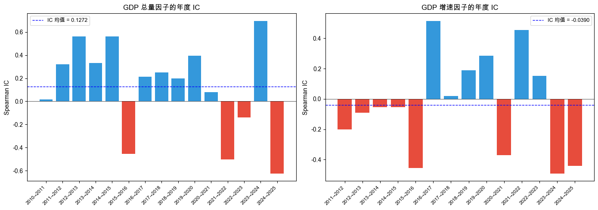
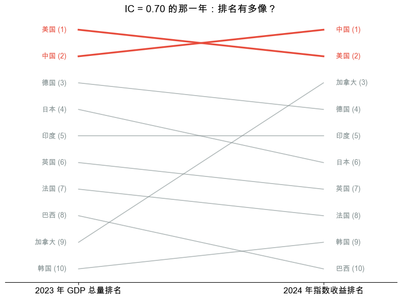
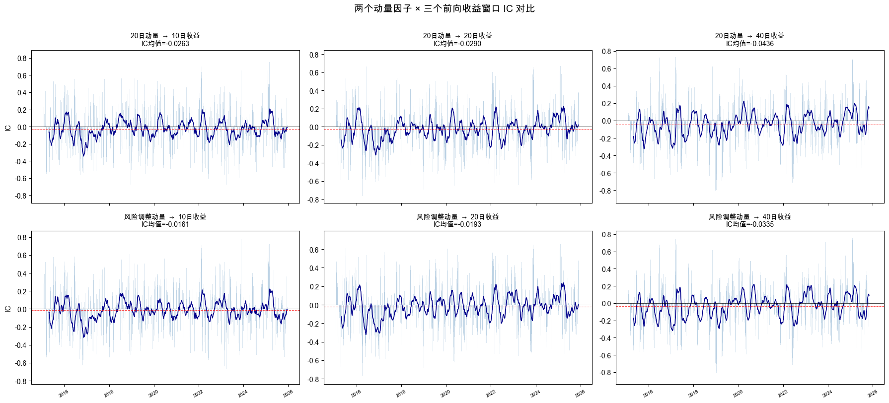
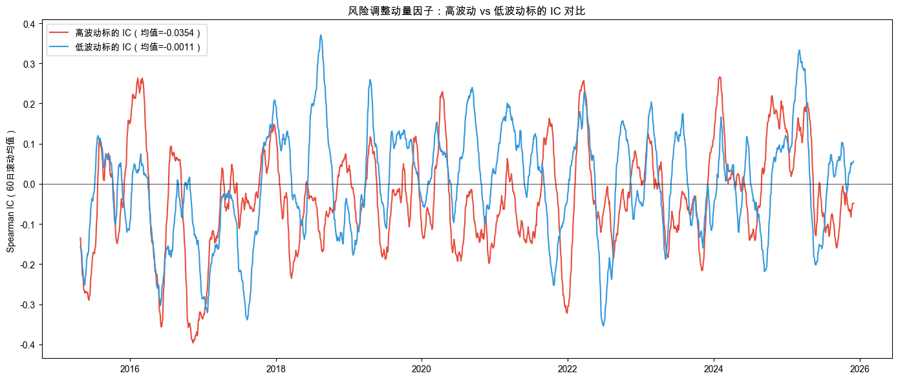
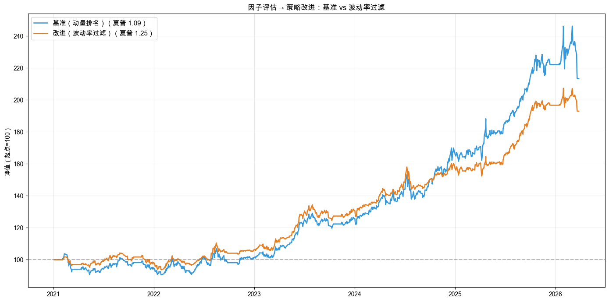

# 第 9 章：持续寻找机会：因子研究入门

> 最新书稿已更新至 [XQuant 量化课堂页](https://xquant.shop/courses)。
> 想阅读最新版官方书稿，请前往图书页。

前面 8 章，我们从零搭建了一个完整的量化策略：选标的、定权重、制定买卖规则、验证有效性、避免过拟合、接入执行、持续迭代。策略跑起来了。

**然后呢？**

做完一个策略就结束了吗？量化交易员的日常到底在忙什么？

答案是：**因子研究**。

回头看前面 8 章的每一个关键决策：用 GDP 选国家，用动量排名买卖。背后都有一个共同逻辑：把投资直觉翻译成可计算变量，再用它做决策。这个变量，就是**因子（Factor）**。

量化研究的日常工作，就是不断寻找新的因子、评估它们的预测能力，再把有用的发现变成策略改进。这一章，我们就来体验这个过程。

### 路线图

**完整跑通一个策略（第 1 章）→ 选什么标的（第 2 章）→ 每个买多少（第 3 章）→ 什么时候买卖（第 4 章）→ 怎么验证有效（第 5 章）→ 如何避免自欺欺人（第 6 章）→ 如何真正执行（第 7 章）→ 如何持续改进（第 8 章）→ 持续寻找机会（第 9 章本章）**

本章从“回顾已有决策”出发，正式引入因子概念，用三个步骤体验量化研究员的日常工作，三步的问题与方法对照如表 9-1 所示。

**表 9-1 第 9 章三步实验问题与方法对照**

| 步骤 | 问题 | 方法 |
|------|------|------|
| 第 1 步 | 前面的决策靠的是什么？ | 回顾 → 引入因子概念 → IC 评估方法 → GDP 因子实验 |
| 第 2 步 | 动量因子到底靠不靠谱？ | 25 只 ETF × 多个前向窗口 → IC 分析 → 分组诊断 |
| 第 3 步 | 因子评估能改进策略吗？ | 补充因子 → 发现问题 → 波动率过滤 → 回测验证 |

（操作流程见前言“怎么使用这本书”。）

---

## 9.1 从直觉到因子

回顾一下前面课程中的两个关键决策，对照如表 9-2 所示。

**表 9-2 前面课程中的两个关键决策回顾**

| 章节 | 决策 | 用了什么数据 | 因子名称 | 因子类别 |
|------|------|-------------|---------|---------|
| 第 2 章选什么 | 选哪个国家的市场 | GDP 总量/增速 | GDP 因子 | 宏观因子 |
| 第 3 章买多少 | 涨得多买、跌得多不买 | 风险调整动量 | 动量因子 | 动量因子 |

你可能没意识到，第 2 章和第 3 章里你已经在用因子了。**因子（Factor）**是描述资产或市场特征的可计算变量。它可以用来解释风险和收益，也可以用来预测表现、辅助决策。比如 GDP 高的国家更值得投，涨得好的资产多买一点。就像你挑餐厅会看评分、距离、价格，这些“参考指标”就是因子。

量化研究的日常工作，就是不断寻找和评估这些因子。

### 怎么评估一个因子好不好？

一个因子好不好，最直接的检验方式是：它的打分排名，和实际收益排名有多像？

这就是 **IC（Information Coefficient，信息系数）** 的核心思想。打个比方，IC 就像考试估分准不准：你预估的前 5 名跟实际前 5 名的重合度越高，说明你的判断越靠谱。

计算方法：每一期，把所有投资对象按因子值排名，再按下一期的实际收益排名，然后算两个排名的 Spearman 相关系数。Spearman 是相关系数的一种，专门看排名而不是数值。它比较的是两次考试的“班级第几名”是否一致，而不是具体分数。相关系数范围从 -1 到 +1：+1 表示因子排名和收益排名完全一致（完美预测），-1 表示完全相反，0 表示毫无关系。

**IC 均值**是多期 IC 的平均值，反映因子是否长期有效：

- 绝对值 > 0.03：有一定参考价值
- 绝对值 > 0.05：算不错的因子
- 绝对值 > 0.1：非常强的因子（实际中很罕见）

**ICIR（IC 信息比率）** = IC 均值 / IC 标准差，衡量 IC 的稳定性。不仅要均值高，还要稳定。偶尔猜中一次的因子不算好，每年都稳定有效才算。这和第 3 章讲简化夏普时的思路类似：不只看平均收益，也要看波动。

### 动手实验 1：GDP 因子 IC 分析

我们一起把这份 spec 写出来。这次重点看两件新东西：**评估工具先讲清楚再用**，以及**因子计算的关键参数要点名到函数级**。

#### 第一、二段：上下文和任务描述

这是收官章第一份 spec，承接前 8 章的所有实验。上下文段把“读者已经在用因子但没意识到”这个起点交代清楚：

> **上下文**：读者已完成第 2 章到第 8 章。本 spec 对应 notebook `q9-daily-work.ipynb` 的第 1 步，从零引入因子概念和 IC 评估方法，并用 10 国 GDP 数据做第一个因子评估实验。
>
> **任务描述**：在 notebook 中创建第 1 步的所有单元格：导入库、因子回顾表、IC 方法说明、GDP 因子 IC 实验、排名对比图、GDP 分析、因子分类全景表。

> 📌 **要点**：收官章 spec 把“评估工具”前置于“评估实验”。任务要求段先单独要求一个 IC 方法说明 markdown（讲 Spearman、阈值、ICIR），再要求 GDP 实验。先把全章共用的“测量尺”建起来，后面所有 spec 都引用同一套语言。

#### 第三段：任务要求

任务要求段是这份 spec 最长的一节（11 条）。两个最关键的细节：

> **任务要求**（摘要）：前两条规定整体结构，3-5 条是具体的 oxq 模块调用细节。
>
> 1. IC 方法说明 markdown 必须放在 GDP 实验之前。先讲 Spearman 相关系数、IC 阈值（0.03 / 0.05 / 0.1）、ICIR 概念
> 2. GDP 数据下载用 `WorldBankFetcher()` + `FactorDownloader(fetcher, sub="macro")` + `dl.download("gdp", start="2010", end="2024", countries=countries)`
> 3. ETF 价格用 `YFinanceDownloader()` + `LocalMarketDataProvider().get_bars()`，时间范围 2011-01-01 至 2026-12-31
> 4. IC 计算：每个“因子年→收益年”配对，用 `scipy.stats.spearmanr` 算相关系数；同时跑 GDP 总量因子和 GDP 增速因子（`gdp_df.pct_change()`）
> 5. 视觉契约：1×2 柱状图（figsize 14×5），正相关蓝色、负相关红色，加 IC 均值虚线；slope chart 选 IC 最大那一年，中美红色粗线高亮、其他灰色

> 📌 **要点**：量化研究 spec 必须把“算什么”具体到函数。“算 IC”不够。`spearmanr` 还是 `pearsonr`？前者看排名相关，后者看数值相关，因子评估默认用 spearman。任何统计计算都要点名具体函数，避免 AI 在等价函数间随机选。

> 📌 **要点**：复用现成模块时，spec 第一条要点名所有 import 路径。AI 不知道哪些轮子已经存在，名字写错就重复造轮子。本节涉及 `WorldBankFetcher`、`FactorDownloader`、`read_factor`、`Momentum`、`RollingVolatility` 等 7 个模块，全部按官方写法显式列出。

#### 第四段：验收标准

> **验收标准**：GDP 数据表（万亿美元） + 10 国 ETF 覆盖表 + 1×2 IC 柱状图 + IC 均值/ICIR 打印 + 排名对比 slope chart + GDP 分析 markdown + 6 类因子分类全景表 + 过渡文案。

完整示例 spec 见配套仓库的 [`q9-daily-work/specs/spec-01-factor-intro.md`](https://github.com/xingwudao/xquant-learning/blob/main/q9-daily-work/specs/spec-01-factor-intro.md)。参考示例后，确认自己的 spec，再复制给 AI。

AI 编程工具执行完毕后，你的 notebook 里应该出现了 GDP 数据表、IC 柱状图和排名对比图。

这个实验做了什么？先下载 10 个国家的 GDP 数据和对应的指数 ETF 价格数据，然后分别用两个 GDP 因子（总量和增速）来预测下一年的指数收益排名，计算每一年的 IC。

### 运行结果

先看两个因子的 IC 对比，如图 9-1 所示。

GDP 总量因子：IC 均值 = 0.1272，ICIR = 0.3158。GDP 增速因子：IC 均值 = -0.0390，ICIR = -0.1177。

GDP 总量因子的 IC 均值为正，说明 GDP 越大的国家，下一年股市表现确实有略好的倾向。虽然很弱、不稳定，但方向是对的。这就呼应了第 2 章的选择逻辑：我们根据 GDP 总量挑选了最大的两个经济体（中国和美国），用沪深 300 和纳斯达克来构建标的池，背后是有数据支撑的。

而 GDP 增速因子的 IC 更差，说明“增长快”并不能预测“股市涨得好”。经济增速和股市回报的关系比直觉想的要弱得多。

再看 IC 最高那一年的排名对比图，如图 9-2 所示。

左列是 GDP 总量排名，右列是下一年指数收益排名。线越平，说明两个排名越接近（IC 越高）；线交叉越多说明排名差异大（IC 低）。中美两国用红色高亮。你能直观感受到“IC 高”意味着什么。

### 结果解读

GDP 因子的局限很明显：年度数据、10 个国家、十几年样本，IC 估计噪音很大。但这正好说明了 IC 的价值。不是拍脑袋觉得“有道理”就行，要用数据验证。

### 因子的分类

因子的世界远不止 GDP 和动量。主要的因子类别如表 9-3 所示，也是你未来挖掘新因子的方向。

**表 9-3 因子分类全景**

| 因子类别 | 含义（一句话） | 常见例子 | 数据来源 |
|---------|--------------|---------|---------|
| 价值 | 便不便宜 | 市盈率、市净率 | 财报数据 |
| 动量 | 涨跌趋势 | N 日收益率、风险调整动量 | 价格数据 |
| 质量 | 公司好不好 | 利润率、负债率 | 财报数据 |
| 波动率 | 稳不稳 | 历史波动率 | 价格数据 |
| 宏观 | 大环境 | GDP、利率 | 经济数据 |
| 另类 | 非传统信息 | 新闻情绪、卫星图像 | 另类数据 |

前面课程里我们用过宏观因子（GDP）和动量因子（风险调整动量）。接下来我们重点研究动量因子，因为它用的是每天都有的价格数据，样本量大、更新快，最适合日常研究。

GDP 因子受限于年度频率和小样本，IC 很不稳定。接下来，我们用日频价格数据和更多投资对象来评估动量因子。这才是量化研究的日常节奏。

---

## 9.2 动量因子：涨得好的会继续涨吗？

第 3 章里我们用动量排名来决定买多少：涨得好的多买，跌得多的不买。当时在 3 只 ETF 上回测效果不错。

但那只是 3 只 ETF。动量因子在更大范围内真的有效吗？它在什么环境下会失灵？要回答这些问题，我们需要扩大标的池，用 IC 来严格评估。

### 动手实验 2：动量因子 IC 分析

我们一起把这份 spec 写出来。这次重点看两件新东西：**IC 计算函数的签名要点名到参数**，以及**最低样本数阈值要写明白**。

#### 第一、二段：上下文和任务描述

> **上下文**：在 `q9-daily-work.ipynb` 的第 1 步中已完成库导入和 GDP 因子 IC 实验。已有变量 `downloader`（YFinanceDownloader）、`provider`（LocalMarketDataProvider）。本 spec 对应第 2 步，把标的池从 10 只扩展到 25 只，用日频数据做动量因子的 IC 分析。
>
> **任务描述**：在 notebook 中新建第 2 步的所有单元格：构建 25 只投资对象组成的标的池、计算动量因子与前向收益、IC 分析表和图、按波动率分组的 IC 分析、问题总结。

#### 第三段：任务要求

任务要求段的灵魂是把 IC 计算的“工程化模式”用函数签名固化下来。任何新因子来了都按这个模板跑一遍。

> **任务要求**（摘要）：
>
> 1. 25 只投资对象组成的标的池：22 国 ETF + 3 个大宗商品（GLD / USO / SLV），时间范围 2015-01-01 至 2025-12-31
> 2. 因子矩阵：`Momentum().compute(df, column="close", period=20)`、`RollingVolatility().compute(df, column="close", period=20)`、RAM = 动量 / 波动率
> 3. 前向收益窗口 `[10, 20, 40]` 交易日：`df["close"].pct_change(h).shift(-h)`
> 4. 实现 `compute_ic_series(factor_df, fwd_df, min_assets=5)`：每个交易日取因子值和前向收益都有数据的投资对象（至少 min_assets 个），用 Spearman 算 IC
> 5. 实现 `compute_grouped_ic(factor_df, fwd_df, vol_df, min_assets=6)`：每天按波动率中位数把投资对象分高/低两组，组内分别算 Spearman IC；要求交集 ≥12、每组 ≥ min_assets
> 6. 视觉契约：2×3 子图（figsize 18×8），柱状图 `width=2, alpha=0.2, steelblue` + 60 日滚动均值 `darkblue` + IC 均值红色虚线
> 7. 末尾保留 `ic_ts = ic_results["风险调整动量 → 20日"]` 和 `fwd_df = fwd_dfs[20]` 给 spec-03

> 📌 **要点**：IC 计算这种“对每天做一次统计、跳过样本不足的天、收集成时间序列”的工程化模式，必须封装成函数：`compute_ic_series(factor_df, fwd_df, min_assets=5)`。函数签名级精度让 AI 没有自由发挥空间，也让读者未来换标的池时有明确的修改入口。

> 📌 **要点**：统计计算的阈值要写明白。`min_assets=5`（整体 IC）和 `min_assets=6`（分组 IC，配合交集 ≥12 的额外门槛）不是凭空选。Spearman 在 ≥5 时方差才可控，分组样本减半后 ≥6 才能稳定。任何“最少多少样本”的阈值都要进 spec 的参数清单，否则 AI 可能选 3 也可能选 10。

#### 第四段：验收标准

> **验收标准**：25 只投资对象覆盖表 + 动量因子矩阵 + 6 组 IC 对比表 + 2×3 IC 时间序列子图 + 分组 IC 表 + 高/低波动 IC 时间序列对比图 + 问题总结 markdown。

完整示例 spec 见配套仓库的 [`q9-daily-work/specs/spec-02-momentum-ic.md`](https://github.com/xingwudao/xquant-learning/blob/main/q9-daily-work/specs/spec-02-momentum-ic.md)。参考示例后，确认自己的 spec，再复制给 AI。

AI 编程工具执行完毕后，你的 notebook 里应该出现了 25 只投资对象的覆盖表、IC 对比表和多张 IC 时间序列图。

这个实验做了什么？把标的池从第 2、3 章的 3 只 ETF 扩展到 25 只全球 ETF（22 个国家/地区 + 黄金/原油/白银），用 2015-2025 的日频数据，分别测试两个动量因子（20 日动量和风险调整动量）在三个前向收益窗口（10/20/40 交易日）上的 IC 表现。然后按每只投资对象自身的波动率分组，看动量因子在高波动和低波动投资对象上的表现差异。

### 运行结果

两个动量因子在三个前向窗口上的 IC 对比如表 9-4 所示。

**表 9-4 两个动量因子 × 三个前向窗口的 IC 对比**

| 因子 / 前向窗口 | IC 均值 | IC 标准差 | ICIR | IC>0 |
|-----------------|--------|----------|------|------|
| 20日动量 / 10日 | -0.0263 | 0.2794 | -0.0941 | 45.7% |
| 20日动量 / 20日 | -0.0290 | 0.2731 | -0.1062 | 45.7% |
| 20日动量 / 40日 | -0.0436 | 0.2794 | -0.1560 | 43.4% |
| 风险调整动量 / 10日 | -0.0161 | 0.2730 | -0.0589 | 46.0% |
| 风险调整动量 / 20日 | -0.0193 | 0.2705 | -0.0714 | 46.4% |
| 风险调整动量 / 40日 | -0.0335 | 0.2770 | -0.1208 | 45.7% |

两个因子在三个窗口上的 IC 均值都接近零。动量因子的截面预测能力很弱。

2×3 的 IC 时间序列图如图 9-3 所示。

图 9-3 每个格子是一个“因子 × 前向窗口”组合的 IC 随时间变化。蓝色柱子是每日 IC，深蓝线是 60 日滚动均值，红色虚线是 IC 均值。可以看到 IC 在零附近大幅波动，正负交替，说明动量因子的预测能力非常不稳定。

关键发现来自**按波动率分组的 IC 分析**。按投资对象自身波动率分组的 IC 表现如表 9-5 所示。

**表 9-5 动量因子在高波动 vs 低波动投资对象上的 IC 表现**

| 因子 | 整体 IC | 高波动组 IC | 低波动组 IC | Spread |
|------|--------|-----------|-----------|--------|
| 20日动量 | -0.0290 | -0.0334 | -0.0119 | 0.0215 |
| 风险调整动量 | -0.0193 | -0.0354 | -0.0011 | 0.0343 |

直观对比如图 9-4 所示。

### 结果解读

分组分析揭示了一个重要规律：**同一天内，高波动投资对象的动量 IC 明显差于低波动投资对象**。

波动率大的资产，价格噪音更大，动量信号就更容易被噪音淹没，指错方向。风险调整动量（RAM = 动量 / 波动率）在低波动组表现更好，说明除以波动率确实有帮助，但对高波动投资对象依然救不了。

结论：**一个因子不够**。动量因子在高波动环境下失灵，我们需要补充能感知波动率环境的因子，在高波动时调整策略行为。

---

## 9.3 从因子到策略：让数据说话

我们已经知道了动量因子的弱点。现在的问题是：这个发现能不能帮我们改进策略？

### 动手实验 3：补充因子 + 策略改进

我们一起把这份 spec 写出来。这次重点看两件新东西：**用包装类把因子的弱点翻译成过滤规则**，以及**教学简化声明**，也就是哪些参数是为了演示效果而非工程最优。

#### 第一、二段：上下文和任务描述

> **上下文**：在 `q9-daily-work.ipynb` 的第 2 步中已完成 25 只投资对象的动量因子 IC 分析和分组分析。已有变量：`all_data`、`vol_df`、`fwd_dfs`、`ic_results`、`compute_ic_series` 函数、`downloader`。本 spec 对应第 3 步：补充因子、总结发现、改进策略并回测对比。
>
> **任务描述**：在 notebook 中新建第 3 步的所有单元格：补充因子 IC、因子评估发现、策略改进框架、第 3 章三只 ETF 的基准回测、波动率过滤改进、对比分析。

#### 第三段：任务要求

任务要求段把“研究 → 工程”这条路具象化：因子评估发现“动量在高波动时容易出错”，怎么把这个发现翻译成代码里能跑的过滤规则？答案是**包装一个 optimizer**。保留原 optimizer 的所有行为，只在末尾“打补丁”。

> **任务要求**（摘要）：
>
> 1. 补充因子 IC：复用 `vol_df`（波动率因子）+ 新建 `rev_df = -df["close"].pct_change(5)`（短期反转因子），用 `compute_ic_series` 算 20 日前向 IC，三因子对比表
> 2. 第 3 章三只 ETF（510300.SS / 513100.SS / 518880.SS）+ 基准策略：`Threshold` 信号、`TopNRankingOptimizer(score_col="ram", n=3, filter_negative=True)`、`RebalanceFrequencyRule(interval_days=21)`、data_start=“2020-06-01”
> 3. 实现 `VolFilteredOptimizer` 包装类：接受 `base_optimizer`、`vol_threshold`、`market_vol` 参数；`optimize()` 先调用 base 拿到权重、再从 indicators 取最新日期查 market_vol、若 > 阈值则把所有持仓权重减半、多余分配给 CASH；暴露 `name` 和 `required_indicators`
> 4. 阈值取市场平均波动率的中位数（教学场景刻意“过滤狠”，50% 时间降低持仓比例，让对比效果显著）
> 5. 视觉契约：净值曲线对比图（figsize 14×7），基准蓝 #3498DB、过滤橙 #E67E22，归一化到起点 = 100，图例标注简化夏普

> 📌 **要点**：把研究发现的因子弱点翻译成代码里的过滤规则时，首选**包装一个新类**。保留原 optimizer 的所有行为，只在末尾“打补丁”。这样原 optimizer 不动、新行为可插可拔，未来想换过滤逻辑只换包装。
>
> 📌 **要点**：包装类要复用原类的契约接口。`VolFilteredOptimizer` 接收一个 `base_optimizer` 引用，复用它的 `required_indicators`，只在 `optimize()` 末尾插入波动率检查。这样调用方完全感知不到差别，可以无痛切换。

> 📌 **要点**：教学场景的参数选择必须在 spec 里声明“是简化、不是最优”。波动率阈值取中位数（50% 时间降低持仓比例）、持仓比例减半（不是 0.7× 也不是 0.3×），都是为了让对比效果显著的教学选择。spec 写明这一点，读者仿写时才知道哪些数字可以、应该被改。

#### 第四段：验收标准

> **验收标准**：三因子 IC 对比表 + 因子评估发现 markdown + 策略改进方向 markdown + 第 3 章三只 ETF 覆盖信息 + 基准回测指标 + 阈值与高波动天数占比 + 过滤策略回测指标 + 指标对比表 + 净值曲线对比图 + 动态分析文本 + 小结 markdown。

完整示例 spec 见配套仓库的 [`q9-daily-work/specs/spec-03-factor-to-strategy.md`](https://github.com/xingwudao/xquant-learning/blob/main/q9-daily-work/specs/spec-03-factor-to-strategy.md)。参考示例后，确认自己的 spec，再复制给 AI。

AI 编程工具执行完毕后，你的 notebook 里应该出现了三因子 IC 对比表、基准策略和波动率过滤策略的回测结果，以及净值曲线对比图。

这个实验做了什么？分三步走：

1. **补充因子**：在 25 只 ETF 上计算波动率因子和短期反转因子的 IC，与动量因子对比
2. **基准回测**：回到第 3 章的三只 ETF（沪深 300、纳指 100、黄金），用 oxq 复刻第 3 章的动量排名策略作为基准
3. **改进回测**：基于因子评估的发现（高波动时动量预测力下降），给策略加上波动率过滤。高波动时自动降低持仓比例

### 运行结果

三因子在 25 只 ETF、20 日前向窗口上的 IC 对比如表 9-6 所示。

**表 9-6 三因子 IC 对比（25 只 ETF，20 日前向窗口）**

| 因子 | IC 均值 | IC 标准差 | ICIR | IC>0 |
|------|--------|----------|------|------|
| 风险调整动量 | -0.0193 | 0.2705 | -0.0714 | 46.4% |
| 波动率 | 0.0020 | 0.2643 | 0.0076 | 49.1% |
| 短期反转 | 0.0183 | 0.2786 | 0.0659 | 52.6% |

三个因子各有侧重：动量看趋势、波动率看风险、反转看短期超跌。它们在不同环境下各有优势。

### 因子评估的发现

关键发现是：**动量因子在高波动投资对象上 IC 为负，在低波动投资对象上接近零**。波动率是动量因子失灵的主要原因。这个发现直接指向一个改进方向：在使用动量因子做决策时，应该考虑波动率环境。

### 因子评估的发现能改进策略吗？

我们在 25 只 ETF 上做了因子评估，现在回到第 2、3 章的三只 ETF（沪深 300、纳指 100、黄金），看看这些发现能不能改进策略。

回顾一下贯穿全书的两步筛选框架：

- **第一步：GDP 因子确定标的池**。在第 1 步中，GDP 因子帮我们从全球市场中筛出了有潜力的国家/资产类别
- **第二步：动量因子制定买入规则**。在标的池内，用动量排名决定买谁、买多少

因子评估告诉我们，动量在高波动时容易出错。如果我们能让策略在高波动时自动降低持仓比例，应该能改善表现。

基准策略与改进策略的回测对比如表 9-7 所示。

**表 9-7 基准（动量排名）vs 改进（波动率过滤）策略对比**

| 策略 | 累计收益 | 年化波动率 | 最大回撤 | 简化夏普 |
|------|---------|----------|---------|---------|
| 基准（动量排名） | +113.36% | 15.01% | -13.32% | 1.09 |
| 改进（波动率过滤） | +92.96% | 11.00% | -10.17% | 1.25 |

净值曲线对比如图 9-5 所示。

基准策略的简化夏普是 1.09，最大回撤 -13.32%。波动率过滤后，简化夏普提高到 1.25，最大回撤降到 -10.17%，回撤改善 23.7%。因子评估告诉我们“高波动时动量 IC 翻负”，加上波动率过滤后回撤确实下降了。这不是靠猜，而是靠数据发现问题、改进策略。

### 结果解读

波动率过滤带来了明显的改善：简化夏普从基准的 1.09 提升到 1.25，最大回撤从 -13.3% 降低到 -10.2%，回撤改善了约 24%。

代价是什么？累计收益从 113% 降到了 93%。高波动时降低持仓比例，自然少赚了一些。但风险调整后的收益（简化夏普）更好了。这正是因子评估带来的价值：**不是让你赚更多，而是让你在承担同样风险的情况下赚得更稳**。

这个改进不是靠猜测，而是因子评估告诉我们的。IC 分析发现高波动时动量 IC 翻负，我们据此加了波动率过滤，回测验证了确实有效。这就是因子研究带来的改进价值。

---

## 9.4 量化交易员的一周长什么样

到这里你已经掌握了“找因子 → 评估 → 改进策略”的完整流程。但每天打开电脑，到底先做什么、再做什么？光知道“应该会做”还不够。收官章还要给你一份能打印贴在桌面的作业日历。

把前 8 章的内容串成一条**可执行的研究流**。一个量化交易员典型的一周长什么样？

### 每个交易日（≤ 30 分钟）

**开盘前（5 分钟）。** 看一眼策略的运行状态。监控仪表盘（第 8 章第 1 步）告诉你“是不是坏了”：滚动夏普还在 0 以上吗？回撤超过你预设的阈值了吗？相对沪深 300 表现还好吗？三个指标都正常，今天没事；任意一个亮红灯，列入待诊断清单。

**盘后（10-15 分钟）。** 拉今日的成交回报，跑一次执行对账（第 7 章第 4 步）：回测口径下应该成交什么，模拟交易或真实交易里实际成交了什么，滑点和佣金加起来是不是在你的预算内。差距稳定 = 健康；差距突然放大 → 列入待诊断清单。

**晚间（10 分钟）。** 把今天的关键事件写进迭代记录表（第 8 章第 3 步）。“今天恶化时段触发”、“某只 ETF 触发止损”、“市场状态切到高波动”。三个月后，这张表是你最值钱的资产。

### 每周（2-3 小时，建议周末）

**周一上午：监控扫描 + 诊断分流。** 把过去一周的滚动夏普、回撤、相对沪深 300 表现拉出来，对比上周：稳定还是恶化？如果有恶化时段，跑诊断三问（第 8 章第 2 步）：先排执行落差（外）、再查市场状态（中）、最后看策略本身（内）。

**周末半天：因子探索 / 假设实验。** 两种典型节奏二选一：
  - **因子探索（第 9 章流程）**：观察市场最近的特征 → 提一个新因子假设 → 跑 IC + 分组分析 → 决定是否纳入后续研究清单。
  - **假设驱动实验（第 8 章第 3 步）**：写下假设和验证标准 → 跑对照回测 → 看结果确认还是推翻假设。**纪律：标准定下来就不能事后改。**

### 每月（半天）

**月度复盘。** 拉本月的全部迭代记录，问三个问题：①假设确认率多少？②哪些假设被推翻、原因是什么？③下个月的研究方向？复盘的目的不是论功行赏，是让“疑”持续运转：上个月你以为对的东西，本月数据是不是还支持？

**工具升级。** 数据源更新了吗？open-xquant 有新模块要试吗？哪条 spec 你写第三遍了，可以模板化吗？这一步是给“做”持续松绑，让单位时间能做的实验更多。

### 每季度（1-2 天）

**季度策略检阅（第 5 章和第 6 章工具全用上）。** 跑一次完整的策略体检：基准对比、分年拆解、收益分布、参数敏感性、Walk-forward、交叉验证、规则负担。把第 5、6 章的检查工具完整跑一遍。任意一项亮红灯，启动重新设计或退役流程。

**视野扩展。** 读 1-2 篇论文 / 行业报告 / 优秀公开策略。不是为了立刻抄，是为了看看世界变到哪了。一个量化交易员退化的标志，是他几个月没读过任何外部输入。

### 一张可贴桌面的作业速查

把上面的节奏压成一张速查表，对应四个阶段和三个环节的位置如表 9-8 所示。

**表 9-8 量化交易员的作业速查**

| 周期 | 主要事项 | 对应阶段 | 对应环节 |
|------|---------|---------|---------|
| 每日 | 监控仪表盘 + 执行对账 + 写迭代记录 | 评估归因 + 执行交易 | 看 |
| 每周 | 监控扫描 + 诊断分流 + 因子/假设实验 | 评估归因 + 确定候选 / 制定规则 | 看 + 疑 + 做 |
| 每月 | 月度复盘 + 工具升级 | 评估归因，反过来影响下一轮研究 | 疑 + 做 |
| 每季度 | 策略完整体检 + 视野扩展 | 四个阶段全部检查 | 做 + 看 + 疑 |

**节奏比“努力”重要。** 量化不是靠加班赚钱，而是靠**让研究流程持续运转、让坏假设尽早被推翻、让好假设尽快被验证**。一周一次因子实验、一个月一次复盘、一个季度一次大检阅。只要持续做，三年后的你会让现在的你认不出来。

---

## 9.5 本章总结

### 策略进化路径

三步走，每一步都有明确的产出：

- **第 1 步**：因子概念 + IC 评估方法（从直觉到数据验证）
- **第 2 步**：动量因子 IC 分析（发现高波动是弱点）
- **第 3 步**：因子评估改进策略（波动率过滤提升简化夏普）

### 概念速查表

本章涉及的核心概念汇总如表 9-9 所示，方便随时回查。

**表 9-9 第 9 章核心概念速查**

| 概念 | 含义 | 类比 |
|------|------|------|
| 因子（Factor） | 描述资产或市场特征的可计算变量，可用于解释风险和收益、预测表现或辅助决策 | 挑餐厅时看的评分、距离、价格 |
| IC（信息系数） | 因子排名和收益排名的相似度，衡量因子预测能力 | 考试预测分和实际分的排名对比 |
| ICIR | IC 均值 / IC 标准差，衡量 IC 的稳定性 | 因子版的“性价比”：不仅要准，还要稳 |
| 截面分析 | 同一时间点比较不同投资对象 | 同一次考试比较不同学生的成绩 |
| 两步筛选框架 | GDP 因子确定标的池 + 动量因子制定买入规则 | 先选城市（宏观），再选餐厅（微观） |

### 本章核心认知

走完三个步骤后，本章最值得带走的三条认知如表 9-10 所示。

**表 9-10 第 9 章核心认知**

| 认知 | 来源 |
|------|------|
| 波动率是动量因子的关键弱点，高波动投资对象的 IC 明显更差 | 第 2 步 |
| 动量因子的截面预测力接近零，回测有效不等于因子有效 | 第 2 步 |
| 因子评估的价值来自发现因子的弱点，并把弱点转化为过滤规则 | 第 3 步 |

> 本章所有代码的可运行版本见配套仓库的 [`q9-daily-work/notebooks/q9-daily-work.ipynb`](https://github.com/xingwudao/xquant-learning/blob/main/q9-daily-work/notebooks/q9-daily-work.ipynb)

---

## 9.6 写给未来的你

这是全书的最后一章。回头看看你走过的路，把整本书带给你的东西浓缩成三件事：**四个阶段、三个环节、一种工作方式**。

**四个阶段你都走过。** 确定候选（第 2 章选 ETF）→ 制定规则（第 3 章定权重 / 第 4 章加买卖规则）→ 执行交易（第 7 章下单）→ 评估归因（第 5、6、8 章评估 / 防过拟合 / 监控诊断）。这一章的因子研究又反过来帮助你确定新的候选、制定新的规则。研究不是走到第 9 章就停止，而是带着新问题回到下一轮。

**做、看、疑三个环节你都练过。**

- **做**：把想法写成 spec，让 AI 把它变成可重复执行的规则。从第 1 章的均线，到第 3 章的权重分配方法、第 4 章的止损止盈、第 8 章的对照实验，每一次都是“做”。
- **看**：不允许“感觉还行”，所有判断都要落到指标上。年化、波动率、最大回撤、简化夏普、卡玛、索提诺、IC、ICIR，你已经收集了一整套尺子。
- **疑**：永远怀疑你的指标。第 1 章撞墙、第 6 章防过拟合检查、第 8 章诊断三问、第 9 章 IC 分组分析，你已经把“疑”从感觉训练成了流程。

会做、会看，但不会疑，最容易把漂亮结果当成真规律。这正是为什么“疑”和“做”“看”在本书同等重要。

**你不需要把重点放在手写代码上。** 每一步都是通过撰写清晰的 spec，让 AI 来执行。这不是偷懒，而是一种新的工作方式。**Spec 写作能力本身就是本书最重要的一份带走品**：从第 1 章的“照着写”，到第 3、4 章的“改参数”，到第 6 章起的“自己拆四段式”，再到第 9 章的“独立设计研究流程”，你的 spec 能力已经走完了三个台阶。

量化交易的门槛正在快速降低。以前需要金融学位、编程能力和大量资金。现在你至少可以用更低的成本开始练习：清晰的思考、数据验证的习惯、一个好用的 AI 编程工具。

但门槛降低不等于赚钱变容易了。市场不会因为工具变好就多给你钱。真正的竞争力在于：

- **更好的因子（做）**：别人没发现的数据关系，让“做什么”持续翻新
- **更快的迭代（看 + 疑）**：从假设到验证的周期越短越好，让“看 / 疑”快到几乎和市场同步
- **更强的纪律（疑）**：不被情绪左右，按数据做决策，不让“疑”被自己的乐观腐蚀

这三件事，恰好可以交给一个被研究纪律约束好的 AI Agent 去放大。具体怎么入门见本章末「拓展阅读」。

**下一轮研究还在你手里。** 让它更快、更稳、更聪明。祝你在量化的路上走得远。

---

## 拓展阅读

### 让 Agent 辅助你跑因子研究

整章你做的因子研究流程是高度结构化的：找因子、查 IC、看分组、改策略，每一步做什么、看什么指标都有明确标准。**结构化的流程最适合交给 AI Agent 执行。**

但通用 Agent 什么都能做，也容易什么都不够守规矩。拿来做量化研究时，它可能跳过 IC 评估，用不可复现的方式处理数据，或者对 IC=0.01 的因子说“还不错”。这些不是能力问题，而是研究纪律问题。

你要做的不是让 Agent “自由发挥”，而是给它清楚的身份约束、操作流程、工具限制和技能模板，让“什么都能做”变成“按规矩做”。

### 用 open-xquant 约束 Agent 的研究流程

open-xquant 在 `agent/bootstrap/` 目录提供了一套量化研究专用的 Agent 约束文件：

- **SOUL.md**：Agent 的身份和底线。最核心的约束是“不可复现 = 不可信 = 不可交易”
- **AGENT.md**：研究 SOP，每一步都要你确认才推进
- **TOOLS.md**：工具清单，告诉 Agent 哪些工具能用、该怎么用
- **skill 文件**：把策略构建、因子评估、交易执行等流程写成可复用技能

**怎么用？** 先阅读 open-xquant 仓库里的 `agent/bootstrap/` 说明，再按你的 Agent 工具配置对应文件。然后你用自然语言提出研究需求，Agent 按 SOP 引导你完成。具体安装步骤见 [open-xquant 仓库](https://github.com/xingwudao/open-xquant)。

### 更多因子、更复杂的组合：机器学习的入口

本课程只用了三个因子做演示。实际的量化研究中，因子数量可能是几十甚至上百个。当因子多了，手工写 if-else 规则来组合就不现实了。阈值怎么定？因子之间的交互关系怎么处理？

这时候就需要机器学习：

- **决策树 / 随机森林**：自动学习因子之间的分裂规则，可解释性好
- **梯度提升树（XGBoost / LightGBM）**：量化行业最常用的多因子组合方法
- **神经网络**：能捕捉更复杂的非线性关系，但需要更多数据

核心思路都一样：把因子当作特征，未来收益当作标签，让模型学出更合适的组合方式。这是你未来进入实战后可以深入探索的方向。但本书的主线已经够你跑很久了，**先把第 8 章的迭代流程跑顺，再考虑加机器学习**。
